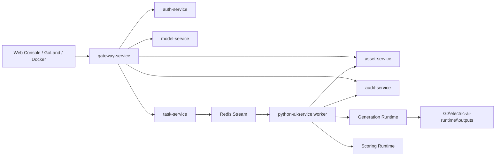

<div align="center">

# Electric AI Platform

面向工业电力场景的图像生成与多维质量评价平台

`Go 微服务边界 + Python AI 运行时中心 + Vue 3 工作台`


</div>

本项目是一个围绕“电力行业图像生成 + 多维质量评价”展开的毕业设计平台。系统采用 Go 微服务承载平台治理与业务编排，采用 Python 运行时承载真实生成与真实评分模型，前端使用 Vue 3 提供统一工作台，支持 Windows 原生与 Docker GPU 两种运行方式。

平台目标不是单独生成一张图片，而是形成完整闭环：

- 根据电力行业 Prompt 生成图像
- 对生成结果进行四维质量评价
- 记录任务生命周期与审计事件
- 在历史中心查看结果、评分和详情
- 在模型中心管理生成模型与评分模型
- 通过脚本完成本机原生或 Docker GPU 运行

## 文档导航

- 模型介绍、对比与评分说明：[docs/model-introduction-and-scoring.md](docs/model-introduction-and-scoring.md)
- 模型训练与使用说明：[docs/model-training-and-usage.md](docs/model-training-and-usage.md)
- 项目函数说明：[docs/project-function-reference.md](docs/project-function-reference.md)
- Windows / Docker GPU 运行手册：[docs/windows-docker-gpu-runbook.md](docs/windows-docker-gpu-runbook.md)

## 项目亮点

- 微服务边界清晰：网关、认证、模型、任务、资产、审计分域明确。
- 真实模型链路：不是纯 mock，而是接入了真实生成模型和真实评分模型。
- 评分维度完整：围绕视觉保真、文本一致、物理合理、构图美学四个维度输出结果。
- 单机友好：针对 `RTX 3060 Laptop GPU 6GB` 这一类单卡环境做了模型加载、释放和运行策略优化。
- 双运行形态：既支持 Windows 原生调试，也支持 Docker GPU 编排。
- 前端可展示：提供登录页、生成工作台、历史中心、模型中心、任务审计等完整界面。

## 2026-04-08 实测结果

本仓库已经补充了基于真实运行时的固定 Prompt 集实测。测试基线如下：

- Prompt 集来源：`web-console/src/views/generate-defaults.ts` 中的 `RECOMMENDED_POSITIVE_PROMPTS` 共 7 条
- 生成参数：`seed=42`、`steps=20`、`guidance_scale=7.5`、`512x512`、每个 Prompt 生成 1 张图
- 评分模型：`electric-score-v1`、`electric-score-v2`、`electric-score-v3`
- 成功完成实测的生成模型：`sd15-electric`、`sd15-electric-specialized`
- 当前实测机器：`RTX 3060 Laptop GPU 6GB`

核心结论：

- 在固定 7 Prompt 集上，`sd15-electric-specialized` 在 3 套评分器下都略高于 `sd15-electric`。
- 在 `electric-score-v3` 下，`sd15-electric-specialized` 平均总分 `60.43`，高于 `sd15-electric` 的 `58.70`，提升 `1.73` 分。
- 在 `electric-score-v3` 的 7 个 Prompt 中，`sd15-electric-specialized` 赢了 4 个；它最大的优势来自 `physical_plausibility`，平均高出 `5.49` 分。
- 平均单图生成耗时上，`sd15-electric-specialized` 为 `6.52s`，快于 `sd15-electric` 的 `7.33s`。
- `unipic2-kontext` 已在运行时注册，但在 `2026-04-08` 的这台 `RTX 3060 Laptop GPU 6GB` 机器上，分片加载阶段退出，错误码为 `3221225477`，因此没有纳入最终汇总图。


更完整的原始结果、失败记录和图表可以直接查看：

- `docs/assets/real-evaluation/tables/benchmark-results.csv`
- `docs/assets/real-evaluation/tables/benchmark-summary.csv`
- `docs/assets/real-evaluation/tables/benchmark-failures.json`
- `docs/assets/real-evaluation/charts/`

## 核心能力

- 电力场景图像生成
- 多模型切换与参数控制
- 图像四维质量评分
- 历史结果分页查询与详情回看
- 任务状态跟踪与审计事件展示
- 模型中心状态探测
- 输出图片落盘与统一访问

## 当前模型体系

### 生成模型

- `sd15-electric`
  当前默认主力生成模型，启动稳定，适合日常联调和标准电力场景出图。
- `sd15-electric-specialized`
  面向电力行业进一步专用化的 SD1.5 路线模型，适合强调行业专属性的实验与展示。
- `unipic2-kontext`
  更偏高质量语义理解的生成模型，适合复杂 Prompt 和最终展示图。

### 评分模型

- `electric-score-v1`
  默认评分模型，采用多运行时组合方式完成四维评分。
- `electric-score-v2`
  自训练评分模型路线，支持独立 bundle 推理。
- `electric-score-v3`
  进一步演进的自训练评分模型路线，支持更强的行业约束与混合评分思路。

### 底层评分组件

- `ImageReward`
  负责文本一致性等更接近人类偏好的图文匹配判断。
- `CLIP-IQA`
  负责视觉保真和物理合理性等基础评分能力。
- `Aesthetic Predictor`
  负责构图美学维度评分。
- `Power Score Runtime`
  平台内部用于承载自训练评分模型与混合评分逻辑。

更详细的模型说明请看：

- [docs/model-introduction-and-scoring.md](docs/model-introduction-and-scoring.md)
- [docs/model-training-and-usage.md](docs/model-training-and-usage.md)

## 系统架构



### 后端微服务

- `services/gateway-service`
  统一入口、代理转发、静态文件访问。
- `services/auth-service`
  登录鉴权与令牌签发。
- `services/model-service`
  模型目录、Prompt 模板、模型状态展示。
- `services/task-service`
  任务创建、状态推进、Redis Stream 投递。
- `services/asset-service`
  图像资产、Prompt 参数、评分结果、历史分页与详情。
- `services/audit-service`
  任务事件审计与时间线查询。

### Python AI 运行时

- `python-ai-service/app/runtimes/sd15_runtime.py`
  `sd15-electric` 与 `sd15-electric-specialized` 的生成运行时基础。
- `python-ai-service/app/runtimes/unipic2_runtime.py`
  `unipic2-kontext` 运行时。
- `python-ai-service/app/runtimes/scorers/image_reward_runtime.py`
  文本一致性等图文偏好评分。
- `python-ai-service/app/runtimes/scorers/clip_iqa_runtime.py`
  视觉保真与物理合理性基础评分。
- `python-ai-service/app/runtimes/scorers/aesthetic_runtime.py`
  构图美学评分。
- `python-ai-service/app/runtimes/scorers/power_score_runtime.py`
  电力行业自训练评分模型运行时。
- `python-ai-service/app/services/scoring_service.py`
  四维评分组合、校准和总分汇总逻辑。

### 前端工作台

- `web-console/src/views/GenerateView.vue`
  图像生成工作台与结果展示。
- `web-console/src/views/HistoryView.vue`
  历史中心与详情抽屉。
- `web-console/src/views/ModelCenterView.vue`
  模型中心。
- `web-console/src/views/TaskAuditView.vue`
  审计视图。
- `web-console/src/views/DashboardView.vue`
  平台总览。

## 仓库结构

```text
electric-ai-platform
├─ services/                    # Go 微服务
│  ├─ auth-service
│  ├─ model-service
│  ├─ task-service
│  ├─ asset-service
│  ├─ audit-service
│  ├─ gateway-service
│  └─ platform-common
├─ python-ai-service/           # Python AI 运行时中心
│  ├─ app/
│  ├─ scripts/
│  └─ tests/
├─ web-console/                 # Vue 3 前端工作台
├─ scripts/                     # Windows / Docker 启动与验证脚本
├─ deploy/                      # Docker、数据库初始化、镜像构建文件
├─ docs/                        # 模型说明与运行手册
└─ storage/                     # 本地存储目录占位
```

## 环境要求

- Windows 11
- Go `G:\Golang\go1.24.0`
- Python `G:\miniconda3\envs\electric-ai-py310`
- Node.js 与 `npm`
- Docker Desktop
- MySQL 8
- Redis 7
- NVIDIA GPU 与可用 CUDA 环境

## 快速开始

### 1. Windows 原生运行

```powershell
powershell -ExecutionPolicy Bypass -File scripts/windows/setup-python-runtime.ps1
powershell -ExecutionPolicy Bypass -File scripts/windows/download-runtime-models.ps1 -All
powershell -ExecutionPolicy Bypass -File scripts/windows/start-platform.ps1
powershell -ExecutionPolicy Bypass -File scripts/windows/smoke-test.ps1
```

详细说明见：[docs/windows-docker-gpu-runbook.md](docs/windows-docker-gpu-runbook.md)

### 2. Docker GPU 运行

```powershell
powershell -ExecutionPolicy Bypass -File scripts/docker/up-platform.ps1
powershell -ExecutionPolicy Bypass -File scripts/docker/download-models.ps1 -Model sd15-electric,unipic2-kontext,image-reward,aesthetic-predictor
powershell -ExecutionPolicy Bypass -File scripts/docker/smoke-test.ps1 -ModelName unipic2-kontext
```

详细说明见：[docs/windows-docker-gpu-runbook.md](docs/windows-docker-gpu-runbook.md)

## 默认访问地址

### Windows 原生

- Web Console：`http://127.0.0.1:5173`
- Gateway：`http://127.0.0.1:8080`
- Python Runtime：`http://127.0.0.1:8090`
- MySQL：`127.0.0.1:3307`
- Redis：`127.0.0.1:6380`

### Docker GPU

- Web Console：`http://127.0.0.1:18088`
- Gateway：`http://127.0.0.1:18080`
- Python Runtime：`http://127.0.0.1:18090`
- MySQL：`127.0.0.1:13307`
- Redis：`127.0.0.1:16380`

## 适用场景

- 电力行业图像生成实验
- 变电站、输电塔、风电、光伏等题材生成
- 图像评分与结果对比分析
- 毕业设计展示、论文配套演示、课程设计原型

## 说明

- 根目录 `README` 用于 GitHub 展示与快速理解项目。
- `docs/` 目录只保留模型说明、训练说明、函数说明和运行手册。
- 之前阶段性的设计稿、计划稿和重复说明文档已删除，不再保留。
- 当前分支可能同时存在未提交的业务代码改动；本文档只描述平台结构与运行方式，不代表所有开发任务都已结束。

- `services/auth-service`
  登录、JWT 签发、基础身份校验。
- `services/model-service`
  模型目录、默认提示词、本地可用性探测。
- `services/task-service`
  任务创建、状态流转、Redis Stream 投递。
- `services/asset-service`
  生成结果与评分结果落库、历史中心查询、详情查询。
- `services/audit-service`
  任务事件审计、时间线查询、审计落库。
- `services/gateway-service`
  统一 HTTP 入口、鉴权转发、图片静态访问。

### Python AI 运行时

- `python-ai-service/app/main.py`
  FastAPI 入口，提供健康检查、模型探针、内部生成接口。
- `python-ai-service/app/worker.py`
  Worker 入口，持续消费 Redis Stream 中的真实任务。
- `python-ai-service/app/runtimes/*`
  真实模型运行时实现与注册中心。
- `python-ai-service/app/services/*`
  任务流水线、生成服务、评分服务。

### 前端工作台

- `web-console/src/views/GenerateView.vue`
  生成工作台与实时进度展示。
- `web-console/src/views/DashboardView.vue`
  平台总览页。
- `web-console/src/views/HistoryView.vue`
  历史中心与资产详情抽屉。
- `web-console/src/views/ModelCenterView.vue`
  模型中心。
- `web-console/src/views/TaskAuditView.vue`
  任务审计页。

## 仓库结构

```text
electric-ai-platform
├─ services/                    # Go 微服务
│  ├─ auth-service
│  ├─ model-service
│  ├─ task-service
│  ├─ asset-service
│  ├─ audit-service
│  ├─ gateway-service
│  └─ platform-common
├─ python-ai-service/           # Python AI 运行时中心
│  ├─ app/
│  ├─ scripts/
│  └─ tests/
├─ web-console/                 # Vue 3 前端工作台
├─ scripts/                     # Windows / Docker 启动与验证脚本
├─ deploy/                      # Docker、数据库初始化、镜像构建文件
├─ docs/                        # 模型说明、训练说明、函数说明与运行手册
└─ storage/                     # 本地存储目录占位
```

## 环境要求

推荐按当前仓库已验证通过的版本准备环境：

- Windows 11
- Go `G:\Golang\go1.24.0`
- Python `G:\miniconda3\envs\electric-ai-py310`
- Node.js 与 `npm`
- Docker Desktop 新版
- MySQL 8
- Redis 7
- NVIDIA GPU 与可用 CUDA 环境

## 固定目录与端口

### 本机原生运行

- Python 环境：`G:\miniconda3\envs\electric-ai-py310`
- AI 运行时根目录：`G:\electric-ai-runtime`
- 旧项目参考目录：`E:\毕业设计\源代码\Project`
- Gateway：`http://127.0.0.1:8080`
- Auth Service：`http://127.0.0.1:8081`
- Model Service：`http://127.0.0.1:8082`
- Task Service：`http://127.0.0.1:8083`
- Asset Service：`http://127.0.0.1:8084`
- Audit Service：`http://127.0.0.1:8085`
- Python API：`http://127.0.0.1:8090`
- Web Console：`http://127.0.0.1:5173`
- MySQL：`127.0.0.1:3307`
- Redis：`127.0.0.1:6380`

### Docker 运行

- Web Console：`http://127.0.0.1:18088`
- Gateway：`http://127.0.0.1:18080`
- Python API：`http://127.0.0.1:18090`
- MySQL：`127.0.0.1:13307`
- Redis：`127.0.0.1:16380`

## Windows 原生运行

推荐依次执行以下命令：

```powershell
powershell -ExecutionPolicy Bypass -File scripts/windows/setup-python-runtime.ps1
powershell -ExecutionPolicy Bypass -File scripts/windows/download-runtime-models.ps1 -All
powershell -ExecutionPolicy Bypass -File scripts/windows/start-platform.ps1
powershell -ExecutionPolicy Bypass -File scripts/windows/smoke-test.ps1
```

### 各脚本职责

- `scripts/windows/setup-python-runtime.ps1`
  创建或复用 `G:\miniconda3\envs\electric-ai-py310` 并安装 Python 依赖。
- `scripts/windows/download-runtime-models.ps1`
  准备 `G:\electric-ai-runtime` 下的模型目录，并检查本地模型文件是否齐全。
- `scripts/windows/start-platform.ps1`
  拉起 MySQL / Redis、全部 Go 微服务、Python API、Python Worker 与前端开发服务器。
- `scripts/windows/smoke-test.ps1`
  执行真实登录、真实生成任务、状态轮询、资产校验与审计校验。

### GoLand 本地调试

如果要在 GoLand 中单独调试某个 Go 微服务，建议这样配置：

1. 先执行 `powershell -ExecutionPolicy Bypass -File scripts/dev-up.ps1` 启动 MySQL / Redis。
2. 把 GoLand 的 Go SDK 固定到 `G:\Golang\go1.24.0`。
3. 将 Run Configuration 的 Working Directory 指到目标服务目录，例如 `services\auth-service`。
4. 直接运行该服务下的 `cmd/server/main.go`。

各服务目录已经提供 `.env.local`，会自动注入：

- `APP_NAME`
- `HTTP_PORT`
- `MYSQL_DSN`
- `REDIS_ADDR`
- `JWT_SECRET`

## Docker 运行

Docker 路线使用完整编排文件 `deploy/docker-compose.platform.yml`，不会覆盖当前 Windows 原生链路。

推荐顺序：

```powershell
powershell -ExecutionPolicy Bypass -File scripts/docker/up-platform.ps1
powershell -ExecutionPolicy Bypass -File scripts/docker/download-models.ps1 -Model sd15-electric,unipic2-kontext,image-reward,aesthetic-predictor
powershell -ExecutionPolicy Bypass -File scripts/docker/smoke-test.ps1 -ModelName unipic2-kontext
```

停止平台：

```powershell
powershell -ExecutionPolicy Bypass -File scripts/docker/down-platform.ps1
```

### Docker 运行前注意

- 需要设置 `JWT_SECRET`，否则容器中的 Go 服务会在启动时报 `missing required env var: JWT_SECRET`。
- Docker 会把 `G:\electric-ai-runtime` 挂载到容器内 `/runtime`，因此模型和输出会与本机原生共享。
- 如果第一次构建时间较长，属于正常现象，尤其是 Python AI 镜像与前端依赖安装阶段。

## 模型说明

### 生成模型

- `sd15-electric`
  默认真实生成模型，当前主链路和基础 smoke test 使用它。
- `unipic2-kontext`
  已完成真实运行时接入；下载 `Skywork/UniPic2-SD3.5M-Kontext-2B` 后即可参与原生和 Docker 生成链路。

### 评分模型

- `image-reward`
  文图一致性评分模型。
- `clip-iqa`
  用于视觉保真度与物理合理性打分。
- `aesthetic-predictor`
  构图美学评分模型，可迁移旧项目权重。

## 常用验证命令

```powershell
& 'G:\miniconda3\envs\electric-ai-py310\python.exe' -m pytest python-ai-service/tests -v

$env:GOROOT = 'G:\Golang\go1.24.0'
& 'G:\Golang\go1.24.0\bin\go.exe' test ./services/task-service/... ./services/asset-service/... ./services/audit-service/... ./services/model-service/... ./services/gateway-service/...

npm --prefix web-console run test
npm --prefix web-console run build

powershell -ExecutionPolicy Bypass -File scripts/windows/smoke-test.ps1
```

## 日志与排障

- 本机运行日志默认落在 `.runtime-logs/`。
- Python 运行时日志落在 `G:\electric-ai-runtime\logs`。
- 如果前端页面出现空白，先检查网关 `8080`、任务服务 `8083`、模型服务 `8082` 是否可达。
- 如果 Docker 运行时报 `JWT_SECRET` 缺失，需要在 compose 使用的环境变量中显式补齐。
- 如果 PowerShell 中使用 `conda activate` 报编码问题，请直接调用 `python.exe`，不要依赖激活脚本。

## 代码注释与维护约定

当前仓库已经按照“核心人工维护代码优先”的方式补充中文注释，重点覆盖：

- Go 微服务核心配置、服务层、仓储层
- Python 运行时入口、依赖装配、任务流水线、模型注册中心、评分与 Worker
- Vue 前端核心 store、API 封装、导航骨架、生成页、审计页、历史页、总览页
- 关键启动脚本与仓库入口文档

`TODO` 只保留在真实待办点，例如：

- 生产环境密钥管理
- 独立数据库迁移流程
- 多 GPU 调度
- 评分标定自动化
- 生产配置分层

## GitHub 发布建议

推荐仓库名：`electric-ai-platform`

如果本地已经登录 Git 并具备推送权限，可以使用：

```powershell
git remote add origin https://github.com/hrzt66/electric-ai-platform.git
git push -u origin <当前分支名>
```

如果远端仓库还没创建，需要先在 GitHub 上创建空仓库，再执行上面的命令。

## 常见问题

### 1. 为什么 GoLand 直接运行会报 `missing required env var: JWT_SECRET`？

因为服务启动时会强制检查 `JWT_SECRET`。请在 GoLand 的 Run Configuration 中设置环境变量，或者让 Working Directory 指向带 `.env.local` 的服务目录。

### 2. 为什么会报 MySQL `127.0.0.1:3307 refused`？

说明本地 MySQL 还没启动，先执行 `scripts/dev-up.ps1` 或 `scripts/windows/start-platform.ps1`。

### 3. 为什么前端请求会出现重定向过多？

通常是网关、Vite 代理或登录态失配导致。先确认：

- `http://127.0.0.1:8080/health` 可访问
- 前端本地代理仍指向网关 `8080`
- 本地登录态没有损坏

### 4. 为什么 `unipic2-kontext` 很慢？

它本身比 `sd15-electric` 更重，而且首次加载会占用更多显存与时间。当前已实现“任务完成后主动释放模型”，后续可继续优化模型预热与设备调度。

## 后续计划

- [ ] 接入生产级密钥管理与配置分层
- [ ] 把服务启动阶段的 schema bootstrap 迁移为独立迁移流程
- [ ] 为多 GPU / 多实例场景引入更清晰的运行时调度器
- [ ] 补全更细粒度的前端端到端回归测试
- [ ] 增加对象存储与外部日志平台接入能力

## 进一步文档

- [模型介绍、对比与评分说明](docs/model-introduction-and-scoring.md)
- [模型训练与使用说明](docs/model-training-and-usage.md)
- [项目函数说明](docs/project-function-reference.md)
- [Windows / Docker GPU 运行手册](docs/windows-docker-gpu-runbook.md)
