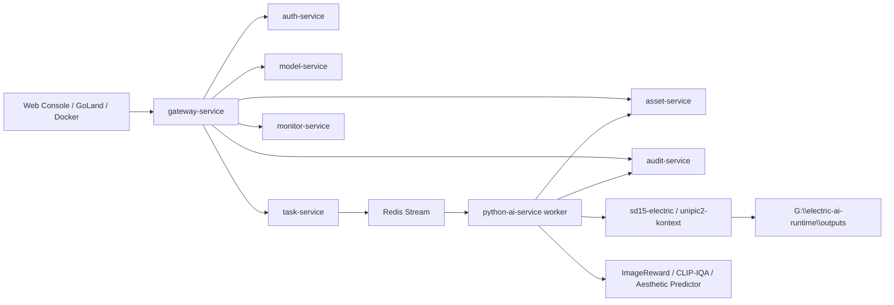

<div align="center">

# Electric AI Platform

面向工业电力场景的图像生成与评分平台

`Go 微服务边界 + Python AI 运行时中心 + Vue 3 工作台`


</div>

面向工业电力场景的图像生成与评分平台，支持真实生成、真实评分、任务审计、历史资产回溯以及 Docker / Windows 原生双运行模式。

当前仓库已经完成以下主链路落地：

- Go 微服务负责登录鉴权、模型目录、任务编排、资产落库、审计追踪和统一网关。
- Python 运行时负责真实模型加载、真实图像生成、真实评分、Redis Stream FIFO 消费和显存释放。
- 前端工作台负责生成参数配置、实时进度、历史中心、模型中心和任务审计视图。
- 运行时目录、模型缓存、日志和输出统一落在 `G:\electric-ai-runtime`，便于本机原生与 Docker 共享。

## 发布说明

### 2026 年 4 月 6 日公开版

- 仓库名称统一为 `electric-ai-platform`，默认分支为 `main`。
- 已完成 `sd15-electric` 与 `unipic2-kontext` 的真实生成接入。
- 已完成 `ImageReward`、`CLIP-IQA`、`Aesthetic Predictor` 的真实评分接入。
- 已补齐 Docker 编排、Windows 原生启动脚本、运行手册与 smoke test。
- 已补充核心代码中文注释、关键 TODO 与面向公开仓库的 README 文档。

### 适用场景

- 工业电力设备图像生成
- 变电站 / 输电塔 / 电力巡检题材实验
- 文图一致性与构图质量评估
- 毕业设计、课程设计、工业 AI 平台原型展示

## 快速开始

### Windows 原生

```powershell
powershell -ExecutionPolicy Bypass -File scripts/windows/setup-python-runtime.ps1
powershell -ExecutionPolicy Bypass -File scripts/windows/download-runtime-models.ps1 -All
powershell -ExecutionPolicy Bypass -File scripts/windows/start-platform.ps1
powershell -ExecutionPolicy Bypass -File scripts/windows/smoke-test.ps1
```

### Docker

```powershell
powershell -ExecutionPolicy Bypass -File scripts/docker/up-platform.ps1
powershell -ExecutionPolicy Bypass -File scripts/docker/download-models.ps1 -Model sd15-electric,unipic2-kontext,image-reward,aesthetic-predictor
powershell -ExecutionPolicy Bypass -File scripts/docker/smoke-test.ps1 -ModelName unipic2-kontext
```

如果你需要完整部署说明，而不只是命令清单，请直接看下文的“详细部署步骤”。

## 架构速览


```mermaid
flowchart LR
    User["Web Console / GoLand / Docker"] --> Gateway["gateway-service"]
    Gateway --> Auth["auth-service"]
    Gateway --> Model["model-service"]
    Gateway --> Task["task-service"]
    Gateway --> Asset["asset-service"]
    Gateway --> Audit["audit-service"]
    Gateway --> Monitor["monitor-service"]
    Task --> Redis["Redis Stream"]
    Redis --> Worker["python-ai-service worker"]
    Worker --> Runtime["sd15-electric / unipic2-kontext"]
    Worker --> Score["ImageReward / CLIP-IQA / Aesthetic Predictor"]
    Worker --> Asset
    Worker --> Audit
    Runtime --> Output["G:\\electric-ai-runtime\\outputs"]
```

## 项目亮点

- 本机原生优先，兼顾 Docker，适合课程设计和真实机器联调。
- 保持 Go 微服务边界，同时把大模型执行集中在 Python 运行时中心。
- 任务通过 Redis Stream 以 FIFO 方式流转，便于追踪与补偿。
- 生成与评分完成后主动释放资源，减少单卡环境下的显存占用。
- 前端直接展示生成进度、任务审计、模型状态与历史资产。

## 核心能力

- 真实生成：已接入 `sd15-electric` 与 `unipic2-kontext` 两条真实生成链路。
- 真实评分：已接入 `ImageReward`、`CLIP-IQA`、`Aesthetic Predictor` 等评分链路，并支持分数校准。
- FIFO 调度：任务由 Go 侧写入 Redis Stream，Python Worker 按 FIFO 消费并持续更新状态。
- 显存回收：生成和评分完成后主动释放模型资源，降低模型切换时的显存压力。
- 审计追踪：任务生命周期会写入审计服务，前端可查看阶段时间线与关联资产。
- 双部署方式：既支持 Windows 原生运行，也支持 Docker 编排运行。

## 技术架构

### 后端微服务

- `services/auth-service`
  登录、JWT 签发、基础身份校验。
- `services/model-service`
  模型目录、默认提示词、本地可用性探测。
- `services/task-service`
  任务创建、状态流转、Redis Stream 投递。
- `services/asset-service`
  生成结果与评分结果落库、历史中心查询、详情查询。
- `services/audit-service`
  任务事件审计、时间线查询、审计落库。
- `services/monitor-service`
  跨平台运行监控服务，采集宿主机与 AI 推理运行时状态，并通过 SSE 推送实时快照，Dashboard 会展示“AI 运行健康”面板。
- `services/gateway-service`
  统一 HTTP 入口、鉴权转发、图片静态访问。

### Python AI 运行时

- `python-ai-service/app/main.py`
  FastAPI 入口，提供健康检查、模型探针、内部生成接口。
- `python-ai-service/app/worker.py`
  Worker 入口，持续消费 Redis Stream 中的真实任务。
- `python-ai-service/app/runtimes/*`
  真实模型运行时实现与注册中心。
- `python-ai-service/app/services/*`
  任务流水线、生成服务、评分服务。

### 前端工作台

- `web-console/src/views/GenerateView.vue`
  生成工作台与实时进度展示。
- `web-console/src/views/DashboardView.vue`
  平台总览页。
- `web-console/src/views/HistoryView.vue`
  历史中心与资产详情抽屉。
- `web-console/src/views/ModelCenterView.vue`
  模型中心。
- `web-console/src/views/TaskAuditView.vue`
  任务审计页。

## 仓库结构

```text
electric-ai-platform
├─ services/                    # Go 微服务
│  ├─ auth-service
│  ├─ model-service
│  ├─ task-service
│  ├─ asset-service
│  ├─ audit-service
│  ├─ gateway-service
│  └─ platform-common
├─ python-ai-service/           # Python AI 运行时中心
│  ├─ app/
│  ├─ scripts/
│  └─ tests/
├─ web-console/                 # Vue 3 前端工作台
├─ scripts/                     # Windows / Docker 启动与验证脚本
├─ deploy/                      # Docker、数据库初始化、镜像构建文件
├─ docs/                        # 运行手册、迁移计划、设计文档
└─ storage/                     # 本地存储目录占位
```

## 环境要求

推荐按当前仓库已验证通过的版本准备环境：

- Windows 11
- Go `G:\Golang\go1.24.0`
- Python `G:\miniconda3\envs\electric-ai-py310`
- Node.js 与 `npm`
- Docker Desktop 新版
- MySQL 8
- Redis 7
- NVIDIA GPU 与可用 CUDA 环境

## 固定目录与端口

### 本机原生运行

- Python 环境：`G:\miniconda3\envs\electric-ai-py310`
- AI 运行时根目录：`G:\electric-ai-runtime`
- 旧项目参考目录：`E:\毕业设计\源代码\Project`
- Gateway：`http://127.0.0.1:8080`
- Auth Service：`http://127.0.0.1:8081`
- Model Service：`http://127.0.0.1:8082`
- Task Service：`http://127.0.0.1:8083`
- Asset Service：`http://127.0.0.1:8084`
- Audit Service：`http://127.0.0.1:8085`
- Python API：`http://127.0.0.1:8090`
- Web Console：`http://127.0.0.1:5173`
- MySQL：`127.0.0.1:3307`
- Redis：`127.0.0.1:6380`

### Docker 运行

- Web Console：`http://127.0.0.1:18088`
- Gateway：`http://127.0.0.1:18080`
- Python API：`http://127.0.0.1:18090`
- MySQL：`127.0.0.1:13307`
- Redis：`127.0.0.1:16380`

## 详细部署步骤

这一节按真实脚本行为整理，适合第一次部署或写毕业设计交付文档时直接照着执行。

### 方案选择

- 需要完整平台并优先使用本机 GPU：走“Windows 原生部署”。
- 需要用容器统一拉起整个平台：走“Docker 全量部署”。
- 只想给本地 Go / Python 服务准备 MySQL 和 Redis：走“仅启动开发依赖”。

### 部署前准备

无论采用哪种方式，建议先确认以下条件：

1. 已克隆仓库，并在仓库根目录执行命令。
2. Windows 路线下，`G:\Golang\go1.24.0\bin\go.exe`、`G:\miniconda3\condabin\conda.bat`、`npm.cmd` 可正常使用。
3. Docker 路线下，Docker Desktop 已启动，且宿主机具备可用 NVIDIA GPU 环境。
4. 已准备 AI 运行时目录 `G:\electric-ai-runtime`，用于存放模型、缓存、日志和生成结果。
5. 默认端口未被其他无关进程占用：`3307`、`6380`、`8080-8086`、`8090`、`5173`、`13307`、`16380`、`18080`、`18088`、`18090`。

### Windows 原生部署

这是当前仓库最完整、最贴近开发联调的运行方式。启动脚本会：

- 复用或拉起 MySQL / Redis
- 构建并启动全部 Go 微服务
- 启动 Python API 与 Worker
- 启动前端 Vite 开发服务器

推荐依次执行以下命令：

```powershell
powershell -ExecutionPolicy Bypass -File scripts/windows/setup-python-runtime.ps1
powershell -ExecutionPolicy Bypass -File scripts/windows/download-runtime-models.ps1 -All
powershell -ExecutionPolicy Bypass -File scripts/windows/start-platform.ps1
powershell -ExecutionPolicy Bypass -File scripts/windows/smoke-test.ps1
```

#### 第 1 步：初始化 Python 运行时

执行：

```powershell
powershell -ExecutionPolicy Bypass -File scripts/windows/setup-python-runtime.ps1
```

这个脚本会自动完成：

- 创建或复用 `G:\miniconda3\envs\electric-ai-py310`
- 安装 [python-ai-service/requirements.txt](/Users/hrzt/code/vibe%20coding/codex/毕业设计/electric-ai-platform/python-ai-service/requirements.txt) 中的依赖
- 执行 `python-ai-service/scripts/runtime_probe.py`，确认 Python AI 服务的基础运行环境可用

如果你的 Conda 不在默认位置，可以显式传参：

```powershell
powershell -ExecutionPolicy Bypass -File scripts/windows/setup-python-runtime.ps1 `
  -CondaBat 'D:\miniconda3\condabin\conda.bat' `
  -PythonEnvPath 'D:\miniconda3\envs\electric-ai-py310' `
  -RuntimeRoot 'D:\electric-ai-runtime'
```

#### 第 2 步：准备模型目录和运行时资源

执行：

```powershell
powershell -ExecutionPolicy Bypass -File scripts/windows/download-runtime-models.ps1 -All
```

这个脚本会把 `ELECTRIC_AI_RUNTIME_ROOT` 指向 `G:\electric-ai-runtime`，然后调用 Python CLI 检查或准备模型目录。若只想检查目录是否完整，可使用：

```powershell
powershell -ExecutionPolicy Bypass -File scripts/windows/download-runtime-models.ps1 -CheckOnly -All
```

若只准备指定模型，可使用：

```powershell
powershell -ExecutionPolicy Bypass -File scripts/windows/download-runtime-models.ps1 -Model sd15-electric,unipic2-kontext
```

#### 第 3 步：启动平台

执行：

```powershell
powershell -ExecutionPolicy Bypass -File scripts/windows/start-platform.ps1
```

脚本默认行为如下：

- MySQL 端口：`3307`
- Redis 端口：`6380`
- Gateway：`http://127.0.0.1:8080`
- Python API：`http://127.0.0.1:8090`
- Web Console：`http://127.0.0.1:5173`

启动时会自动做这些检查和处理：

- 如果 `3307` 与 `6380` 无监听，则调用 [scripts/dev-up.ps1](/Users/hrzt/code/vibe%20coding/codex/毕业设计/electric-ai-platform/scripts/dev-up.ps1) 拉起开发依赖
- 检查运行时模型目录是否可用
- 清理仓库自身残留的旧进程和旧监听端口
- 构建并启动 `auth-service`、`model-service`、`task-service`、`asset-service`、`audit-service`、`monitor-service`、`gateway-service`
- 启动 `python-ai-service` 的 API 进程与 Worker 进程
- 如果未指定 `-SkipWeb`，启动前端开发服务器

如果你只想启动后端与 Python，不启动前端，可用：

```powershell
powershell -ExecutionPolicy Bypass -File scripts/windows/start-platform.ps1 -SkipWeb
```

如果你已经提前准备好了 Python 环境，也可以跳过 Python 初始化：

```powershell
powershell -ExecutionPolicy Bypass -File scripts/windows/start-platform.ps1 -SkipPythonSetup
```

启动完成后，日志默认在 `.runtime-logs/windows/` 下。

#### 第 4 步：执行冒烟验证

执行：

```powershell
powershell -ExecutionPolicy Bypass -File scripts/windows/smoke-test.ps1
```

这个脚本会实际完成一条端到端链路：

1. 检查 `gateway` 与 `python runtime` 健康状态。
2. 调用 `/api/v1/auth/login` 使用默认账户登录。
3. 拉取模型列表，确认目标模型已暴露。
4. 创建一条真实生成任务。
5. 轮询任务状态直到 `completed`。
6. 校验资产历史、图片文件、评分结果和审计事件。

默认测试模型是 `sd15-electric`。如需切换：

```powershell
powershell -ExecutionPolicy Bypass -File scripts/windows/smoke-test.ps1 -ModelName unipic2-kontext
```

### 各脚本职责

- `scripts/windows/setup-python-runtime.ps1`
  创建或复用 `G:\miniconda3\envs\electric-ai-py310` 并安装 Python 依赖。
- `scripts/windows/download-runtime-models.ps1`
  准备 `G:\electric-ai-runtime` 下的模型目录，并检查本地模型文件是否齐全。
- `scripts/windows/start-platform.ps1`
  拉起 MySQL / Redis、全部 Go 微服务、Python API、Python Worker 与前端开发服务器。
- `scripts/windows/smoke-test.ps1`
  执行真实登录、真实生成任务、状态轮询、资产校验与审计校验。

### Windows 原生停止方式

- 停止 MySQL 和 Redis：`powershell -ExecutionPolicy Bypass -File scripts/dev-down.ps1`
- 其余平台进程会在下次执行 `scripts/windows/start-platform.ps1` 时被自动清理；如需立刻停止，可结束 `.runtime-logs/windows/launchers` 拉起的对应进程
- 若只需停止 macOS/Linux 版本的本地平台脚本，可参考 [scripts/mac/stop-platform.sh](/Users/hrzt/code/vibe%20coding/codex/毕业设计/electric-ai-platform/scripts/mac/stop-platform.sh)

### GoLand 本地调试

如果要在 GoLand 中单独调试某个 Go 微服务，建议这样配置：

1. 先执行 `powershell -ExecutionPolicy Bypass -File scripts/dev-up.ps1` 启动 MySQL / Redis。
2. 把 GoLand 的 Go SDK 固定到 `G:\Golang\go1.24.0`。
3. 将 Run Configuration 的 Working Directory 指到目标服务目录，例如 `services\auth-service`。
4. 直接运行该服务下的 `cmd/server/main.go`。

各服务目录已经提供 `.env.local`，会自动注入：

- `APP_NAME`
- `HTTP_PORT`
- `MYSQL_DSN`
- `REDIS_ADDR`
- `JWT_SECRET`

### macOS / Linux 本地依赖

如果你只是想在 Docker 里准备本地开发所需的 MySQL 和 Redis，可以直接执行：

```bash
./scripts/dev-up.sh
```

停止并清理数据卷：

```bash
./scripts/dev-down.sh
```

这套脚本默认使用 `deploy/docker-compose.dependencies.yml`，会启动：

- MySQL：`127.0.0.1:3307`
- Redis：`127.0.0.1:6380`

本地服务可直接复用下面这些连接参数：

- `MYSQL_DSN=root:root@tcp(127.0.0.1:3307)/electric_ai?charset=utf8mb4&parseTime=True&loc=Local`
- `REDIS_ADDR=127.0.0.1:6380`
- `REDIS_URL=redis://127.0.0.1:6380/0`

如果你想改端口，也可以在执行前覆盖环境变量，例如：

```bash
MYSQL_PORT=13307 REDIS_PORT=16380 ./scripts/dev-up.sh
```

### Docker 全量部署

Docker 路线使用完整编排文件 [deploy/docker-compose.platform.yml](/Users/hrzt/code/vibe%20coding/codex/毕业设计/electric-ai-platform/deploy/docker-compose.platform.yml)，会同时启动：

- `mysql`
- `redis`
- 全部 Go 微服务
- `python-ai-service`
- `python-ai-worker`
- `web-console`

推荐顺序：

```powershell
powershell -ExecutionPolicy Bypass -File scripts/docker/up-platform.ps1
powershell -ExecutionPolicy Bypass -File scripts/docker/download-models.ps1 -Model sd15-electric,unipic2-kontext,image-reward,aesthetic-predictor
powershell -ExecutionPolicy Bypass -File scripts/docker/smoke-test.ps1 -ModelName unipic2-kontext
```

#### 第 1 步：拉起容器平台

执行：

```powershell
powershell -ExecutionPolicy Bypass -File scripts/docker/up-platform.ps1
```

默认会执行 `docker compose -f deploy/docker-compose.platform.yml up -d --build`，并等待以下地址可访问：

- `http://127.0.0.1:18080/health`
- `http://127.0.0.1:18090/health`
- `http://127.0.0.1:18088`

如果你已经构建过镜像，只想直接启动容器：

```powershell
powershell -ExecutionPolicy Bypass -File scripts/docker/up-platform.ps1 -NoBuild
```

#### 第 2 步：下载或检查容器运行时模型

执行：

```powershell
powershell -ExecutionPolicy Bypass -File scripts/docker/download-models.ps1 -All
```

这个脚本本质上会执行容器内命令：

```powershell
docker compose -f deploy/docker-compose.platform.yml run --rm python-ai-service python3 scripts/download_models.py --all
```

如果只检查不下载：

```powershell
powershell -ExecutionPolicy Bypass -File scripts/docker/download-models.ps1 -CheckOnly -All
```

如果只处理指定模型：

```powershell
powershell -ExecutionPolicy Bypass -File scripts/docker/download-models.ps1 -Model sd15-electric -Model unipic2-kontext
```

#### 第 3 步：执行 Docker 冒烟测试

执行：

```powershell
powershell -ExecutionPolicy Bypass -File scripts/docker/smoke-test.ps1 -ModelName unipic2-kontext
```

这个脚本会在 Docker 暴露端口上完成与 Windows 原生相同的端到端验证，默认地址如下：

- Gateway：`http://127.0.0.1:18080`
- Python API：`http://127.0.0.1:18090`
- Web Console：`http://127.0.0.1:18088`

#### 第 4 步：停止容器平台

执行：

```powershell
powershell -ExecutionPolicy Bypass -File scripts/docker/down-platform.ps1
```

如果需要连同数据卷一起清理：

```powershell
powershell -ExecutionPolicy Bypass -File scripts/docker/down-platform.ps1 -RemoveVolumes
```

### Docker 部署注意事项

- `deploy/docker-compose.platform.yml` 已经内置 `JWT_SECRET: electric-ai-secret`，按仓库默认脚本运行时不需要额外手工设置。
- Docker 会把宿主机 `G:/electric-ai-runtime` 挂载到容器内 `/runtime`，因此模型、缓存和输出会与 Windows 原生共享。
- 如果第一次构建时间较长，属于正常现象，尤其是 Python AI 镜像与前端依赖安装阶段。
- `python-ai-service` 与 `python-ai-worker` 都声明了 GPU 资源保留；如果 Docker Desktop 没有正确接入 NVIDIA 运行时，容器可能启动成功但模型不可用。
- Compose 中网关容器的 `IMAGE_OUTPUT_DIR` 当前配置为 `/runtime/image`，而 Python 运行时输出目录说明使用的是 `/runtime/outputs` 体系；如果你调整了容器内静态文件映射，建议同步核对图片预览链路。

### 仅启动开发依赖

如果你不需要整个平台，只想在本机启动 Go 服务或 Python 服务，并把数据库和 Redis 交给 Docker 管理，可以使用依赖编排：

- Windows：

```powershell
powershell -ExecutionPolicy Bypass -File scripts/dev-up.ps1
```

- macOS / Linux：

```bash
./scripts/dev-up.sh
```

默认会启动：

- MySQL：`127.0.0.1:3307`
- Redis：`127.0.0.1:6380`

停止方式：

- Windows：`powershell -ExecutionPolicy Bypass -File scripts/dev-down.ps1`
- macOS / Linux：`./scripts/dev-down.sh`

### 部署完成后的检查清单

无论选择哪种部署方式，建议至少检查以下项目：

1. `gateway` 健康接口可访问。
2. `python-ai-service` 健康接口可访问。
3. 模型探针接口能看到目标模型，状态为 `available` 或 `experimental`。
4. 默认账户 `admin / admin123456` 可以登录。
5. 能成功提交一条生成任务，并在历史中心看到图片与评分。
6. 审计页能看到完整阶段事件。

## 模型说明

### 生成模型

- `sd15-electric`
  默认真实生成模型，当前主链路和基础 smoke test 使用它。
- `unipic2-kontext`
  已完成真实运行时接入；下载 `Skywork/UniPic2-SD3.5M-Kontext-2B` 后即可参与原生和 Docker 生成链路。

### 评分模型

- `image-reward`
  文图一致性评分模型。
- `clip-iqa`
  用于视觉保真度与物理合理性打分。
- `aesthetic-predictor`
  构图美学评分模型，可迁移旧项目权重。

## 常用验证命令

```powershell
& 'G:\miniconda3\envs\electric-ai-py310\python.exe' -m pytest python-ai-service/tests -v

$env:GOROOT = 'G:\Golang\go1.24.0'
& 'G:\Golang\go1.24.0\bin\go.exe' test ./services/task-service/... ./services/asset-service/... ./services/audit-service/... ./services/model-service/... ./services/gateway-service/...

npm --prefix web-console run test
npm --prefix web-console run build

powershell -ExecutionPolicy Bypass -File scripts/windows/smoke-test.ps1
```

## 日志与排障

- 本机运行日志默认落在 `.runtime-logs/`。
- Python 运行时日志落在 `G:\electric-ai-runtime\logs`。
- 如果前端页面出现空白，先检查网关 `8080`、任务服务 `8083`、模型服务 `8082` 是否可达。
- 如果 Docker 运行时报 `JWT_SECRET` 缺失，需要在 compose 使用的环境变量中显式补齐。
- 如果 PowerShell 中使用 `conda activate` 报编码问题，请直接调用 `python.exe`，不要依赖激活脚本。

## 代码注释与维护约定

当前仓库已经按照“核心人工维护代码优先”的方式补充中文注释，重点覆盖：

- Go 微服务核心配置、服务层、仓储层
- Python 运行时入口、依赖装配、任务流水线、模型注册中心、评分与 Worker
- Vue 前端核心 store、API 封装、导航骨架、生成页、审计页、历史页、总览页
- 关键启动脚本与仓库入口文档

`TODO` 只保留在真实待办点，例如：

- 生产环境密钥管理
- 独立数据库迁移流程
- 多 GPU 调度
- 评分标定自动化
- 生产配置分层

## GitHub 发布建议

推荐仓库名：`electric-ai-platform`

如果本地已经登录 Git 并具备推送权限，可以使用：

```powershell
git remote add origin https://github.com/hrzt66/electric-ai-platform.git
git push -u origin <当前分支名>
```

如果远端仓库还没创建，需要先在 GitHub 上创建空仓库，再执行上面的命令。

## 常见问题

### 1. 为什么 GoLand 直接运行会报 `missing required env var: JWT_SECRET`？

因为服务启动时会强制检查 `JWT_SECRET`。请在 GoLand 的 Run Configuration 中设置环境变量，或者让 Working Directory 指向带 `.env.local` 的服务目录。

### 2. 为什么会报 MySQL `127.0.0.1:3307 refused`？

说明本地 MySQL 还没启动，先执行 `scripts/dev-up.ps1` 或 `scripts/windows/start-platform.ps1`。

### 3. 为什么前端请求会出现重定向过多？

通常是网关、Vite 代理或登录态失配导致。先确认：

- `http://127.0.0.1:8080/health` 可访问
- 前端本地代理仍指向网关 `8080`
- 本地登录态没有损坏

### 4. 为什么 `unipic2-kontext` 很慢？

它本身比 `sd15-electric` 更重，而且首次加载会占用更多显存与时间。当前已实现“任务完成后主动释放模型”，后续可继续优化模型预热与设备调度。

## 后续计划

- [ ] 接入生产级密钥管理与配置分层
- [ ] 把服务启动阶段的 schema bootstrap 迁移为独立迁移流程
- [ ] 为多 GPU / 多实例场景引入更清晰的运行时调度器
- [ ] 补全更细粒度的前端端到端回归测试
- [ ] 增加对象存储与外部日志平台接入能力

## 进一步文档

- [模型介绍、对比与评分说明](docs/models/model-introduction-and-scoring.md)
- [Windows 原生运行手册](docs/runtime/windows-native-runbook.md)
- [Docker GPU 运行手册](docs/runtime/docker-gpu-runbook.md)
- [迁移执行计划](docs/superpowers/plans/2026-04-05-legacy-capability-migration.md)
