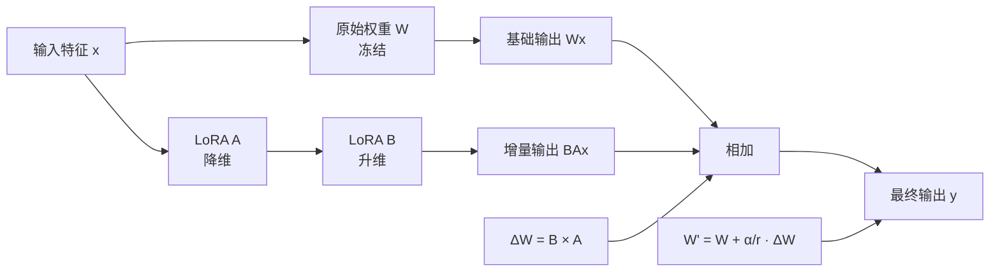

# LoRA 核心原理与结构图 `image2` 提示词

## 用途

这份文档用于给 `image2` 生成“LoRA 核心原理与结构图”。  
这张图适合作为论文技术原理章节中的“参数高效微调原理图”，重点说明 LoRA 如何在冻结大模型主权重的前提下，通过低秩矩阵实现低成本微调。

## 本文档依据的项目事实

- 当前项目采用 SD1.5 LoRA 训练路线：`docs/superpowers/specs/2026-04-18-sd15-electric-specialized-v2-design.md`
- 当前项目 LoRA 关键超参数：`docs/thesis/sd15-electric-specialized-lora-hyperparameters-three-line-table.md`
- 当前项目训练命令构建：`python-ai-service/training/generation/train_lora.py`
- 当前项目 LoRA 融合逻辑：`python-ai-service/training/generation/merge_lora.py`

## 当前项目里这张图应该怎么理解

这张图不应该画成你平台的训练流水线，也不应该画成“下载数据 -> 训练 100 epoch -> 部署”的工程流程。  
它应该画成“LoRA 为什么能高效微调 Stable Diffusion”这一层的原理图。

重点应放在下面 4 个概念：

- 原始大模型权重 `W` 冻结不更新
- 额外引入低秩矩阵 `A` 与 `B`
- 用低秩增量 `ΔW = B × A` 近似权重更新
- 最终得到 `W' = W + α/r · ΔW`

如果要贴合你的项目，可以弱提示：

- 当前 LoRA 主要用于 `Stable Diffusion 1.5`
- 当前项目参数为 `rank = 32`、`alpha = 32`
- 当前项目训练后会将 LoRA 权重融合到最终部署模型中

## 推荐画法

我建议这张图采用“结构图 + 原理公式图 + 训练/推理区别图”的合并表达：

- 左侧画标准线性层或注意力层的原始权重路径
- 中间画 LoRA 低秩旁路分支
- 右侧画输出结果
- 下方加一条简洁说明，区分“训练阶段”和“推理融合阶段”

这样最适合论文和答辩，因为它同时能说明：

- LoRA 的数学思想
- LoRA 的网络插入方式
- LoRA 的实际使用方式

## 可直接复制给 `image2` 的完整提示词

```md
请绘制一张“LoRA 核心原理与结构图”，要求是中文、正式、论文级、适合毕业设计答辩 PPT 和技术原理章节插图使用。

一、整体风格要求

- 图类型是“模型原理图 / 参数高效微调结构图”
- 不是业务流程图，不是系统架构图，不是数据库图，不是网页截图
- 使用白底或浅灰底，蓝色、青色、橙色为主色，整体风格学术化、专业化、清晰化
- 所有说明文字使用中文，数学符号和技术名可保留英文或公式，如 LoRA、rank、alpha、W、ΔW
- 模块边框规整，箭头明确，公式表达简洁
- 整张图要让人一眼看出“冻结原权重 + 增加低秩分支 + 只训练少量参数”的核心思想

二、图标题

标题写为：
“LoRA 核心原理与结构图”

副标题写为：
“冻结大模型主权重下的低秩适配微调机制”

三、整体布局要求

请将整张图从左到右分成以下 4 个区域：

1. 原始层输入区
2. 主权重路径区
3. LoRA 低秩旁路区
4. 输出与公式说明区

可以在下方增加一个“训练阶段 / 推理阶段”说明栏。

四、必须出现的核心模块

1. 输入区
- 输入特征 x

2. 主权重路径区
- 原始权重矩阵 W
- 标注“冻结，不参与训练”
- 原始线性变换输出

3. LoRA 低秩旁路区
- 降维矩阵 A
- 升维矩阵 B
- rank r
- alpha 缩放系数
- 低秩增量 ΔW

4. 输出区
- 原始输出 + LoRA 增量输出
- 最终输出 y

五、必须体现的核心原理

请清晰表现以下逻辑：

1. 输入 x 同时进入两条路径：
   - 主权重路径
   - LoRA 低秩旁路

2. 主权重路径：
- x 经过原始权重 W
- W 冻结，不更新
- 得到基础输出

3. LoRA 低秩旁路：
- x 先经过降维矩阵 A
- 再经过升维矩阵 B
- 形成低秩增量输出
- 旁路只训练 A 与 B

4. 最终输出：
- 原始输出与增量输出相加
- 得到新的等效权重结果

六、必须出现的公式

请在图中清晰放出以下核心公式：

1. 增量权重公式：
- ΔW = B × A

2. 融合后权重公式：
- W' = W + α/r · ΔW

3. 输出公式可选：
- y = Wx + α/r · BAx

请把公式画得简洁、规范、适合论文插图。

七、必须体现的关键概念

请明显体现以下概念：

- 原始权重冻结
- 只训练低秩矩阵
- 参数量显著减少
- 显存占用更低
- 训练成本更低
- 可在推理前融合回原模型

八、建议增加的辅助说明标签

请在图中适当增加简短中文说明：

- “原始参数冻结”
- “低秩分解”
- “降维”
- “升维”
- “旁路增量更新”
- “参数高效微调”
- “仅训练 A、B”
- “推理时可融合”

九、建议增加的训练/推理区别说明

请在图底部或右下角增加一个小说明框：

训练阶段：
- 冻结原始权重 W
- 仅更新 A、B

推理阶段：
- 将 LoRA 增量融合回原模型
- 使用融合后的新权重进行推理

十、建议增加的 Stable Diffusion 关联说明

请在边角增加一个简短补充说明框：

- LoRA 常插入到扩散模型的 U-Net 注意力层或线性层中
- 当前项目用于 Stable Diffusion 1.5 电力领域专用模型微调
- 当前项目 LoRA Rank = 32
- 当前项目 LoRA Alpha = 32

这部分只作为项目关联说明，不要喧宾夺主。

十一、图中建议的视觉重点

请重点突出：

- 冻结的 W
- 可训练的 A 与 B
- ΔW 的形成过程
- W 与 ΔW 的加和关系

其中：
- 冻结参数可以用灰蓝色
- 可训练 LoRA 参数可以用橙色或绿色
- 输出路径可以用蓝色强调

十二、版式要求

- 输出为 16:9 横版高清图
- 风格像论文第 2 章中的“LoRA 原理结构图”
- 结构清晰、公式简洁、视觉层次分明
- 不要过度复杂
- 便于答辩现场远距离阅读

十三、文字要求

- 所有解释文字用中文
- 数学公式保持标准写法
- 模块名可保留英文术语：LoRA、rank、alpha
- 不要乱码
- 不要出现与主题无关的组件
```

## 建议追加给 `image2` 的负面约束

```md
不要画成训练流水线图，不要画成平台架构图，不要加入数据库、Redis、微服务、前端页面、部署环境、评分模型等无关内容，不要把 LoRA 画成完整全量微调，不要省略冻结主权重、A/B 低秩分支、ΔW 和权重融合公式，不要把图画成过于复杂的 Transformer 全网络展开图。
```

## 如果你想让图更像论文插图，可以补这一句

```md
请让整张图更像“论文中的参数高效微调原理图”，突出低秩分解、冻结主干、增量更新与推理融合关系，减少装饰性图标，增强学术表达。
```

## 如果你想让图更适合答辩 PPT，可以补这一句

```md
请增强主视觉引导，让观众能快速理解“原始权重冻结，LoRA 只训练小规模低秩矩阵，并通过增量方式修改输出”的核心逻辑。
```

## Mermaid 草稿

如果你想先确认逻辑结构，可以先参考这份 Mermaid 草稿：



## 当前文档采用的默认假设

- 默认这张图用于“论文技术原理章节”，而不是训练工程章节。
- 默认重点讲 LoRA 的通用原理，而不是你项目里的完整训练流水线。
- 默认会弱提示你项目使用的是 `SD1.5 LoRA`，`rank=32`，`alpha=32`。

