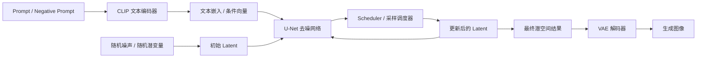

# Stable Diffusion 结构与生成流程图 `image2` 提示词

## 用途

这份文档用于给 `image2` 生成“Stable Diffusion 结构与生成流程图”。  
这张图更适合作为论文第 2 章或技术原理章节中的“模型原理图”，用来说明 Stable Diffusion 的核心组成与从文本到图像的生成过程。

## 本文档依据的项目事实

- 当前仓库已有简化草稿：`docs/image/mermaid/01-图2-1-Stable-Diffusion-结构与生成流程图.mmd`
- 当前平台中的 SD1.5 运行时：`python-ai-service/app/runtimes/sd15_runtime.py`
- 模型说明文档：`docs/models/model-introduction-and-scoring.md`
- 论文插图设计背景：`docs/superpowers/specs/2026-04-18-thesis-figure-package-design.md`

## 当前项目里这张图应该怎么理解

这张图不应该画成你整个平台的业务流程，也不应该画成某个服务调用链。  
它应该是“生成模型原理图”，重点解释：

- 文本提示词如何进入文本编码器
- 随机噪声如何在潜空间中初始化
- U-Net 如何在文本条件引导下迭代去噪
- Scheduler 如何控制逐步采样
- VAE 如何把潜变量解码为最终图像

如果需要更贴合你项目，可以在图中弱化通用理论、稍微强调：

- 当前平台主要使用 `Stable Diffusion 1.5`
- 真实推理运行在 `diffusers StableDiffusionPipeline`
- 支持 `attention slicing` 与 `VAE slicing`

但主图仍应以“通用 Stable Diffusion 原理”表达为主。

## 推荐画法

我建议这张图采用“结构图 + 生成流程图合并”的方式：

- 左侧放输入：`Prompt / Negative Prompt / Random Noise`
- 中部放模型结构：`CLIP 文本编码器 / U-Net / Scheduler / VAE`
- 右侧放输出：`Latent Result / Final Image`
- 用循环箭头体现“多步迭代去噪”

这样最适合论文和答辩，因为它兼顾：

- 结构理解
- 生成过程
- 推理顺序

## 可直接复制给 `image2` 的完整提示词

```md
请绘制一张“Stable Diffusion 结构与生成流程图”，要求是中文、正式、论文级、适合毕业设计答辩 PPT 和技术原理章节插图使用。

一、整体风格要求

- 图类型是“模型结构与生成流程图”
- 不是业务流程图，不是系统架构图，不是数据库图，不是网页截图
- 使用白底或浅灰底，蓝色、青色、紫灰色作为主色，整体风格清晰、正式、学术化
- 所有说明文字使用中文，技术名可保留少量英文，如 CLIP、U-Net、VAE、Scheduler、Latent
- 模块边框规整，箭头明确，结构层次清楚
- 整张图要能一眼看出“文本条件 + 随机噪声 -> 潜空间迭代去噪 -> VAE 解码 -> 最终图像”的过程

二、图标题

标题写为：
“Stable Diffusion 结构与生成流程图”

副标题写为：
“基于文本条件引导的潜空间扩散生成过程”

三、整体布局要求

请将整张图按从左到右布局，分成以下 5 个区域：

1. 输入区
2. 条件编码区
3. 潜空间去噪区
4. 解码输出区
5. 说明标注区

四、必须出现的核心模块

1. 输入区
- 文本提示词 Prompt
- 负向提示词 Negative Prompt
- 随机噪声 / 随机潜变量

2. 条件编码区
- CLIP 文本编码器
- 文本嵌入 / 条件向量

3. 潜空间去噪区
- Latent 潜空间
- U-Net 去噪网络
- Scheduler / 采样调度器
- 多步迭代去噪循环

4. 解码输出区
- 去噪后的潜变量
- VAE 解码器
- 最终生成图像

五、必须体现的生成流程

请清晰画出以下流程：

1. 用户输入 Prompt 和 Negative Prompt
2. Prompt 与 Negative Prompt 输入 CLIP 文本编码器
3. 文本编码器输出条件向量 / 文本嵌入
4. 生成过程从随机噪声或随机潜变量开始
5. 随机潜变量进入潜空间
6. U-Net 在文本条件引导下预测噪声残差
7. Scheduler 根据当前时间步更新 latent
8. 这个过程会重复多次，形成“迭代去噪循环”
9. 去噪结束后得到最终潜空间结果
10. 最终潜变量输入 VAE 解码器
11. VAE 解码输出最终图像

六、必须体现的关键概念

请在图中明显体现以下概念：

- 文本条件引导
- 潜空间生成，而不是直接在像素空间生成
- 多步采样 / 多步去噪
- U-Net 是核心去噪网络
- Scheduler 控制时间步和采样更新
- VAE 负责 latent 与图像之间的转换

七、建议增加的辅助说明

请在图中适当增加简短中文标签说明：

- “文本语义编码”
- “条件引导”
- “潜变量初始化”
- “噪声预测”
- “逐步去噪”
- “采样步控制”
- “潜空间表示”
- “图像解码”
- “最终生成结果”

八、建议增加的结构细节

请让 U-Net 区域略微突出，并可在其中标注：
- 下采样
- 中间瓶颈
- 上采样
- 跨层连接

但不要把 U-Net 内部画得过于复杂，仍需保持论文插图易读性。

九、建议增加的 Stable Diffusion 特征说明

请在图右下角或侧边增加一个简短说明框，写出：

- 使用 CLIP 编码文本条件
- 在 latent 空间中进行扩散与去噪
- 通过多步采样逐渐恢复图像语义结构
- 最后由 VAE 解码生成可视图像

十、如果需要更贴合当前项目，可增加的弱提示

可以在图的边角增加一小块“本项目实现说明”：

- 当前平台主要接入 Stable Diffusion 1.5
- 基于 diffusers StableDiffusionPipeline 实现
- 推理阶段启用 attention slicing 与 VAE slicing

这部分只作为补充说明，不要让它喧宾夺主。

十一、版式要求

- 输出为 16:9 横版高清图
- 风格像论文第 2 章中的“模型结构原理图”
- 模块清晰、箭头明确、层次分明
- 去噪循环要可视化明显
- 不要让图面过于拥挤

十二、文字要求

- 所有业务解释与说明文字用中文
- 模块名可保留英文术语：CLIP、U-Net、VAE、Scheduler、Latent
- 不要乱码
- 不要使用项目无关组件
```

## 建议追加给 `image2` 的负面约束

```md
不要画成系统架构图，不要画成平台部署图，不要加入数据库、Redis、Gateway、前端页面、微服务、用户登录、评分模型等无关模块，不要把 Stable Diffusion 画成 GAN，不要省略 U-Net、VAE、CLIP 文本编码器、Scheduler 和 latent 潜空间，不要把流程画成一次性直通而缺少迭代去噪循环。
```

## 如果你想让图更像论文插图，可以补这一句

```md
请让整张图更像“论文中的扩散模型原理图”，突出文本条件编码、潜空间扩散、U-Net 迭代去噪与 VAE 解码过程，减少装饰性图标，增强学术表达。
```

## 如果你想让图更适合答辩 PPT，可以补这一句

```md
请增强主链路视觉引导，让观众能快速看清“Prompt -> 文本编码 -> latent 去噪 -> VAE 解码 -> 最终图像”的核心路径。
```

## Mermaid 草稿

如果你想先确认逻辑结构，可以先参考这份 Mermaid 草稿：



## 当前文档采用的默认假设

- 默认这张图用于“论文技术原理章节”，而不是平台业务章节。
- 默认重点讲 Stable Diffusion 的通用结构与生成流程。
- 默认以 `Stable Diffusion 1.5` 风格的结构表达为主，因为这和你当前项目最贴近。

