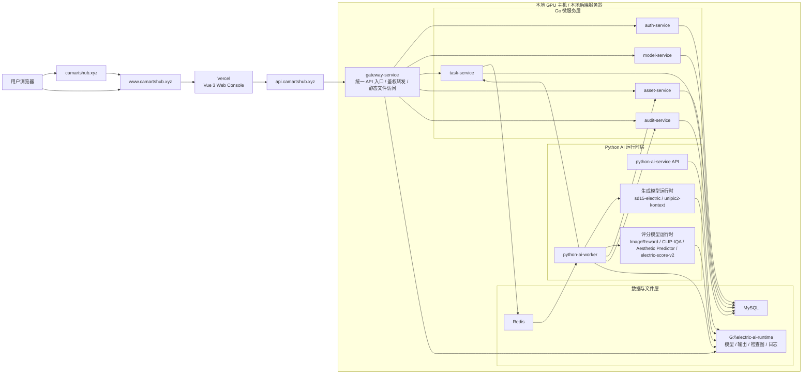

# Electric AI Platform 平台部署图 `image2` 提示词

## 用途

这份文档用于给 `image2` 生成本项目的“平台部署图”。  
这张图重点展示平台如何上线到公网、前端与后端分别部署在哪里、哪些服务对外暴露、哪些服务只在内部运行。

这张图适合：

- 毕业设计论文中的“平台部署图”
- 答辩 PPT 中的“系统部署方案”
- 项目汇报中的“公网发布与本地算力协同部署图”

## 本文档依据的项目事实

- 公网部署设计：`docs/superpowers/specs/2026-04-25-vercel-local-backend-design.md`
- Docker 编排：`deploy/docker-compose.platform.yml`
- Docker 运行手册：`docs/runtime/docker-gpu-runbook.md`
- Windows 原生运行手册：`docs/runtime/windows-native-runbook.md`
- 前端 Nginx 代理：`deploy/docker/web-console.nginx.conf`
- 网关路由：`services/gateway-service/router/router.go`

## 这张图应该表达什么

这张“平台部署图”建议突出以下 5 个部署事实：

1. 前端正式站点部署在 `Vercel`
2. 公网后端统一入口为 `api.camartshub.xyz`
3. 后端真实承载位置是“本地 GPU 主机”
4. 对外只暴露统一网关，不暴露 MySQL、Redis、Python 内部端口
5. 平台支持两种本地运行方式：
   - Windows 原生运行
   - Docker GPU 容器化运行

## 推荐的画图视角

建议把这张图做成“部署拓扑图”，重点分成以下几个区域：

- 公网用户访问区
- 域名与托管区
- 本地 GPU 主机区
- 平台内部服务区
- 数据与运行时资源区
- 部署模式说明区

## 推荐方案

我建议默认采用“公网部署版平台部署图”，也就是：

- 左侧画公网访问入口
- 中间画域名与 Vercel
- 右侧画本地 GPU 主机
- 主机内部再展开网关、微服务、Python 运行时、MySQL、Redis、运行时目录

这样最适合论文和答辩，因为它能一眼说明：

- 页面在云端
- 算力在本地
- 统一 API 入口在公网
- 内部服务仍保持微服务分层

## 可直接复制给 `image2` 的完整提示词

```md
请绘制一张“Electric AI Platform 平台部署图”，要求是中文、正式、论文级、适合毕业设计答辩 PPT 使用的部署拓扑图。

一、整体风格要求

- 图类型是“平台部署图 / 部署拓扑图”
- 不是业务流程图，不是数据库 ER 图，不是 UI 截图，不是流程漫画
- 使用白底或浅灰底，蓝色、青色、绿色为主色，整体风格专业、整洁、工程化
- 所有文字使用中文，技术名可保留少量英文，如 Vercel、Docker、Redis、MySQL、Vue 3、Python AI Worker
- 模块边框规整，箭头清晰，部署边界明显
- 整张图要重点体现“公网入口”和“本地 GPU 主机承载”的分工

二、图标题

标题写为：
“Electric AI Platform 平台部署图”

副标题写为：
“Vercel 前端公网部署 + 本地 GPU 后端承载 + 统一 API 网关接入”

三、整体布局要求

请把整张图从左到右分成 4 个主要区域：

1. 公网访问区
2. 域名与前端托管区
3. 本地 GPU 主机部署区
4. 部署说明区

其中“本地 GPU 主机部署区”再细分为：

- 接入层
- Go 微服务层
- Python AI 运行时层
- 数据与文件层

四、必须出现的节点

1. 公网访问区
- 用户浏览器
- 学生/教师/评审用户

2. 域名与前端托管区
- camartshub.xyz
- www.camartshub.xyz
- api.camartshub.xyz
- Vercel 静态前端托管
- Vue 3 Web Console

请体现：
- camartshub.xyz 跳转到 www.camartshub.xyz
- www.camartshub.xyz 承载前端页面
- 前端通过 api.camartshub.xyz 访问后端

3. 本地 GPU 主机部署区

请画一个大的部署边界框，标题为：
“本地 GPU 主机 / 本地后端服务器”

在这个框里必须出现：

接入层：
- gateway-service
- 标注“统一 API 入口 / 鉴权转发 / 静态文件访问”

Go 微服务层：
- auth-service
- model-service
- task-service
- asset-service
- audit-service

Python AI 层：
- python-ai-service API
- python-ai-worker
- 生成模型运行时
- 评分模型运行时

数据与文件层：
- MySQL
- Redis
- G:\\electric-ai-runtime
- 输出图片
- 检查图
- 模型目录
- 日志目录

五、必须体现的连接关系

请严格画出以下关系：

1. 用户浏览器访问 www.camartshub.xyz
2. www.camartshub.xyz 由 Vercel 托管 Vue 3 Web Console
3. 前端通过 api.camartshub.xyz 访问后端
4. api.camartshub.xyz 指向本地 GPU 主机上的 gateway-service
5. gateway-service 转发到：
   - auth-service
   - model-service
   - task-service
   - asset-service
   - audit-service
6. task-service 与 Redis 通信，用于任务投递
7. python-ai-worker 从 Redis 异步消费任务
8. python-ai-worker 与 task-service、asset-service、audit-service、model-service 交互
9. python-ai-service API 与 python-ai-worker 共用本地运行时目录
10. 生成模型和评分模型运行在本地 GPU 环境中
11. MySQL 为各微服务提供业务数据存储
12. G:\\electric-ai-runtime 存放模型、输出、日志、缓存
13. gateway-service 对外暴露：
   - /api/v1/*
   - /files/images/*
   - /files/image-checks/*

六、必须体现的部署边界

请在图中明确区分“公网暴露”和“内部服务”：

公网可访问：
- www.camartshub.xyz
- api.camartshub.xyz

仅内部运行，不直接暴露公网：
- auth-service
- model-service
- task-service
- asset-service
- audit-service
- python-ai-service
- python-ai-worker
- MySQL
- Redis

七、必须体现的部署模式

请在图右侧或右下角单独增加“部署模式说明”模块，写出：

1. Windows 原生运行模式
- web-console 运行在 Vite dev server
- gateway-service 使用 8080
- python-ai-service 使用 8090
- MySQL 使用 3307
- Redis 使用 6380

2. Docker GPU 运行模式
- web-console 暴露 18088
- gateway-service 暴露 18080
- python-ai-service 暴露 18090
- MySQL 暴露 13307
- Redis 暴露 16380
- 宿主机 G:\\electric-ai-runtime 挂载到容器 /runtime

八、图中建议重点标注的说明

请在合适位置增加简短标签：

- “公网前端入口”
- “统一 API 域名”
- “仅网关对外暴露”
- “本地 GPU 算力承载”
- “微服务内部通信”
- “异步任务队列”
- “模型与输出共享目录”
- “Docker / 原生双模式”

九、建议的模型运行时内容

在“生成模型运行时”框内可以写：
- sd15-electric
- unipic2-kontext

在“评分模型运行时”框内可以写：
- ImageReward
- CLIP-IQA
- Aesthetic Predictor
- electric-score-v2

十、必须体现的核心部署思想

请让整张图明显表达以下思想：

- 前端页面部署在云端，方便公网访问
- 后端与 AI 运行时保留在本地 GPU 主机，便于使用本地算力
- 公网访问统一收敛到一个 API 域名
- 微服务与 AI 运行时继续保留原有边界
- 数据库、Redis、Python 内部服务不直接暴露公网
- 平台既可本机原生运行，也可容器化运行

十一、输出要求

- 输出为 16:9 横版高清图
- 风格像毕业设计论文或项目答辩中的正式部署图
- 层次清楚、边界明确、箭头清晰
- 强调部署位置、访问路径、对外暴露边界
- 不要让图过于复杂拥挤
```

## 建议追加给 `image2` 的负面约束

```md
不要画成业务流程图，不要画成数据库 ER 图，不要加入 Kubernetes、Service Mesh、Kafka、对象存储、云数据库、手机 App、小程序、负载均衡集群等项目中没有的组件，不要错误地把 MySQL、Redis、python-ai-service 直接暴露到公网，不要省略 Vercel、本地 GPU 主机、gateway-service、api.camartshub.xyz 这几个关键节点。
```

## 论文版补充句

如果你想让它更像论文里的“平台部署图”，可以在提示词后面追加：

```md
请让整张图更像“论文第3章系统部署图”，突出部署位置、服务边界、访问入口和内外网隔离关系，减少装饰性图标，增强工程表达与学术规范感。
```

## 答辩版补充句

如果你想让它更适合答辩 PPT，可以在提示词后面追加：

```md
请增强主访问路径的视觉引导，让观众能快速理解“浏览器 -> Vercel 前端 -> api.camartshub.xyz -> 本地 gateway-service -> 微服务与 AI 运行时”的部署路径。
```

## Mermaid 草稿

如果你想先确认结构，可以先参考这份 Mermaid 草稿：



## 当前文档采用的默认假设

- 默认这张图优先展示“公网部署方案”，即 `Vercel 前端 + 本地 GPU 后端`。
- 默认同时在图中保留“Docker / Windows 原生双模式”的说明块。
- 默认重点不在业务流程，而在部署位置、访问边界和服务暴露策略。

