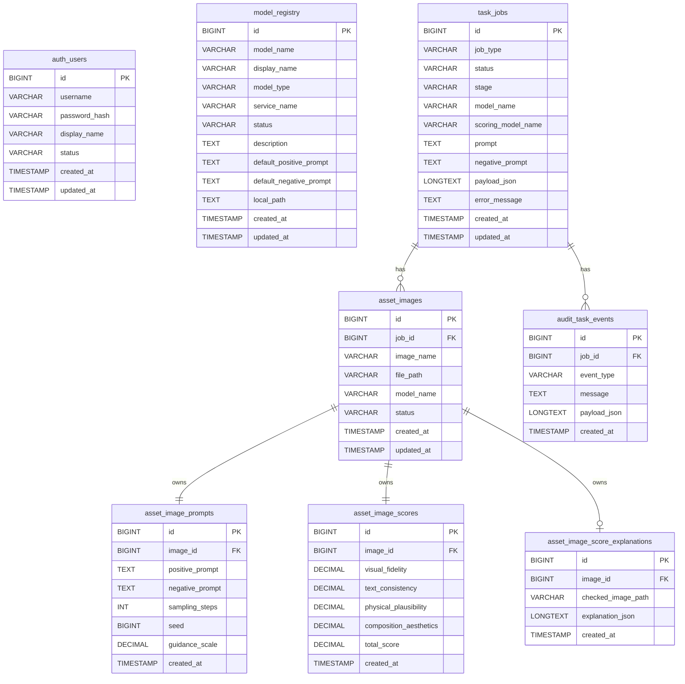

# Electric AI Platform 核心数据关系图 `image2` 提示词

## 用途

这份文档用于给 `image2` 生成本项目的“核心数据关系图”。  
这张图更偏向论文中的“数据库 E-R 图 / 核心实体关系图”，重点展示平台核心业务数据之间的关联关系，而不是系统部署架构。

适合用于：

- 毕业设计论文中的“系统数据库 E-R 图”
- 答辩 PPT 中的“核心数据关系图”
- 项目汇报中的“业务实体与数据结构说明图”

## 本文档依据的项目事实

- 初始化表结构：`deploy/mysql/init/001_schema.sql`
- 初始化种子：`deploy/mysql/init/002_seed.sql`
- 任务模型：`services/task-service/model/task.go`
- 资产模型：`services/asset-service/model/asset.go`
- 审计模型：`services/audit-service/model/event.go`
- 用户模型：`services/auth-service/model/user.go`
- 模型注册表：`services/model-service/model/model.go`
- 已有 Mermaid 草图：`docs/image/mermaid/04-图3-2-系统数据库-E-R-图.mmd`

## 这张图的推荐表达重点

这张图建议突出 8 个核心实体：

- `auth_users`
- `model_registry`
- `task_jobs`
- `asset_images`
- `asset_image_prompts`
- `asset_image_scores`
- `asset_image_score_explanations`
- `audit_task_events`

其中真正的核心主线是：

`task_jobs -> asset_images -> prompt / score / score_explanation`

以及：

`task_jobs -> audit_task_events`

另外还有两类“业务关联但不一定是硬外键”的关系：

- `task_jobs.model_name` 与 `model_registry.model_name`
- `task_jobs.scoring_model_name` 与 `model_registry.model_name`

## 图面应该怎么画

建议生成一张“论文风格的 E-R 数据关系图”，要求：

- 白底或浅灰底
- 蓝色、青色为主色
- 表结构框规整，字段清晰
- 主键、外键明确标注
- 强关联使用实线
- 业务语义关联可使用虚线
- 重点体现 1 对多、1 对 1、可选关联

## 可直接复制给 `image2` 的完整提示词

```md
请绘制一张“Electric AI Platform 核心数据关系图”，风格为中文论文级数据库 E-R 图，适合毕业设计论文和答辩 PPT 使用。

一、整体风格要求

- 图类型是“数据库 E-R 图 / 核心数据关系图”
- 不是系统部署图，不是业务流程图，不是网页界面截图
- 白色或浅灰背景，蓝色和青色为主色，整体风格正式、工整、专业
- 所有文字使用中文，但表名和字段名保留英文数据库命名
- 每个实体用规范的数据库表结构框展示
- 主键标记为 PK，外键标记为 FK
- 关系线和基数要清晰，适合论文插图

二、图标题

标题写为：
“Electric AI Platform 核心数据关系图”

副标题写为：
“面向图像生成、评分、资产管理与任务审计的核心实体关系”

三、必须出现的核心实体

请把下面 8 个实体作为主图主体：

1. auth_users
2. model_registry
3. task_jobs
4. asset_images
5. asset_image_prompts
6. asset_image_scores
7. asset_image_score_explanations
8. audit_task_events

四、每个实体需要体现的关键字段

1. auth_users
- id PK
- username
- password_hash
- display_name
- status
- created_at
- updated_at

2. model_registry
- id PK
- model_name
- display_name
- model_type
- service_name
- status
- description
- default_positive_prompt
- default_negative_prompt
- local_path
- created_at
- updated_at

3. task_jobs
- id PK
- job_type
- status
- stage
- model_name
- scoring_model_name
- prompt
- negative_prompt
- payload_json
- error_message
- created_at
- updated_at

4. asset_images
- id PK
- job_id FK
- image_name
- file_path
- model_name
- status
- created_at
- updated_at

5. asset_image_prompts
- id PK
- image_id FK
- positive_prompt
- negative_prompt
- sampling_steps
- seed
- guidance_scale
- created_at

6. asset_image_scores
- id PK
- image_id FK
- visual_fidelity
- text_consistency
- physical_plausibility
- composition_aesthetics
- total_score
- created_at

7. asset_image_score_explanations
- id PK
- image_id FK
- checked_image_path
- explanation_json
- created_at

8. audit_task_events
- id PK
- job_id FK
- event_type
- message
- payload_json
- created_at

五、必须体现的强关系

请明确画出以下真实强关系，并标注关系基数：

1. task_jobs 与 asset_images
- 一个任务可以产生多张图片
- 关系：1 对多
- 表达为：task_jobs 1 ----- N asset_images

2. asset_images 与 asset_image_prompts
- 每张图片对应一条提示词记录
- 关系：1 对 1
- 表达为：asset_images 1 ----- 1 asset_image_prompts

3. asset_images 与 asset_image_scores
- 每张图片对应一条评分记录
- 关系：1 对 1
- 表达为：asset_images 1 ----- 1 asset_image_scores

4. asset_images 与 asset_image_score_explanations
- 每张图片可以有 0 或 1 条评分解释记录
- 关系：1 对 0..1
- 表达为：asset_images 1 ----- 0..1 asset_image_score_explanations

5. task_jobs 与 audit_task_events
- 一个任务对应多条审计事件
- 关系：1 对多
- 表达为：task_jobs 1 ----- N audit_task_events

六、必须体现的业务语义关系

请额外画出以下“业务语义关联”，但与真实外键区分开：

1. task_jobs.model_name -> model_registry.model_name
- 表示任务选择的生成模型来自模型注册表
- 这是业务语义关联，不一定是数据库硬外键
- 建议用虚线表示

2. task_jobs.scoring_model_name -> model_registry.model_name
- 表示任务选择的评分模型来自模型注册表
- 这是业务语义关联，不一定是数据库硬外键
- 建议用虚线表示

3. asset_images.model_name -> model_registry.model_name
- 表示图片结果由某个生成模型产生
- 这是业务语义关联
- 建议用虚线表示

七、auth_users 的处理方式

请保留 auth_users 实体，但不要把它错误地画成直接外键连接 task_jobs，因为当前项目表结构里没有“用户 ID -> 任务表”的显式外键。

可以在图中把 auth_users 放在左上角或上方，作为“登录鉴权实体”，并用弱提示说明：
- 当前主要用于登录认证
- 暂未与任务表建立直接外键关系

八、图中建议增加的说明标签

请在适当位置增加简短说明标签：

- “任务主表”
- “资产主表”
- “提示词子表”
- “评分子表”
- “评分解释扩展表”
- “审计事件表”
- “模型注册表”
- “用户认证表”
- “实线：真实外键关系”
- “虚线：业务语义关联”

九、图面布局建议

请按下面思路排版，使结构清晰：

- 左上角：auth_users
- 上方或右上角：model_registry
- 中间核心：task_jobs
- task_jobs 下方：asset_images
- asset_images 下方并列：asset_image_prompts、asset_image_scores、asset_image_score_explanations
- task_jobs 右侧或下右侧：audit_task_events

这样可以突出“任务”作为中心实体，“资产”和“审计”作为两条主分支。

十、必须体现的核心业务含义

请让整张图明显表达以下业务含义：

- 用户登录后可发起生成任务
- 任务记录保存生成参数和当前状态
- 一个任务会产出多张生成图片
- 每张图片会保存对应提示词和评分结果
- 部分图片还会附带评分解释与检查图
- 每个任务在执行过程中会产生多条审计事件
- 模型注册表统一记录生成模型与评分模型目录
- 数据关系支撑“生成、评分、历史回溯、审计追踪”四类核心功能

十一、输出要求

- 输出为 16:9 横版高清图
- 风格像论文第 3 章中的“系统数据库 E-R 图”
- 保证字段文字清晰
- 保证关系基数清楚
- 保证主实体和子实体层次明确
- 不要把图画得过于复杂拥挤
```

## 建议追加给 `image2` 的负面约束

```md
不要画成系统架构图，不要画成业务流程图，不要加入 Redis、Gateway、Python Worker、Docker、Vercel、浏览器等非数据库实体，不要错误地把 auth_users 和 task_jobs 画成直接外键，不要遗漏 asset_image_prompts、asset_image_scores、audit_task_events，不要把 model_registry 画成真实硬外键中心，不要加入项目中不存在的订单、支付、角色权限、文件对象存储等表。
```

## 如果你想让图更像论文插图，可以补这一句

```md
请让整张图更像“论文中的系统数据库 E-R 图”，强化实体边界、主外键标识、基数关系和核心业务说明，弱化装饰性图标。
```

## 如果你想让图更适合答辩 PPT，可以补这一句

```md
请适当突出 task_jobs、asset_images、asset_image_scores、audit_task_events 这几张核心表，让观众能快速看清任务、资产、评分、审计之间的主干关系。
```

## Mermaid 草稿

如果你想先确认结构，可以先参考这份 Mermaid 草稿：



## 当前文档采用的默认假设

- 默认这张图是“核心数据关系图”，所以以数据库实体为主，而不是运行时组件。
- 默认 `auth_users` 只作为登录认证实体展示，不强行补画不存在的任务归属外键。
- 默认 `model_registry` 与任务、资产之间主要表达业务语义关系，而不是数据库硬外键。
- 默认 `model_prompt_templates` 不纳入主图，因为它是扩展配置表，不属于当前最核心的数据主链路。

