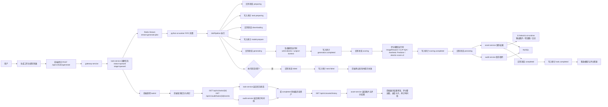

# Electric AI Platform 生成任务业务流程图 `image2` 提示词

## 用途

这份文档用于给 `image2` 生成本项目的“生成任务业务流程图”。  
重点不是总架构，而是展示一次生成任务从“用户提交”到“结果回显”的完整业务闭环。

这张图适合：

- 毕业设计论文中的“核心业务流程图”
- 答辩 PPT 中的“生成任务执行流程”
- 项目汇报中的“前后端与 AI 运行时协同流程”

## 本文档依据的项目事实

- 前端提交流程：`web-console/src/views/GenerateView.vue`
- 前端 API：`web-console/src/api/platform.ts`
- 前端状态管理：`web-console/src/stores/platform.ts`
- 网关路由：`services/gateway-service/router/router.go`
- 任务创建：`services/task-service/controller/task_controller.go`
- 任务入队：`services/task-service/service/task_service.go`
- Worker 消费：`python-ai-service/app/workers/job_worker.py`
- 任务流水线：`python-ai-service/app/services/job_pipeline.py`
- 状态回写：`python-ai-service/app/clients/task_client.py`
- 资产落库：`python-ai-service/app/clients/asset_client.py`
- 审计写入：`python-ai-service/app/clients/audit_client.py`

## 这张图应该表达什么

这张“生成任务业务流程图”要突出以下主线：

1. 用户在生成工作台填写参数并提交任务
2. 前端通过网关调用 `POST /api/v1/tasks/generate`
3. `task-service` 创建任务记录并写入 Redis Stream
4. `python-ai-worker` 从 Redis Stream FIFO 消费任务
5. Worker 按阶段推进任务状态
6. Worker 调用生成模型出图
7. Worker 调用评分模型完成评分
8. Worker 将结果写入资产服务，将事件写入审计服务
9. 前端轮询任务状态和审计时间线
10. 任务完成后前端拉取历史资产并展示图片与评分结果

## 推荐的画图形式

建议让 `image2` 生成“横向泳道式业务流程图”，泳道从左到右依次为：

- 用户
- Vue 3 生成工作台
- gateway-service
- task-service
- Redis Stream
- python-ai-worker
- 生成模型运行时
- 评分模型运行时
- asset-service
- audit-service
- MySQL / 文件存储

这样最适合画“业务闭环”和“调用顺序”。

## 可直接复制给 `image2` 的完整提示词

```md
请绘制一张“Electric AI Platform 生成任务业务流程图”，要求是中文、正式、论文级、适合毕业设计答辩 PPT 使用的横向泳道流程图。

一、整体风格要求

- 图类型是“业务流程图 + 泳道流程图”，不是系统总架构图，不是 UI 截图，不是插画
- 使用白底或浅灰底，蓝色、青色、绿色作为主色，整体风格专业、清晰、工程化
- 所有文字都用中文，技术名可保留少量英文，如 Redis Stream、Python Worker、JWT、Vue 3
- 强调箭头方向、步骤编号、状态变化、结果回流
- 图面整洁、可读性高，适合论文和答辩展示

二、图标题

标题写为：
“Electric AI Platform 生成任务业务流程图”

副标题写为：
“从任务提交、异步调度、图像生成、评分落库到前端结果回显的完整业务闭环”

三、泳道划分

请把整张图按横向泳道划分为以下 11 个参与方：

1. 用户
2. Vue 3 生成工作台
3. gateway-service
4. task-service
5. Redis Stream
6. python-ai-worker
7. 生成模型运行时
8. 评分模型运行时
9. asset-service
10. audit-service
11. MySQL / 文件存储

四、必须出现的流程步骤

请按顺序画出以下业务步骤，并用清晰箭头连接：

1. 用户进入“生成工作台”
2. 用户填写 prompt、negative prompt、模型、评分模型、尺寸、步数等参数
3. 用户点击“提交生成任务”
4. Vue 3 前端调用网关接口：POST /api/v1/tasks/generate
5. gateway-service 将请求转发给 task-service
6. task-service 校验并创建任务记录，初始状态为：
   - status = queued
   - stage = queued
7. task-service 将任务消息写入 Redis Stream：
   - stream:generate:jobs
8. task-service 返回任务 ID 和任务基础信息给前端
9. 前端进入“轮询任务状态”阶段

10. python-ai-worker 从 Redis Stream 以 FIFO 方式异步消费任务
11. Worker 解析任务 payload，开始执行 JobPipeline
12. Worker 回写任务状态为：
   - preparing
13. Worker 写入审计事件：
   - task.preparing
14. Worker 加载或获取对应生成模型运行时
15. Worker 回写任务状态为：
   - downloading
16. Worker 写入审计事件：
   - model.prepare
17. Worker 回写任务状态为：
   - generating
18. Worker 调用生成模型运行时执行图像生成

生成模型运行时框中请写出：
- sd15-electric
- unipic2-kontext

19. 图像生成完成后，Worker 写入审计事件：
   - generation.completed
20. Worker 回写任务状态为：
   - scoring
21. Worker 调用评分模型运行时执行图像评分

评分模型运行时框中请写出：
- ImageReward
- CLIP-IQA
- Aesthetic Predictor
- electric-score-v2

22. 评分完成后，Worker 写入审计事件：
   - scoring.completed
23. Worker 回写任务状态为：
   - persisting
24. Worker 将生成结果和评分结果提交给 asset-service
25. Worker 将任务审计事件提交给 audit-service
26. asset-service 与 audit-service 将数据写入 MySQL
27. 输出图片、检查图、日志写入本地文件目录
28. 本地文件目录请标注：
   - G:\\electric-ai-runtime
29. Worker 最终回写任务状态为：
   - completed
30. Worker 写入审计事件：
   - task.completed
31. 任务完成后释放生成模型和评分资源

五、前端回显闭环必须体现

请把“用户看到结果”的闭环也画出来：

1. Vue 3 生成工作台每隔一段时间轮询任务详情和审计时间线
2. 前端调用：
   - GET /api/v1/tasks/{id}
   - GET /api/v1/audit/tasks/{id}/events
3. 当任务状态为 completed 时
4. 前端进一步拉取历史资产或当前任务结果
5. 前端展示：
   - 生成图片预览
   - 四维评分
   - 总分
   - 审计时间线
   - 任务进度卡片

六、失败分支必须体现

请增加一个异常分支：

- 如果生成或评分过程中出现异常
- Worker 将任务状态回写为：
  - failed
- Worker 写入审计事件：
  - task.failed
- 前端轮询到 failed 后停止轮询
- 页面提示任务失败信息

七、图中必须体现的业务特征

请在图中明显体现以下要点：

- 前端提交与后端执行解耦
- 任务通过 Redis Stream 异步排队
- python-ai-worker 按 FIFO 消费
- 状态推进与审计记录同步发生
- 生成完成后立即进入评分阶段
- 评分完成后进行资产持久化
- 前端通过轮询拿到任务状态和结果
- 整个流程形成“提交 -> 调度 -> 生成 -> 评分 -> 落库 -> 回显”的闭环

八、图中建议的重点标注

请在适当位置加简短说明标签：

- “统一 API 入口”
- “异步任务队列”
- “FIFO 消费”
- “状态推进”
- “审计留痕”
- “结果持久化”
- “前端轮询”
- “结果回显”
- “资源释放”

九、版式要求

- 输出为 16:9 横版高清图
- 使用清晰的泳道边界
- 同类动作使用统一视觉样式
- 正常流程使用实线箭头
- 异常流程使用红色或橙色强调
- 阶段状态节点要显眼，便于论文说明 queued、preparing、downloading、generating、scoring、persisting、completed、failed

十、文字要求

- 所有业务解释文字使用中文
- 模块名称尽量与项目真实命名一致
- 不要出现乱码
- 不要出现不属于本项目的组件
```

## 建议追加给 `image2` 的负面约束

```md
不要画成总架构图，不要画成云原生集群图，不要出现 Kubernetes、Kafka、对象存储、手机 App、小程序、消息总线、负载均衡集群等项目中没有的组件，不要省略 Redis Stream，不要省略 python-ai-worker，不要省略 task-service，不要省略 asset-service 和 audit-service，不要把生成和评分画成前端直接执行，不要遗漏任务失败分支，不要遗漏前端轮询结果回显闭环。
```

## 论文版补充句

如果你要让它更像论文中的“业务流程图”，可以在提示词后面再加一句：

```md
请让整张图更像“论文第3章核心业务流程图”，突出业务时序、状态流转、审计留痕和结果回显，减少装饰性图标，增强工程表达与学术规范感。
```

## 答辩版补充句

如果你要让它更适合答辩 PPT，可以在提示词后面再加一句：

```md
请增强主流程的视觉引导，让观众能快速看清“用户提交 -> task-service入队 -> Redis Stream -> Python Worker -> 生成 -> 评分 -> 资产/审计 -> 前端回显”的核心路径。
```

## Mermaid 草稿

如果你想先确认逻辑结构，可以先参考这份 Mermaid 草稿：



## 当前文档采用的默认假设

- 默认这张图用于表现“生成工作台提交真实生成任务”的主流程。
- 默认采用仓库当前真实实现，而不是抽象化的理想流程。
- 默认把前端轮询和结果回显也纳入业务流程图，而不是只画后端执行链。

