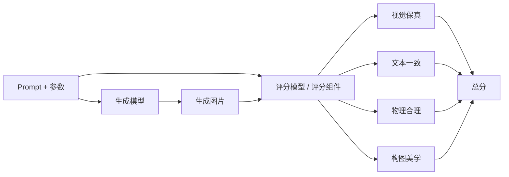
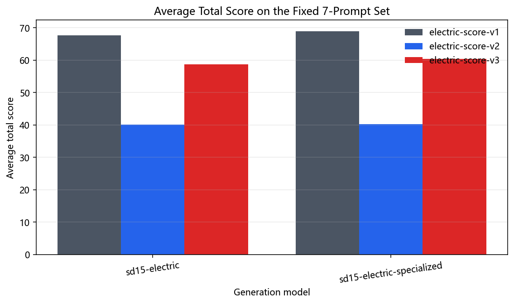
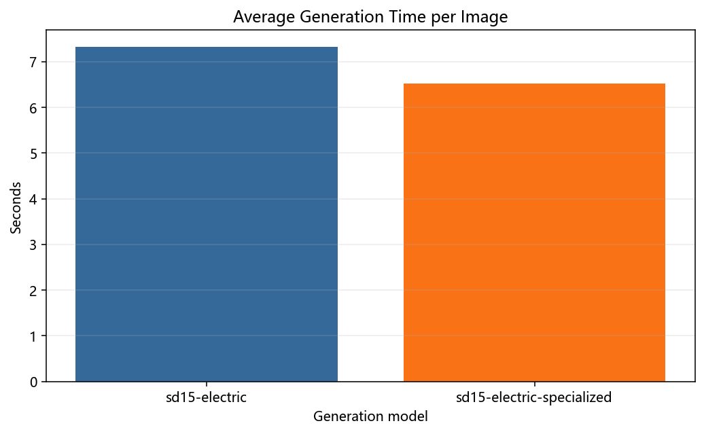
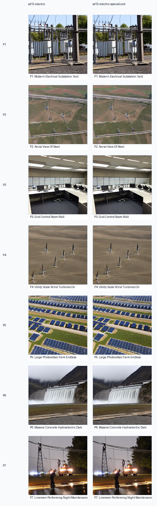
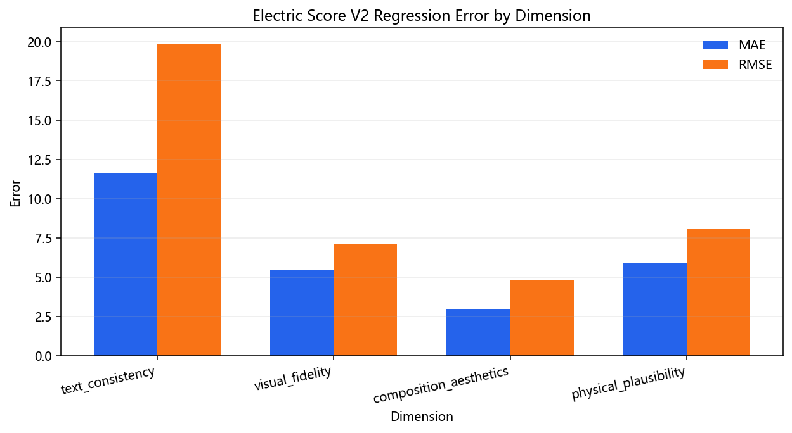
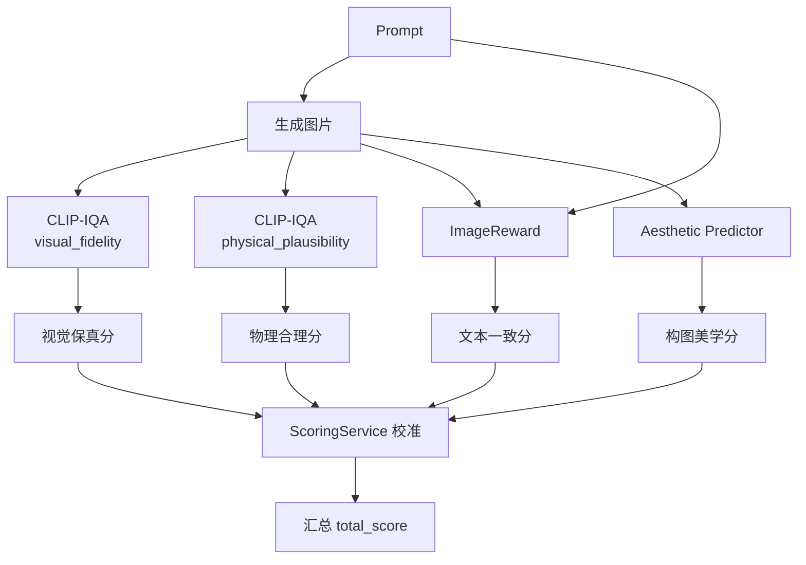

# 模型介绍、对比与评分说明

本文档用于统一介绍当前项目中接入的所有生成模型、评分模型和底层评分组件，重点回答三个问题：

1. 当前平台到底接入了哪些模型。
2. 不同电力场景下应该优先选择哪个生成模型。
3. 评分结果里的四个维度和总分分别代表什么，应该如何理解。

本文档说明以当前仓库代码实现为准，重点对应以下位置：

- `python-ai-service/app/runtimes/runtime_registry.py`
- `python-ai-service/app/runtimes/sd15_runtime.py`
- `python-ai-service/app/runtimes/unipic2_runtime.py`
- `python-ai-service/app/runtimes/scorers/image_reward_runtime.py`
- `python-ai-service/app/runtimes/scorers/clip_iqa_runtime.py`
- `python-ai-service/app/runtimes/scorers/aesthetic_runtime.py`
- `python-ai-service/app/runtimes/scorers/power_score_runtime.py`
- `python-ai-service/app/services/scoring_service.py`

## 1. 模型体系总览

当前平台的模型体系分为三层：

- 生成模型：负责根据 Prompt 生成电力行业图像
- 评分模型：负责输出四维评分和总分
- 评分组件模型：负责在默认评分链路里分担不同维度的打分任务

## 2. 生成模型介绍与对比

### 2.1 当前已接入生成模型

| 模型名 | 类型 | 当前定位 | 特点 |
| --- | --- | --- | --- |
| `sd15-electric` | SD1.5 路线 | 默认主力生成模型 | 启动稳定、速度较快、适合日常联调 |
| `sd15-electric-specialized` | SD1.5 电力专用路线 | 电力专用增强模型 | 更强调行业专属性，适合专门实验和展示 |
| `unipic2-kontext` | 更强语义理解路线 | 高质量复杂场景模型 | 更擅长复杂 Prompt、多条件描述和展示图 |

### 2.2 `sd15-electric`

`sd15-electric` 是当前最适合日常联调和常规生成任务的默认生成模型。

它的优势主要体现在：

- 加载逻辑成熟，依赖稳定
- 对单卡本机环境更友好
- 更适合快速测试前后端链路
- 对变电站、输电塔、风电场等结构较清晰的场景，通常能较快产出可用结果

它的不足主要是：

- 面对很长的 Prompt 和复杂条件约束时，语义表达不如更强的上下文模型
- 对复杂构图、设备层级关系和更细腻的语义控制能力有限

推荐使用场景：

- 日常开发联调
- smoke test
- 快速验证生成链路
- 标准工业电力场景出图

### 2.3 `sd15-electric-specialized`

`sd15-electric-specialized` 是当前平台预留和支持的电力行业专用增强路线。它本质上仍然属于 SD1.5 体系，但更强调电力行业图像的专属性。

它的价值在于：

- 保持 SD1.5 路线的部署稳定性
- 在行业题材上比通用 SD1.5 更有针对性
- 更适合展示“本课题针对电力行业做了专门优化”

它的适用场景包括：

- 电力行业专用模型展示
- 强调行业数据微调思路的毕业设计答辩
- 对行业部件、典型场景更敏感的专项测试

### 2.4 `unipic2-kontext`

`unipic2-kontext` 是当前平台中更偏高质量语义理解的生成模型。它比 `sd15-electric` 更重，但通常也更擅长处理复杂 Prompt。

它的优势：

- 对复杂长 Prompt 语义理解更强
- 更适合多条件组合场景
- 在最终展示图上通常更有潜力

它的代价：

- 首次加载更慢
- 对显存更敏感
- 更依赖运行时的 offload 和显存释放策略
- 在 `2026-04-08` 的当前实测机 `RTX 3060 Laptop GPU 6GB` 上，分片加载阶段退出，错误码为 `3221225477`

推荐使用场景：

- 最终展示图生成
- 复杂 Prompt
- 更强调“文字要求被真正理解”的任务

### 2.5 生成模型选型建议

如果你的目标是：

- 快速联调前后端
- 快速检查任务能否跑通
- 日常多次提交任务测试

优先选 `sd15-electric`。

如果你的目标是：

- 生成高质量展示图
- 使用更复杂、更长的 Prompt
- 更强调语义理解能力

优先选 `unipic2-kontext`。

如果你的目标是：

- 突出电力行业专属性
- 展示“专用模型”方向
- 做电力题材专项实验

优先选 `sd15-electric-specialized`。

一句话总结：

- `sd15-electric` 是稳定主力
- `sd15-electric-specialized` 是行业增强路线
- `unipic2-kontext` 是高质量复杂场景路线

### 2.6 固定 Prompt 集实测对比（2026-04-08）

本次已经基于 `web-console/src/views/generate-defaults.ts` 中的 `7` 条推荐 Prompt 做了真实生成与真实评分。生成参数固定为 `seed=42`、`steps=20`、`guidance_scale=7.5`、`512x512`。成功完成汇总的生成模型是 `sd15-electric` 与 `sd15-electric-specialized`；`unipic2-kontext` 因本机资源边界未纳入汇总。

| 生成模型 | `electric-score-v1` 平均总分 | `electric-score-v2` 平均总分 | `electric-score-v3` 平均总分 | 平均单图耗时 |
| --- | --- | --- | --- | --- |
| `sd15-electric` | `67.67` | `40.05` | `58.70` | `7.33s` |
| `sd15-electric-specialized` | `68.91` | `40.23` | `60.43` | `6.52s` |

从固定 Prompt 集实测可以看到：

- `sd15-electric-specialized` 在三套评分器下都略高于 `sd15-electric`
- 在 `electric-score-v3` 下，`sd15-electric-specialized` 平均总分高出 `1.73`
- 在 `electric-score-v3` 的 `7` 个 Prompt 中，`sd15-electric-specialized` 赢了 `4` 个
- `sd15-electric-specialized` 在 `electric-score-v3` 下最大的增益来自 `physical_plausibility`，平均高出 `5.49`

## 3. 评分模型与评分组件总览

### 3.1 当前评分模型

| 模型名 | 当前定位 | 实现方式 | 说明 |
| --- | --- | --- | --- |
| `electric-score-v1` | 默认评分模型 | 组件组合式评分 | 使用多种评分组件组合出四维评分 |
| `electric-score-v2` | 自训练评分模型 | bundle 推理 | 走自训练评分模型路线 |
| `electric-score-v3` | 进阶评分模型 | bundle / hybrid 路线 | 面向更强行业约束与更贴近人类判断的演进方案 |

### 3.2 默认评分链路 `electric-score-v1`

当前默认评分模型是 `electric-score-v1`。它不是一个单独的大模型，而是一条“多组件组合评分链路”。

其核心特点是：

- 使用 `ImageReward` 处理文本一致性等更偏图文偏好的维度
- 使用 `CLIP-IQA` 处理视觉保真与物理合理性等基础评分能力
- 使用 `Aesthetic Predictor` 处理构图美学
- 最后由 `ScoringService` 统一校准并计算总分

这种做法的优点是：

- 结构清楚
- 容易调试
- 适合毕业设计里解释“为什么四个维度不是同一个模型一起算出来的”

### 3.3 自训练评分模型 `electric-score-v2`

`electric-score-v2` 是当前代码中已经支持的自训练评分模型路线之一。它通过 bundle 方式加载，而不是简单依赖默认组件组合。

它的意义是：

- 让评分模型从“多个通用组件拼装”走向“更具整体性的自训练方案”
- 便于后续把行业知识、更复杂的图像特征和自定义目标一起纳入训练

### 3.4 自训练评分模型 `electric-score-v3`

`electric-score-v3` 是进一步演进的评分模型路线。当前代码已经预留和支持了这一命名与运行方式。

它对应的思路更偏向：

- 更强的人类偏好对齐
- 更强的电力行业规则约束
- 更明确的“行业专用评分模型”方向

在毕业设计叙事里，这条路线很重要，因为它可以体现：

- 平台不是只接入了通用评分器
- 而是在向“电力专用评分模型”继续演进

### 3.5 三套评分模型的实测读法差异

固定 Prompt 集实测已经给出三套评分模型的真实耗时与相对排序：

- `electric-score-v1` 平均评分耗时约 `19.26s/图`
- `electric-score-v2` 平均评分耗时约 `0.22s/图`
- `electric-score-v3` 平均评分耗时约 `4.56s/图`

读结果时需要注意两点：

1. `v1`、`v2`、`v3` 的绝对分值标尺没有完全对齐，更适合做“同一评分器下不同生成模型”的比较。
2. `v3` 更适合回答“是否符合电力行业结构约束”，`v1` 更接近默认线上组合评分，`v2` 更适合说明自训练轻量评分器已经落地。

### 3.6 `electric-score-v2` 量化误差（实测）

`electric-score-v2` 已经把最终回归误差写入 `G:\electric-ai-runtime\models\scoring\electric-score-v2\metrics.json`。当前误差水平如下：

| 维度 | MAE | RMSE |
| --- | --- | --- |
| `text_consistency` | `11.5880` | `19.8579` |
| `visual_fidelity` | `5.4243` | `7.0638` |
| `composition_aesthetics` | `2.9621` | `4.8258` |
| `physical_plausibility` | `5.8959` | `8.0440` |

其中 `composition_aesthetics` 的误差最低，而 `text_consistency` 仍然是最难学的维度，这也解释了为什么 `v2` 在绝对总分上看起来比 `v1 / v3` 更保守。

## 4. 底层评分组件说明

### 4.1 `ImageReward`

作用：

- 主要负责文本一致性等更偏图文匹配、人类偏好相关的评分

特点：

- 更接近“人看这张图是不是符合这段描述”
- 对 Prompt 和图像的整体匹配更敏感

适合回答的问题：

- 这张图是否贴题
- 这张图是否真的体现了 Prompt 中的关键元素

### 4.2 `CLIP-IQA`

作用：

- 主要承担视觉保真和物理合理性的基础评分

特点：

- 适合做图像质量、结构合理性和图文关系的基础判断
- 是当前默认评分体系里的重要底座

适合回答的问题：

- 图像看起来是否清晰、可信
- 设备结构和空间关系是否有明显问题

### 4.3 `Aesthetic Predictor`

作用：

- 主要负责构图美学维度评分

特点：

- 更偏画面组织、视觉观感和审美质量
- 不直接等同于“图像是否贴题”

适合回答的问题：

- 画面构图是否顺眼
- 光影和整体观感是否更适合展示

### 4.4 `Power Score Runtime`

作用：

- 承载平台内部的自训练评分模型运行时
- 支持 `electric-score-v2`、`electric-score-v3` 等路线

特点：

- 不只是调用通用评分组件
- 还能整合行业特征、自训练 bundle、辅助检测器等能力

## 5. 四维评分含义

当前平台最终输出四个维度和一个总分：

| 字段名 | 中文含义 | 主要关注点 |
| --- | --- | --- |
| `visual_fidelity` | 视觉保真度 | 图像是否清晰、真实、细节是否像真实工业照片 |
| `text_consistency` | 文本一致性 | 图像内容是否符合 Prompt 要求 |
| `physical_plausibility` | 物理合理性 | 结构、连接、空间关系是否符合工程常识 |
| `composition_aesthetics` | 构图美观度 | 画面组织、视觉平衡和展示观感 |
| `total_score` | 总分 | 按权重汇总后的综合结果 |

## 6. 当前总分权重

`ScoringService` 当前采用的默认权重如下：

| 维度 | 权重 |
| --- | --- |
| `visual_fidelity` | `0.21` |
| `text_consistency` | `0.37` |
| `physical_plausibility` | `0.24` |
| `composition_aesthetics` | `0.18` |

这说明当前平台的业务取向不是“只要图片好看就行”，而是更强调：

1. 是否贴合 Prompt
2. 是否符合电力行业场景逻辑
3. 再考虑整体观感和构图

## 7. 评分流程说明

这张流程图说明：

- 评分不是单模型单输出
- 不同维度由不同评分能力负责
- 最终由 `ScoringService` 统一校准与汇总

## 8. 模型选择建议

### 8.1 如果你要做日常联调

- 生成模型优先：`sd15-electric`
- 评分模型优先：`electric-score-v1`

原因：

- 路线稳定
- 速度更合适
- 便于快速排查问题

### 8.2 如果你要做最终展示图

- 在更高内存或已提前验证可加载的机器上，生成模型优先：`unipic2-kontext`
- 在当前 `RTX 3060 Laptop GPU 6GB` 实测机上，更稳妥的最终展示路径是：`sd15-electric-specialized`
- 评分模型优先：`electric-score-v1` 或更高阶的 `electric-score-v3`

原因：

- 生成效果和复杂语义能力更强
- 适合强调图像质量和语义理解

### 8.3 如果你要强调行业专属性

- 生成模型优先：`sd15-electric-specialized`
- 评分模型优先：`electric-score-v2` 或 `electric-score-v3`

原因：

- 更符合“电力行业专用模型”的毕业设计叙事
- 更能体现平台不只是套用通用模型

## 9. 建议的结果阅读顺序

对于工业电力题材图片，建议按以下顺序理解评分：

1. 先看 `text_consistency`
   判断是否贴题
2. 再看 `physical_plausibility`
   判断结构和场景是否合理
3. 再看 `visual_fidelity`
   判断图像是否清晰可信
4. 最后看 `composition_aesthetics`
   判断它是否更适合展示

原因是：

- 电力题材首先要“对”
- 然后才是“像”
- 最后才是“好看”

## 10. 总结

当前平台的模型体系可以概括为：

- 生成侧采用 `sd15-electric`、`sd15-electric-specialized`、`unipic2-kontext` 三条路线
- 默认评分侧采用 `electric-score-v1` 组合评分链路
- 自训练评分侧支持 `electric-score-v2` 和 `electric-score-v3`
- 底层评分组件包括 `ImageReward`、`CLIP-IQA`、`Aesthetic Predictor` 和 `Power Score Runtime`

这一体系既支持日常开发联调，也支持毕业设计中的“行业专用模型 + 多维评分模型”叙事。
