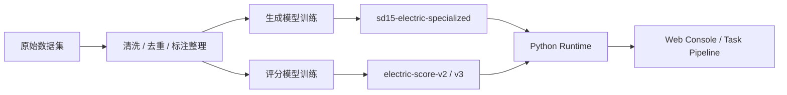
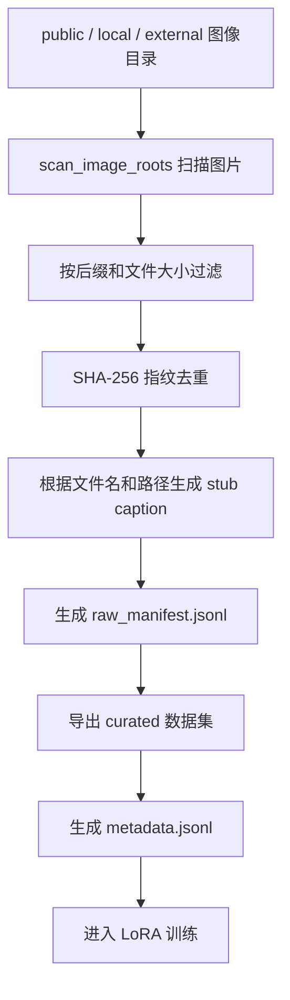
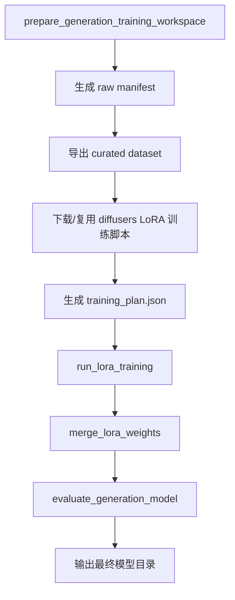
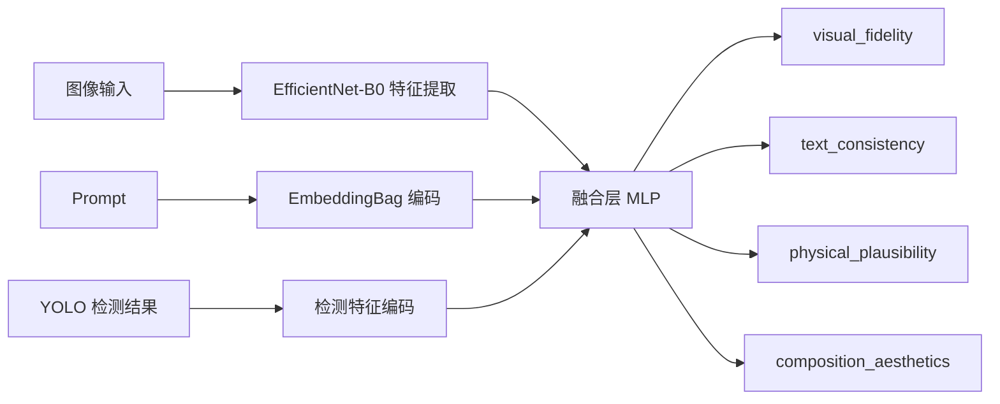
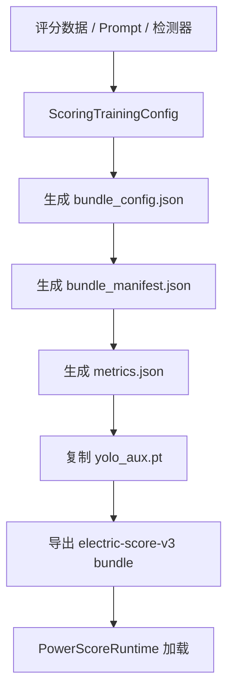
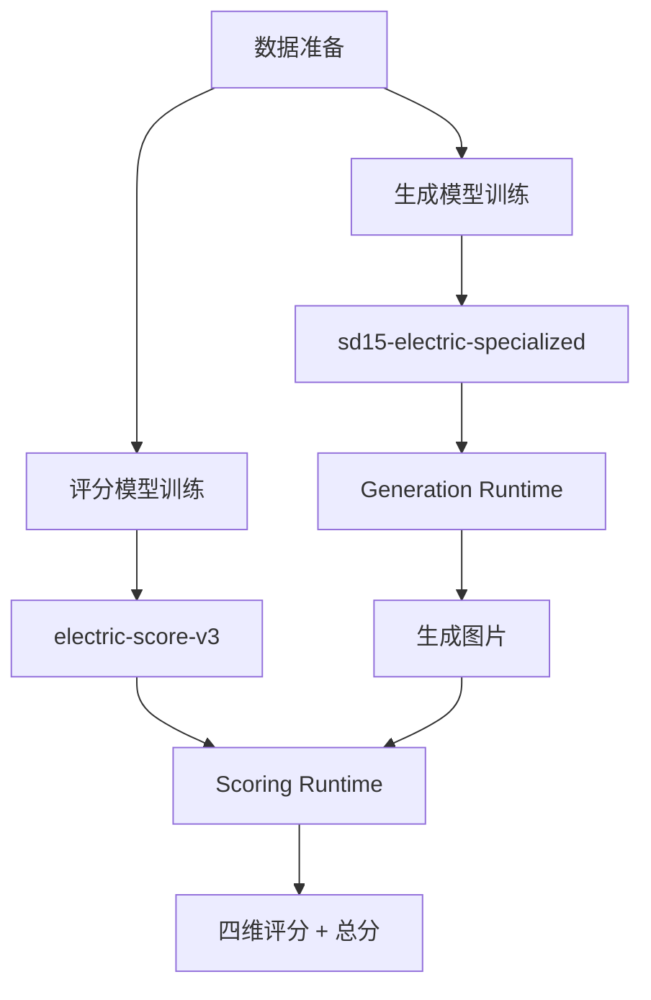
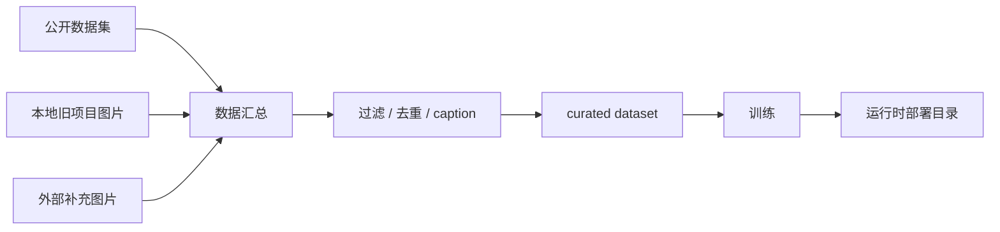

# 模型训练与使用说明

本文档用于说明当前项目中的模型训练方法、训练数据来源、可使用算法、输出目录和实际使用方式。文档重点覆盖两条路线：

1. 电力行业专用生成模型训练路线
2. 电力行业评分模型训练与部署路线

## 1. 模型训练体系总览

当前项目的训练体系分为两部分：

- 生成模型训练：围绕 `sd15-electric-specialized` 构建电力行业专用生成模型
- 评分模型训练：围绕 `electric-score-v2` 与 `electric-score-v3` 构建电力行业多维评分模型



## 2. 生成模型训练方法

### 2.1 训练目标

生成模型训练的目标是在 `Stable Diffusion 1.5` 路线上得到一个更偏电力行业场景的专用模型，用于提高以下场景的生成效果：

- 变电站
- 输电线路
- 风电场
- 光伏场站
- 水电设施
- 电力巡检与工业设备特写

当前输出模型名为：

- `sd15-electric-specialized`

输出目录为：

- `G:\electric-ai-runtime\models\generation\sd15-electric-specialized`

### 2.2 使用算法

当前生成模型训练路线使用的核心算法和工程方法包括：

- `Stable Diffusion 1.5`
- `LoRA` 微调
- `diffusers` 训练脚本
- `FP16 mixed precision`
- `cosine` 学习率调度
- `gradient checkpointing`
- 训练后权重合并

其中最关键的算法路线是：

1. 以 `runwayml/stable-diffusion-v1-5` 或本地 `sd15-electric` 为基础模型
2. 使用 `LoRA` 对电力行业图像进行低秩微调
3. 训练结束后将 LoRA 权重合并到独立模型目录
4. 输出为平台可直接部署的完整模型

### 2.3 训练超参数

根据 `python-ai-service/training/generation/config.py`，当前训练配置如下：

| 参数 | 当前值 |
| --- | --- |
| 基础模型 | `runwayml/stable-diffusion-v1-5` |
| 输出模型名 | `sd15-electric-specialized` |
| 分辨率 | `512` |
| LoRA rank | `32` |
| LoRA alpha | `32` |
| batch size | `1` |
| gradient accumulation steps | `8` |
| learning rate | `1e-4` |
| lr scheduler | `cosine` |
| warmup steps | `200` |
| max train steps | `6000` |
| checkpointing steps | `500` |
| mixed precision | `fp16` |
| gradient checkpointing | `true` |
| random flip | `true` |
| center crop | `true` |
| seed | `42` |

### 2.4 训练数据来源

生成模型训练数据来自三个来源入口：

- `public_roots`
  公开电力图像数据集目录
- `local_roots`
  本地旧项目中的电力场景图片
- `external_roots`
  外部补充图片目录

当前脚本里，`prepare_generation_v3_dataset.py` 默认会优先使用：

- `G:\electric-ai-runtime\datasets\external`
- `E:\毕业设计\源代码\Project\static`

### 2.5 数据处理流程

生成训练数据的预处理流程如下：



### 2.6 数据清洗方法

当前数据处理方法主要包括：

- 后缀过滤：仅保留 `.png`、`.jpg`、`.jpeg`、`.webp`、`.bmp`
- 空文件过滤：跳过大小为 `0` 的文件
- 指纹去重：通过 `SHA-256` 计算文件指纹，去除重复样本
- caption 补全：根据路径和文件名中的关键词自动补生成初始描述

典型自动识别关键词包括：

- `substation`
- `transformer`
- `tower`
- `conductor`
- `insulator`
- `busbar`
- `wind turbine`
- `solar panel`

### 2.7 训练流程



### 2.8 训练命令

只准备训练工作区：

```powershell
& 'G:\miniconda3\envs\electric-ai-py310\python.exe' python-ai-service/scripts/train_generation_v3.py --prepare-only
```

限制训练样本数量：

```powershell
& 'G:\miniconda3\envs\electric-ai-py310\python.exe' python-ai-service/scripts/train_generation_v3.py --max-train-samples 500
```

正式训练并输出模型：

```powershell
& 'G:\miniconda3\envs\electric-ai-py310\python.exe' python-ai-service/scripts/train_generation_v3.py
```

### 2.9 训练输出

训练完成后会产出：

- `training_plan.json`
- `lora-output/`
- 合并后的最终模型目录
- 验证生成结果目录

最终用于部署的模型应放在：

- `G:\electric-ai-runtime\models\generation\sd15-electric-specialized`

## 3. 评分模型训练方法

### 3.1 训练目标

评分模型训练的目标是构建一个比默认组合评分链路更具电力行业专属性的评分模型，使系统不仅能判断“图是否清晰”，还能判断：

- 图是否贴合 Prompt
- 电力设备是否出现
- 结构关系是否合理
- 是否满足电力行业场景常识

当前评分模型路线包括：

- `electric-score-v2`
- `electric-score-v3`

### 3.2 使用算法

当前评分模型涉及的算法和模型包括：

- `ImageReward`
- `CLIP-IQA`
- `Aesthetic Predictor`
- `YOLO` 辅助检测
- `EfficientNet-B0`
- `EmbeddingBag` Prompt 编码
- 多头回归输出四维评分
- hybrid teacher-student 设计思路

其中 `power_score_runtime.py` 中的 `FourDimScoreModel` 使用了以下结构：

- 图像 backbone：`EfficientNet-B0`
- Prompt 编码：`EmbeddingBag`
- 检测特征编码：全连接 + `SiLU`
- 融合网络：多层 `MLP`
- 输出头：四个维度各自一个回归 head

### 3.3 评分模型结构图



### 3.4 评分训练配置

根据 `python-ai-service/training/scoring/config.py`，当前主要配置如下：

| 参数 | 当前值 |
| --- | --- |
| runtime_type | `hybrid` |
| bundle_name | `electric-score-v3` |
| source_detector_bundle_name | `electric-score-v2` |
| 目标维度 | `visual_fidelity`、`text_consistency`、`physical_plausibility`、`composition_aesthetics` |

当前类别标签包括：

- `wind_turbine`
- `transformer`
- `breaker`
- `switch`
- `insulator`
- `arrester`
- `tower`
- `conductor`
- `busbar`
- `frame`

### 3.5 教师模型配置

在 `electric-score-v3` 路线中，教师模型配置为：

| 维度 | 教师模型 |
| --- | --- |
| 文本一致性 | `ImageReward-v1.0` |
| 视觉保真度 | `CLIP-IQA/visual_fidelity` |
| 物理合理性 | `CLIP-IQA/physical_plausibility` |
| 构图美学 | `Aesthetic Predictor (CLIP-L14)` |

这说明当前 `v3` 路线并不是单纯重新训练一个黑盒模型，而是采用：

- 教师模型提供监督信号
- 检测器提供行业目标信息
- 自训练 bundle 提供统一部署形态

### 3.6 评分训练数据

评分训练依赖的数据类型主要包括：

- 生成图像样本
- Prompt 文本
- 电力设备检测结果
- 四维评分目标
- 总分权重配置

当前代码中已经明确保存和使用：

- 评分目标维度
- 电力设备类别
- 权重配置
- detector bundle 来源
- bundle 配置清单

这意味着评分训练的数据组织核心是“图像 + Prompt + 检测特征 + 四维目标”。

### 3.7 评分训练流程



### 3.8 评分训练命令

```powershell
& 'G:\miniconda3\envs\electric-ai-py310\python.exe' python-ai-service/scripts/train_scoring_v3.py
```

执行后会输出：

- `scoring_training_root`
- `scoring_model_root`

最终评分模型目录应位于：

- `G:\electric-ai-runtime\models\scoring\electric-score-v3`

## 4. 模型使用方法

### 4.1 生成模型使用

在平台中使用生成模型的方式有两类：

1. 前端工作台中直接选择模型
2. 通过 smoke test 或接口调用指定模型名

常用模型名：

- `sd15-electric`
- `sd15-electric-specialized`
- `unipic2-kontext`

### 4.2 评分模型使用

常用评分模型名：

- `electric-score-v1`
- `electric-score-v2`
- `electric-score-v3`

默认情况下，生成任务提交后会自动触发评分流程。

### 4.3 Windows 原生使用建议

- 日常联调优先：`sd15-electric + electric-score-v1`
- 展示图优先：`unipic2-kontext + electric-score-v1`
- 行业专用实验优先：`sd15-electric-specialized + electric-score-v3`

### 4.4 Docker GPU 使用建议

Docker GPU 路线更适合：

- 容器化部署展示
- 统一启动多服务
- 更稳定地进行高质量模型演示

## 5. 训练与使用中的关键图表

### 5.1 模型体系图



### 5.2 训练数据流图



## 6. 总结

当前项目中的模型训练与使用体系可以概括为：

- 生成侧以 `SD1.5 + LoRA` 为核心路线
- 评分侧以 `默认组合评分 + 自训练 bundle` 为核心路线
- 数据准备强调电力行业图像的清洗、去重与描述补全
- 训练输出最终都需要落到 `G:\electric-ai-runtime` 下的标准模型目录
- 平台使用时可以根据“联调 / 展示 / 行业专用实验”选择不同模型组合

这套设计既适合毕业设计的工程说明，也适合后续继续补充真实训练结果和对比实验。
