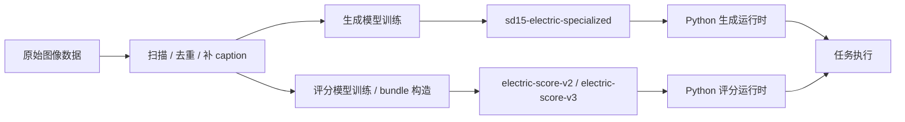
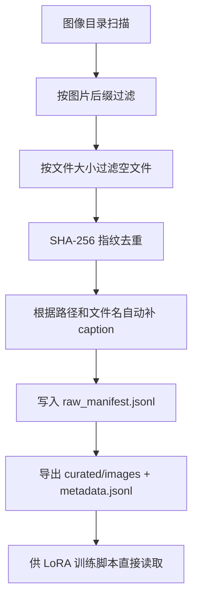
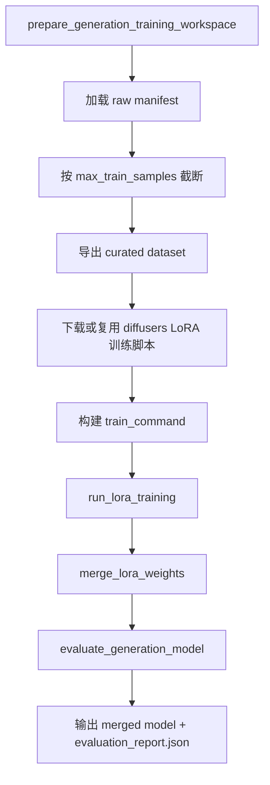
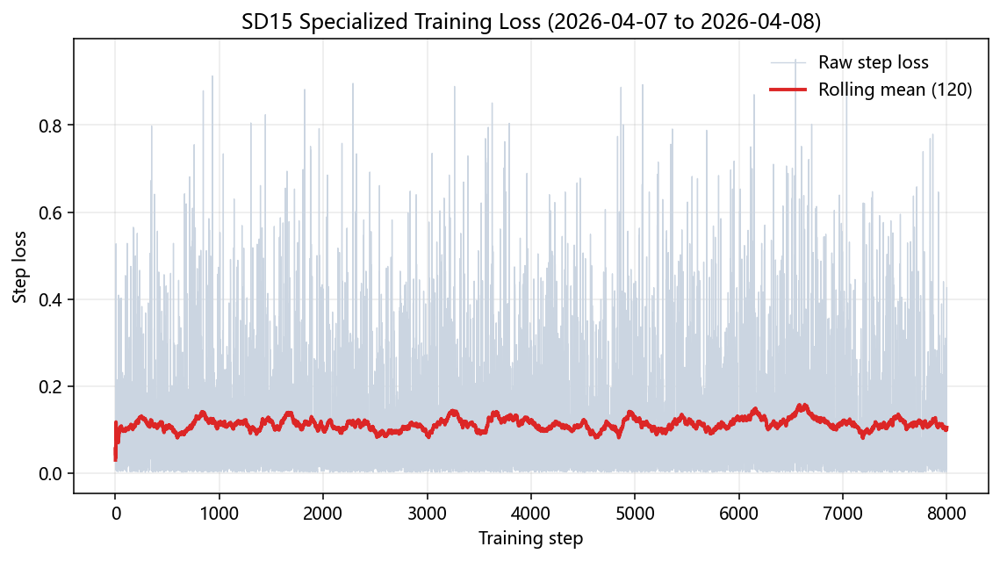
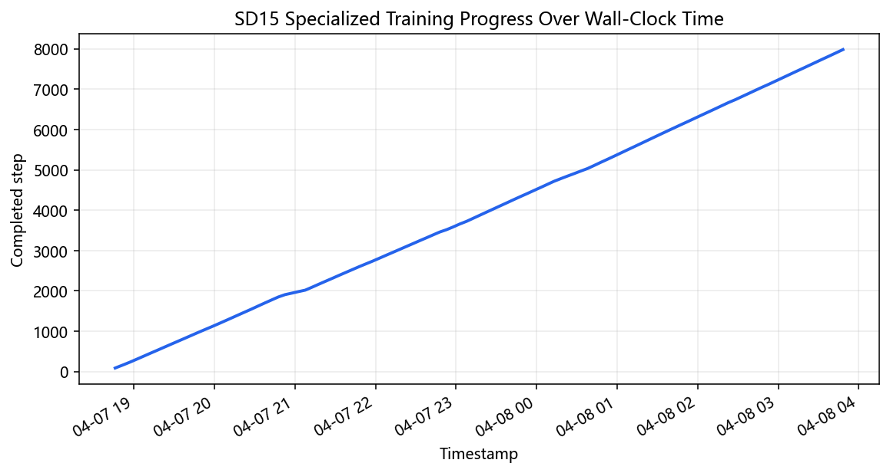
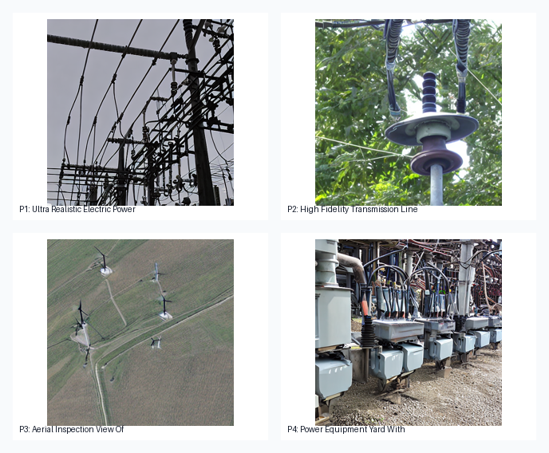
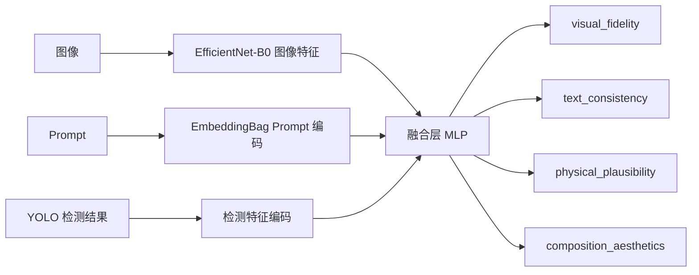
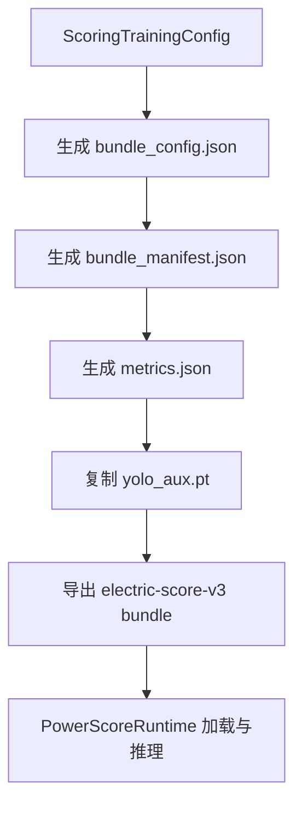
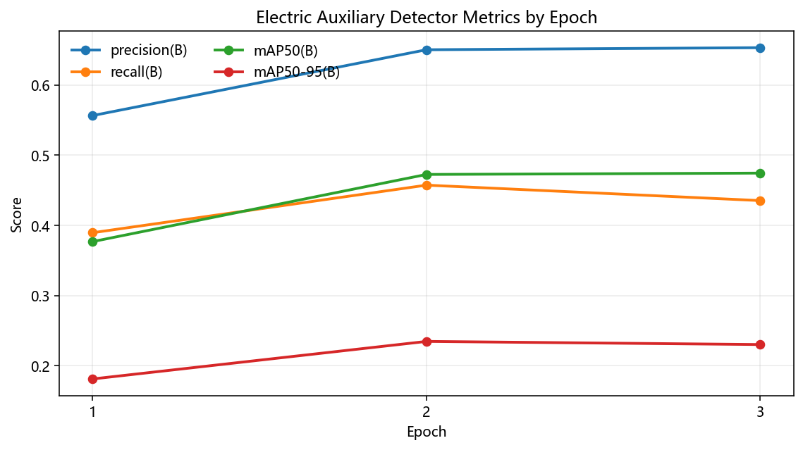
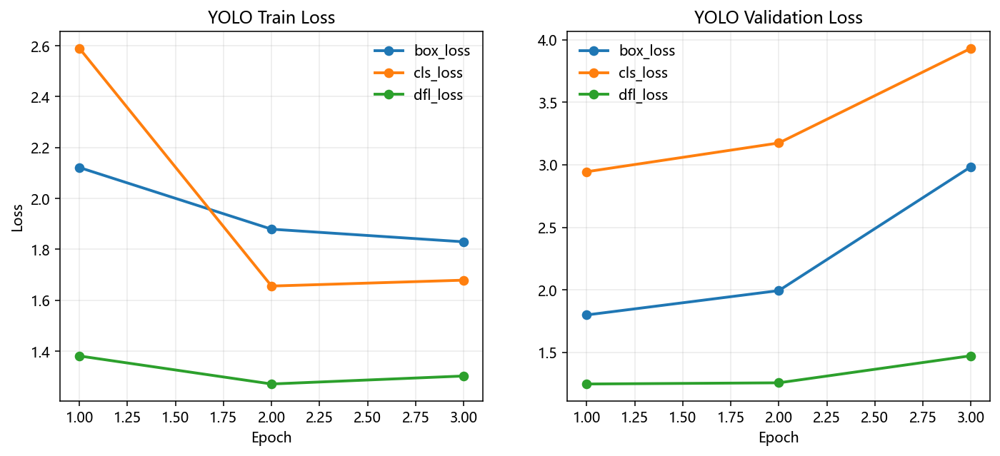

# 模型训练与使用说明

本文档用于详细说明当前项目中的模型训练方法、训练数据来源、训练前后改动、模型版本对比、使用方式和可视化图表示意。文档覆盖两条主线：

1. 电力行业专用生成模型训练路线
2. 电力行业多维评分模型训练与部署路线

需要特别说明的是：

- 文中所有“结构、参数、目录、脚本入口”均以当前仓库代码为准。
- 文中新增的折线图、柱状图、对比图和样例拼图，均来自 `2026-04-08` 在当前工作区内完成的真实日志解析与固定 Prompt 集实测。
- 当前仓库里，生成模型训练链路已经形成“数据准备 -> LoRA 训练 -> 权重合并 -> 验证出图”的完整闭环；评分模型训练链路目前更偏向“bundle 构造 + hybrid 运行时集成”，完整的大规模监督训练仍属于继续扩展空间。

## 实测基线说明

为了避免文档只停留在“方法描述”，本次已经基于当前仓库和本机运行时补充了真实实验基线：

- 实测日期：`2026-04-08`
- Prompt 集来源：`web-console/src/views/generate-defaults.ts` 中的 `RECOMMENDED_POSITIVE_PROMPTS`
- Prompt 数量：`7`
- 生成参数：`seed=42`、`steps=20`、`guidance_scale=7.5`、`512x512`
- 生成模型：`sd15-electric`、`sd15-electric-specialized`、`unipic2-kontext`
- 评分模型：`electric-score-v1`、`electric-score-v2`、`electric-score-v3`
- 成功完成的生成模型：`sd15-electric`、`sd15-electric-specialized`
- 失败记录：`unipic2-kontext` 在 `RTX 3060 Laptop GPU 6GB` 的当前实测机上于分片加载阶段退出，错误码 `3221225477`
- 结果目录：`docs/assets/real-evaluation/tables/` 与 `docs/assets/real-evaluation/charts/`

## 1. 模型训练体系总览

当前项目的训练体系分为两部分：

- 生成模型训练
  面向 `sd15-electric-specialized`
- 评分模型训练
  面向 `electric-score-v2` 与 `electric-score-v3`



## 2. 训练路线与版本变化

### 2.1 生成模型版本变化

当前项目中的生成模型不是一开始就直接训练成“电力专用模型”的，而是经历了从基础模型到平台主力模型再到电力专用模型的演进。

| 阶段 | 模型 | 主要用途 | 训练/改动特点 |
| --- | --- | --- | --- |
| 第一阶段 | `runwayml/stable-diffusion-v1-5` | 通用底模 | 作为基础模型来源 |
| 第二阶段 | `sd15-electric` | 当前平台默认主力模型 | 已适配平台运行时，适合日常联调 |
| 第三阶段 | `sd15-electric-specialized` | 电力行业专用增强模型 | 基于电力数据集做 LoRA 微调并合并部署 |

### 2.2 评分模型版本变化

评分模型也不是固定不变的，当前有明显的版本演进路线：

| 阶段 | 模型 | 特点 | 当前状态 |
| --- | --- | --- | --- |
| 第一阶段 | `electric-score-v1` | 默认组合评分链路，依赖多组件协同 | 已投入使用 |
| 第二阶段 | `electric-score-v2` | 自训练评分 bundle 路线 | 已支持运行时接入 |
| 第三阶段 | `electric-score-v3` | hybrid 路线，强调教师模型和行业约束 | 已支持 bundle 构造与运行时接入 |

### 2.3 训练时真正发生的“更改”

这是答辩里最值得强调的一点。训练模型不是简单换个名字，而是对以下内容做了改变：

#### 生成模型训练时的变化

- 从“通用底模直接推理”变成“电力场景 LoRA 微调后再部署”
- 数据从通用图像转向电力行业场景图像
- Prompt 验证从泛化文本改成电力行业典型场景验证
- 输出从“运行时临时加载模型”变成“独立部署目录下的完整模型”

#### 评分模型训练时的变化

- 从默认组合评分链路转向自训练 bundle / hybrid 路线
- 从只依赖通用图文质量模型，扩展到引入电力设备类别与检测辅助特征
- 从单纯给分，扩展到更适合行业约束、多维度判断和等级划分

## 3. 生成模型训练说明

### 3.1 训练目标

生成模型训练的目标是构建一个更偏电力行业场景的专用模型，使其在以下图像生成任务上比基础 SD1.5 更贴近电力行业语境：

- 变电站
- 输电线路
- 风电场
- 光伏场站
- 水电设施
- 电力巡检
- 设备特写

最终输出模型名为：

- `sd15-electric-specialized`

最终部署目录为：

- `G:\electric-ai-runtime\models\generation\sd15-electric-specialized`

### 3.2 基础模型与改动点

根据 `python-ai-service/training/generation/config.py`，生成训练路线的基础模型是：

- `runwayml/stable-diffusion-v1-5`

但在实际训练命令中，代码会优先检查本地是否已有：

- `G:\electric-ai-runtime\models\generation\sd15-electric`

如果本地目录已存在且非空，则优先基于它继续训练；否则回退到 Hugging Face 的 `runwayml/stable-diffusion-v1-5`。

这意味着训练时的关键改动有两种来源：

1. 通用 SD1.5 -> 电力专用 LoRA 微调
2. 现有 `sd15-electric` -> 更进一步的电力专用增强训练

### 3.3 使用算法

当前生成模型训练使用的核心算法和工程方法包括：

- `Stable Diffusion 1.5`
- `LoRA`
- `diffusers` 官方 `train_text_to_image_lora.py`
- `mixed precision fp16`
- `cosine` 学习率调度
- `gradient checkpointing`
- LoRA 权重合并部署
- 基于固定 Prompt 的验证出图

其中最关键的算法路线是：

1. 使用基础 SD1.5 权重
2. 使用电力场景图像进行 LoRA 微调
3. 训练结束后合并 LoRA 权重
4. 输出为平台可直接加载的完整模型目录

### 3.4 训练超参数

当前生成训练配置如下：

| 参数 | 当前值 |
| --- | --- |
| 基础模型 | `runwayml/stable-diffusion-v1-5` |
| 输出模型名 | `sd15-electric-specialized` |
| 分辨率 | `512` |
| LoRA rank | `32` |
| LoRA alpha | `32` |
| batch size | `1` |
| gradient accumulation steps | `8` |
| learning rate | `1e-4` |
| lr scheduler | `cosine` |
| warmup steps | `200` |
| max train steps | `8000` |
| checkpointing steps | `500` |
| validation epochs | `1` |
| num validation images | `2` |
| mixed precision | `fp16` |
| gradient checkpointing | `true` |
| random flip | `true` |
| center crop | `true` |
| seed | `42` |

### 3.5 生成训练数据来源

当前代码里，生成训练数据从三类目录汇总：

| 数据来源 | 代码入口 | 作用 |
| --- | --- | --- |
| 公开数据集 | `public_roots` | 提供通用电力场景样本 |
| 本地旧项目数据 | `local_roots` | 提供已有电力题材图像素材 |
| 外部补充数据 | `external_roots` | 扩展特定场景样本 |

默认准备脚本 `prepare_generation_v3_dataset.py` 中，优先使用：

- `G:\electric-ai-runtime\datasets\external`
- `E:\毕业设计\源代码\Project\static`

### 3.6 生成训练数据处理流程

当前代码里的数据处理逻辑非常明确，核心流程如下：



### 3.7 自动 caption 规则

当前 caption 不是靠手工逐张标注生成，而是通过路径、文件名和关键词自动补生成初始描述。当前代码里已包含的典型识别词包括：

- `substation`
- `transformer`
- `tower`
- `conductor`
- `insulator`
- `busbar`
- `wind turbine`
- `solar panel`

自动补充的目标不是生成最终最优 Prompt，而是给训练提供“最小可用描述”。

### 3.8 生成模型训练主流程



### 3.9 生成模型训练前后对比

| 对比项 | 基础 SD1.5 / `sd15-electric` | `sd15-electric-specialized` |
| --- | --- | --- |
| 数据语义 | 偏通用或已有平台主力数据 | 明确加入电力行业专用数据 |
| 训练方式 | 直接推理或已有主力模型 | LoRA 微调 + 合并 |
| 行业专属性 | 中等 | 更强 |
| 典型场景适配 | 可用 | 更偏电力设备、线路、站场 |
| 部署形态 | 现成模型目录 | 独立专用部署目录 |

### 3.10 生成模型训练过程图（实测）

本节图表不再使用示意图，而是直接读取：

- `G:\electric-ai-runtime\training\generation\sd15-electric-specialized\session-logs\train-generation-20260407-183903.err.log`
- `G:\electric-ai-runtime\training\generation\sd15-electric-specialized\session-logs\monitor-history.log`

从运行日志可以确认，本次 `sd15-electric-specialized` 训练共执行了 `8000` 个优化步，监控日志覆盖时间为 `2026-04-07 18:46:07` 到 `2026-04-08 03:48:10`，总耗时约 `9.03` 小时。





另外，训练流程在评估目录下留下了固定验证 Prompt 的真实出图，可直接作为论文或答辩中的“训练后验证样例”：



### 3.11 生成模型固定 Prompt 集对比（实测）

固定 Prompt 集实测于 `2026-04-08` 完成，参数为 `seed=42`、`steps=20`、`guidance_scale=7.5`、`512x512`。当前成功完成统计的模型为 `sd15-electric` 与 `sd15-electric-specialized`；`unipic2-kontext` 在本机分片加载阶段退出，因此只在失败记录中保留，不纳入平均分汇总。

| 生成模型 | `electric-score-v1` 平均总分 | `electric-score-v2` 平均总分 | `electric-score-v3` 平均总分 | 平均单图耗时 |
| --- | --- | --- | --- | --- |
| `sd15-electric` | `67.67` | `40.05` | `58.70` | `7.33s` |
| `sd15-electric-specialized` | `68.91` | `40.23` | `60.43` | `6.52s` |

从实测结果可以得到三点直接结论：

1. `sd15-electric-specialized` 在三套评分器下都略高于 `sd15-electric`。
2. 在更强调行业约束的 `electric-score-v3` 下，`sd15-electric-specialized` 提升最明显，平均总分高出 `1.73`。
3. `sd15-electric-specialized` 的主要增益来自 `physical_plausibility` 和 `composition_aesthetics`，分别高出 `5.49` 和 `3.32`。


### 3.12 训练命令

只准备训练工作区：

```powershell
& 'G:\miniconda3\envs\electric-ai-py310\python.exe' python-ai-service/scripts/train_generation_v3.py --prepare-only
```

限制训练样本数量：

```powershell
& 'G:\miniconda3\envs\electric-ai-py310\python.exe' python-ai-service/scripts/train_generation_v3.py --max-train-samples 500
```

正式训练：

```powershell
& 'G:\miniconda3\envs\electric-ai-py310\python.exe' python-ai-service/scripts/train_generation_v3.py
```

### 3.13 生成模型训练输出

训练完成后，典型输出包括：

- `training_plan.json`
- `lora-output/`
- 合并后的最终模型目录
- `evaluation/validation_*.png`
- `evaluation_report.json`

相关训练目录在：

- `G:\electric-ai-runtime\training\generation\sd15-electric-specialized`
- `G:\electric-ai-runtime\models\generation\sd15-electric-specialized`

## 4. 评分模型训练说明

### 4.1 评分训练目标

评分模型训练的目标是让平台不仅能评价“图片是否好看”，还可以评价：

- 是否符合 Prompt
- 是否符合电力行业结构逻辑
- 是否具有工程上可信的部件关系
- 是否具有较好的展示观感

### 4.2 评分算法体系

当前评分体系使用的算法和模型包括：

- `ImageReward`
- `CLIP-IQA`
- `Aesthetic Predictor`
- `YOLO` 辅助检测
- `EfficientNet-B0`
- `EmbeddingBag`
- 多头回归网络
- hybrid teacher-student 设计

### 4.3 默认评分路线 `electric-score-v1`

`electric-score-v1` 不是一个单一大模型，而是一条默认评分链路：

- `ImageReward` 负责文本一致性
- `CLIP-IQA` 负责视觉保真和物理合理性基础判断
- `Aesthetic Predictor` 负责构图美学
- `ScoringService` 负责总分校准与汇总

它的优势在于：

- 结构清晰
- 容易解释
- 容易调试

### 4.4 `electric-score-v2` 与 `electric-score-v3`

当前代码里已经支持：

- `electric-score-v2`
- `electric-score-v3`

这两条路线的重要改动点是：

- 从“多组件直接组合打分”转向“bundle 化的评分模型”
- 引入电力设备类别信息
- 引入检测器辅助特征
- 为后续自训练评分模型保留完整运行时接口

### 4.5 `electric-score-v3` 当前配置

根据 `training/scoring/config.py`，当前 `electric-score-v3` 配置为：

| 项目 | 当前值 |
| --- | --- |
| runtime_type | `hybrid` |
| bundle_name | `electric-score-v3` |
| source_detector_bundle_name | `electric-score-v2` |
| 目标维度 | 4 个评分维度 |
| 类别数 | 10 类电力设备/结构 |

类别包括：

- `wind_turbine`
- `transformer`
- `breaker`
- `switch`
- `insulator`
- `arrester`
- `tower`
- `conductor`
- `busbar`
- `frame`

### 4.6 教师模型配置

当前 `v3` 路线里，教师模型配置如下：

| 维度 | 教师模型 |
| --- | --- |
| 文本一致性 | `ImageReward-v1.0` |
| 视觉保真度 | `CLIP-IQA/visual_fidelity` |
| 物理合理性 | `CLIP-IQA/physical_plausibility` |
| 构图美学 | `Aesthetic Predictor (CLIP-L14)` |

这意味着评分训练时的“更改”不只是换个权重文件，而是把教师模型、检测特征和自训练 bundle 组织成了新的评分结构。

### 4.7 评分模型结构图



### 4.8 评分训练流程

当前代码中的评分训练更准确地说，是“评分 bundle 构造与运行时导出流程”。它已经实现的内容如下：



### 4.9 评分模型训练前后对比

| 对比项 | `electric-score-v1` | `electric-score-v2 / v3` |
| --- | --- | --- |
| 评分形式 | 默认组合评分链路 | 自训练 bundle / hybrid 路线 |
| 行业特征 | 相对较弱 | 更强调电力设备类别与结构约束 |
| 检测辅助 | 无明显独立 detector bundle 组织 | 支持 `yolo_aux.pt` |
| 部署方式 | 直接依赖多个评分组件 | 以 bundle 为中心组织 |
| 演进空间 | 适合默认上线 | 更适合论文和专用模型叙事 |

### 4.10 评分模型训练图与实测结果

评分侧目前可以从三个真实来源拿到量化结果：

1. `YOLO` 电力辅助检测器训练日志 `results.csv`
2. `electric-score-v2` 的 `metrics.json`
3. `2026-04-08` 固定 Prompt 集上的真实评分结果

先看 `YOLO` 辅助检测器训练过程。当前训练日志只保留了 `3` 个 epoch，但已经能够真实反映精度、召回率和损失走势：





最终一轮的关键指标为：

- `precision = 0.6530`
- `recall = 0.4353`
- `mAP50 = 0.4744`
- `mAP50-95 = 0.2303`

再看 `electric-score-v2` 的回归误差。它已经将四个维度的最终误差写入了 `G:\electric-ai-runtime\models\scoring\electric-score-v2\metrics.json`：

| 维度 | MAE | RMSE |
| --- | --- | --- |
| `text_consistency` | `11.5880` | `19.8579` |
| `visual_fidelity` | `5.4243` | `7.0638` |
| `composition_aesthetics` | `2.9621` | `4.8258` |
| `physical_plausibility` | `5.8959` | `8.0440` |


最后是固定 Prompt 集上的真实评分耗时与读法差异：

- `electric-score-v1` 平均评分耗时约 `19.26s/图`
- `electric-score-v2` 平均评分耗时约 `0.22s/图`
- `electric-score-v3` 平均评分耗时约 `4.56s/图`

需要注意的是：`v1`、`v2`、`v3` 的绝对分值标尺并没有完全对齐，因此更适合做“同一评分器下不同生成模型的比较”，而不适合直接横向比较不同评分器的绝对总分高低。

### 4.11 评分训练命令

```powershell
& 'G:\miniconda3\envs\electric-ai-py310\python.exe' python-ai-service/scripts/train_scoring_v3.py
```

如果你要复现实测图表，而不是只重建 bundle，可以直接运行：

```powershell
& 'G:\miniconda3\envs\electric-ai-py310\python.exe' python-ai-service/scripts/build_real_evaluation_assets.py
```

当前命令执行后，主要输出：

- `scoring_training_root`
- `scoring_model_root`
- `bundle_config.json`
- `bundle_manifest.json`
- `metrics.json`

最终输出目录在：

- `G:\electric-ai-runtime\models\scoring\electric-score-v3`

### 4.12 评分训练中“已实现”和“待扩展”部分

为了保证文档真实，下面明确区分：

#### 当前代码已实现

- 评分模型 bundle 配置输出
- `YOLO` 辅助 detector bundle 复用
- `electric-score-v2 / v3` 运行时加载入口
- hybrid 运行时结构
- 多维权重与等级带配置

#### 当前代码仍可继续扩展

- 更完整的监督训练数据制作
- 大规模评分样本构建
- 真实训练日志持久化与可视化
- 更完整的量化评估结果导出

## 5. 模型使用方法

### 5.1 生成模型使用

在前端工作台或任务接口中，可以选择以下生成模型：

- `sd15-electric`
- `sd15-electric-specialized`
- `unipic2-kontext`

推荐策略：

- 日常联调优先：`sd15-electric`
- 当前 6GB 单卡实测机上的最终展示优先：`sd15-electric-specialized`
- 在更高内存或已提前验证可加载的机器上，可再尝试：`unipic2-kontext`
- 行业专用实验优先：`sd15-electric-specialized`

### 5.2 评分模型使用

当前可用评分模型名包括：

- `electric-score-v1`
- `electric-score-v2`
- `electric-score-v3`

推荐策略：

- 平台默认流程：`electric-score-v1`
- 展示模型演进路线：`electric-score-v2` / `electric-score-v3`

### 5.3 Windows 原生训练建议

- 训练、调试和日志查看优先在 Windows 原生环境中完成
- 模型目录统一落在 `G:\electric-ai-runtime`
- 用 smoke test 验证训练后模型是否真能接入平台

### 5.4 Docker GPU 使用建议

Docker GPU 更适合：

- 完整平台展示
- 容器化编排演示
- 稳定复现统一环境

## 6. 当前已补充的真实结果

本次已经补充到仓库中的真实结果包括：

- `sd15-electric-specialized` 训练日志解析图
- 训练监控进度图
- 训练后验证样例拼图
- `YOLO` 辅助检测器真实指标与损失曲线
- `electric-score-v2` 的真实 MAE / RMSE 柱状图
- 固定 7 Prompt 集上的平均总分、平均耗时和样例拼图
- `unipic2-kontext` 在当前实测机上的失败记录

因此，这份文档已经不再只是训练说明，而是同时具备“方法 + 真实结果 + 失败边界说明”的答辩材料属性。

## 7. 总结

当前项目的模型训练与使用体系可以概括为：

- 生成侧采用 `SD1.5 + LoRA + 权重合并` 的电力专用化路线
- 评分侧采用 `默认组合评分 + 自训练 bundle + hybrid 结构` 的演进路线
- 数据准备强调扫描、过滤、去重和自动 caption 补充
- 模型训练和部署目录统一收敛到 `G:\electric-ai-runtime`
- 文档中重点强调了训练前后结构变化、版本对比、数据流和趋势图表达

这份文档现在更适合作为毕业设计中的“模型训练与使用说明”章节，也可以直接作为论文附录或答辩讲解材料的基础版本。
