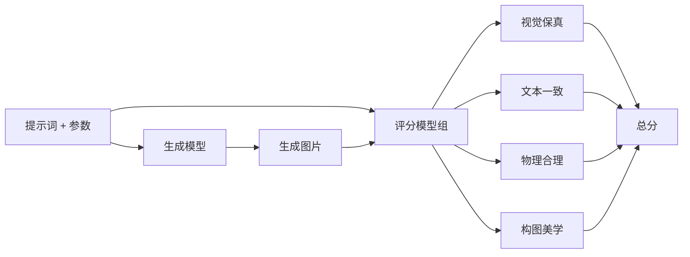
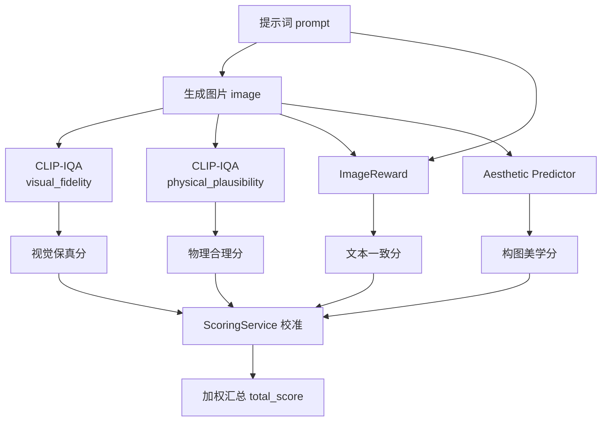
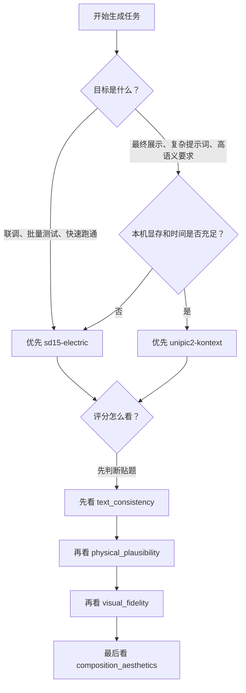

# 模型介绍、对比与评分说明

本文档用于单独介绍当前仓库中已经接入的生成模型和评分模型，重点回答三个问题：

1. 当前项目里到底用了哪些模型，各自负责什么。
2. 面对不同工业电力图像任务时，应该优先选择哪个生成模型。
3. 评分结果中的四个维度和总分分别代表什么，应该如何解读。

本文所有说明都以当前仓库里的真实实现为准，重点对应以下代码：

- `python-ai-service/app/runtimes/sd15_runtime.py`
- `python-ai-service/app/runtimes/unipic2_runtime.py`
- `python-ai-service/app/runtimes/scorers/image_reward_runtime.py`
- `python-ai-service/app/runtimes/scorers/clip_iqa_runtime.py`
- `python-ai-service/app/runtimes/scorers/aesthetic_runtime.py`
- `python-ai-service/app/services/scoring_service.py`

## 1. 模型体系总览

当前平台把模型分成两大类：

- 生成模型：负责根据提示词生成工业电力图像。
- 评分模型：负责从不同角度评价生成结果是否可信、是否贴题、是否美观。



## 2. 生成模型对比

### 2.1 总览表

| 模型名 | 当前定位 | 优势 | 劣势 | 速度与资源 | 推荐使用场景 |
| --- | --- | --- | --- | --- | --- |
| `sd15-electric` | 默认主力生成模型 | 稳定、兼容性好、启动成本较低 | 复杂语义和高级构图表达能力有限 | 较快，单卡本机更友好 | 日常开发、联调、基础 smoke test、标准工业场景 |
| `unipic2-kontext` | 高质量生成模型 | 语义理解更强，复杂场景和描述组合能力更好 | 模型更重，首次加载慢，显存压力更大 | 较慢，更依赖 CPU offload / 显存管理 | 答辩展示、复杂提示词、强调语义控制的高质量出图 |

### 2.2 `sd15-electric`

`sd15-electric` 是当前仓库中的默认真实生成模型，也是最适合本机日常开发联调的生成模型。

从实现上看，它基于 `diffusers.StableDiffusionPipeline` 加载，支持：

- `float16 / float32` 自动选择
- attention slicing
- VAE slicing
- 在支持时启用 `enable_model_cpu_offload`

这意味着它的工程特点是：

- 启动逻辑成熟，库生态最稳定。
- 推理速度相对更快，适合频繁提交任务测试。
- 对工业电力题材这种“结构比较清晰、对象类别相对稳定”的提示词，通常能较快给出可用结果。

它的主要不足在于：

- 当提示词很长、约束很多、需要兼顾复杂风格与复杂结构时，容易出现“画面看起来像对了，但细节语义没完全跟上”。
- 对更复杂的构图、空间关系、部件层级表达，通常不如更大的上下文型模型。

### 2.3 `unipic2-kontext`

`unipic2-kontext` 是当前仓库中更偏“高质量语义理解”的生成模型。它接入的是 `Skywork/UniPic2-SD3.5M-Kontext-2B` 这一路线，并在代码中显式加载：

- transformer
- VAE
- 多路文本编码器
- tokenizer / scheduler

它在工程上比 `sd15-electric` 更复杂，因此仓库实现里也额外做了执行策略控制：

- `model` offload
- `sequential` offload
- `none`

默认推荐 `model` offload，原因是它在单卡机器上更平衡：

- 比完全常驻 GPU 更省显存
- 比串行 offload 更容易保持可接受的速度

它的主要优势是：

- 对复杂描述、长提示词、多约束场景理解更强。
- 更适合“500kV 变电站、复杂设备、工业写实、细节精密”这类多条件任务。
- 对整体语义一致性和画面组织通常更有潜力。

它的代价也很明显：

- 首次加载慢。
- 对显存占用更敏感。
- 如果模型不及时释放，后续任务会明显受拖累。

这也是为什么当前仓库在任务结束后会主动调用 `unload()`，尽量释放显存。

### 2.4 生成模型选型建议

如果你的目标是：

- 快速联调前后端链路
- 检查任务能否真实跑通
- 快速得到一张结构清晰的工业图

优先选 `sd15-electric`。

如果你的目标是：

- 做最终展示图
- 使用更复杂、更长的提示词
- 更强调“文字要求被真正理解”

优先选 `unipic2-kontext`。

一句话总结：

- `sd15-electric` 更像“稳定主力”
- `unipic2-kontext` 更像“高质量冲刺模型”

## 3. 评分体系总览

当前平台不是只给一个总分，而是先计算四个维度，再计算总分：

| 评分维度 | 当前含义 | 主要关注点 |
| --- | --- | --- |
| `visual_fidelity` | 视觉保真 | 图像是否清晰、可信、细节是否像真实工业照片 |
| `text_consistency` | 文本一致 | 图像内容和提示词描述是否匹配 |
| `physical_plausibility` | 物理合理 | 结构、连接、空间关系是否符合工程直觉 |
| `composition_aesthetics` | 构图美学 | 画面组织、视觉观感、审美质量 |
| `total_score` | 总分 | 按权重聚合并校准后的综合结果 |

当前总分权重不是平均分，而是偏向“文本一致性优先”的业务取向：

| 维度 | 权重 |
| --- | --- |
| `visual_fidelity` | `0.21` |
| `text_consistency` | `0.37` |
| `physical_plausibility` | `0.24` |
| `composition_aesthetics` | `0.18` |

这意味着在当前平台里，“看起来像一张好图”并不够，是否真正贴合提示词会对总分产生更大影响。

### 3.1 评分流程图



这张图强调了当前平台的一个核心事实：

- 评分不是单模型单输出。
- 而是由多种评分模型分别负责不同维度。
- 最终由 `ScoringService` 做统一校准与加权汇总。

### 3.2 模型选型决策图



这张决策图背后的推荐逻辑是：

- 先决定“生成阶段”用哪个模型。
- 再决定“结果阶段”应该优先看哪些评分。
- 对工业电力题材来说，通常是“贴题”和“结构合理”优先于“单纯好看”。

### 3.3 关键数学函数说明

当前平台虽然最终展示的是 `0-100` 分数，但底层并不是简单线性打分，而是用了一组归一化、映射和校准函数。

#### 3.3.1 ImageReward 的 sigmoid 归一化

`ImageReward` 输出的是原始分值 `r`，当前平台会把它映射到 `0-100`：

```text
S_image_reward(r) = clip(100 / (1 + e^(-r)), 0, 100)
```

这里的意义是：

- 当原始分值较低时，分数增长较慢。
- 当原始分值接近 0 附近时，分数变化更敏感。
- 当原始分值很高时，分数会逐渐饱和，不会无限增大。

这就是典型的 sigmoid 压缩思想，它能把不受限原始分数变成更容易展示和比较的 `0-100` 区间。

#### 3.3.2 CLIP-IQA 的正负概率归一化

当前项目中的 `CLIP-IQA` 会为一张图构造：

- 一组正向描述
- 一组负向描述

然后计算：

```text
p_pos = mean(positive_probs)
p_neg = mean(negative_probs)
S_clip = 100 * p_pos / (p_pos + p_neg)
```

它的直觉很简单：

- 如果图片更像“正向工业描述”，分数就更高。
- 如果图片更像“负向失真描述”，分数就更低。

这也是为什么 `CLIP-IQA` 能被你这个项目改造成：

- 视觉保真评分器
- 物理合理评分器

关键不在于换模型，而在于换正负提示词集合。

#### 3.3.3 Aesthetic Predictor 的特征归一化

`Aesthetic Predictor` 在送入 MLP 之前，会先对图像特征做 L2 归一化：

```text
z_hat = z / ||z||2
```

这里：

- `z` 是 CLIP 提取出的图像特征向量
- `||z||2` 是它的 L2 范数

这样做的目的是：

- 让特征更多体现“方向信息”而不是绝对长度
- 降低不同图片特征尺度不一致带来的影响
- 让后面的美学回归器更稳定

#### 3.3.4 Aesthetic Predictor 的分段映射

`Aesthetic Predictor` 的原始分不是直接等于最终 `0-100`，而是通过分段函数映射：

```text
当 raw < 5:
S_aesthetic = 10 + (raw - 1) * (50 / 4)

当 raw >= 5:
S_aesthetic = 60 + (raw - 5) * (40 / 3.5)
```

最后再限制到 `0-100`：

```text
S_aesthetic = clip(S_aesthetic, 0, 100)
```

这样做的意义是：

- 让低分区和高分区有不同斜率
- 保留美学分的区分度
- 避免原始回归输出直接映射后过于拥挤在中间区间

#### 3.3.5 总分加权函数

四个维度的分数校准后，会按权重计算总分：

```text
total_score =
  0.21 * visual_fidelity +
  0.37 * text_consistency +
  0.24 * physical_plausibility +
  0.18 * composition_aesthetics
```

这意味着总分不是“简单平均”，而是明确偏向文本一致性。

#### 3.3.6 高分压缩函数

当前平台为了避免某些维度长期虚高，引入了高分段压缩函数：

```text
若 s <= knee:
f(s) = s

若 s > knee:
f(s) = knee + (s - knee) * scale
```

其中：

- `knee` 是拐点
- `scale` 是压缩比例，通常小于 `1`

它的直觉是：

- 拐点之前保持原始分数
- 拐点之后增幅变慢

所以它特别适合处理“高分段过于乐观”的模型输出。

#### 3.3.7 低分抬升函数

针对文本一致性偏低的问题，当前平台还引入了低分抬升函数：

```text
若 s >= target:
g(s) = s

若 s < target:
g(s) = s + (target - s) * gain
```

其中：

- `target` 是希望靠近的目标分位
- `gain` 是抬升比例

它的作用是：

- 不改动已经足够高的分数
- 只适度抬升过低分数
- 缓解原始模型长期偏低的系统性偏差

## 4. 评分模型详细介绍

### 4.1 `ImageReward`

`ImageReward` 在当前平台中主要承担“文本一致性”评分任务。

它的核心思路可以理解为：

- 同时看提示词和图片
- 判断这张图是否满足了提示词意图
- 输出一个原始分值
- 再经过归一化映射到 `0-100`

当前代码中对原始分值采用的是 sigmoid 归一化：

```text
score = 100 / (1 + exp(-raw_score))
```

它的特点是：

- 对“提示词有没有落实到画面里”比较敏感。
- 比较适合做文图一致性评价。
- 不直接等同于“画面好不好看”，而是更偏“图是不是在回答这段提示词”。

它的局限也很重要：

- 如果提示词本身写得很宽泛，它可能无法给出特别有区分度的结果。
- 如果图像整体好看，但关键对象没真正满足提示词，它往往会把分数拉低。

所以当你看到：

- `视觉保真很高`
- `文本一致偏低`

往往意味着这张图“像一张好工业图”，但“不一定是你要的那张工业图”。

### 4.2 `CLIP-IQA`

当前项目里的 `CLIP-IQA` 没有只用一个固定 prompt，而是被拆成了两种工作模式：

- `visual_fidelity`
- `physical_plausibility`

代码里分别维护了正向提示词集合和负向提示词集合。它的评分逻辑可以理解为：

1. 读取图片
2. 给出一组“好图描述”和一组“坏图描述”
3. 用 CLIP 计算图片对这些文本的匹配概率
4. 把正向平均概率和负向平均概率做归一化
5. 得到 `0-100` 分数

它为什么适合当前平台：

- `visual_fidelity` 模式下，它更像是在判断图像是否具备“真实工业图”的观感。
- `physical_plausibility` 模式下，它更像是在判断结构关系是否合理，例如导线、绝缘子、支撑、连接关系是否可信。

这也是当前平台很关键的一点：  
`CLIP-IQA` 在这里不是单纯做美学评分，而是通过提示词工程被改造成了“工业视觉保真 / 工程物理合理”两路评分器。

它的优势是：

- 灵活
- 不需要重新训练整套大模型
- 很适合工业场景下的“规则感”评估

它的不足是：

- 依赖提示词设计质量
- 更像“基于语义对比的感知评分”，不是严格的工程仿真校验
- 它能判断“不太像真的”，但不能保证“完全符合电力工程规范”

### 4.3 `Aesthetic Predictor`

`Aesthetic Predictor` 在当前平台中主要承担“构图美学”评分。

它的实现路径是：

1. 先用 `CLIP ViT-L/14` 提取图像特征
2. 再把特征送入一个 MLP 回归器
3. 输出原始美学分
4. 再归一化成 `0-100`

当前项目中的权重文件来源于旧项目：

- `E:\毕业设计\源代码\Project\sac+logos+ava1-l14-linearMSE.pth`

如果运行目录中没有该权重，当前实现会尝试自动复制到新的评分模型目录中。

它适合评估的内容主要包括：

- 构图是否平衡
- 画面是否顺眼
- 视觉组织是否舒适
- 图片整体是否具有更好的展示感

它不擅长的事情是：

- 判断提示词是否满足
- 判断导线和设备连接是否符合工程常识
- 判断某个局部结构是不是物理上正确

因此它更适合作为“展示质量”的补充维度，而不是工业真实性的唯一标准。

## 5. 当前总分为什么不是简单平均

当前平台在 `ScoringService` 中对四个维度做了两层处理：

1. 先使用真实评分模型输出原始分数
2. 再进行轻量校准
3. 最后按权重聚合成总分

### 5.1 当前校准策略

| 维度 | 校准策略 | 目的 |
| --- | --- | --- |
| `visual_fidelity` | 高分段压缩，`knee=72`，`scale=0.38` | 避免视觉保真长期虚高 |
| `text_consistency` | 低分段抬升，`target=52`，`gain=0.22` | 缓解文本一致性长期偏低 |
| `physical_plausibility` | 高分段压缩，`knee=68`，`scale=0.45` | 避免物理合理分值虚高 |
| `composition_aesthetics` | 高分段压缩，`knee=70`，`scale=0.60` | 控制美学分值过于乐观 |

这套策略的直接背景就是你之前观察到的现象：

- 视觉保真度过高
- 文本一致性过低
- 物理一致性偏高
- 构图美学相对居中

因此当前实现不是“盲信原始模型分数”，而是做了工程校准，让总分更符合工业题材下的实际使用感受。

### 5.2 为什么要强调文本一致性

在当前平台里，一张图如果：

- 很清晰
- 很像工业照片
- 但没有把提示词中的核心设备、场景或关系表现出来

那么它不应该拿到过高总分。

所以当前权重把 `text_consistency` 提高到了 `0.37`，它是四项中占比最高的一个维度。

这代表项目的业务取向是：

> “生成结果不仅要看起来好，还必须尽量生成成用户真正想要的那张图。”

## 6. 如何解读评分结果

### 6.1 常见组合含义

#### 视觉保真高，文本一致低

说明：

- 图像质量不错
- 工业观感也比较真实
- 但和提示词要求的具体对象、场景或细节不完全匹配

常见原因：

- 提示词过长，模型抓住了风格但没抓住关键对象
- 模型生成了“像电力图”的画面，但没有真正满足任务语义

#### 文本一致高，视觉保真一般

说明：

- 图里确实出现了提示词要求的内容
- 但画质、真实感、细节质量还不够理想

常见原因：

- 模型把语义做对了，但局部细节仍显粗糙

#### 物理合理高，美学一般

说明：

- 结构和连接关系看起来比较可信
- 但构图、整体视觉吸引力不够强

这类图适合工程合理性验证，不一定适合最终展示。

#### 美学高，但文本一致和物理合理一般

说明：

- 图可能“好看”
- 但不一定“贴题”
- 也不一定“工程上可信”

这类图更适合视觉展示，不适合直接作为工业真实性样例。

### 6.2 总分区间建议

| 总分区间 | 建议解读 |
| --- | --- |
| `85-100` | 综合表现非常好，可作为展示级结果重点保留 |
| `70-84` | 已具备较强可用性，适合继续微调提示词后优化 |
| `55-69` | 有部分维度明显偏弱，需要结合单项分具体分析 |
| `0-54` | 当前结果不稳定，建议调整模型、提示词或参数重新生成 |

## 7. 实际使用建议

### 7.1 做平台联调或批量测试

优先使用：

- `sd15-electric`

原因：

- 更稳
- 更快
- 更适合反复提交任务和看全链路日志

### 7.2 做最终展示图

优先尝试：

- `unipic2-kontext`

同时重点观察：

- `text_consistency`
- `physical_plausibility`

原因：

- 复杂提示词下，它更有机会生成“更接近需求”的图
- 但也更容易因为模型重量大而带来时间和显存成本

### 7.3 看评分时不要只盯总分

推荐顺序：

1. 先看 `text_consistency`
2. 再看 `physical_plausibility`
3. 再看 `visual_fidelity`
4. 最后看 `composition_aesthetics`

原因是对于工业电力题材来说：

- 是否贴题
- 是否结构合理

通常比“单纯好不好看”更重要。

## 8. 当前方案的边界

当前评分体系已经能真实运行，但仍然属于“工程可用版”，而不是最终学术标准版。

需要明确的边界包括：

- `CLIP-IQA` 的物理合理性判断仍然是语义近似，不是电力规范校核。
- `ImageReward` 更擅长文图一致性，不等于工业专业性评分。
- `Aesthetic Predictor` 更像展示审美评分，不等于工程可信度评分。
- 当前总分校准参数是经验参数，后续仍可通过人工标注集进一步标定。

## 9. 一句话结论

如果只用一句话概括当前平台的模型体系，可以这样理解：

> `sd15-electric` 负责稳定出图，`unipic2-kontext` 负责冲击高质量语义生成，`ImageReward + CLIP-IQA + Aesthetic Predictor` 共同负责从“贴题、真实、合理、好看”四个方向评价结果，而 `ScoringService` 负责把这些分数调成更符合工业场景使用习惯的综合得分。
