# Electric AI Platform 函数介绍文档

> 本文档基于当前仓库源码自动整理，覆盖前端 Vue/TypeScript、Python AI 运行时、Python 训练脚本和 Go 微服务中的业务函数。

> 说明：
> - “函数用途”优先取源码中的注释、文档字符串和上下文；没有显式注释时，会根据命名和所在模块做合理推断。
> - “调用的其他函数”基于静态分析提取，只统计函数体内直接可见的调用表达式；反射、动态分发、框架自动注入和跨进程调用不一定能完全呈现。
> - 调用关系图使用 Mermaid 绘制，并按模块与文件拆分；图中只展示静态分析能稳定识别的主关系。
> - 测试文件、`node_modules`、构建产物和模型数据文件未纳入本说明。

## 1. 项目函数总览

- 函数总数：`535`
- Go：`99`
- Python：`360`
- TypeScript：`48`
- Vue/TypeScript：`28`

### 1.1 按模块统计

- 前端 Web Console：`76` 个函数
- Python AI 运行时：`165` 个函数
- Python 训练与数据处理：`168` 个函数
- Python 脚本工具：`27` 个函数
- Go 微服务：`99` 个函数

### 1.2 模块调用关系图

下面这张图展示各大模块之间的主要静态调用方向，边上的数字表示识别到的跨模块调用次数。

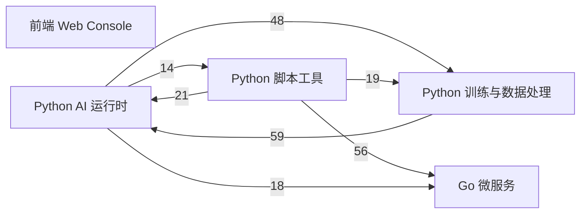

### 1.3 文档阅读方式

- 先看“模块索引”，快速定位你关心的子系统。
- 再看每个模块前面的“文件级调用图”，了解局部函数调用链。
- 最后进入对应函数条目，查看位置、参数、职责和调用关系。

## 2. 模块索引

### 前端 Web Console

- `web-console/src/api/platform.ts`: `10` 个函数
- `web-console/src/components/AppShell.vue`: `2` 个函数
- `web-console/src/components/audit/audit-event-presenter.ts`: `9` 个函数
- `web-console/src/components/history/HistoryDetailDrawer.vue`: `4` 个函数
- `web-console/src/components/workbench/ScoreRadar.vue`: `2` 个函数
- `web-console/src/components/workbench/generation-progress.ts`: `10` 个函数
- `web-console/src/model-copy.ts`: `2` 个函数
- `web-console/src/router/index.ts`: `1` 个函数
- `web-console/src/stores/auth.ts`: `2` 个函数
- `web-console/src/stores/platform.ts`: `6` 个函数
- `web-console/src/utils/score-grade.ts`: `3` 个函数
- `web-console/src/views/DashboardView.vue`: `1` 个函数
- `web-console/src/views/GenerateView.vue`: `9` 个函数
- `web-console/src/views/HistoryView.vue`: `5` 个函数
- `web-console/src/views/LoginView.vue`: `1` 个函数
- `web-console/src/views/ModelCenterView.vue`: `2` 个函数
- `web-console/src/views/TaskAuditView.vue`: `2` 个函数
- `web-console/src/views/generate-recommendations.ts`: `1` 个函数
- `web-console/src/views/task-audit-utils.ts`: `4` 个函数

### Python AI 运行时

- `python-ai-service/app/clients/asset_client.py`: `2` 个函数
- `python-ai-service/app/clients/audit_client.py`: `2` 个函数
- `python-ai-service/app/clients/task_client.py`: `2` 个函数
- `python-ai-service/app/core/runtime_logging.py`: `1` 个函数
- `python-ai-service/app/core/runtime_paths.py`: `11` 个函数
- `python-ai-service/app/core/settings.py`: `16` 个函数
- `python-ai-service/app/core/torch_cuda.py`: `5` 个函数
- `python-ai-service/app/dependencies.py`: `4` 个函数
- `python-ai-service/app/main.py`: `8` 个函数
- `python-ai-service/app/runtimes/runtime_registry.py`: `13` 个函数
- `python-ai-service/app/runtimes/scorers/aesthetic_runtime.py`: `10` 个函数
- `python-ai-service/app/runtimes/scorers/clip_iqa_runtime.py`: `6` 个函数
- `python-ai-service/app/runtimes/scorers/image_reward_runtime.py`: `7` 个函数
- `python-ai-service/app/runtimes/scorers/power_score_runtime.py`: `29` 个函数
- `python-ai-service/app/runtimes/sd15_runtime.py`: `7` 个函数
- `python-ai-service/app/runtimes/ssd1b_runtime.py`: `7` 个函数
- `python-ai-service/app/runtimes/unipic2_runtime.py`: `9` 个函数
- `python-ai-service/app/services/generation_service.py`: `2` 个函数
- `python-ai-service/app/services/job_pipeline.py`: `2` 个函数
- `python-ai-service/app/services/mock_generator.py`: `1` 个函数
- `python-ai-service/app/services/mock_scorer.py`: `1` 个函数
- `python-ai-service/app/services/scoring_service.py`: `8` 个函数
- `python-ai-service/app/worker.py`: `2` 个函数
- `python-ai-service/app/workers/job_worker.py`: `10` 个函数

### Python 训练与数据处理

- `python-ai-service/training/common/jsonl.py`: `2` 个函数
- `python-ai-service/training/common/paths.py`: `2` 个函数
- `python-ai-service/training/generation/build_manifest.py`: `1` 个函数
- `python-ai-service/training/generation/captioning.py`: `4` 个函数
- `python-ai-service/training/generation/config.py`: `3` 个函数
- `python-ai-service/training/generation/dedupe.py`: `2` 个函数
- `python-ai-service/training/generation/evaluate.py`: `1` 个函数
- `python-ai-service/training/generation/merge_lora.py`: `1` 个函数
- `python-ai-service/training/generation/pipeline.py`: `8` 个函数
- `python-ai-service/training/generation/prepare_dataset.py`: `1` 个函数
- `python-ai-service/training/generation/public_dataset.py`: `16` 个函数
- `python-ai-service/training/generation/scan_sources.py`: `1` 个函数
- `python-ai-service/training/generation/train_lora.py`: `3` 个函数
- `python-ai-service/training/reporting/thesis_figure_config.py`: `3` 个函数
- `python-ai-service/training/reporting/thesis_figure_data.py`: `6` 个函数
- `python-ai-service/training/reporting/thesis_figure_rendering.py`: `24` 个函数
- `python-ai-service/training/reporting/yolo_epoch_metrics.py`: `11` 个函数
- `python-ai-service/training/scoring/config.py`: `1` 个函数
- `python-ai-service/training/scoring/datasets.py`: `34` 个函数
- `python-ai-service/training/scoring/modeling.py`: `7` 个函数
- `python-ai-service/training/scoring/pipeline.py`: `12` 个函数
- `python-ai-service/training/scoring/yolo_dataset_tools.py`: `25` 个函数

### Python 脚本工具

- `python-ai-service/scripts/bootstrap.py`: `1` 个函数
- `python-ai-service/scripts/download_models.py`: `8` 个函数
- `python-ai-service/scripts/generate_thesis_figures.py`: `2` 个函数
- `python-ai-service/scripts/monitor_yolo_epoch_metrics.py`: `3` 个函数
- `python-ai-service/scripts/prepare_generation_v3_dataset.py`: `2` 个函数
- `python-ai-service/scripts/repair_yolo_merged_dataset.py`: `2` 个函数
- `python-ai-service/scripts/runtime_probe.py`: `4` 个函数
- `python-ai-service/scripts/train_generation_v3.py`: `1` 个函数
- `python-ai-service/scripts/train_scoring_v2.py`: `2` 个函数
- `python-ai-service/scripts/train_scoring_v3.py`: `2` 个函数

### Go 微服务

- `services/asset-service/cmd/server/main.go`: `1` 个函数
- `services/asset-service/controller/asset_controller.go`: `5` 个函数
- `services/asset-service/model/asset.go`: `1` 个函数
- `services/asset-service/repository/asset_repository.go`: `8` 个函数
- `services/asset-service/router/router.go`: `1` 个函数
- `services/asset-service/service/asset_service.go`: `6` 个函数
- `services/audit-service/cmd/server/main.go`: `1` 个函数
- `services/audit-service/controller/audit_controller.go`: `3` 个函数
- `services/audit-service/repository/audit_repository.go`: `6` 个函数
- `services/audit-service/router/router.go`: `1` 个函数
- `services/audit-service/service/audit_service.go`: `4` 个函数
- `services/auth-service/cmd/server/main.go`: `1` 个函数
- `services/auth-service/controller/auth_controller.go`: `2` 个函数
- `services/auth-service/repository/user_repository.go`: `2` 个函数
- `services/auth-service/router/router.go`: `1` 个函数
- `services/auth-service/service/auth_service.go`: `2` 个函数
- `services/gateway-service/cmd/server/main.go`: `3` 个函数
- `services/gateway-service/middleware/auth.go`: `1` 个函数
- `services/gateway-service/middleware/cors.go`: `1` 个函数
- `services/gateway-service/router/router.go`: `1` 个函数
- `services/gateway-service/service/proxy_service.go`: `2` 个函数
- `services/model-service/cmd/server/main.go`: `1` 个函数
- `services/model-service/controller/model_controller.go`: `3` 个函数
- `services/model-service/repository/model_repository.go`: `7` 个函数
- `services/model-service/router/router.go`: `1` 个函数
- `services/model-service/service/model_service.go`: `5` 个函数
- `services/platform-common/pkg/config/config.go`: `6` 个函数
- `services/platform-common/pkg/jwtx/jwt.go`: `1` 个函数
- `services/platform-common/pkg/logger/logger.go`: `2` 个函数
- `services/task-service/cmd/server/main.go`: `1` 个函数
- `services/task-service/controller/task_controller.go`: `5` 个函数
- `services/task-service/repository/task_repository.go`: `8` 个函数
- `services/task-service/router/router.go`: `1` 个函数
- `services/task-service/service/task_service.go`: `5` 个函数

## 4. 微服务内部函数调用图专项说明

### 4.1 微服务是从哪一块开始汇总的

在这个项目里，每一个 Go 微服务的调用图，都是从各自的 `cmd/server/main.go` 开始汇总。

也就是说，单个微服务的内部主链路统一按下面这个顺序展开：

`cmd/server/main.go -> router -> controller -> service -> repository -> MySQL/Redis/公共库`

其中：

- `main.go` 是服务装配入口，负责加载配置、初始化数据库或 Redis、创建 repository/service/controller，并启动 Gin 引擎。
- `router` 负责把 URL 路径绑定到控制器函数。
- `controller` 负责参数绑定、HTTP 状态码和响应封装。
- `service` 负责核心业务逻辑。
- `repository` 负责落库、查库、迁移 SQL 或其他持久化细节。
- `gateway-service` 是特例，它主要是 `main -> router -> middleware/proxy service`，不经过传统 repository。

### 4.2 所有微服务的入口汇总图

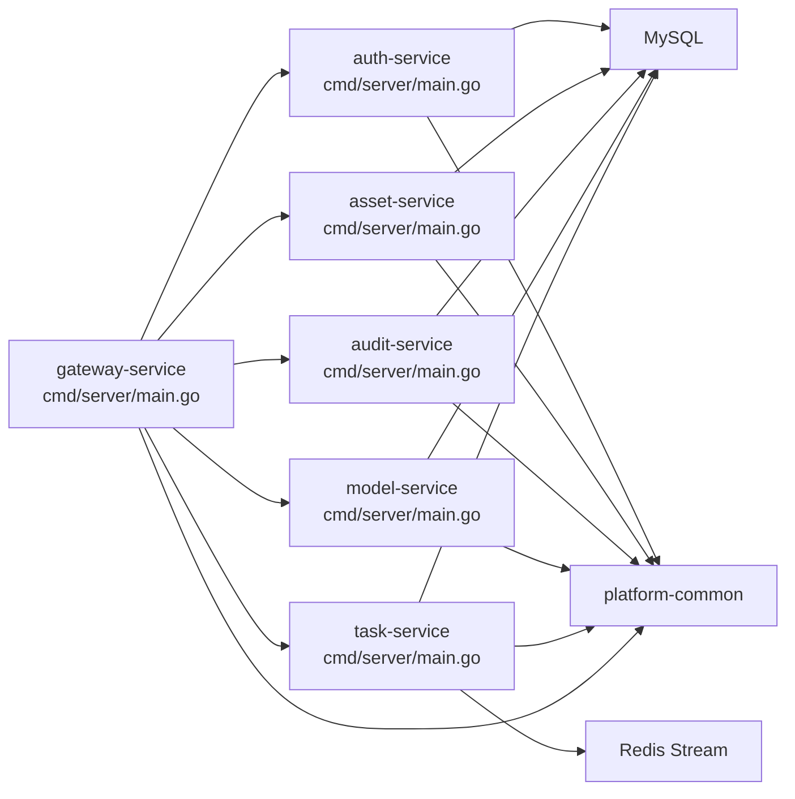

### 4.3 每个微服务的分层调用图

#### Auth Service

- 汇总起点：`services/auth-service/cmd/server/main.go`
- 说明：登录鉴权服务，从 HTTP 登录请求一路下沉到用户查询和 JWT 签发。

分层与函数范围：
- `入口层`: `services/auth-service/cmd/server/main.go` -> `main`
- `路由层`: `services/auth-service/router/router.go` -> `New`
- `控制器层`: `services/auth-service/controller/auth_controller.go` -> `NewAuthController, Login`
- `服务层`: `services/auth-service/service/auth_service.go` -> `NewAuthService, Login`
- `仓储层`: `services/auth-service/repository/user_repository.go` -> `NewUserRepository, FindByUsername`

服务内主调用链：
- `main -> config.Load -> sql.Open -> repository.NewUserRepository -> service.NewAuthService -> controller.NewAuthController -> router.New -> engine.Run`
- `router.New -> authController.Login`
- `AuthController.Login -> AuthService.Login`
- `AuthService.Login -> UserRepository.FindByUsername`
- `AuthService.Login -> jwtx.Issue`

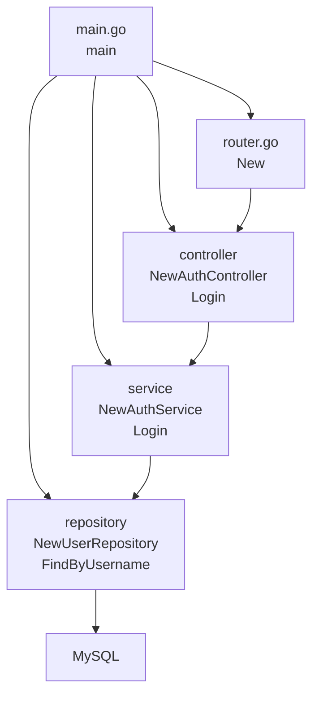

#### Asset Service

- 汇总起点：`services/asset-service/cmd/server/main.go`
- 说明：资产服务负责接收生成结果、写入资产数据，并给历史中心提供列表、分页和详情查询。

分层与函数范围：
- `入口层`: `services/asset-service/cmd/server/main.go` -> `main`
- `路由层`: `services/asset-service/router/router.go` -> `New`
- `控制器层`: `services/asset-service/controller/asset_controller.go` -> `NewAssetController, SaveGenerateResults, ListHistory, ListHistoryPage, GetAssetDetail`
- `服务层`: `services/asset-service/service/asset_service.go` -> `NewAssetService, SaveGenerateResults, ListHistory, ListHistoryPage, GetAssetDetail, normalizeHistoryPageQuery`
- `仓储层`: `services/asset-service/repository/asset_repository.go` -> `NewAssetRepository, ensureSchema, SaveResults, ListHistory, ListHistoryPage, GetDetail`

服务内主调用链：
- `main -> config.Load -> sql.Open -> repository.NewAssetRepository -> service.NewAssetService -> controller.NewAssetController -> router.New -> engine.Run`
- `router.New -> AssetController.SaveGenerateResults / ListHistory / ListHistoryPage / GetAssetDetail`
- `SaveGenerateResults -> AssetService.SaveGenerateResults -> AssetRepository.ListHistory / SaveResults / GetDetail`
- `ListHistory -> AssetService.ListHistory -> AssetRepository.ListHistory`
- `ListHistoryPage -> AssetService.ListHistoryPage -> normalizeHistoryPageQuery -> AssetRepository.ListHistoryPage`
- `GetAssetDetail -> AssetService.GetAssetDetail -> AssetRepository.GetDetail`

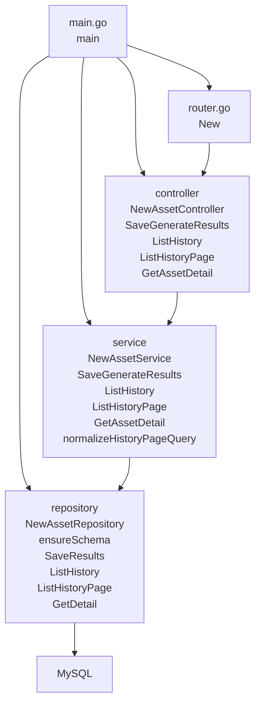

#### Audit Service

- 汇总起点：`services/audit-service/cmd/server/main.go`
- 说明：审计服务负责写入任务时间线事件，并按任务 ID 提供完整事件列表。

分层与函数范围：
- `入口层`: `services/audit-service/cmd/server/main.go` -> `main`
- `路由层`: `services/audit-service/router/router.go` -> `New`
- `控制器层`: `services/audit-service/controller/audit_controller.go` -> `NewAuditController, RecordTaskEvent, ListTaskEvents`
- `服务层`: `services/audit-service/service/audit_service.go` -> `NewAuditService, RecordTaskEvent, ListTaskEvents, extractJobID`
- `仓储层`: `services/audit-service/repository/audit_repository.go` -> `NewAuditRepository, auditSchemaStatements, ensureSchema, isIgnorableMigrationError, Append, ListByJobID`

服务内主调用链：
- `main -> config.Load -> sql.Open -> repository.NewAuditRepository -> service.NewAuditService -> controller.NewAuditController -> router.New -> engine.Run`
- `router.New -> AuditController.RecordTaskEvent / ListTaskEvents`
- `RecordTaskEvent -> AuditService.RecordTaskEvent -> extractJobID -> AuditRepository.Append`
- `ListTaskEvents -> AuditService.ListTaskEvents -> AuditRepository.ListByJobID`

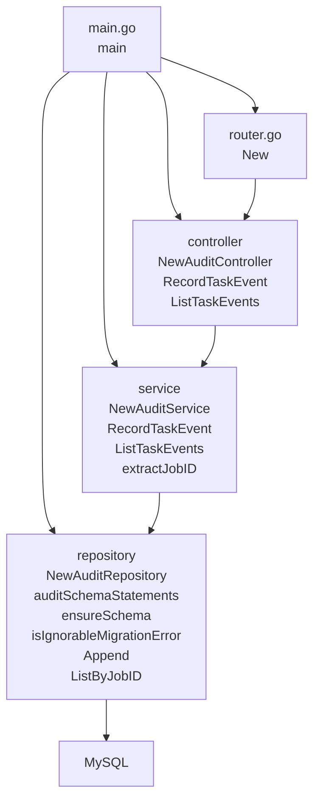

#### Model Service

- 汇总起点：`services/model-service/cmd/server/main.go`
- 说明：模型服务负责维护模型注册表，并叠加本地文件状态后返回模型中心可用的数据。

分层与函数范围：
- `入口层`: `services/model-service/cmd/server/main.go` -> `main`
- `路由层`: `services/model-service/router/router.go` -> `New`
- `控制器层`: `services/model-service/controller/model_controller.go` -> `NewModelController, ListModels, GetModel`
- `服务层`: `services/model-service/service/model_service.go` -> `NewModelService, ListModels, GetModel, hydrateStatus, hasLocalModelFiles`
- `仓储层`: `services/model-service/repository/model_repository.go` -> `NewModelRepository, modelSchemaStatements, runtimePath, ensureSchema, isIgnorableMigrationError, ListCatalog, GetByName`

服务内主调用链：
- `main -> config.Load -> sql.Open -> repository.NewModelRepository -> service.NewModelService -> controller.NewModelController -> router.New -> engine.Run`
- `router.New -> ModelController.ListModels / GetModel`
- `ListModels -> ModelService.ListModels -> ModelRepository.ListCatalog -> hydrateStatus -> hasLocalModelFiles`
- `GetModel -> ModelService.GetModel -> ModelRepository.GetByName -> hydrateStatus`
- `ModelRepository.ensureSchema -> modelSchemaStatements / runtimePath`

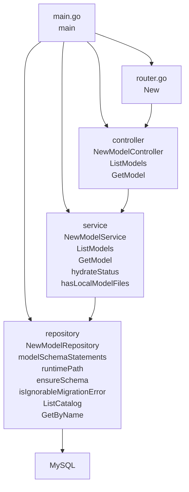

#### Task Service

- 汇总起点：`services/task-service/cmd/server/main.go`
- 说明：任务服务负责创建生成任务、维护任务状态，并把新任务投递到 Redis Stream。

分层与函数范围：
- `入口层`: `services/task-service/cmd/server/main.go` -> `main`
- `路由层`: `services/task-service/router/router.go` -> `New`
- `控制器层`: `services/task-service/controller/task_controller.go` -> `NewTaskController, CreateGenerateJob, GetJob, ListJobs, UpdateTaskStatus`
- `服务层`: `services/task-service/service/task_service.go` -> `NewTaskService, CreateGenerateJob, GetJob, ListJobs, UpdateStatus`
- `仓储层`: `services/task-service/repository/task_repository.go` -> `NewTaskRepository, taskSchemaStatements, ensureSchema, isIgnorableMigrationError, Create, GetByID, List, UpdateStatus`

服务内主调用链：
- `main -> config.Load -> sql.Open -> redis.NewClient -> repository.NewTaskRepository -> service.NewTaskService -> controller.NewTaskController -> router.New -> engine.Run`
- `router.New -> TaskController.CreateGenerateJob / GetJob / ListJobs / UpdateTaskStatus`
- `CreateGenerateJob -> TaskService.CreateGenerateJob -> TaskRepository.Create -> TaskRepository.GetByID -> redis.XAdd`
- `GetJob -> TaskService.GetJob -> TaskRepository.GetByID`
- `ListJobs -> TaskService.ListJobs -> TaskRepository.List`
- `UpdateTaskStatus -> TaskService.UpdateStatus -> TaskRepository.UpdateStatus -> TaskRepository.GetByID`

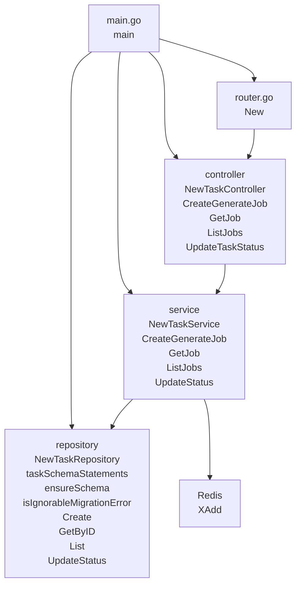

#### Gateway Service

- 汇总起点：`services/gateway-service/cmd/server/main.go`
- 说明：网关服务不走 controller/service/repository 业务链，而是从入口层组装反向代理和中间件，再统一转发到各后端服务。

分层与函数范围：
- `入口层`: `services/gateway-service/cmd/server/main.go` -> `main, getenv, resolveImageCheckDir`
- `路由层`: `services/gateway-service/router/router.go` -> `New`
- `中间件层`: `services/gateway-service/middleware/auth.go` -> `RequireBearer`
- `中间件层`: `services/gateway-service/middleware/cors.go` -> `CORS`
- `代理服务层`: `services/gateway-service/service/proxy_service.go` -> `NewReverseProxy, NewStaticFileHandler`

服务内主调用链：
- `main -> config.Load -> getenv / resolveImageCheckDir -> service.NewReverseProxy / NewStaticFileHandler -> router.New -> engine.Run`
- `router.New -> middleware.CORS / middleware.RequireBearer`
- `router.New -> gin.WrapH(upstreams.Auth / Model / Task / Asset / Audit / Files / ImageChecks)`

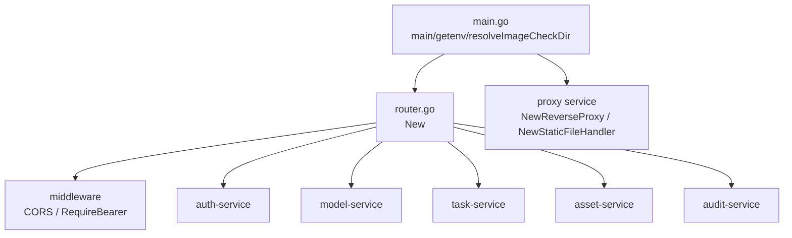

### 4.4 最终汇总

从代码结构上看，这个项目中的 Go 微服务调用图最终可以总结为两类：

- 业务型微服务：`main -> router -> controller -> service -> repository -> MySQL/Redis`
- 网关型微服务：`main -> router -> middleware/proxy -> 下游微服务`

如果后续你要继续扩展文档，建议把“微服务内部函数调用图”的统一汇总起点固定为 `services/<service-name>/cmd/server/main.go`。这样所有服务的图都能用同一标准来画，阅读时也最整齐。


## 3. 逐文件函数说明

## 3.1 前端 Web Console

### 本模块文件级调用图索引

- `web-console/src/stores/platform.ts`
- `web-console/src/views/GenerateView.vue`
- `web-console/src/views/HistoryView.vue`
- `web-console/src/views/task-audit-utils.ts`

### `web-console/src/api/platform.ts`

#### `unwrap`

- 所在位置：`web-console/src/api/platform.ts:14`
- 语言：`TypeScript`
- 函数签名：`async unwrap(request: Promise<{ data: ApiEnvelope<T> }>)`
- 函数用途：源码中没有显式注释，这里根据函数命名和上下文推断其职责。
- 参数说明：
  - `request`: TypeScript 参数，类型为 `Promise<{ data: ApiEnvelope<T> }>`。
- 调用的项目内函数：未通过静态分析识别到明显的项目内直接函数调用，或主要依赖对象方法/框架回调。

#### `createGenerateTask`

- 所在位置：`web-console/src/api/platform.ts:22`
- 语言：`TypeScript`
- 函数签名：`createGenerateTask(payload: GenerateTaskRequest)`
- 函数用途：createGenerateTask 提交一条新的真实生成任务。
- 参数说明：
  - `payload`: TypeScript 参数，类型为 `GenerateTaskRequest`。
- 调用的项目内函数：未通过静态分析识别到明显的项目内直接函数调用，或主要依赖对象方法/框架回调。
- 其他可见调用：`post`

#### `getTask`

- 所在位置：`web-console/src/api/platform.ts:27`
- 语言：`TypeScript`
- 函数签名：`getTask(taskId: number)`
- 函数用途：getTask 查询单个任务的最新状态。
- 参数说明：
  - `taskId`: TypeScript 参数，类型为 `number`。
- 调用的项目内函数：未通过静态分析识别到明显的项目内直接函数调用，或主要依赖对象方法/框架回调。
- 其他可见调用：`get`

#### `listTasks`

- 所在位置：`web-console/src/api/platform.ts:32`
- 语言：`TypeScript`
- 函数签名：`listTasks()`
- 函数用途：listTasks 拉取任务列表，并显式关闭浏览器缓存。
- 参数说明：无显式参数。
- 调用的项目内函数：未通过静态分析识别到明显的项目内直接函数调用，或主要依赖对象方法/框架回调。
- 其他可见调用：`get`

#### `listAssetHistory`

- 所在位置：`web-console/src/api/platform.ts:47`
- 语言：`TypeScript`
- 函数签名：`listAssetHistory()`
- 函数用途：listAssetHistory 拉取历史中心所需的资产列表。
- 参数说明：无显式参数。
- 调用的项目内函数：未通过静态分析识别到明显的项目内直接函数调用，或主要依赖对象方法/框架回调。
- 其他可见调用：`get`

#### `listAssetHistoryPage`

- 所在位置：`web-console/src/api/platform.ts:52`
- 语言：`TypeScript`
- 函数签名：`listAssetHistoryPage(params: AssetHistoryPageQuery)`
- 函数用途：listAssetHistoryPage 拉取历史中心分页数据，并把筛选条件直接透传给后端。
- 参数说明：
  - `params`: TypeScript 参数，类型为 `AssetHistoryPageQuery`。
- 调用的项目内函数：未通过静态分析识别到明显的项目内直接函数调用，或主要依赖对象方法/框架回调。
- 其他可见调用：`get`

#### `getAssetDetail`

- 所在位置：`web-console/src/api/platform.ts:61`
- 语言：`TypeScript`
- 函数签名：`getAssetDetail(assetId: number)`
- 函数用途：getAssetDetail 查询单个资产的详细信息。
- 参数说明：
  - `assetId`: TypeScript 参数，类型为 `number`。
- 调用的项目内函数：未通过静态分析识别到明显的项目内直接函数调用，或主要依赖对象方法/框架回调。
- 其他可见调用：`get`

#### `listTaskAuditEvents`

- 所在位置：`web-console/src/api/platform.ts:66`
- 语言：`TypeScript`
- 函数签名：`listTaskAuditEvents(taskId: number)`
- 函数用途：listTaskAuditEvents 拉取某个任务的审计时间线。
- 参数说明：
  - `taskId`: TypeScript 参数，类型为 `number`。
- 调用的项目内函数：未通过静态分析识别到明显的项目内直接函数调用，或主要依赖对象方法/框架回调。
- 其他可见调用：`get`

#### `listModels`

- 所在位置：`web-console/src/api/platform.ts:71`
- 语言：`TypeScript`
- 函数签名：`listModels()`
- 函数用途：listModels 拉取模型中心展示用的模型目录。
- 参数说明：无显式参数。
- 调用的项目内函数：未通过静态分析识别到明显的项目内直接函数调用，或主要依赖对象方法/框架回调。
- 其他可见调用：`get`

#### `buildImageUrl`

- 所在位置：`web-console/src/api/platform.ts:74`
- 语言：`TypeScript`
- 函数签名：`buildImageUrl(filePath: string)`
- 函数用途：负责构建并返回一个新的对象、实例或配置结果。
- 参数说明：
  - `filePath`: TypeScript 参数，类型为 `string`。
- 调用的项目内函数：未通过静态分析识别到明显的项目内直接函数调用，或主要依赖对象方法/框架回调。
- 其他可见调用：`split, pop, image_check, test`


### `web-console/src/components/AppShell.vue`

#### `go`

- 所在位置：`web-console/src/components/AppShell.vue:23`
- 语言：`Vue/TypeScript`
- 函数签名：`async go(path: string)`
- 函数用途：这是 Vue 视图/组件内部函数，用于支撑页面交互、派生状态或事件响应。
- 参数说明：
  - `path`: TypeScript 参数，类型为 `string`。
- 调用的项目内函数：未通过静态分析识别到明显的项目内直接函数调用，或主要依赖对象方法/框架回调。
- 其他可见调用：`push`

#### `logout`

- 所在位置：`web-console/src/components/AppShell.vue:37`
- 语言：`Vue/TypeScript`
- 函数签名：`logout()`
- 函数用途：这是 Vue 视图/组件内部函数，用于支撑页面交互、派生状态或事件响应。
- 参数说明：无显式参数。
- 调用的项目内函数：未通过静态分析识别到明显的项目内直接函数调用，或主要依赖对象方法/框架回调。
- 其他可见调用：`clearSession, push`


### `web-console/src/components/audit/audit-event-presenter.ts`

#### `normalizeEventType`

- 所在位置：`web-console/src/components/audit/audit-event-presenter.ts:20`
- 语言：`TypeScript`
- 函数签名：`normalizeEventType(value: string)`
- 函数用途：源码中没有显式注释，这里根据函数命名和上下文推断其职责。
- 参数说明：
  - `value`: TypeScript 参数，类型为 `string`。
- 调用的项目内函数：未通过静态分析识别到明显的项目内直接函数调用，或主要依赖对象方法/框架回调。
- 其他可见调用：`trim, toLowerCase, replace`

#### `includesAny`

- 所在位置：`web-console/src/components/audit/audit-event-presenter.ts:24`
- 语言：`TypeScript`
- 函数签名：`includesAny(source: string, tokens: string[])`
- 函数用途：源码中没有显式注释，这里根据函数命名和上下文推断其职责。
- 参数说明：
  - `source`: TypeScript 参数，类型为 `string`。
  - `tokens`: TypeScript 参数，类型为 `string[]`。
- 调用的项目内函数：未通过静态分析识别到明显的项目内直接函数调用，或主要依赖对象方法/框架回调。
- 其他可见调用：`some, includes`

#### `parsePayload`

- 所在位置：`web-console/src/components/audit/audit-event-presenter.ts:28`
- 语言：`TypeScript`
- 函数签名：`parsePayload(payloadJson: string)`
- 函数用途：负责解析输入或加载外部资源。
- 参数说明：
  - `payloadJson`: TypeScript 参数，类型为 `string`。
- 调用的项目内函数：未通过静态分析识别到明显的项目内直接函数调用，或主要依赖对象方法/框架回调。
- 其他可见调用：`trim, parse, isArray`

#### `formatValue`

- 所在位置：`web-console/src/components/audit/audit-event-presenter.ts:41`
- 语言：`TypeScript`
- 函数签名：`formatValue(value: unknown)`
- 函数用途：源码中没有显式注释，这里根据函数命名和上下文推断其职责。
- 参数说明：
  - `value`: TypeScript 参数，类型为 `unknown`。
- 调用的项目内函数：
  - `formatValue -> web-console/src/components/audit/audit-event-presenter.ts:41`
- 其他可见调用：`isArray, join, String`

#### `joinSentence`

- 所在位置：`web-console/src/components/audit/audit-event-presenter.ts:57`
- 语言：`TypeScript`
- 函数签名：`joinSentence(parts: string[])`
- 函数用途：源码中没有显式注释，这里根据函数命名和上下文推断其职责。
- 参数说明：
  - `parts`: TypeScript 参数，类型为 `string[]`。
- 调用的项目内函数：未通过静态分析识别到明显的项目内直接函数调用，或主要依赖对象方法/框架回调。
- 其他可见调用：`join`

#### `summarizePayload`

- 所在位置：`web-console/src/components/audit/audit-event-presenter.ts:62`
- 语言：`TypeScript`
- 函数签名：`summarizePayload(payload: PayloadRecord | null)`
- 函数用途：源码中没有显式注释，这里根据函数命名和上下文推断其职责。
- 参数说明：
  - `payload`: TypeScript 参数，类型为 `PayloadRecord | null`。
- 调用的项目内函数：
  - `joinSentence -> web-console/src/components/audit/audit-event-presenter.ts:57`
  - `formatValue -> web-console/src/components/audit/audit-event-presenter.ts:41`
- 其他可见调用：`entries`

#### `resolveTitle`

- 所在位置：`web-console/src/components/audit/audit-event-presenter.ts:81`
- 语言：`TypeScript`
- 函数签名：`resolveTitle(eventType: string)`
- 函数用途：源码中没有显式注释，这里根据函数命名和上下文推断其职责。
- 参数说明：
  - `eventType`: TypeScript 参数，类型为 `string`。
- 调用的项目内函数：
  - `normalizeEventType -> web-console/src/components/audit/audit-event-presenter.ts:20`
  - `includesAny -> web-console/src/components/audit/audit-event-presenter.ts:24; web-console/src/components/workbench/generation-progress.ts:29`

#### `resolveDescription`

- 所在位置：`web-console/src/components/audit/audit-event-presenter.ts:123`
- 语言：`TypeScript`
- 函数签名：`resolveDescription(eventType: string, payload: PayloadRecord | null, message: string)`
- 函数用途：源码中没有显式注释，这里根据函数命名和上下文推断其职责。
- 参数说明：
  - `eventType`: TypeScript 参数，类型为 `string`。
  - `payload`: TypeScript 参数，类型为 `PayloadRecord | null`。
  - `message`: TypeScript 参数，类型为 `string`。
- 调用的项目内函数：
  - `normalizeEventType -> web-console/src/components/audit/audit-event-presenter.ts:20`
  - `formatValue -> web-console/src/components/audit/audit-event-presenter.ts:41`
  - `includesAny -> web-console/src/components/audit/audit-event-presenter.ts:24; web-console/src/components/workbench/generation-progress.ts:29`
  - `summarizePayload -> web-console/src/components/audit/audit-event-presenter.ts:62`
- 其他可见调用：`trim`

#### `presentAuditEvent`

- 所在位置：`web-console/src/components/audit/audit-event-presenter.ts:184`
- 语言：`TypeScript`
- 函数签名：`presentAuditEvent(event: AuditEvent)`
- 函数用途：源码中没有显式注释，这里根据函数命名和上下文推断其职责。
- 参数说明：
  - `event`: TypeScript 参数，类型为 `AuditEvent`。
- 调用的项目内函数：
  - `parsePayload -> web-console/src/components/audit/audit-event-presenter.ts:28`
  - `resolveTitle -> web-console/src/components/audit/audit-event-presenter.ts:81`
  - `resolveDescription -> web-console/src/components/audit/audit-event-presenter.ts:123`


### `web-console/src/components/history/HistoryDetailDrawer.vue`

#### `openExplanation`

- 所在位置：`web-console/src/components/history/HistoryDetailDrawer.vue:145`
- 语言：`Vue/TypeScript`
- 函数签名：`openExplanation(key: ScoreDimensionKey)`
- 函数用途：这是 Vue 视图/组件内部函数，用于支撑页面交互、派生状态或事件响应。
- 参数说明：
  - `key`: TypeScript 参数，类型为 `ScoreDimensionKey`。
- 调用的项目内函数：未通过静态分析识别到明显的项目内直接函数调用，或主要依赖对象方法/框架回调。

#### `formatBandRange`

- 所在位置：`web-console/src/components/history/HistoryDetailDrawer.vue:153`
- 语言：`Vue/TypeScript`
- 函数签名：`formatBandRange(score: number)`
- 函数用途：这是 Vue 视图/组件内部函数，用于支撑页面交互、派生状态或事件响应。
- 参数说明：
  - `score`: TypeScript 参数，类型为 `number`。
- 调用的项目内函数：
  - `getScoreBand -> web-console/src/utils/score-grade.ts:17`
- 其他可见调用：`toFixed`

#### `formatInputValue`

- 所在位置：`web-console/src/components/history/HistoryDetailDrawer.vue:159`
- 语言：`Vue/TypeScript`
- 函数签名：`formatInputValue(value: unknown)`
- 函数用途：这是 Vue 视图/组件内部函数，用于支撑页面交互、派生状态或事件响应。
- 参数说明：
  - `value`: TypeScript 参数，类型为 `unknown`。
- 调用的项目内函数：
  - `formatInputValue -> web-console/src/components/history/HistoryDetailDrawer.vue:159`
- 其他可见调用：`isArray, join, entries, String`

#### `guessCheckedImagePath`

- 所在位置：`web-console/src/components/history/HistoryDetailDrawer.vue:171`
- 语言：`Vue/TypeScript`
- 函数签名：`guessCheckedImagePath(filePath: string)`
- 函数用途：这是 Vue 视图/组件内部函数，用于支撑页面交互、派生状态或事件响应。
- 参数说明：
  - `filePath`: TypeScript 参数，类型为 `string`。
- 调用的项目内函数：未通过静态分析识别到明显的项目内直接函数调用，或主要依赖对象方法/框架回调。
- 其他可见调用：`replace, image`


### `web-console/src/components/workbench/ScoreRadar.vue`

#### `polarPoint`

- 所在位置：`web-console/src/components/workbench/ScoreRadar.vue:23`
- 语言：`Vue/TypeScript`
- 函数签名：`polarPoint(index: number, value: number, radius = 84)`
- 函数用途：这是 Vue 视图/组件内部函数，用于支撑页面交互、派生状态或事件响应。
- 参数说明：
  - `index`: TypeScript 参数，类型为 `number`。
  - `value`: TypeScript 参数，类型为 `number`。
  - `radius = 84`: 输入参数。
- 调用的项目内函数：未通过静态分析识别到明显的项目内直接函数调用，或主要依赖对象方法/框架回调。
- 其他可见调用：`max, min, cos, sin`

#### `gridPoint`

- 所在位置：`web-console/src/components/workbench/ScoreRadar.vue:31`
- 语言：`Vue/TypeScript`
- 函数签名：`gridPoint(index: number, level: number, radius = 84)`
- 函数用途：这是 Vue 视图/组件内部函数，用于支撑页面交互、派生状态或事件响应。
- 参数说明：
  - `index`: TypeScript 参数，类型为 `number`。
  - `level`: TypeScript 参数，类型为 `number`。
  - `radius = 84`: 输入参数。
- 调用的项目内函数：未通过静态分析识别到明显的项目内直接函数调用，或主要依赖对象方法/框架回调。
- 其他可见调用：`cos, sin`


### `web-console/src/components/workbench/generation-progress.ts`

#### `normalize`

- 所在位置：`web-console/src/components/workbench/generation-progress.ts:24`
- 语言：`TypeScript`
- 函数签名：`normalize(value: string)`
- 函数用途：源码中没有显式注释，这里根据函数命名和上下文推断其职责。
- 参数说明：
  - `value`: TypeScript 参数，类型为 `string`。
- 调用的项目内函数：未通过静态分析识别到明显的项目内直接函数调用，或主要依赖对象方法/框架回调。
- 其他可见调用：`trim, toLowerCase, replace`

#### `includesAny`

- 所在位置：`web-console/src/components/workbench/generation-progress.ts:29`
- 语言：`TypeScript`
- 函数签名：`includesAny(source: string, tokens: string[])`
- 函数用途：源码中没有显式注释，这里根据函数命名和上下文推断其职责。
- 参数说明：
  - `source`: TypeScript 参数，类型为 `string`。
  - `tokens`: TypeScript 参数，类型为 `string[]`。
- 调用的项目内函数：未通过静态分析识别到明显的项目内直接函数调用，或主要依赖对象方法/框架回调。
- 其他可见调用：`some, includes`

#### `sortAuditEvents`

- 所在位置：`web-console/src/components/workbench/generation-progress.ts:34`
- 语言：`TypeScript`
- 函数签名：`sortAuditEvents(events: AuditEvent[])`
- 函数用途：源码中没有显式注释，这里根据函数命名和上下文推断其职责。
- 参数说明：
  - `events`: TypeScript 参数，类型为 `AuditEvent[]`。
- 调用的项目内函数：未通过静态分析识别到明显的项目内直接函数调用，或主要依赖对象方法/框架回调。
- 其他可见调用：`sort, parse`

#### `resolvePhaseIndex`

- 所在位置：`web-console/src/components/workbench/generation-progress.ts:39`
- 语言：`TypeScript`
- 函数签名：`resolvePhaseIndex(task: GenerateTask, auditEvents: AuditEvent[])`
- 函数用途：源码中没有显式注释，这里根据函数命名和上下文推断其职责。
- 参数说明：
  - `task`: TypeScript 参数，类型为 `GenerateTask`。
  - `auditEvents`: TypeScript 参数，类型为 `AuditEvent[]`。
- 调用的项目内函数：
  - `normalize -> web-console/src/components/workbench/generation-progress.ts:24`
  - `sortAuditEvents -> web-console/src/components/workbench/generation-progress.ts:34`
  - `includesAny -> web-console/src/components/audit/audit-event-presenter.ts:24; web-console/src/components/workbench/generation-progress.ts:29`

#### `buildPhaseState`

- 所在位置：`web-console/src/components/workbench/generation-progress.ts:65`
- 语言：`TypeScript`
- 函数签名：`buildPhaseState(index: number, activePhaseIndex: number, taskStatus: string)`
- 函数用途：负责构建并返回一个新的对象、实例或配置结果。
- 参数说明：
  - `index`: TypeScript 参数，类型为 `number`。
  - `activePhaseIndex`: TypeScript 参数，类型为 `number`。
  - `taskStatus`: TypeScript 参数，类型为 `string`。
- 调用的项目内函数：未通过静态分析识别到明显的项目内直接函数调用，或主要依赖对象方法/框架回调。

#### `buildHeadline`

- 所在位置：`web-console/src/components/workbench/generation-progress.ts:92`
- 语言：`TypeScript`
- 函数签名：`buildHeadline(taskStatus: string, phaseIndex: number)`
- 函数用途：负责构建并返回一个新的对象、实例或配置结果。
- 参数说明：
  - `taskStatus`: TypeScript 参数，类型为 `string`。
  - `phaseIndex`: TypeScript 参数，类型为 `number`。
- 调用的项目内函数：未通过静态分析识别到明显的项目内直接函数调用，或主要依赖对象方法/框架回调。

#### `buildDetail`

- 所在位置：`web-console/src/components/workbench/generation-progress.ts:117`
- 语言：`TypeScript`
- 函数签名：`buildDetail(task: GenerateTask, phaseIndex: number)`
- 函数用途：负责构建并返回一个新的对象、实例或配置结果。
- 参数说明：
  - `task`: TypeScript 参数，类型为 `GenerateTask`。
  - `phaseIndex`: TypeScript 参数，类型为 `number`。
- 调用的项目内函数：未通过静态分析识别到明显的项目内直接函数调用，或主要依赖对象方法/框架回调。

#### `formatAuditEventLabel`

- 所在位置：`web-console/src/components/workbench/generation-progress.ts:142`
- 语言：`TypeScript`
- 函数签名：`formatAuditEventLabel(eventType: string)`
- 函数用途：源码中没有显式注释，这里根据函数命名和上下文推断其职责。
- 参数说明：
  - `eventType`: TypeScript 参数，类型为 `string`。
- 调用的项目内函数：
  - `normalize -> web-console/src/components/workbench/generation-progress.ts:24`
  - `includesAny -> web-console/src/components/audit/audit-event-presenter.ts:24; web-console/src/components/workbench/generation-progress.ts:29`

#### `getRecentAuditEvents`

- 所在位置：`web-console/src/components/workbench/generation-progress.ts:168`
- 语言：`TypeScript`
- 函数签名：`getRecentAuditEvents(auditEvents: AuditEvent[], count = 3)`
- 函数用途：负责读取、查询或列举数据。
- 参数说明：
  - `auditEvents`: TypeScript 参数，类型为 `AuditEvent[]`。
  - `count = 3`: 输入参数。
- 调用的项目内函数：
  - `sortAuditEvents -> web-console/src/components/workbench/generation-progress.ts:34`
- 其他可见调用：`slice`

#### `buildGenerationProgress`

- 所在位置：`web-console/src/components/workbench/generation-progress.ts:173`
- 语言：`TypeScript`
- 函数签名：`buildGenerationProgress(task: GenerateTask | null, auditEvents: AuditEvent[])`
- 函数用途：负责构建并返回一个新的对象、实例或配置结果。
- 参数说明：
  - `task`: TypeScript 参数，类型为 `GenerateTask | null`。
  - `auditEvents`: TypeScript 参数，类型为 `AuditEvent[]`。
- 调用的项目内函数：
  - `resolvePhaseIndex -> web-console/src/components/workbench/generation-progress.ts:39`
  - `buildHeadline -> web-console/src/components/workbench/generation-progress.ts:92`
  - `buildDetail -> web-console/src/components/workbench/generation-progress.ts:117`
  - `buildPhaseState -> web-console/src/components/workbench/generation-progress.ts:65`
- 其他可见调用：`min`


### `web-console/src/model-copy.ts`

#### `localizeModelRecord`

- 所在位置：`web-console/src/model-copy.ts:42`
- 语言：`TypeScript`
- 函数签名：`localizeModelRecord(model: ModelRecord)`
- 函数用途：源码中没有显式注释，这里根据函数命名和上下文推断其职责。
- 参数说明：
  - `model`: TypeScript 参数，类型为 `ModelRecord`。
- 调用的项目内函数：未通过静态分析识别到明显的项目内直接函数调用，或主要依赖对象方法/框架回调。

#### `localizeModelRecords`

- 所在位置：`web-console/src/model-copy.ts:55`
- 语言：`TypeScript`
- 函数签名：`localizeModelRecords(models: ModelRecord[])`
- 函数用途：源码中没有显式注释，这里根据函数命名和上下文推断其职责。
- 参数说明：
  - `models`: TypeScript 参数，类型为 `ModelRecord[]`。
- 调用的项目内函数：未通过静态分析识别到明显的项目内直接函数调用，或主要依赖对象方法/框架回调。


### `web-console/src/router/index.ts`

#### `createAppRouter`

- 所在位置：`web-console/src/router/index.ts:11`
- 语言：`TypeScript`
- 函数签名：`createAppRouter(history: RouterHistory)`
- 函数用途：负责构建并返回一个新的对象、实例或配置结果。
- 参数说明：
  - `history`: TypeScript 参数，类型为 `RouterHistory`。
- 调用的项目内函数：未通过静态分析识别到明显的项目内直接函数调用，或主要依赖对象方法/框架回调。
- 其他可见调用：`createRouter, beforeEach, useAuthStore, hydrate`


### `web-console/src/stores/auth.ts`

#### `state`

- 所在位置：`web-console/src/stores/auth.ts:12`
- 语言：`TypeScript`
- 函数签名：`state()`
- 函数用途：源码中没有显式注释，这里根据函数命名和上下文推断其职责。
- 参数说明：无显式参数。
- 调用的项目内函数：未通过静态分析识别到明显的项目内直接函数调用，或主要依赖对象方法/框架回调。

#### `getStorage`

- 所在位置：`web-console/src/stores/auth.ts:62`
- 语言：`TypeScript`
- 函数签名：`getStorage()`
- 函数用途：负责读取、查询或列举数据。
- 参数说明：无显式参数。
- 调用的项目内函数：未通过静态分析识别到明显的项目内直接函数调用，或主要依赖对象方法/框架回调。


### `web-console/src/stores/platform.ts`

#### 调用关系图

这张图展示当前文件内函数之间可直接识别的调用关系。

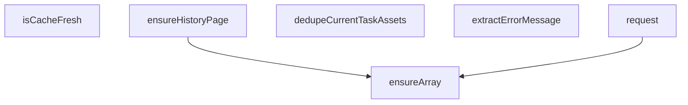

#### `isCacheFresh`

- 所在位置：`web-console/src/stores/platform.ts:26`
- 语言：`TypeScript`
- 函数签名：`isCacheFresh(timestamp: number, ttl = CACHE_TTL_MS)`
- 函数用途：源码中没有显式注释，这里根据函数命名和上下文推断其职责。
- 参数说明：
  - `timestamp`: TypeScript 参数，类型为 `number`。
  - `ttl = CACHE_TTL_MS`: 输入参数。
- 调用的项目内函数：未通过静态分析识别到明显的项目内直接函数调用，或主要依赖对象方法/框架回调。
- 其他可见调用：`now`

#### `ensureArray`

- 所在位置：`web-console/src/stores/platform.ts:31`
- 语言：`TypeScript`
- 函数签名：`ensureArray(value: T[] | null | undefined)`
- 函数用途：源码中没有显式注释，这里根据函数命名和上下文推断其职责。
- 参数说明：
  - `value`: TypeScript 参数，类型为 `T[] | null | undefined`。
- 调用的项目内函数：未通过静态分析识别到明显的项目内直接函数调用，或主要依赖对象方法/框架回调。
- 其他可见调用：`isArray`

#### `ensureHistoryPage`

- 所在位置：`web-console/src/stores/platform.ts:36`
- 语言：`TypeScript`
- 函数签名：`ensureHistoryPage(value: AssetHistoryPage | null | undefined)`
- 函数用途：源码中没有显式注释，这里根据函数命名和上下文推断其职责。
- 参数说明：
  - `value`: TypeScript 参数，类型为 `AssetHistoryPage | null | undefined`。
- 调用的项目内函数：
  - `ensureArray -> web-console/src/stores/platform.ts:31`

#### `dedupeCurrentTaskAssets`

- 所在位置：`web-console/src/stores/platform.ts:46`
- 语言：`TypeScript`
- 函数签名：`dedupeCurrentTaskAssets(items: AssetHistoryItem[])`
- 函数用途：源码中没有显式注释，这里根据函数命名和上下文推断其职责。
- 参数说明：
  - `items`: TypeScript 参数，类型为 `AssetHistoryItem[]`。
- 调用的项目内函数：未通过静态分析识别到明显的项目内直接函数调用，或主要依赖对象方法/框架回调。
- 其他可见调用：`has, add`

#### `extractErrorMessage`

- 所在位置：`web-console/src/stores/platform.ts:58`
- 语言：`TypeScript`
- 函数签名：`extractErrorMessage(error: unknown, fallback: string)`
- 函数用途：源码中没有显式注释，这里根据函数命名和上下文推断其职责。
- 参数说明：
  - `error`: TypeScript 参数，类型为 `unknown`。
  - `fallback`: TypeScript 参数，类型为 `string`。
- 调用的项目内函数：未通过静态分析识别到明显的项目内直接函数调用，或主要依赖对象方法/框架回调。
- 其他可见调用：`trim`

#### `request`

- 所在位置：`web-console/src/stores/platform.ts:327`
- 语言：`TypeScript`
- 函数签名：`request(async ()`
- 函数用途：源码中没有显式注释，这里根据函数命名和上下文推断其职责。
- 参数说明：
  - `async (`: 输入参数。
- 调用的项目内函数：
  - `getTask -> web-console/src/api/platform.ts:27`
  - `listTaskAuditEvents -> web-console/src/api/platform.ts:66`
  - `ensureArray -> web-console/src/stores/platform.ts:31`
- 其他可见调用：`all, fetchHistory`


### `web-console/src/utils/score-grade.ts`

#### `getScoreBand`

- 所在位置：`web-console/src/utils/score-grade.ts:17`
- 语言：`TypeScript`
- 函数签名：`getScoreBand(score: number)`
- 函数用途：负责读取、查询或列举数据。
- 参数说明：
  - `score`: TypeScript 参数，类型为 `number`。
- 调用的项目内函数：未通过静态分析识别到明显的项目内直接函数调用，或主要依赖对象方法/框架回调。
- 其他可见调用：`max, min, find`

#### `getScoreGrade`

- 所在位置：`web-console/src/utils/score-grade.ts:22`
- 语言：`TypeScript`
- 函数签名：`getScoreGrade(score: number)`
- 函数用途：负责读取、查询或列举数据。
- 参数说明：
  - `score`: TypeScript 参数，类型为 `number`。
- 调用的项目内函数：
  - `getScoreBand -> web-console/src/utils/score-grade.ts:17`

#### `getScoreGradeLabel`

- 所在位置：`web-console/src/utils/score-grade.ts:26`
- 语言：`TypeScript`
- 函数签名：`getScoreGradeLabel(score: number)`
- 函数用途：负责读取、查询或列举数据。
- 参数说明：
  - `score`: TypeScript 参数，类型为 `number`。
- 调用的项目内函数：
  - `getScoreBand -> web-console/src/utils/score-grade.ts:17`


### `web-console/src/views/DashboardView.vue`

#### `loadDashboard`

- 所在位置：`web-console/src/views/DashboardView.vue:27`
- 语言：`Vue/TypeScript`
- 函数签名：`async loadDashboard()`
- 函数用途：负责解析输入或加载外部资源。
- 参数说明：无显式参数。
- 调用的项目内函数：未通过静态分析识别到明显的项目内直接函数调用，或主要依赖对象方法/框架回调。
- 其他可见调用：`all, fetchTasks, fetchHistory, fetchModels`


### `web-console/src/views/GenerateView.vue`

#### 调用关系图

这张图展示当前文件内函数之间可直接识别的调用关系。

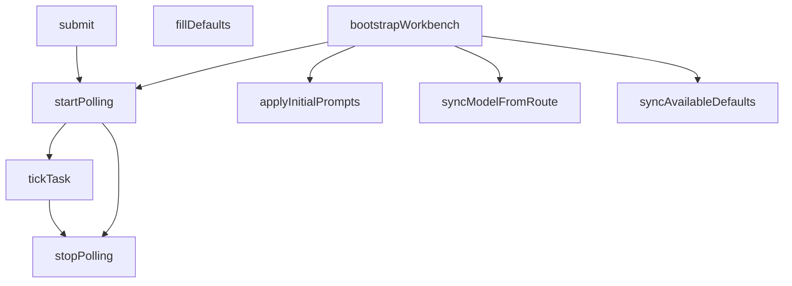

#### `stopPolling`

- 所在位置：`web-console/src/views/GenerateView.vue:90`
- 语言：`Vue/TypeScript`
- 函数签名：`stopPolling()`
- 函数用途：这是 Vue 视图/组件内部函数，用于支撑页面交互、派生状态或事件响应。
- 参数说明：无显式参数。
- 调用的项目内函数：未通过静态分析识别到明显的项目内直接函数调用，或主要依赖对象方法/框架回调。
- 其他可见调用：`clearInterval`

#### `tickTask`

- 所在位置：`web-console/src/views/GenerateView.vue:97`
- 语言：`Vue/TypeScript`
- 函数签名：`async tickTask(taskId: number)`
- 函数用途：这是 Vue 视图/组件内部函数，用于支撑页面交互、派生状态或事件响应。
- 参数说明：
  - `taskId`: TypeScript 参数，类型为 `number`。
- 调用的项目内函数：
  - `stopPolling -> web-console/src/views/GenerateView.vue:90`
- 其他可见调用：`refreshTask, success, error`

#### `startPolling`

- 所在位置：`web-console/src/views/GenerateView.vue:121`
- 语言：`Vue/TypeScript`
- 函数签名：`async startPolling(taskId: number)`
- 函数用途：负责启动一段流程或执行一次任务。
- 参数说明：
  - `taskId`: TypeScript 参数，类型为 `number`。
- 调用的项目内函数：
  - `stopPolling -> web-console/src/views/GenerateView.vue:90`
  - `tickTask -> web-console/src/views/GenerateView.vue:97`
- 其他可见调用：`setInterval`

#### `submit`

- 所在位置：`web-console/src/views/GenerateView.vue:129`
- 语言：`Vue/TypeScript`
- 函数签名：`async submit()`
- 函数用途：这是 Vue 视图/组件内部函数，用于支撑页面交互、派生状态或事件响应。
- 参数说明：无显式参数。
- 调用的项目内函数：
  - `startPolling -> web-console/src/views/GenerateView.vue:121`
- 其他可见调用：`submitGenerateJob, success, error`

#### `fillDefaults`

- 所在位置：`web-console/src/views/GenerateView.vue:140`
- 语言：`Vue/TypeScript`
- 函数签名：`fillDefaults(model: ModelRecord)`
- 函数用途：这是 Vue 视图/组件内部函数，用于支撑页面交互、派生状态或事件响应。
- 参数说明：
  - `model`: TypeScript 参数，类型为 `ModelRecord`。
- 调用的项目内函数：
  - `pickRecommendedGenerationPrompt -> web-console/src/views/generate-recommendations.ts:13`

#### `applyInitialPrompts`

- 所在位置：`web-console/src/views/GenerateView.vue:156`
- 语言：`Vue/TypeScript`
- 函数签名：`applyInitialPrompts(model: ModelRecord)`
- 函数用途：这是 Vue 视图/组件内部函数，用于支撑页面交互、派生状态或事件响应。
- 参数说明：
  - `model`: TypeScript 参数，类型为 `ModelRecord`。
- 调用的项目内函数：未通过静态分析识别到明显的项目内直接函数调用，或主要依赖对象方法/框架回调。

#### `syncModelFromRoute`

- 所在位置：`web-console/src/views/GenerateView.vue:171`
- 语言：`Vue/TypeScript`
- 函数签名：`syncModelFromRoute()`
- 函数用途：负责更新状态、字段或配置。
- 参数说明：无显式参数。
- 调用的项目内函数：未通过静态分析识别到明显的项目内直接函数调用，或主要依赖对象方法/框架回调。
- 其他可见调用：`some`

#### `syncAvailableDefaults`

- 所在位置：`web-console/src/views/GenerateView.vue:178`
- 语言：`Vue/TypeScript`
- 函数签名：`syncAvailableDefaults()`
- 函数用途：负责更新状态、字段或配置。
- 参数说明：无显式参数。
- 调用的项目内函数：未通过静态分析识别到明显的项目内直接函数调用，或主要依赖对象方法/框架回调。
- 其他可见调用：`some`

#### `bootstrapWorkbench`

- 所在位置：`web-console/src/views/GenerateView.vue:221`
- 语言：`Vue/TypeScript`
- 函数签名：`async bootstrapWorkbench()`
- 函数用途：负责启动一段流程或执行一次任务。
- 参数说明：无显式参数。
- 调用的项目内函数：
  - `syncAvailableDefaults -> web-console/src/views/GenerateView.vue:178`
  - `syncModelFromRoute -> web-console/src/views/GenerateView.vue:171`
  - `applyInitialPrompts -> web-console/src/views/GenerateView.vue:156`
  - `startPolling -> web-console/src/views/GenerateView.vue:121`
- 其他可见调用：`fetchModels`


### `web-console/src/views/HistoryView.vue`

#### 调用关系图

这张图展示当前文件内函数之间可直接识别的调用关系。

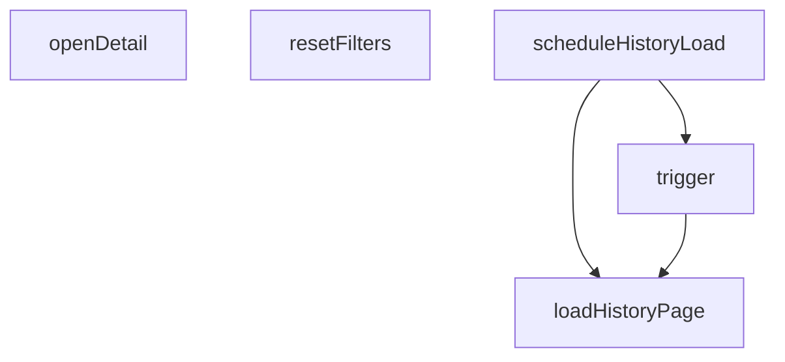

#### `openDetail`

- 所在位置：`web-console/src/views/HistoryView.vue:24`
- 语言：`Vue/TypeScript`
- 函数签名：`async openDetail(item: AssetHistoryItem)`
- 函数用途：这是 Vue 视图/组件内部函数，用于支撑页面交互、派生状态或事件响应。
- 参数说明：
  - `item`: TypeScript 参数，类型为 `AssetHistoryItem`。
- 调用的项目内函数：未通过静态分析识别到明显的项目内直接函数调用，或主要依赖对象方法/框架回调。
- 其他可见调用：`all, fetchAssetDetail, fetchTaskAudit`

#### `resetFilters`

- 所在位置：`web-console/src/views/HistoryView.vue:30`
- 语言：`Vue/TypeScript`
- 函数签名：`resetFilters()`
- 函数用途：这是 Vue 视图/组件内部函数，用于支撑页面交互、派生状态或事件响应。
- 参数说明：无显式参数。
- 调用的项目内函数：未通过静态分析识别到明显的项目内直接函数调用，或主要依赖对象方法/框架回调。

#### `loadHistoryPage`

- 所在位置：`web-console/src/views/HistoryView.vue:39`
- 语言：`Vue/TypeScript`
- 函数签名：`async loadHistoryPage(page = 1, pageSize = platformStore.historyPageSize)`
- 函数用途：负责解析输入或加载外部资源。
- 参数说明：
  - `page = 1`: 输入参数。
  - `pageSize = platformStore.historyPageSize`: 输入参数。
- 调用的项目内函数：未通过静态分析识别到明显的项目内直接函数调用，或主要依赖对象方法/框架回调。
- 其他可见调用：`fetchHistoryPage, trim`

#### `scheduleHistoryLoad`

- 所在位置：`web-console/src/views/HistoryView.vue:60`
- 语言：`Vue/TypeScript`
- 函数签名：`scheduleHistoryLoad(page = 1, pageSize = platformStore.historyPageSize, immediate = false)`
- 函数用途：这是 Vue 视图/组件内部函数，用于支撑页面交互、派生状态或事件响应。
- 参数说明：
  - `page = 1`: 输入参数。
  - `pageSize = platformStore.historyPageSize`: 输入参数。
  - `immediate = false`: 输入参数。
- 调用的项目内函数：
  - `loadHistoryPage -> web-console/src/views/HistoryView.vue:39`
  - `trigger -> web-console/src/views/HistoryView.vue:66`
- 其他可见调用：`clearTimeout, setTimeout`

#### `trigger`

- 所在位置：`web-console/src/views/HistoryView.vue:66`
- 语言：`Vue/TypeScript`
- 函数签名：`trigger()`
- 函数用途：这是 Vue 视图/组件内部函数，用于支撑页面交互、派生状态或事件响应。
- 参数说明：无显式参数。
- 调用的项目内函数：
  - `loadHistoryPage -> web-console/src/views/HistoryView.vue:39`


### `web-console/src/views/LoginView.vue`

#### `submit`

- 所在位置：`web-console/src/views/LoginView.vue:35`
- 语言：`Vue/TypeScript`
- 函数签名：`async submit()`
- 函数用途：这是 Vue 视图/组件内部函数，用于支撑页面交互、派生状态或事件响应。
- 参数说明：无显式参数。
- 调用的项目内函数：未通过静态分析识别到明显的项目内直接函数调用，或主要依赖对象方法/框架回调。
- 其他可见调用：`post, setSession, success, push, error`


### `web-console/src/views/ModelCenterView.vue`

#### `jumpToGenerate`

- 所在位置：`web-console/src/views/ModelCenterView.vue:14`
- 语言：`Vue/TypeScript`
- 函数签名：`jumpToGenerate(modelName: string)`
- 函数用途：这是 Vue 视图/组件内部函数，用于支撑页面交互、派生状态或事件响应。
- 参数说明：
  - `modelName`: TypeScript 参数，类型为 `string`。
- 调用的项目内函数：未通过静态分析识别到明显的项目内直接函数调用，或主要依赖对象方法/框架回调。
- 其他可见调用：`push`

#### `loadModelPage`

- 所在位置：`web-console/src/views/ModelCenterView.vue:20`
- 语言：`Vue/TypeScript`
- 函数签名：`async loadModelPage()`
- 函数用途：负责解析输入或加载外部资源。
- 参数说明：无显式参数。
- 调用的项目内函数：未通过静态分析识别到明显的项目内直接函数调用，或主要依赖对象方法/框架回调。
- 其他可见调用：`fetchModels`


### `web-console/src/views/TaskAuditView.vue`

#### `bootstrapAuditContext`

- 所在位置：`web-console/src/views/TaskAuditView.vue:37`
- 语言：`Vue/TypeScript`
- 函数签名：`async bootstrapAuditContext()`
- 函数用途：负责启动一段流程或执行一次任务。
- 参数说明：无显式参数。
- 调用的项目内函数：未通过静态分析识别到明显的项目内直接函数调用，或主要依赖对象方法/框架回调。
- 其他可见调用：`all, fetchTasks, fetchHistory`

#### `loadTaskAuditPage`

- 所在位置：`web-console/src/views/TaskAuditView.vue:59`
- 语言：`Vue/TypeScript`
- 函数签名：`async loadTaskAuditPage(targetTaskId: number)`
- 函数用途：负责解析输入或加载外部资源。
- 参数说明：
  - `targetTaskId`: TypeScript 参数，类型为 `number`。
- 调用的项目内函数：未通过静态分析识别到明显的项目内直接函数调用，或主要依赖对象方法/框架回调。
- 其他可见调用：`refreshTask, fetchHistory`


### `web-console/src/views/generate-recommendations.ts`

#### `pickRecommendedGenerationPrompt`

- 所在位置：`web-console/src/views/generate-recommendations.ts:13`
- 语言：`TypeScript`
- 函数签名：`pickRecommendedGenerationPrompt(randomValue = Math.random()`
- 函数用途：源码中没有显式注释，这里根据函数命名和上下文推断其职责。
- 参数说明：
  - `randomValue = Math.random(`: 输入参数。
- 调用的项目内函数：未通过静态分析识别到明显的项目内直接函数调用，或主要依赖对象方法/框架回调。
- 其他可见调用：`isFinite, min, max, random, floor`


### `web-console/src/views/task-audit-utils.ts`

#### 调用关系图

这张图展示当前文件内函数之间可直接识别的调用关系。

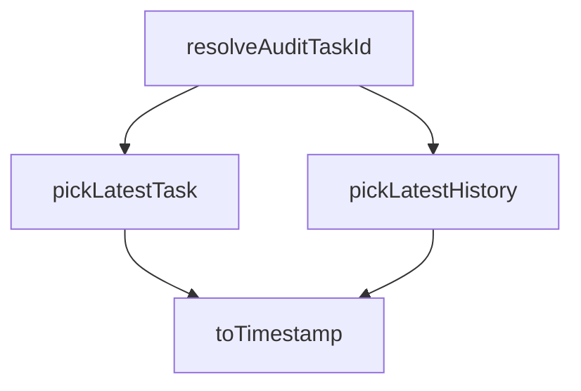

#### `toTimestamp`

- 所在位置：`web-console/src/views/task-audit-utils.ts:9`
- 语言：`TypeScript`
- 函数签名：`toTimestamp(value: string)`
- 函数用途：源码中没有显式注释，这里根据函数命名和上下文推断其职责。
- 参数说明：
  - `value`: TypeScript 参数，类型为 `string`。
- 调用的项目内函数：未通过静态分析识别到明显的项目内直接函数调用，或主要依赖对象方法/框架回调。
- 其他可见调用：`parse, isFinite`

#### `pickLatestTask`

- 所在位置：`web-console/src/views/task-audit-utils.ts:14`
- 语言：`TypeScript`
- 函数签名：`pickLatestTask(tasks: GenerateTask[])`
- 函数用途：源码中没有显式注释，这里根据函数命名和上下文推断其职责。
- 参数说明：
  - `tasks`: TypeScript 参数，类型为 `GenerateTask[]`。
- 调用的项目内函数：
  - `toTimestamp -> web-console/src/views/task-audit-utils.ts:9`
- 其他可见调用：`sort`

#### `pickLatestHistory`

- 所在位置：`web-console/src/views/task-audit-utils.ts:25`
- 语言：`TypeScript`
- 函数签名：`pickLatestHistory(history: AssetHistoryItem[])`
- 函数用途：源码中没有显式注释，这里根据函数命名和上下文推断其职责。
- 参数说明：
  - `history`: TypeScript 参数，类型为 `AssetHistoryItem[]`。
- 调用的项目内函数：
  - `toTimestamp -> web-console/src/views/task-audit-utils.ts:9`
- 其他可见调用：`sort`

#### `resolveAuditTaskId`

- 所在位置：`web-console/src/views/task-audit-utils.ts:36`
- 语言：`TypeScript`
- 函数签名：`resolveAuditTaskId(input: ResolveAuditTaskIdInput)`
- 函数用途：源码中没有显式注释，这里根据函数命名和上下文推断其职责。
- 参数说明：
  - `input`: TypeScript 参数，类型为 `ResolveAuditTaskIdInput`。
- 调用的项目内函数：
  - `pickLatestTask -> web-console/src/views/task-audit-utils.ts:14`
  - `pickLatestHistory -> web-console/src/views/task-audit-utils.ts:25`
- 其他可见调用：`isArray`


## 3.2 Python AI 运行时

### 本模块文件级调用图索引

- `python-ai-service/app/dependencies.py`
- `python-ai-service/app/main.py`
- `python-ai-service/app/runtimes/runtime_registry.py`
- `python-ai-service/app/runtimes/scorers/aesthetic_runtime.py`
- `python-ai-service/app/runtimes/scorers/clip_iqa_runtime.py`
- `python-ai-service/app/runtimes/scorers/image_reward_runtime.py`
- `python-ai-service/app/runtimes/scorers/power_score_runtime.py`
- `python-ai-service/app/runtimes/sd15_runtime.py`
- `python-ai-service/app/runtimes/ssd1b_runtime.py`
- `python-ai-service/app/runtimes/unipic2_runtime.py`
- `python-ai-service/app/services/generation_service.py`
- `python-ai-service/app/services/scoring_service.py`
- `python-ai-service/app/workers/job_worker.py`

### `python-ai-service/app/clients/asset_client.py`

#### `AssetClient.__init__`

- 所在位置：`python-ai-service/app/clients/asset_client.py:7`
- 语言：`Python`
- 函数签名：`def __init__(self, base_url: str, session: httpx.Client | None = None) -> None`
- 函数用途：源码中没有显式注释，这里根据函数命名和上下文推断其职责。
- 参数说明：
  - `self`: 实例/类自身引用。
  - `base_url: str`: 输入参数，具体含义请结合函数上下文理解。
  - `session: httpx.Client | None`: 可选参数，默认值为 `None`。
- 调用的项目内函数：
  - `__init__ -> python-ai-service/app/clients/asset_client.py:7; python-ai-service/app/clients/audit_client.py:7; python-ai-service/app/clients/task_client.py:9`
- 其他可见调用：`rstrip, Client`

#### `AssetClient.save_results`

- 所在位置：`python-ai-service/app/clients/asset_client.py:11`
- 语言：`Python`
- 函数签名：`def save_results(self, job_id: int, results: list[dict]) -> None`
- 函数用途：源码中没有显式注释，这里根据函数命名和上下文推断其职责。
- 参数说明：
  - `self`: 实例/类自身引用。
  - `job_id: int`: 输入参数，具体含义请结合函数上下文理解。
  - `results: list[dict]`: 输入参数，具体含义请结合函数上下文理解。
- 调用的项目内函数：
  - `save_results -> python-ai-service/app/clients/asset_client.py:11`
- 其他可见调用：`post, raise_for_status`


### `python-ai-service/app/clients/audit_client.py`

#### `AuditClient.__init__`

- 所在位置：`python-ai-service/app/clients/audit_client.py:7`
- 语言：`Python`
- 函数签名：`def __init__(self, base_url: str, session: httpx.Client | None = None) -> None`
- 函数用途：源码中没有显式注释，这里根据函数命名和上下文推断其职责。
- 参数说明：
  - `self`: 实例/类自身引用。
  - `base_url: str`: 输入参数，具体含义请结合函数上下文理解。
  - `session: httpx.Client | None`: 可选参数，默认值为 `None`。
- 调用的项目内函数：
  - `__init__ -> python-ai-service/app/clients/asset_client.py:7; python-ai-service/app/clients/audit_client.py:7; python-ai-service/app/clients/task_client.py:9`
- 其他可见调用：`rstrip, Client`

#### `AuditClient.record_event`

- 所在位置：`python-ai-service/app/clients/audit_client.py:11`
- 语言：`Python`
- 函数签名：`def record_event(self, event_type: str, payload: dict) -> None`
- 函数用途：源码中没有显式注释，这里根据函数命名和上下文推断其职责。
- 参数说明：
  - `self`: 实例/类自身引用。
  - `event_type: str`: 输入参数，具体含义请结合函数上下文理解。
  - `payload: dict`: 输入参数，具体含义请结合函数上下文理解。
- 调用的项目内函数：
  - `record_event -> python-ai-service/app/clients/audit_client.py:11`
- 其他可见调用：`post, raise_for_status`


### `python-ai-service/app/clients/task_client.py`

#### `TaskClient.__init__`

- 所在位置：`python-ai-service/app/clients/task_client.py:9`
- 语言：`Python`
- 函数签名：`def __init__(self, base_url: str, session: httpx.Client | None = None) -> None`
- 函数用途：源码中没有显式注释，这里根据函数命名和上下文推断其职责。
- 参数说明：
  - `self`: 实例/类自身引用。
  - `base_url: str`: 输入参数，具体含义请结合函数上下文理解。
  - `session: httpx.Client | None`: 可选参数，默认值为 `None`。
- 调用的项目内函数：
  - `__init__ -> python-ai-service/app/clients/asset_client.py:7; python-ai-service/app/clients/audit_client.py:7; python-ai-service/app/clients/task_client.py:9`
- 其他可见调用：`rstrip, Client`

#### `TaskClient.update_status`

- 所在位置：`python-ai-service/app/clients/task_client.py:13`
- 语言：`Python`
- 函数签名：`def update_status(self, job_id: int, status: str, stage: str, error_message: str | None = None) -> None`
- 函数用途：负责更新状态、字段或配置。
- 参数说明：
  - `self`: 实例/类自身引用。
  - `job_id: int`: 输入参数，具体含义请结合函数上下文理解。
  - `status: str`: 输入参数，具体含义请结合函数上下文理解。
  - `stage: str`: 输入参数，具体含义请结合函数上下文理解。
  - `error_message: str | None`: 可选参数，默认值为 `None`。
- 调用的项目内函数：
  - `update_status -> python-ai-service/app/clients/task_client.py:13`
- 其他可见调用：`post, raise_for_status`


### `python-ai-service/app/core/runtime_logging.py`

#### `configure_runtime_logging`

- 所在位置：`python-ai-service/app/core/runtime_logging.py:8`
- 语言：`Python`
- 函数签名：`def configure_runtime_logging(level: int = logging.INFO) -> None`
- 函数用途：源码中没有显式注释，这里根据函数命名和上下文推断其职责。
- 参数说明：
  - `level: int`: 可选参数，默认值为 `logging.INFO`。
- 调用的项目内函数：
  - `configure_runtime_logging -> python-ai-service/app/core/runtime_logging.py:8`
- 其他可见调用：`getLogger, basicConfig, setLevel`


### `python-ai-service/app/core/runtime_paths.py`

#### `RuntimePaths.__post_init__`

- 所在位置：`python-ai-service/app/core/runtime_paths.py:11`
- 语言：`Python`
- 函数签名：`def __post_init__(self) -> None`
- 函数用途：源码中没有显式注释，这里根据函数命名和上下文推断其职责。
- 参数说明：
  - `self`: 实例/类自身引用。
- 调用的项目内函数：
  - `__post_init__ -> python-ai-service/app/core/runtime_paths.py:11`
- 其他可见调用：`Path`

#### `RuntimePaths.hf_home`

- 所在位置：`python-ai-service/app/core/runtime_paths.py:15`
- 语言：`Python`
- 函数签名：`def hf_home(self) -> Path`
- 函数用途：源码中没有显式注释，这里根据函数命名和上下文推断其职责。
- 修饰信息：`property`
- 参数说明：
  - `self`: 实例/类自身引用。
- 调用的项目内函数：
  - `hf_home -> python-ai-service/app/core/runtime_paths.py:15; python-ai-service/app/core/settings.py:107`

#### `RuntimePaths.models_generation`

- 所在位置：`python-ai-service/app/core/runtime_paths.py:19`
- 语言：`Python`
- 函数签名：`def models_generation(self) -> Path`
- 函数用途：源码中没有显式注释，这里根据函数命名和上下文推断其职责。
- 修饰信息：`property`
- 参数说明：
  - `self`: 实例/类自身引用。
- 调用的项目内函数：
  - `models_generation -> python-ai-service/app/core/runtime_paths.py:19`

#### `RuntimePaths.models_scoring`

- 所在位置：`python-ai-service/app/core/runtime_paths.py:23`
- 语言：`Python`
- 函数签名：`def models_scoring(self) -> Path`
- 函数用途：源码中没有显式注释，这里根据函数命名和上下文推断其职责。
- 修饰信息：`property`
- 参数说明：
  - `self`: 实例/类自身引用。
- 调用的项目内函数：
  - `models_scoring -> python-ai-service/app/core/runtime_paths.py:23`

#### `RuntimePaths.outputs_images`

- 所在位置：`python-ai-service/app/core/runtime_paths.py:27`
- 语言：`Python`
- 函数签名：`def outputs_images(self) -> Path`
- 函数用途：源码中没有显式注释，这里根据函数命名和上下文推断其职责。
- 修饰信息：`property`
- 参数说明：
  - `self`: 实例/类自身引用。
- 调用的项目内函数：
  - `outputs_images -> python-ai-service/app/core/runtime_paths.py:27`

#### `RuntimePaths.outputs_image_checks`

- 所在位置：`python-ai-service/app/core/runtime_paths.py:31`
- 语言：`Python`
- 函数签名：`def outputs_image_checks(self) -> Path`
- 函数用途：源码中没有显式注释，这里根据函数命名和上下文推断其职责。
- 修饰信息：`property`
- 参数说明：
  - `self`: 实例/类自身引用。
- 调用的项目内函数：
  - `outputs_image_checks -> python-ai-service/app/core/runtime_paths.py:31`

#### `RuntimePaths.logs`

- 所在位置：`python-ai-service/app/core/runtime_paths.py:35`
- 语言：`Python`
- 函数签名：`def logs(self) -> Path`
- 函数用途：源码中没有显式注释，这里根据函数命名和上下文推断其职责。
- 修饰信息：`property`
- 参数说明：
  - `self`: 实例/类自身引用。
- 调用的项目内函数：
  - `logs -> python-ai-service/app/core/runtime_paths.py:35`

#### `RuntimePaths.tmp`

- 所在位置：`python-ai-service/app/core/runtime_paths.py:39`
- 语言：`Python`
- 函数签名：`def tmp(self) -> Path`
- 函数用途：源码中没有显式注释，这里根据函数命名和上下文推断其职责。
- 修饰信息：`property`
- 参数说明：
  - `self`: 实例/类自身引用。
- 调用的项目内函数：
  - `tmp -> python-ai-service/app/core/runtime_paths.py:39`

#### `RuntimePaths.directory_map`

- 所在位置：`python-ai-service/app/core/runtime_paths.py:42`
- 语言：`Python`
- 函数签名：`def directory_map(self) -> dict[str, Path]`
- 函数用途：源码中没有显式注释，这里根据函数命名和上下文推断其职责。
- 参数说明：
  - `self`: 实例/类自身引用。
- 调用的项目内函数：
  - `directory_map -> python-ai-service/app/core/runtime_paths.py:42`

#### `RuntimePaths.ensure_directories`

- 所在位置：`python-ai-service/app/core/runtime_paths.py:53`
- 语言：`Python`
- 函数签名：`def ensure_directories(self) -> None`
- 函数用途：源码中没有显式注释，这里根据函数命名和上下文推断其职责。
- 参数说明：
  - `self`: 实例/类自身引用。
- 调用的项目内函数：
  - `ensure_directories -> python-ai-service/app/core/runtime_paths.py:53; python-ai-service/training/common/paths.py:28`
  - `directory_map -> python-ai-service/app/core/runtime_paths.py:42`
- 其他可见调用：`values, mkdir`

#### `RuntimePaths.build_probe_report`

- 所在位置：`python-ai-service/app/core/runtime_paths.py:57`
- 语言：`Python`
- 函数签名：`def build_probe_report(self) -> dict[str, object]`
- 函数用途：负责构建并返回一个新的对象、实例或配置结果。
- 参数说明：
  - `self`: 实例/类自身引用。
- 调用的项目内函数：
  - `build_probe_report -> python-ai-service/app/core/runtime_paths.py:57`
  - `directory_map -> python-ai-service/app/core/runtime_paths.py:42`
- 其他可见调用：`str, exists, items`


### `python-ai-service/app/core/settings.py`

#### `_project_root`

- 所在位置：`python-ai-service/app/core/settings.py:11`
- 语言：`Python`
- 函数签名：`def _project_root() -> Path`
- 函数用途：源码中没有显式注释，这里根据函数命名和上下文推断其职责。
- 参数说明：无显式参数。
- 调用的项目内函数：
  - `_project_root -> python-ai-service/app/core/settings.py:11`
- 其他可见调用：`Path, resolve`

#### `_load_local_env_files`

- 所在位置：`python-ai-service/app/core/settings.py:19`
- 语言：`Python`
- 函数签名：`def _load_local_env_files() -> None`
- 函数用途：源码中没有显式注释，这里根据函数命名和上下文推断其职责。
- 参数说明：无显式参数。
- 调用的项目内函数：
  - `_load_local_env_files -> python-ai-service/app/core/settings.py:19`
  - `_dotenv_candidates -> python-ai-service/app/core/settings.py:26`
  - `_parse_env_file -> python-ai-service/app/core/settings.py:42`
  - `getenv -> services/gateway-service/cmd/server/main.go:36; services/platform-common/pkg/config/config.go:40`
- 其他可见调用：`items`

#### `_dotenv_candidates`

- 所在位置：`python-ai-service/app/core/settings.py:26`
- 语言：`Python`
- 函数签名：`def _dotenv_candidates() -> list[Path]`
- 函数用途：源码中没有显式注释，这里根据函数命名和上下文推断其职责。
- 参数说明：无显式参数。
- 调用的项目内函数：
  - `_dotenv_candidates -> python-ai-service/app/core/settings.py:26`
- 其他可见调用：`cwd, set, is_file, add`

#### `_parse_env_file`

- 所在位置：`python-ai-service/app/core/settings.py:42`
- 语言：`Python`
- 函数签名：`def _parse_env_file(path: Path) -> dict[str, str]`
- 函数用途：源码中没有显式注释，这里根据函数命名和上下文推断其职责。
- 参数说明：
  - `path: Path`: 输入参数，具体含义请结合函数上下文理解。
- 调用的项目内函数：
  - `_parse_env_file -> python-ai-service/app/core/settings.py:42`
- 其他可见调用：`read_text, splitlines, strip, startswith, split`

#### `_read_path_env`

- 所在位置：`python-ai-service/app/core/settings.py:55`
- 语言：`Python`
- 函数签名：`def _read_path_env(name: str, fallback: Path) -> Path`
- 函数用途：源码中没有显式注释，这里根据函数命名和上下文推断其职责。
- 参数说明：
  - `name: str`: 输入参数，具体含义请结合函数上下文理解。
  - `fallback: Path`: 输入参数，具体含义请结合函数上下文理解。
- 调用的项目内函数：
  - `_read_path_env -> python-ai-service/app/core/settings.py:55`
  - `getenv -> services/gateway-service/cmd/server/main.go:36; services/platform-common/pkg/config/config.go:40`
- 其他可见调用：`Path`

#### `_read_bool_env`

- 所在位置：`python-ai-service/app/core/settings.py:60`
- 语言：`Python`
- 函数签名：`def _read_bool_env(name: str, fallback: bool) -> bool`
- 函数用途：源码中没有显式注释，这里根据函数命名和上下文推断其职责。
- 参数说明：
  - `name: str`: 输入参数，具体含义请结合函数上下文理解。
  - `fallback: bool`: 输入参数，具体含义请结合函数上下文理解。
- 调用的项目内函数：
  - `_read_bool_env -> python-ai-service/app/core/settings.py:60`
  - `getenv -> services/gateway-service/cmd/server/main.go:36; services/platform-common/pkg/config/config.go:40`
- 其他可见调用：`strip, lower`

#### `_read_choice_env`

- 所在位置：`python-ai-service/app/core/settings.py:67`
- 语言：`Python`
- 函数签名：`def _read_choice_env(name: str, fallback: str, allowed: set[str]) -> str`
- 函数用途：源码中没有显式注释，这里根据函数命名和上下文推断其职责。
- 参数说明：
  - `name: str`: 输入参数，具体含义请结合函数上下文理解。
  - `fallback: str`: 输入参数，具体含义请结合函数上下文理解。
  - `allowed: set[str]`: 输入参数，具体含义请结合函数上下文理解。
- 调用的项目内函数：
  - `_read_choice_env -> python-ai-service/app/core/settings.py:67`
  - `getenv -> services/gateway-service/cmd/server/main.go:36; services/platform-common/pkg/config/config.go:40`
- 其他可见调用：`strip, lower`

#### `Settings.from_env`

- 所在位置：`python-ai-service/app/core/settings.py:88`
- 语言：`Python`
- 函数签名：`def from_env(cls) -> 'Settings'`
- 函数用途：源码中没有显式注释，这里根据函数命名和上下文推断其职责。
- 修饰信息：`classmethod`
- 参数说明：
  - `cls`: 实例/类自身引用。
- 调用的项目内函数：
  - `from_env -> python-ai-service/app/core/settings.py:88`
  - `_load_local_env_files -> python-ai-service/app/core/settings.py:19`
  - `_read_path_env -> python-ai-service/app/core/settings.py:55`
  - `getenv -> services/gateway-service/cmd/server/main.go:36; services/platform-common/pkg/config/config.go:40`
  - `_read_choice_env -> python-ai-service/app/core/settings.py:67`
  - `_read_bool_env -> python-ai-service/app/core/settings.py:60`
- 其他可见调用：`cls`

#### `Settings.hf_home`

- 所在位置：`python-ai-service/app/core/settings.py:107`
- 语言：`Python`
- 函数签名：`def hf_home(self) -> Path`
- 函数用途：源码中没有显式注释，这里根据函数命名和上下文推断其职责。
- 修饰信息：`property`
- 参数说明：
  - `self`: 实例/类自身引用。
- 调用的项目内函数：
  - `hf_home -> python-ai-service/app/core/runtime_paths.py:15; python-ai-service/app/core/settings.py:107`

#### `Settings.generation_model_dir`

- 所在位置：`python-ai-service/app/core/settings.py:111`
- 语言：`Python`
- 函数签名：`def generation_model_dir(self) -> Path`
- 函数用途：源码中没有显式注释，这里根据函数命名和上下文推断其职责。
- 修饰信息：`property`
- 参数说明：
  - `self`: 实例/类自身引用。
- 调用的项目内函数：
  - `generation_model_dir -> python-ai-service/app/core/settings.py:111`

#### `Settings.scoring_model_dir`

- 所在位置：`python-ai-service/app/core/settings.py:115`
- 语言：`Python`
- 函数签名：`def scoring_model_dir(self) -> Path`
- 函数用途：源码中没有显式注释，这里根据函数命名和上下文推断其职责。
- 修饰信息：`property`
- 参数说明：
  - `self`: 实例/类自身引用。
- 调用的项目内函数：
  - `scoring_model_dir -> python-ai-service/app/core/settings.py:115`

#### `Settings.output_image_dir`

- 所在位置：`python-ai-service/app/core/settings.py:119`
- 语言：`Python`
- 函数签名：`def output_image_dir(self) -> Path`
- 函数用途：源码中没有显式注释，这里根据函数命名和上下文推断其职责。
- 修饰信息：`property`
- 参数说明：
  - `self`: 实例/类自身引用。
- 调用的项目内函数：
  - `output_image_dir -> python-ai-service/app/core/settings.py:119`

#### `Settings.output_image_check_dir`

- 所在位置：`python-ai-service/app/core/settings.py:123`
- 语言：`Python`
- 函数签名：`def output_image_check_dir(self) -> Path`
- 函数用途：源码中没有显式注释，这里根据函数命名和上下文推断其职责。
- 修饰信息：`property`
- 参数说明：
  - `self`: 实例/类自身引用。
- 调用的项目内函数：
  - `output_image_check_dir -> python-ai-service/app/core/settings.py:123`

#### `Settings.logs_dir`

- 所在位置：`python-ai-service/app/core/settings.py:127`
- 语言：`Python`
- 函数签名：`def logs_dir(self) -> Path`
- 函数用途：源码中没有显式注释，这里根据函数命名和上下文推断其职责。
- 修饰信息：`property`
- 参数说明：
  - `self`: 实例/类自身引用。
- 调用的项目内函数：
  - `logs_dir -> python-ai-service/app/core/settings.py:127`

#### `Settings.tmp_dir`

- 所在位置：`python-ai-service/app/core/settings.py:131`
- 语言：`Python`
- 函数签名：`def tmp_dir(self) -> Path`
- 函数用途：源码中没有显式注释，这里根据函数命名和上下文推断其职责。
- 修饰信息：`property`
- 参数说明：
  - `self`: 实例/类自身引用。
- 调用的项目内函数：
  - `tmp_dir -> python-ai-service/app/core/settings.py:131`

#### `get_settings`

- 所在位置：`python-ai-service/app/core/settings.py:136`
- 语言：`Python`
- 函数签名：`def get_settings() -> Settings`
- 函数用途：缓存 settings，避免一次任务内反复解析环境变量。
- 修饰信息：`lru_cache(maxsize=1)`
- 参数说明：无显式参数。
- 调用的项目内函数：
  - `get_settings -> python-ai-service/app/core/settings.py:136`
  - `from_env -> python-ai-service/app/core/settings.py:88`


### `python-ai-service/app/core/torch_cuda.py`

#### `seed_global_torch`

- 所在位置：`python-ai-service/app/core/torch_cuda.py:9`
- 语言：`Python`
- 函数签名：`def seed_global_torch(seed: int) -> None`
- 函数用途：同时设置 CPU 与 CUDA 默认随机数生成器的种子。
- 参数说明：
  - `seed: int`: 输入参数，具体含义请结合函数上下文理解。
- 调用的项目内函数：
  - `seed_global_torch -> python-ai-service/app/core/torch_cuda.py:9`
- 其他可见调用：`manual_seed, is_available, hasattr, manual_seed_all`

#### `is_mps_available`

- 所在位置：`python-ai-service/app/core/torch_cuda.py:18`
- 语言：`Python`
- 函数签名：`def is_mps_available() -> bool`
- 函数用途：返回当前 PyTorch 是否暴露可用的 MPS 设备。
- 参数说明：无显式参数。
- 调用的项目内函数：
  - `is_mps_available -> python-ai-service/app/core/torch_cuda.py:18`
- 其他可见调用：`getattr, bool, callable, is_available`

#### `preferred_torch_device_type`

- 所在位置：`python-ai-service/app/core/torch_cuda.py:31`
- 语言：`Python`
- 函数签名：`def preferred_torch_device_type() -> str`
- 函数用途：统一返回当前首选 torch 设备类型。
- 参数说明：无显式参数。
- 调用的项目内函数：
  - `preferred_torch_device_type -> python-ai-service/app/core/torch_cuda.py:31`
  - `is_mps_available -> python-ai-service/app/core/torch_cuda.py:18`
- 其他可见调用：`is_available`

#### `best_effort_cleanup_torch`

- 所在位置：`python-ai-service/app/core/torch_cuda.py:45`
- 语言：`Python`
- 函数签名：`def best_effort_cleanup_torch(logger: logging.Logger | None = None, label: str = 'runtime') -> None`
- 函数用途：尽力执行当前设备对应的缓存回收，避免任务结束后残留显存。
- 参数说明：
  - `logger: logging.Logger | None`: 可选参数，默认值为 `None`。
  - `label: str`: 可选参数，默认值为 `'runtime'`。
- 调用的项目内函数：
  - `best_effort_cleanup_torch -> python-ai-service/app/core/torch_cuda.py:45`
  - `is_mps_available -> python-ai-service/app/core/torch_cuda.py:18`
- 其他可见调用：`collect, is_available, getattr, callable, step, warning, empty_cache`

#### `best_effort_cleanup_cuda`

- 所在位置：`python-ai-service/app/core/torch_cuda.py:77`
- 语言：`Python`
- 函数签名：`def best_effort_cleanup_cuda(logger: logging.Logger | None = None, label: str = 'runtime') -> None`
- 函数用途：兼容旧调用点，实际复用通用 torch 清理逻辑。
- 参数说明：
  - `logger: logging.Logger | None`: 可选参数，默认值为 `None`。
  - `label: str`: 可选参数，默认值为 `'runtime'`。
- 调用的项目内函数：
  - `best_effort_cleanup_cuda -> python-ai-service/app/core/torch_cuda.py:77`
  - `best_effort_cleanup_torch -> python-ai-service/app/core/torch_cuda.py:45`


### `python-ai-service/app/dependencies.py`

#### 调用关系图

这张图展示当前文件内函数之间可直接识别的调用关系。

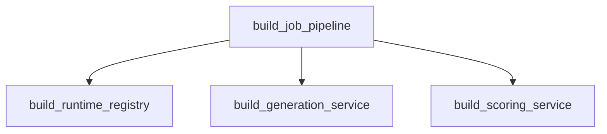

#### `build_runtime_registry`

- 所在位置：`python-ai-service/app/dependencies.py:19`
- 语言：`Python`
- 函数签名：`def build_runtime_registry(settings: Settings | None = None) -> RuntimeRegistry`
- 函数用途：创建运行时注册中心，统一管理生成模型实例的获取与释放。
- 参数说明：
  - `settings: Settings | None`: 可选参数，默认值为 `None`。
- 调用的项目内函数：
  - `build_runtime_registry -> python-ai-service/app/dependencies.py:19`
  - `get_settings -> python-ai-service/app/core/settings.py:136`
- 其他可见调用：`RuntimeRegistry`

#### `build_generation_service`

- 所在位置：`python-ai-service/app/dependencies.py:24`
- 语言：`Python`
- 函数签名：`def build_generation_service() -> GenerationService`
- 函数用途：生成服务本身无状态，因此可以直接轻量实例化。
- 参数说明：无显式参数。
- 调用的项目内函数：
  - `build_generation_service -> python-ai-service/app/dependencies.py:24`
- 其他可见调用：`GenerationService`

#### `build_scoring_service`

- 所在位置：`python-ai-service/app/dependencies.py:29`
- 语言：`Python`
- 函数签名：`def build_scoring_service(settings: Settings | None = None, release_after_batch: bool | None = None) -> ScoringService`
- 函数用途：评分服务默认接入真实评分运行时，并复用同一个 CLIP-IQA 实例降低显存占用。
- 参数说明：
  - `settings: Settings | None`: 可选参数，默认值为 `None`。
  - `release_after_batch: bool | None`: 可选参数，默认值为 `None`。
- 调用的项目内函数：
  - `build_scoring_service -> python-ai-service/app/dependencies.py:29`
  - `get_settings -> python-ai-service/app/core/settings.py:136`
- 其他可见调用：`ScoringService, ImageRewardRuntime, AestheticRuntime, ClipIQARuntime, PowerScoreRouter, PowerScoreRuntime`

#### `build_job_pipeline`

- 所在位置：`python-ai-service/app/dependencies.py:54`
- 语言：`Python`
- 函数签名：`def build_job_pipeline(settings: Settings | None = None, runtime_registry: RuntimeRegistry | None = None, generation_service: GenerationService | None = None, scoring_service: ScoringService | None = None) -> JobPipeline`
- 函数用途：把任务服务、资产服务、审计服务和本地模型链路组装成一条完整执行流水线。
- 参数说明：
  - `settings: Settings | None`: 可选参数，默认值为 `None`。
  - `runtime_registry: RuntimeRegistry | None`: 可选参数，默认值为 `None`。
  - `generation_service: GenerationService | None`: 可选参数，默认值为 `None`。
  - `scoring_service: ScoringService | None`: 可选参数，默认值为 `None`。
- 调用的项目内函数：
  - `build_job_pipeline -> python-ai-service/app/dependencies.py:54`
  - `get_settings -> python-ai-service/app/core/settings.py:136`
  - `build_runtime_registry -> python-ai-service/app/dependencies.py:19`
  - `build_generation_service -> python-ai-service/app/dependencies.py:24`
  - `build_scoring_service -> python-ai-service/app/dependencies.py:29`
- 其他可见调用：`JobPipeline, TaskClient, AssetClient, AuditClient`


### `python-ai-service/app/main.py`

#### 调用关系图

这张图展示当前文件内函数之间可直接识别的调用关系。

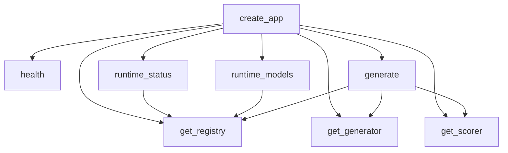

#### `create_app`

- 所在位置：`python-ai-service/app/main.py:11`
- 语言：`Python`
- 函数签名：`def create_app(runtime_registry = None, generation_service = None, scoring_service = None) -> FastAPI`
- 函数用途：Create the app while lazily constructing heavyweight runtime dependencies.
- 参数说明：
  - `runtime_registry`: 可选参数，默认值为 `None`。
  - `generation_service`: 可选参数，默认值为 `None`。
  - `scoring_service`: 可选参数，默认值为 `None`。
- 调用的项目内函数：
  - `create_app -> python-ai-service/app/main.py:11`
  - `get_registry -> python-ai-service/app/main.py:17`
  - `build_runtime_registry -> python-ai-service/app/dependencies.py:19`
  - `get_generator -> python-ai-service/app/main.py:23`
  - `build_generation_service -> python-ai-service/app/dependencies.py:24`
  - `get_scorer -> python-ai-service/app/main.py:29`
  - `build_scoring_service -> python-ai-service/app/dependencies.py:29`
  - `health -> python-ai-service/app/main.py:38`
  - `runtime_status -> python-ai-service/app/main.py:42`
  - `build_status -> python-ai-service/app/runtimes/runtime_registry.py:91`
  - `runtime_models -> python-ai-service/app/main.py:46`
  - `list_models -> python-ai-service/app/runtimes/runtime_registry.py:72`
- 其他可见调用：`FastAPI, get, post`

#### `get_registry`

- 所在位置：`python-ai-service/app/main.py:17`
- 语言：`Python`
- 函数签名：`def get_registry()`
- 函数用途：负责读取、查询或列举数据。
- 参数说明：无显式参数。
- 调用的项目内函数：
  - `get_registry -> python-ai-service/app/main.py:17`
  - `build_runtime_registry -> python-ai-service/app/dependencies.py:19`

#### `get_generator`

- 所在位置：`python-ai-service/app/main.py:23`
- 语言：`Python`
- 函数签名：`def get_generator()`
- 函数用途：负责读取、查询或列举数据。
- 参数说明：无显式参数。
- 调用的项目内函数：
  - `get_generator -> python-ai-service/app/main.py:23`
  - `build_generation_service -> python-ai-service/app/dependencies.py:24`

#### `get_scorer`

- 所在位置：`python-ai-service/app/main.py:29`
- 语言：`Python`
- 函数签名：`def get_scorer()`
- 函数用途：负责读取、查询或列举数据。
- 参数说明：无显式参数。
- 调用的项目内函数：
  - `get_scorer -> python-ai-service/app/main.py:29`
  - `build_scoring_service -> python-ai-service/app/dependencies.py:29`

#### `health`

- 所在位置：`python-ai-service/app/main.py:38`
- 语言：`Python`
- 函数签名：`def health() -> dict`
- 函数用途：源码中没有显式注释，这里根据函数命名和上下文推断其职责。
- 修饰信息：`app.get('/health')`
- 参数说明：无显式参数。
- 调用的项目内函数：
  - `health -> python-ai-service/app/main.py:38`

#### `runtime_status`

- 所在位置：`python-ai-service/app/main.py:42`
- 语言：`Python`
- 函数签名：`def runtime_status() -> dict`
- 函数用途：负责启动一段流程或执行一次任务。
- 修饰信息：`app.get('/runtime/status')`
- 参数说明：无显式参数。
- 调用的项目内函数：
  - `runtime_status -> python-ai-service/app/main.py:42`
  - `get_registry -> python-ai-service/app/main.py:17`
  - `build_status -> python-ai-service/app/runtimes/runtime_registry.py:91`

#### `runtime_models`

- 所在位置：`python-ai-service/app/main.py:46`
- 语言：`Python`
- 函数签名：`def runtime_models() -> dict`
- 函数用途：负责启动一段流程或执行一次任务。
- 修饰信息：`app.get('/runtime/models')`
- 参数说明：无显式参数。
- 调用的项目内函数：
  - `runtime_models -> python-ai-service/app/main.py:46`
  - `get_registry -> python-ai-service/app/main.py:17`
  - `list_models -> python-ai-service/app/runtimes/runtime_registry.py:72`

#### `generate`

- 所在位置：`python-ai-service/app/main.py:50`
- 语言：`Python`
- 函数签名：`def generate(request: GenerateJob) -> dict`
- 函数用途：源码中没有显式注释，这里根据函数命名和上下文推断其职责。
- 修饰信息：`app.post('/internal/generate')`
- 参数说明：
  - `request: GenerateJob`: 输入参数，具体含义请结合函数上下文理解。
- 调用的项目内函数：
  - `generate -> python-ai-service/app/main.py:50; python-ai-service/app/runtimes/sd15_runtime.py:59; python-ai-service/app/runtimes/ssd1b_runtime.py:51`
  - `get_registry -> python-ai-service/app/main.py:17`
  - `get_generation_runtime -> python-ai-service/app/runtimes/runtime_registry.py:43`
  - `get_generator -> python-ai-service/app/main.py:23`
  - `get_scorer -> python-ai-service/app/main.py:29`
  - `score_batch -> python-ai-service/app/services/scoring_service.py:64`


### `python-ai-service/app/runtimes/runtime_registry.py`

#### 调用关系图

这张图展示当前文件内函数之间可直接识别的调用关系。

```mermaid
flowchart TD
    n_python_ai_service_app_runtimes_runtime_registry_pyRuntimeRegistry___init__["RuntimeRegistry.__init__"]
    n_python_ai_service_app_runtimes_runtime_registry_pyRuntimeRegistry_get_generation_runtime["RuntimeRegistry.get_generation_runtime"]
    n_python_ai_service_app_runtimes_runtime_registry_pyRuntimeRegistry_release_generation_runtime["RuntimeRegistry.release_generation_runtime"]
    n_python_ai_service_app_runtimes_runtime_registry_pyRuntimeRegistry_list_models["RuntimeRegistry.list_models"]
    n_python_ai_service_app_runtimes_runtime_registry_pyRuntimeRegistry_build_status["RuntimeRegistry.build_status"]
    n_python_ai_service_app_runtimes_runtime_registry_pyRuntimeRegistry__build_sd15_runtime["RuntimeRegistry._build_sd15_runtime"]
    n_python_ai_service_app_runtimes_runtime_registry_pyRuntimeRegistry__build_sd15_specialized_runtime["RuntimeRegistry._build_sd15_specialized_runtime"]
    n_python_ai_service_app_runtimes_runtime_registry_pyRuntimeRegistry__build_ssd1b_runtime["RuntimeRegistry._build_ssd1b_runtime"]
    n_python_ai_service_app_runtimes_runtime_registry_pyRuntimeRegistry__build_unipic2_runtime["RuntimeRegistry._build_unipic2_runtime"]
    n_python_ai_service_app_runtimes_runtime_registry_pyRuntimeRegistry__release_generation_runtime["RuntimeRegistry._release_generation_runtime"]
    n_python_ai_service_app_runtimes_runtime_registry_pyRuntimeRegistry__package_available["RuntimeRegistry._package_available"]
    n_python_ai_service_app_runtimes_runtime_registry_pyRuntimeRegistry__detect_cuda["RuntimeRegistry._detect_cuda"]
    n_python_ai_service_app_runtimes_runtime_registry_pyRuntimeRegistry_get_generation_runtime --> n_python_ai_service_app_runtimes_runtime_registry_pyRuntimeRegistry__release_generation_runtime
    n_python_ai_service_app_runtimes_runtime_registry_pyRuntimeRegistry_release_generation_runtime --> n_python_ai_service_app_runtimes_runtime_registry_pyRuntimeRegistry__release_generation_runtime
    n_python_ai_service_app_runtimes_runtime_registry_pyRuntimeRegistry_build_status --> n_python_ai_service_app_runtimes_runtime_registry_pyRuntimeRegistry__package_available
    n_python_ai_service_app_runtimes_runtime_registry_pyRuntimeRegistry_build_status --> n_python_ai_service_app_runtimes_runtime_registry_pyRuntimeRegistry__detect_cuda
    n_python_ai_service_app_runtimes_runtime_registry_pyRuntimeRegistry_build_status --> n_python_ai_service_app_runtimes_runtime_registry_pyRuntimeRegistry_list_models
    n_python_ai_service_app_runtimes_runtime_registry_pyRuntimeRegistry__detect_cuda --> n_python_ai_service_app_runtimes_runtime_registry_pyRuntimeRegistry__package_available
```

#### `RuntimeRegistry.__init__`

- 所在位置：`python-ai-service/app/runtimes/runtime_registry.py:24`
- 语言：`Python`
- 函数签名：`def __init__(self, settings: Settings | None = None, manifest_provider: Callable[[Settings | None], dict[str, dict[str, Any]]] = get_model_manifest) -> None`
- 函数用途：初始化模型清单提供者、生成模型工厂和运行时缓存。
- 参数说明：
  - `self`: 实例/类自身引用。
  - `settings: Settings | None`: 可选参数，默认值为 `None`。
  - `manifest_provider: Callable[[Settings | None], dict[str, dict[str, Any]]]`: 可选参数，默认值为 `get_model_manifest`。
- 调用的项目内函数：
  - `__init__ -> python-ai-service/app/clients/asset_client.py:7; python-ai-service/app/clients/audit_client.py:7; python-ai-service/app/clients/task_client.py:9`
  - `get_settings -> python-ai-service/app/core/settings.py:136`

#### `RuntimeRegistry.get_generation_runtime`

- 所在位置：`python-ai-service/app/runtimes/runtime_registry.py:43`
- 语言：`Python`
- 函数签名：`def get_generation_runtime(self, model_name: str)`
- 函数用途：获取指定生成模型的运行时，并在必要时释放前一个活跃模型。
- 参数说明：
  - `self`: 实例/类自身引用。
  - `model_name: str`: 输入参数，具体含义请结合函数上下文理解。
- 调用的项目内函数：
  - `get_generation_runtime -> python-ai-service/app/runtimes/runtime_registry.py:43`
  - `_release_generation_runtime -> python-ai-service/app/runtimes/runtime_registry.py:136`
- 其他可见调用：`KeyError, info`

#### `RuntimeRegistry.release_generation_runtime`

- 所在位置：`python-ai-service/app/runtimes/runtime_registry.py:65`
- 语言：`Python`
- 函数签名：`def release_generation_runtime(self, model_name: str | None = None) -> None`
- 函数用途：释放指定模型或当前活跃模型占用的运行时资源。
- 参数说明：
  - `self`: 实例/类自身引用。
  - `model_name: str | None`: 可选参数，默认值为 `None`。
- 调用的项目内函数：
  - `release_generation_runtime -> python-ai-service/app/runtimes/runtime_registry.py:65`
  - `_release_generation_runtime -> python-ai-service/app/runtimes/runtime_registry.py:136`

#### `RuntimeRegistry.list_models`

- 所在位置：`python-ai-service/app/runtimes/runtime_registry.py:72`
- 语言：`Python`
- 函数签名：`def list_models(self) -> dict[str, list[dict[str, Any]]]`
- 函数用途：返回模型中心可直接展示的模型条目列表与本地可用状态。
- 参数说明：
  - `self`: 实例/类自身引用。
- 调用的项目内函数：
  - `list_models -> python-ai-service/app/runtimes/runtime_registry.py:72`
  - `_resolve_status -> python-ai-service/app/runtimes/runtime_registry.py:160`
- 其他可见调用：`_manifest_provider, items, Path, exists, any, iterdir, sort`

#### `RuntimeRegistry.build_status`

- 所在位置：`python-ai-service/app/runtimes/runtime_registry.py:91`
- 语言：`Python`
- 函数签名：`def build_status(self) -> dict[str, Any]`
- 函数用途：构建运行时探针报告，用于健康检查和模型中心状态页。
- 参数说明：
  - `self`: 实例/类自身引用。
- 调用的项目内函数：
  - `build_status -> python-ai-service/app/runtimes/runtime_registry.py:91`
  - `build_probe_report -> python-ai-service/app/core/runtime_paths.py:57`
  - `_package_available -> python-ai-service/app/runtimes/runtime_registry.py:147; python-ai-service/scripts/runtime_probe.py:20`
  - `_detect_cuda -> python-ai-service/app/runtimes/runtime_registry.py:151; python-ai-service/scripts/runtime_probe.py:24`
  - `list_models -> python-ai-service/app/runtimes/runtime_registry.py:72`
- 其他可见调用：`RuntimePaths, split`

#### `RuntimeRegistry._build_sd15_runtime`

- 所在位置：`python-ai-service/app/runtimes/runtime_registry.py:107`
- 语言：`Python`
- 函数签名：`def _build_sd15_runtime(self) -> SD15Runtime`
- 函数用途：构造 SD1.5 运行时实例。
- 参数说明：
  - `self`: 实例/类自身引用。
- 调用的项目内函数：
  - `_build_sd15_runtime -> python-ai-service/app/runtimes/runtime_registry.py:107`
- 其他可见调用：`SD15Runtime`

#### `RuntimeRegistry._build_sd15_specialized_runtime`

- 所在位置：`python-ai-service/app/runtimes/runtime_registry.py:114`
- 语言：`Python`
- 函数签名：`def _build_sd15_specialized_runtime(self) -> SD15Runtime`
- 函数用途：构造电力行业专用 SD1.5 运行时实例。
- 参数说明：
  - `self`: 实例/类自身引用。
- 调用的项目内函数：
  - `_build_sd15_specialized_runtime -> python-ai-service/app/runtimes/runtime_registry.py:114`
- 其他可见调用：`SD15Runtime`

#### `RuntimeRegistry._build_ssd1b_runtime`

- 所在位置：`python-ai-service/app/runtimes/runtime_registry.py:121`
- 语言：`Python`
- 函数签名：`def _build_ssd1b_runtime(self) -> SSD1BRuntime`
- 函数用途：构造 SSD-1B 运行时实例。
- 参数说明：
  - `self`: 实例/类自身引用。
- 调用的项目内函数：
  - `_build_ssd1b_runtime -> python-ai-service/app/runtimes/runtime_registry.py:121`
- 其他可见调用：`SSD1BRuntime`

#### `RuntimeRegistry._build_unipic2_runtime`

- 所在位置：`python-ai-service/app/runtimes/runtime_registry.py:128`
- 语言：`Python`
- 函数签名：`def _build_unipic2_runtime(self) -> UniPic2Runtime`
- 函数用途：构造 UniPic2 运行时实例，并注入当前 offload 配置。
- 参数说明：
  - `self`: 实例/类自身引用。
- 调用的项目内函数：
  - `_build_unipic2_runtime -> python-ai-service/app/runtimes/runtime_registry.py:128`
- 其他可见调用：`UniPic2Runtime`

#### `RuntimeRegistry._release_generation_runtime`

- 所在位置：`python-ai-service/app/runtimes/runtime_registry.py:136`
- 语言：`Python`
- 函数签名：`def _release_generation_runtime(self, model_name: str) -> None`
- 函数用途：源码中没有显式注释，这里根据函数命名和上下文推断其职责。
- 参数说明：
  - `self`: 实例/类自身引用。
  - `model_name: str`: 输入参数，具体含义请结合函数上下文理解。
- 调用的项目内函数：
  - `_release_generation_runtime -> python-ai-service/app/runtimes/runtime_registry.py:136`
  - `unload -> python-ai-service/app/runtimes/scorers/aesthetic_runtime.py:133; python-ai-service/app/runtimes/scorers/clip_iqa_runtime.py:99; python-ai-service/app/runtimes/scorers/image_reward_runtime.py:67`
- 其他可见调用：`pop, info, hasattr`

#### `RuntimeRegistry._package_available`

- 所在位置：`python-ai-service/app/runtimes/runtime_registry.py:147`
- 语言：`Python`
- 函数签名：`def _package_available(name: str) -> bool`
- 函数用途：检查某个 Python 包是否已安装，用于运行时探针展示。
- 修饰信息：`staticmethod`
- 参数说明：
  - `name: str`: 输入参数，具体含义请结合函数上下文理解。
- 调用的项目内函数：
  - `_package_available -> python-ai-service/app/runtimes/runtime_registry.py:147; python-ai-service/scripts/runtime_probe.py:20`
- 其他可见调用：`find_spec`

#### `RuntimeRegistry._detect_cuda`

- 所在位置：`python-ai-service/app/runtimes/runtime_registry.py:151`
- 语言：`Python`
- 函数签名：`def _detect_cuda(self) -> bool | None`
- 函数用途：探测当前 Python 环境是否真正具备可用 CUDA。
- 参数说明：
  - `self`: 实例/类自身引用。
- 调用的项目内函数：
  - `_detect_cuda -> python-ai-service/app/runtimes/runtime_registry.py:151; python-ai-service/scripts/runtime_probe.py:24`
  - `_package_available -> python-ai-service/app/runtimes/runtime_registry.py:147; python-ai-service/scripts/runtime_probe.py:20`
- 其他可见调用：`bool, is_available`

#### `RuntimeRegistry._resolve_status`

- 所在位置：`python-ai-service/app/runtimes/runtime_registry.py:160`
- 语言：`Python`
- 函数签名：`def _resolve_status(self, name: str, target: str, has_files: bool) -> str`
- 函数用途：根据本地目录内容和模型目标类型推导最终展示状态。
- 参数说明：
  - `self`: 实例/类自身引用。
  - `name: str`: 输入参数，具体含义请结合函数上下文理解。
  - `target: str`: 输入参数，具体含义请结合函数上下文理解。
  - `has_files: bool`: 输入参数，具体含义请结合函数上下文理解。
- 调用的项目内函数：
  - `_resolve_status -> python-ai-service/app/runtimes/runtime_registry.py:160`


### `python-ai-service/app/runtimes/scorers/aesthetic_runtime.py`

#### 调用关系图

这张图展示当前文件内函数之间可直接识别的调用关系。

```mermaid
flowchart TD
    n_python_ai_service_app_runtimes_scorers_aesthetic_runtime_py_extract_weight_filename["_extract_weight_filename"]
    n_python_ai_service_app_runtimes_scorers_aesthetic_runtime_pyAestheticPredictor___init__["AestheticPredictor.__init__"]
    n_python_ai_service_app_runtimes_scorers_aesthetic_runtime_pyAestheticPredictor_forward["AestheticPredictor.forward"]
    n_python_ai_service_app_runtimes_scorers_aesthetic_runtime_pyAestheticRuntime___init__["AestheticRuntime.__init__"]
    n_python_ai_service_app_runtimes_scorers_aesthetic_runtime_pyAestheticRuntime_normalize_score["AestheticRuntime.normalize_score"]
    n_python_ai_service_app_runtimes_scorers_aesthetic_runtime_pyAestheticRuntime__resolve_device["AestheticRuntime._resolve_device"]
    n_python_ai_service_app_runtimes_scorers_aesthetic_runtime_pyAestheticRuntime__resolve_weight_path["AestheticRuntime._resolve_weight_path"]
    n_python_ai_service_app_runtimes_scorers_aesthetic_runtime_pyAestheticRuntime__load_models["AestheticRuntime._load_models"]
    n_python_ai_service_app_runtimes_scorers_aesthetic_runtime_pyAestheticRuntime_score_image["AestheticRuntime.score_image"]
    n_python_ai_service_app_runtimes_scorers_aesthetic_runtime_pyAestheticRuntime_unload["AestheticRuntime.unload"]
    n_python_ai_service_app_runtimes_scorers_aesthetic_runtime_pyAestheticRuntime__resolve_weight_path --> n_python_ai_service_app_runtimes_scorers_aesthetic_runtime_py_extract_weight_filename
    n_python_ai_service_app_runtimes_scorers_aesthetic_runtime_pyAestheticRuntime__load_models --> n_python_ai_service_app_runtimes_scorers_aesthetic_runtime_pyAestheticRuntime__resolve_device
    n_python_ai_service_app_runtimes_scorers_aesthetic_runtime_pyAestheticRuntime__load_models --> n_python_ai_service_app_runtimes_scorers_aesthetic_runtime_pyAestheticRuntime__resolve_weight_path
    n_python_ai_service_app_runtimes_scorers_aesthetic_runtime_pyAestheticRuntime_score_image --> n_python_ai_service_app_runtimes_scorers_aesthetic_runtime_pyAestheticRuntime__load_models
    n_python_ai_service_app_runtimes_scorers_aesthetic_runtime_pyAestheticRuntime_score_image --> n_python_ai_service_app_runtimes_scorers_aesthetic_runtime_pyAestheticRuntime__resolve_device
    n_python_ai_service_app_runtimes_scorers_aesthetic_runtime_pyAestheticRuntime_score_image --> n_python_ai_service_app_runtimes_scorers_aesthetic_runtime_pyAestheticRuntime_normalize_score
```

#### `_extract_weight_filename`

- 所在位置：`python-ai-service/app/runtimes/scorers/aesthetic_runtime.py:21`
- 语言：`Python`
- 函数签名：`def _extract_weight_filename(path_like: str | Path) -> str`
- 函数用途：兼容 Windows 路径和普通路径，提取最终权重文件名。
- 参数说明：
  - `path_like: str | Path`: 输入参数，具体含义请结合函数上下文理解。
- 调用的项目内函数：
  - `_extract_weight_filename -> python-ai-service/app/runtimes/scorers/aesthetic_runtime.py:21`
- 其他可见调用：`str, PureWindowsPath, Path`

#### `AestheticPredictor.__init__`

- 所在位置：`python-ai-service/app/runtimes/scorers/aesthetic_runtime.py:30`
- 语言：`Python`
- 函数签名：`def __init__(self) -> None`
- 函数用途：构建多层感知机结构，用于回归单一美学分值。
- 参数说明：
  - `self`: 实例/类自身引用。
- 调用的项目内函数：
  - `__init__ -> python-ai-service/app/clients/asset_client.py:7; python-ai-service/app/clients/audit_client.py:7; python-ai-service/app/clients/task_client.py:9`
- 其他可见调用：`Linear`

#### `AestheticPredictor.forward`

- 所在位置：`python-ai-service/app/runtimes/scorers/aesthetic_runtime.py:38`
- 语言：`Python`
- 函数签名：`def forward(self, x)`
- 函数用途：执行前向传播，把 CLIP 特征映射为单维原始美学分。
- 参数说明：
  - `self`: 实例/类自身引用。
  - `x`: 输入参数，具体含义请结合函数上下文理解。
- 调用的项目内函数：
  - `forward -> python-ai-service/app/runtimes/scorers/aesthetic_runtime.py:38; python-ai-service/training/scoring/modeling.py:170`
- 其他可见调用：`relu, layer0, dropout, layer2, layer4, layer6`

#### `AestheticRuntime.__init__`

- 所在位置：`python-ai-service/app/runtimes/scorers/aesthetic_runtime.py:49`
- 语言：`Python`
- 函数签名：`def __init__(self, device: str | None = None, clip_model_id: str = 'openai/clip-vit-large-patch14', weight_path: Path | None = None) -> None`
- 函数用途：初始化设备、CLIP 模型标识和可选的权重路径。
- 参数说明：
  - `self`: 实例/类自身引用。
  - `device: str | None`: 可选参数，默认值为 `None`。
  - `clip_model_id: str`: 可选参数，默认值为 `'openai/clip-vit-large-patch14'`。
  - `weight_path: Path | None`: 可选参数，默认值为 `None`。
- 调用的项目内函数：
  - `__init__ -> python-ai-service/app/clients/asset_client.py:7; python-ai-service/app/clients/audit_client.py:7; python-ai-service/app/clients/task_client.py:9`
- 其他可见调用：`Path`

#### `AestheticRuntime.normalize_score`

- 所在位置：`python-ai-service/app/runtimes/scorers/aesthetic_runtime.py:64`
- 语言：`Python`
- 函数签名：`def normalize_score(self, raw_score: float) -> float`
- 函数用途：把原始美学回归分映射到 0-100，更贴近前端展示需求。
- 参数说明：
  - `self`: 实例/类自身引用。
  - `raw_score: float`: 输入参数，具体含义请结合函数上下文理解。
- 调用的项目内函数：
  - `normalize_score -> python-ai-service/app/runtimes/scorers/aesthetic_runtime.py:64; python-ai-service/app/runtimes/scorers/image_reward_runtime.py:27`
- 其他可见调用：`round, max, min`

#### `AestheticRuntime._resolve_device`

- 所在位置：`python-ai-service/app/runtimes/scorers/aesthetic_runtime.py:72`
- 语言：`Python`
- 函数签名：`def _resolve_device(self) -> str`
- 函数用途：自动解析当前可用设备。
- 参数说明：
  - `self`: 实例/类自身引用。
- 调用的项目内函数：
  - `_resolve_device -> python-ai-service/app/runtimes/scorers/aesthetic_runtime.py:72; python-ai-service/app/runtimes/scorers/clip_iqa_runtime.py:59; python-ai-service/app/runtimes/scorers/image_reward_runtime.py:31`
- 其他可见调用：`is_available`

#### `AestheticRuntime._resolve_weight_path`

- 所在位置：`python-ai-service/app/runtimes/scorers/aesthetic_runtime.py:79`
- 语言：`Python`
- 函数签名：`def _resolve_weight_path(self) -> Path`
- 函数用途：确定美学模型权重路径，并在必要时从旧项目复制到新目录。
- 参数说明：
  - `self`: 实例/类自身引用。
- 调用的项目内函数：
  - `_resolve_weight_path -> python-ai-service/app/runtimes/scorers/aesthetic_runtime.py:79`
  - `get_settings -> python-ai-service/app/core/settings.py:136`
  - `_extract_weight_filename -> python-ai-service/app/runtimes/scorers/aesthetic_runtime.py:21`
- 其他可见调用：`mkdir, exists, copy2`

#### `AestheticRuntime._load_models`

- 所在位置：`python-ai-service/app/runtimes/scorers/aesthetic_runtime.py:90`
- 语言：`Python`
- 函数签名：`def _load_models(self) -> None`
- 函数用途：懒加载 CLIP 与美学回归器，并完成旧权重到新结构的参数映射。
- 参数说明：
  - `self`: 实例/类自身引用。
- 调用的项目内函数：
  - `_load_models -> python-ai-service/app/runtimes/scorers/aesthetic_runtime.py:90; python-ai-service/app/runtimes/scorers/clip_iqa_runtime.py:66`
  - `_resolve_device -> python-ai-service/app/runtimes/scorers/aesthetic_runtime.py:72; python-ai-service/app/runtimes/scorers/clip_iqa_runtime.py:59; python-ai-service/app/runtimes/scorers/image_reward_runtime.py:31`
  - `_resolve_weight_path -> python-ai-service/app/runtimes/scorers/aesthetic_runtime.py:79`
- 其他可见调用：`from_pretrained, to, eval, load, AestheticPredictor, load_state_dict`

#### `AestheticRuntime.score_image`

- 所在位置：`python-ai-service/app/runtimes/scorers/aesthetic_runtime.py:118`
- 语言：`Python`
- 函数签名：`def score_image(self, image_path: str, prompt: str = '') -> float`
- 函数用途：提取图像特征并输出归一化后的构图美学分。
- 参数说明：
  - `self`: 实例/类自身引用。
  - `image_path: str`: 输入参数，具体含义请结合函数上下文理解。
  - `prompt: str`: 可选参数，默认值为 `''`。
- 调用的项目内函数：
  - `score_image -> python-ai-service/app/runtimes/scorers/aesthetic_runtime.py:118; python-ai-service/app/runtimes/scorers/clip_iqa_runtime.py:78; python-ai-service/app/runtimes/scorers/image_reward_runtime.py:61`
  - `_load_models -> python-ai-service/app/runtimes/scorers/aesthetic_runtime.py:90; python-ai-service/app/runtimes/scorers/clip_iqa_runtime.py:66`
  - `_resolve_device -> python-ai-service/app/runtimes/scorers/aesthetic_runtime.py:72; python-ai-service/app/runtimes/scorers/clip_iqa_runtime.py:59; python-ai-service/app/runtimes/scorers/image_reward_runtime.py:31`
  - `normalize_score -> python-ai-service/app/runtimes/scorers/aesthetic_runtime.py:64; python-ai-service/app/runtimes/scorers/image_reward_runtime.py:27`
- 其他可见调用：`open, convert, _clip_processor, to, no_grad, vision_model, norm, float, _predictor, item`

#### `AestheticRuntime.unload`

- 所在位置：`python-ai-service/app/runtimes/scorers/aesthetic_runtime.py:133`
- 语言：`Python`
- 函数签名：`def unload(self) -> None`
- 函数用途：释放 CLIP 与回归头权重，回收 CPU / GPU 内存。
- 参数说明：
  - `self`: 实例/类自身引用。
- 调用的项目内函数：
  - `unload -> python-ai-service/app/runtimes/scorers/aesthetic_runtime.py:133; python-ai-service/app/runtimes/scorers/clip_iqa_runtime.py:99; python-ai-service/app/runtimes/scorers/image_reward_runtime.py:67`
  - `best_effort_cleanup_cuda -> python-ai-service/app/core/torch_cuda.py:77`
- 其他可见调用：`getattr, setattr, collect`


### `python-ai-service/app/runtimes/scorers/clip_iqa_runtime.py`

#### 调用关系图

这张图展示当前文件内函数之间可直接识别的调用关系。

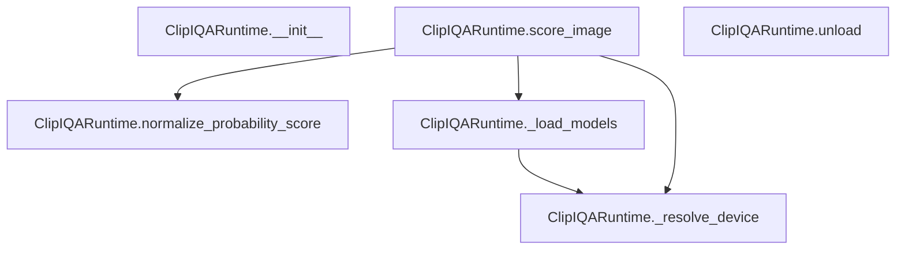

#### `ClipIQARuntime.__init__`

- 所在位置：`python-ai-service/app/runtimes/scorers/clip_iqa_runtime.py:44`
- 语言：`Python`
- 函数签名：`def __init__(self, mode: str, device: str | None = None, clip_model_id: str = 'openai/clip-vit-large-patch14') -> None`
- 函数用途：初始化 CLIP-IQA 运行时的评分模式、设备和模型标识。
- 参数说明：
  - `self`: 实例/类自身引用。
  - `mode: str`: 输入参数，具体含义请结合函数上下文理解。
  - `device: str | None`: 可选参数，默认值为 `None`。
  - `clip_model_id: str`: 可选参数，默认值为 `'openai/clip-vit-large-patch14'`。
- 调用的项目内函数：
  - `__init__ -> python-ai-service/app/clients/asset_client.py:7; python-ai-service/app/clients/audit_client.py:7; python-ai-service/app/clients/task_client.py:9`

#### `ClipIQARuntime.normalize_probability_score`

- 所在位置：`python-ai-service/app/runtimes/scorers/clip_iqa_runtime.py:52`
- 语言：`Python`
- 函数签名：`def normalize_probability_score(self, avg_positive: float, avg_negative: float) -> float`
- 函数用途：把正负提示词平均概率折算成 0-100 的二分类相对得分。
- 参数说明：
  - `self`: 实例/类自身引用。
  - `avg_positive: float`: 输入参数，具体含义请结合函数上下文理解。
  - `avg_negative: float`: 输入参数，具体含义请结合函数上下文理解。
- 调用的项目内函数：
  - `normalize_probability_score -> python-ai-service/app/runtimes/scorers/clip_iqa_runtime.py:52`
- 其他可见调用：`round`

#### `ClipIQARuntime._resolve_device`

- 所在位置：`python-ai-service/app/runtimes/scorers/clip_iqa_runtime.py:59`
- 语言：`Python`
- 函数签名：`def _resolve_device(self) -> str`
- 函数用途：自动确定 CLIP 推理所用设备。
- 参数说明：
  - `self`: 实例/类自身引用。
- 调用的项目内函数：
  - `_resolve_device -> python-ai-service/app/runtimes/scorers/aesthetic_runtime.py:72; python-ai-service/app/runtimes/scorers/clip_iqa_runtime.py:59; python-ai-service/app/runtimes/scorers/image_reward_runtime.py:31`
- 其他可见调用：`is_available`

#### `ClipIQARuntime._load_models`

- 所在位置：`python-ai-service/app/runtimes/scorers/clip_iqa_runtime.py:66`
- 语言：`Python`
- 函数签名：`def _load_models(self) -> None`
- 函数用途：懒加载 CLIP 模型与处理器，减少空闲时资源占用。
- 参数说明：
  - `self`: 实例/类自身引用。
- 调用的项目内函数：
  - `_load_models -> python-ai-service/app/runtimes/scorers/aesthetic_runtime.py:90; python-ai-service/app/runtimes/scorers/clip_iqa_runtime.py:66`
  - `_resolve_device -> python-ai-service/app/runtimes/scorers/aesthetic_runtime.py:72; python-ai-service/app/runtimes/scorers/clip_iqa_runtime.py:59; python-ai-service/app/runtimes/scorers/image_reward_runtime.py:31`
- 其他可见调用：`from_pretrained, to, eval`

#### `ClipIQARuntime.score_image`

- 所在位置：`python-ai-service/app/runtimes/scorers/clip_iqa_runtime.py:78`
- 语言：`Python`
- 函数签名：`def score_image(self, image_path: str, prompt: str = '', mode: str | None = None) -> float`
- 函数用途：使用正负工业描述模板对单张图片做相对质量评分。
- 参数说明：
  - `self`: 实例/类自身引用。
  - `image_path: str`: 输入参数，具体含义请结合函数上下文理解。
  - `prompt: str`: 可选参数，默认值为 `''`。
  - `mode: str | None`: 可选参数，默认值为 `None`。
- 调用的项目内函数：
  - `score_image -> python-ai-service/app/runtimes/scorers/aesthetic_runtime.py:118; python-ai-service/app/runtimes/scorers/clip_iqa_runtime.py:78; python-ai-service/app/runtimes/scorers/image_reward_runtime.py:61`
  - `_load_models -> python-ai-service/app/runtimes/scorers/aesthetic_runtime.py:90; python-ai-service/app/runtimes/scorers/clip_iqa_runtime.py:66`
  - `_resolve_device -> python-ai-service/app/runtimes/scorers/aesthetic_runtime.py:72; python-ai-service/app/runtimes/scorers/clip_iqa_runtime.py:59; python-ai-service/app/runtimes/scorers/image_reward_runtime.py:31`
  - `normalize_probability_score -> python-ai-service/app/runtimes/scorers/clip_iqa_runtime.py:52`
- 其他可见调用：`open, Path, convert, _clip_processor, to, items, no_grad, _clip_model, softmax, float, mean, item`

#### `ClipIQARuntime.unload`

- 所在位置：`python-ai-service/app/runtimes/scorers/clip_iqa_runtime.py:99`
- 语言：`Python`
- 函数签名：`def unload(self) -> None`
- 函数用途：释放 CLIP 模型与处理器，回收显存。
- 参数说明：
  - `self`: 实例/类自身引用。
- 调用的项目内函数：
  - `unload -> python-ai-service/app/runtimes/scorers/aesthetic_runtime.py:133; python-ai-service/app/runtimes/scorers/clip_iqa_runtime.py:99; python-ai-service/app/runtimes/scorers/image_reward_runtime.py:67`
  - `best_effort_cleanup_cuda -> python-ai-service/app/core/torch_cuda.py:77`
- 其他可见调用：`getattr, setattr, collect`


### `python-ai-service/app/runtimes/scorers/image_reward_runtime.py`

#### 调用关系图

这张图展示当前文件内函数之间可直接识别的调用关系。

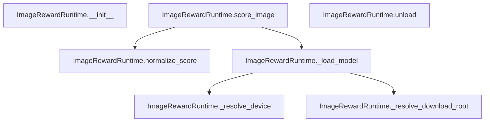

#### `ImageRewardRuntime.__init__`

- 所在位置：`python-ai-service/app/runtimes/scorers/image_reward_runtime.py:14`
- 语言：`Python`
- 函数签名：`def __init__(self, device: str | None = None, model_name: str = 'ImageReward-v1.0', download_root: Path | None = None) -> None`
- 函数用途：记录模型名称、目标设备和模型下载目录。
- 参数说明：
  - `self`: 实例/类自身引用。
  - `device: str | None`: 可选参数，默认值为 `None`。
  - `model_name: str`: 可选参数，默认值为 `'ImageReward-v1.0'`。
  - `download_root: Path | None`: 可选参数，默认值为 `None`。
- 调用的项目内函数：
  - `__init__ -> python-ai-service/app/clients/asset_client.py:7; python-ai-service/app/clients/audit_client.py:7; python-ai-service/app/clients/task_client.py:9`
- 其他可见调用：`Path`

#### `ImageRewardRuntime.normalize_score`

- 所在位置：`python-ai-service/app/runtimes/scorers/image_reward_runtime.py:27`
- 语言：`Python`
- 函数签名：`def normalize_score(self, raw_score: float) -> float`
- 函数用途：把 ImageReward 原始分值压到 0-100 便于和其它维度统一展示。
- 参数说明：
  - `self`: 实例/类自身引用。
  - `raw_score: float`: 输入参数，具体含义请结合函数上下文理解。
- 调用的项目内函数：
  - `normalize_score -> python-ai-service/app/runtimes/scorers/aesthetic_runtime.py:64; python-ai-service/app/runtimes/scorers/image_reward_runtime.py:27`
- 其他可见调用：`round, max, min, exp`

#### `ImageRewardRuntime._resolve_device`

- 所在位置：`python-ai-service/app/runtimes/scorers/image_reward_runtime.py:31`
- 语言：`Python`
- 函数签名：`def _resolve_device(self) -> str`
- 函数用途：自动选择评分设备，优先 CUDA，其次 CPU。
- 参数说明：
  - `self`: 实例/类自身引用。
- 调用的项目内函数：
  - `_resolve_device -> python-ai-service/app/runtimes/scorers/aesthetic_runtime.py:72; python-ai-service/app/runtimes/scorers/clip_iqa_runtime.py:59; python-ai-service/app/runtimes/scorers/image_reward_runtime.py:31`
- 其他可见调用：`is_available`

#### `ImageRewardRuntime._resolve_download_root`

- 所在位置：`python-ai-service/app/runtimes/scorers/image_reward_runtime.py:41`
- 语言：`Python`
- 函数签名：`def _resolve_download_root(self) -> Path`
- 函数用途：确定 ImageReward 权重的本地缓存目录。
- 参数说明：
  - `self`: 实例/类自身引用。
- 调用的项目内函数：
  - `_resolve_download_root -> python-ai-service/app/runtimes/scorers/image_reward_runtime.py:41`
  - `get_settings -> python-ai-service/app/core/settings.py:136`
- 其他可见调用：`mkdir`

#### `ImageRewardRuntime._load_model`

- 所在位置：`python-ai-service/app/runtimes/scorers/image_reward_runtime.py:49`
- 语言：`Python`
- 函数签名：`def _load_model(self)`
- 函数用途：懒加载 ImageReward 模型，避免服务启动时直接下载或占用显存。
- 参数说明：
  - `self`: 实例/类自身引用。
- 调用的项目内函数：
  - `_load_model -> python-ai-service/app/runtimes/scorers/image_reward_runtime.py:49`
  - `_resolve_device -> python-ai-service/app/runtimes/scorers/aesthetic_runtime.py:72; python-ai-service/app/runtimes/scorers/clip_iqa_runtime.py:59; python-ai-service/app/runtimes/scorers/image_reward_runtime.py:31`
  - `_resolve_download_root -> python-ai-service/app/runtimes/scorers/image_reward_runtime.py:41`
- 其他可见调用：`load, str`

#### `ImageRewardRuntime.score_image`

- 所在位置：`python-ai-service/app/runtimes/scorers/image_reward_runtime.py:61`
- 语言：`Python`
- 函数签名：`def score_image(self, image_path: str, prompt: str) -> float`
- 函数用途：对单张图片执行文图一致性评分，并返回归一化后的结果。
- 参数说明：
  - `self`: 实例/类自身引用。
  - `image_path: str`: 输入参数，具体含义请结合函数上下文理解。
  - `prompt: str`: 输入参数，具体含义请结合函数上下文理解。
- 调用的项目内函数：
  - `score_image -> python-ai-service/app/runtimes/scorers/aesthetic_runtime.py:118; python-ai-service/app/runtimes/scorers/clip_iqa_runtime.py:78; python-ai-service/app/runtimes/scorers/image_reward_runtime.py:61`
  - `_load_model -> python-ai-service/app/runtimes/scorers/image_reward_runtime.py:49`
  - `normalize_score -> python-ai-service/app/runtimes/scorers/aesthetic_runtime.py:64; python-ai-service/app/runtimes/scorers/image_reward_runtime.py:27`
- 其他可见调用：`float, score`

#### `ImageRewardRuntime.unload`

- 所在位置：`python-ai-service/app/runtimes/scorers/image_reward_runtime.py:67`
- 语言：`Python`
- 函数签名：`def unload(self) -> None`
- 函数用途：释放 ImageReward 模型实例及 CUDA 缓存。
- 参数说明：
  - `self`: 实例/类自身引用。
- 调用的项目内函数：
  - `unload -> python-ai-service/app/runtimes/scorers/aesthetic_runtime.py:133; python-ai-service/app/runtimes/scorers/clip_iqa_runtime.py:99; python-ai-service/app/runtimes/scorers/image_reward_runtime.py:67`
  - `best_effort_cleanup_cuda -> python-ai-service/app/core/torch_cuda.py:77`
- 其他可见调用：`collect`


### `python-ai-service/app/runtimes/scorers/power_score_runtime.py`

#### 调用关系图

这张图展示当前文件内函数之间可直接识别的调用关系。

```mermaid
flowchart TD
    n_python_ai_service_app_runtimes_scorers_power_score_runtime_pycalibrate_student_scores["calibrate_student_scores"]
    n_python_ai_service_app_runtimes_scorers_power_score_runtime_pyrecompute_total_score["recompute_total_score"]
    n_python_ai_service_app_runtimes_scorers_power_score_runtime_py_lift_low_band["_lift_low_band"]
    n_python_ai_service_app_runtimes_scorers_power_score_runtime_pyPowerScoreRuntime___init__["PowerScoreRuntime.__init__"]
    n_python_ai_service_app_runtimes_scorers_power_score_runtime_pyPowerScoreRuntime_score_image["PowerScoreRuntime.score_image"]
    n_python_ai_service_app_runtimes_scorers_power_score_runtime_pyPowerScoreRuntime_unload["PowerScoreRuntime.unload"]
    n_python_ai_service_app_runtimes_scorers_power_score_runtime_pyPowerScoreRuntime__ensure_loaded["PowerScoreRuntime._ensure_loaded"]
    n_python_ai_service_app_runtimes_scorers_power_score_runtime_pyPowerScoreRuntime__ensure_student_loaded["PowerScoreRuntime._ensure_student_loaded"]
    n_python_ai_service_app_runtimes_scorers_power_score_runtime_pyPowerScoreRuntime__score_student_image["PowerScoreRuntime._score_student_image"]
    n_python_ai_service_app_runtimes_scorers_power_score_runtime_pyPowerScoreRuntime__predict_detections["PowerScoreRuntime._predict_detections"]
    n_python_ai_service_app_runtimes_scorers_power_score_runtime_pyPowerScoreRuntime__normalize_detection["PowerScoreRuntime._normalize_detection"]
    n_python_ai_service_app_runtimes_scorers_power_score_runtime_pyPowerScoreRuntime__write_checked_image["PowerScoreRuntime._write_checked_image"]
    n_python_ai_service_app_runtimes_scorers_power_score_runtime_pycalibrate_student_scores --> n_python_ai_service_app_runtimes_scorers_power_score_runtime_py_lift_low_band
    n_python_ai_service_app_runtimes_scorers_power_score_runtime_pyPowerScoreRuntime_score_image --> n_python_ai_service_app_runtimes_scorers_power_score_runtime_pyPowerScoreRuntime__ensure_loaded
    n_python_ai_service_app_runtimes_scorers_power_score_runtime_pyPowerScoreRuntime_score_image --> n_python_ai_service_app_runtimes_scorers_power_score_runtime_pyPowerScoreRuntime__score_student_image
    n_python_ai_service_app_runtimes_scorers_power_score_runtime_pyPowerScoreRuntime__ensure_loaded --> n_python_ai_service_app_runtimes_scorers_power_score_runtime_pyPowerScoreRuntime__ensure_student_loaded
    n_python_ai_service_app_runtimes_scorers_power_score_runtime_pyPowerScoreRuntime__score_student_image --> n_python_ai_service_app_runtimes_scorers_power_score_runtime_pyPowerScoreRuntime__predict_detections
    n_python_ai_service_app_runtimes_scorers_power_score_runtime_pyPowerScoreRuntime__score_student_image --> n_python_ai_service_app_runtimes_scorers_power_score_runtime_pyPowerScoreRuntime__write_checked_image
    n_python_ai_service_app_runtimes_scorers_power_score_runtime_pyPowerScoreRuntime__score_student_image --> n_python_ai_service_app_runtimes_scorers_power_score_runtime_pycalibrate_student_scores
    n_python_ai_service_app_runtimes_scorers_power_score_runtime_pyPowerScoreRuntime__predict_detections --> n_python_ai_service_app_runtimes_scorers_power_score_runtime_pyPowerScoreRuntime__normalize_detection
```

#### `calibrate_student_scores`

- 所在位置：`python-ai-service/app/runtimes/scorers/power_score_runtime.py:44`
- 语言：`Python`
- 函数签名：`def calibrate_student_scores(raw_scores: dict[str, float], total_weights: dict[str, float], calibration: dict[str, dict[str, float]] | None = None) -> dict[str, float]`
- 函数用途：源码中没有显式注释，这里根据函数命名和上下文推断其职责。
- 参数说明：
  - `raw_scores: dict[str, float]`: 输入参数，具体含义请结合函数上下文理解。
  - `total_weights: dict[str, float]`: 输入参数，具体含义请结合函数上下文理解。
  - `calibration: dict[str, dict[str, float]] | None`: 可选参数，默认值为 `None`。
- 调用的项目内函数：
  - `calibrate_student_scores -> python-ai-service/app/runtimes/scorers/power_score_runtime.py:44`
  - `clamp_score -> python-ai-service/training/scoring/modeling.py:135`
  - `_lift_low_band -> python-ai-service/app/runtimes/scorers/power_score_runtime.py:80; python-ai-service/app/services/scoring_service.py:147`
- 其他可见调用：`items, get, float, round, sum`

#### `recompute_total_score`

- 所在位置：`python-ai-service/app/runtimes/scorers/power_score_runtime.py:68`
- 语言：`Python`
- 函数签名：`def recompute_total_score(component_scores: dict[str, float], total_weights: dict[str, float]) -> dict[str, float]`
- 函数用途：源码中没有显式注释，这里根据函数命名和上下文推断其职责。
- 参数说明：
  - `component_scores: dict[str, float]`: 输入参数，具体含义请结合函数上下文理解。
  - `total_weights: dict[str, float]`: 输入参数，具体含义请结合函数上下文理解。
- 调用的项目内函数：
  - `recompute_total_score -> python-ai-service/app/runtimes/scorers/power_score_runtime.py:68`
- 其他可见调用：`dict, round, sum, get`

#### `_lift_low_band`

- 所在位置：`python-ai-service/app/runtimes/scorers/power_score_runtime.py:80`
- 语言：`Python`
- 函数签名：`def _lift_low_band(score: float, target: float, gain: float) -> float`
- 函数用途：源码中没有显式注释，这里根据函数命名和上下文推断其职责。
- 参数说明：
  - `score: float`: 输入参数，具体含义请结合函数上下文理解。
  - `target: float`: 输入参数，具体含义请结合函数上下文理解。
  - `gain: float`: 输入参数，具体含义请结合函数上下文理解。
- 调用的项目内函数：
  - `_lift_low_band -> python-ai-service/app/runtimes/scorers/power_score_runtime.py:80; python-ai-service/app/services/scoring_service.py:147`
- 其他可见调用：`max, min, float, round`

#### `PowerScoreRuntime.__init__`

- 所在位置：`python-ai-service/app/runtimes/scorers/power_score_runtime.py:88`
- 语言：`Python`
- 函数签名：`def __init__(self, bundle_dir: Path, device: str | None = None, yolo_runtime: Any | None = None, image_check_dir: Path | None = None) -> None`
- 函数用途：源码中没有显式注释，这里根据函数命名和上下文推断其职责。
- 参数说明：
  - `self`: 实例/类自身引用。
  - `bundle_dir: Path`: 输入参数，具体含义请结合函数上下文理解。
  - `device: str | None`: 可选参数，默认值为 `None`。
  - `yolo_runtime: Any | None`: 可选参数，默认值为 `None`。
  - `image_check_dir: Path | None`: 可选参数，默认值为 `None`。
- 调用的项目内函数：
  - `__init__ -> python-ai-service/app/clients/asset_client.py:7; python-ai-service/app/clients/audit_client.py:7; python-ai-service/app/clients/task_client.py:9`
  - `choose_training_device -> python-ai-service/training/scoring/modeling.py:113`
- 其他可见调用：`Path`

#### `PowerScoreRuntime.score_image`

- 所在位置：`python-ai-service/app/runtimes/scorers/power_score_runtime.py:107`
- 语言：`Python`
- 函数签名：`def score_image(self, image_path: str, prompt: str) -> dict[str, Any]`
- 函数用途：源码中没有显式注释，这里根据函数命名和上下文推断其职责。
- 参数说明：
  - `self`: 实例/类自身引用。
  - `image_path: str`: 输入参数，具体含义请结合函数上下文理解。
  - `prompt: str`: 输入参数，具体含义请结合函数上下文理解。
- 调用的项目内函数：
  - `score_image -> python-ai-service/app/runtimes/scorers/aesthetic_runtime.py:118; python-ai-service/app/runtimes/scorers/clip_iqa_runtime.py:78; python-ai-service/app/runtimes/scorers/image_reward_runtime.py:61`
  - `_ensure_loaded -> python-ai-service/app/runtimes/scorers/power_score_runtime.py:121`
  - `_score_student_image -> python-ai-service/app/runtimes/scorers/power_score_runtime.py:164`

#### `PowerScoreRuntime.unload`

- 所在位置：`python-ai-service/app/runtimes/scorers/power_score_runtime.py:111`
- 语言：`Python`
- 函数签名：`def unload(self) -> None`
- 函数用途：源码中没有显式注释，这里根据函数命名和上下文推断其职责。
- 参数说明：
  - `self`: 实例/类自身引用。
- 调用的项目内函数：
  - `unload -> python-ai-service/app/runtimes/scorers/aesthetic_runtime.py:133; python-ai-service/app/runtimes/scorers/clip_iqa_runtime.py:99; python-ai-service/app/runtimes/scorers/image_reward_runtime.py:67`
- 其他可见调用：`empty_cache, hasattr`

#### `PowerScoreRuntime._ensure_loaded`

- 所在位置：`python-ai-service/app/runtimes/scorers/power_score_runtime.py:121`
- 语言：`Python`
- 函数签名：`def _ensure_loaded(self) -> None`
- 函数用途：源码中没有显式注释，这里根据函数命名和上下文推断其职责。
- 参数说明：
  - `self`: 实例/类自身引用。
- 调用的项目内函数：
  - `_ensure_loaded -> python-ai-service/app/runtimes/scorers/power_score_runtime.py:121`
  - `_ensure_student_loaded -> python-ai-service/app/runtimes/scorers/power_score_runtime.py:129`
- 其他可见调用：`exists, FileNotFoundError, loads, read_text`

#### `PowerScoreRuntime._ensure_student_loaded`

- 所在位置：`python-ai-service/app/runtimes/scorers/power_score_runtime.py:129`
- 语言：`Python`
- 函数签名：`def _ensure_student_loaded(self) -> None`
- 函数用途：源码中没有显式注释，这里根据函数命名和上下文推断其职责。
- 参数说明：
  - `self`: 实例/类自身引用。
- 调用的项目内函数：
  - `_ensure_student_loaded -> python-ai-service/app/runtimes/scorers/power_score_runtime.py:129`
- 其他可见调用：`str, exists, FileNotFoundError, loads, read_text, int, get, Compose, Resize, ToTensor, Normalize, FourDimScoreModel`

#### `PowerScoreRuntime._score_student_image`

- 所在位置：`python-ai-service/app/runtimes/scorers/power_score_runtime.py:164`
- 语言：`Python`
- 函数签名：`def _score_student_image(self, image_path: str, prompt: str) -> dict[str, Any]`
- 函数用途：源码中没有显式注释，这里根据函数命名和上下文推断其职责。
- 参数说明：
  - `self`: 实例/类自身引用。
  - `image_path: str`: 输入参数，具体含义请结合函数上下文理解。
  - `prompt: str`: 输入参数，具体含义请结合函数上下文理解。
- 调用的项目内函数：
  - `_score_student_image -> python-ai-service/app/runtimes/scorers/power_score_runtime.py:164`
  - `encode_prompt -> python-ai-service/training/scoring/modeling.py:130`
  - `_predict_detections -> python-ai-service/app/runtimes/scorers/power_score_runtime.py:217`
  - `_write_checked_image -> python-ai-service/app/runtimes/scorers/power_score_runtime.py:266`
  - `_analyze_image -> python-ai-service/app/runtimes/scorers/power_score_runtime.py:311; python-ai-service/training/scoring/datasets.py:836`
  - `_analyze_prompt -> python-ai-service/app/runtimes/scorers/power_score_runtime.py:355; python-ai-service/training/scoring/datasets.py:876`
  - `_build_yolo_feature_vector -> python-ai-service/app/runtimes/scorers/power_score_runtime.py:722; python-ai-service/training/scoring/datasets.py:814`
  - `clamp_score -> python-ai-service/training/scoring/modeling.py:135`
  - `calibrate_student_scores -> python-ai-service/app/runtimes/scorers/power_score_runtime.py:44`
  - `_ground_detection_sensitive_scores -> python-ai-service/app/runtimes/scorers/power_score_runtime.py:388`
  - `_build_score_explanation -> python-ai-service/app/runtimes/scorers/power_score_runtime.py:428`
- 其他可见调用：`open, convert, _transform, unsqueeze, to, tensor, no_grad, _model, detach, cpu, tolist, get`

#### `PowerScoreRuntime._predict_detections`

- 所在位置：`python-ai-service/app/runtimes/scorers/power_score_runtime.py:217`
- 语言：`Python`
- 函数签名：`def _predict_detections(self, image_path: str) -> list[dict[str, Any]]`
- 函数用途：源码中没有显式注释，这里根据函数命名和上下文推断其职责。
- 参数说明：
  - `self`: 实例/类自身引用。
  - `image_path: str`: 输入参数，具体含义请结合函数上下文理解。
- 调用的项目内函数：
  - `_predict_detections -> python-ai-service/app/runtimes/scorers/power_score_runtime.py:217`
  - `_yolo_device -> python-ai-service/app/runtimes/scorers/power_score_runtime.py:749`
  - `_normalize_detection -> python-ai-service/app/runtimes/scorers/power_score_runtime.py:258`
- 其他可见调用：`predict, int, get, float, isinstance, zip, tolist, str`

#### `PowerScoreRuntime._normalize_detection`

- 所在位置：`python-ai-service/app/runtimes/scorers/power_score_runtime.py:258`
- 语言：`Python`
- 函数签名：`def _normalize_detection(item: dict[str, Any]) -> dict[str, Any]`
- 函数用途：源码中没有显式注释，这里根据函数命名和上下文推断其职责。
- 修饰信息：`staticmethod`
- 参数说明：
  - `item: dict[str, Any]`: 输入参数，具体含义请结合函数上下文理解。
- 调用的项目内函数：
  - `_normalize_detection -> python-ai-service/app/runtimes/scorers/power_score_runtime.py:258`
- 其他可见调用：`get, str, float`

#### `PowerScoreRuntime._write_checked_image`

- 所在位置：`python-ai-service/app/runtimes/scorers/power_score_runtime.py:266`
- 语言：`Python`
- 函数签名：`def _write_checked_image(self, image: Image.Image, image_path: str, detections: list[dict[str, Any]]) -> str | None`
- 函数用途：源码中没有显式注释，这里根据函数命名和上下文推断其职责。
- 参数说明：
  - `self`: 实例/类自身引用。
  - `image: Image.Image`: 输入参数，具体含义请结合函数上下文理解。
  - `image_path: str`: 输入参数，具体含义请结合函数上下文理解。
  - `detections: list[dict[str, Any]]`: 输入参数，具体含义请结合函数上下文理解。
- 调用的项目内函数：
  - `_write_checked_image -> python-ai-service/app/runtimes/scorers/power_score_runtime.py:266`
- 其他可见调用：`mkdir, Path, copy, Draw, truetype, load_default, max, float, min, rectangle, textbbox, text`

#### `PowerScoreRuntime._analyze_image`

- 所在位置：`python-ai-service/app/runtimes/scorers/power_score_runtime.py:311`
- 语言：`Python`
- 函数签名：`def _analyze_image(image: Image.Image, detections: list[dict[str, Any]]) -> dict[str, float]`
- 函数用途：源码中没有显式注释，这里根据函数命名和上下文推断其职责。
- 修饰信息：`staticmethod`
- 参数说明：
  - `image: Image.Image`: 输入参数，具体含义请结合函数上下文理解。
  - `detections: list[dict[str, Any]]`: 输入参数，具体含义请结合函数上下文理解。
- 调用的项目内函数：
  - `_analyze_image -> python-ai-service/app/runtimes/scorers/power_score_runtime.py:311; python-ai-service/training/scoring/datasets.py:836`
  - `clamp_score -> python-ai-service/training/scoring/modeling.py:135`
- 其他可见调用：`asarray, convert, mean, float, abs, diff, min, std, max`

#### `PowerScoreRuntime._analyze_prompt`

- 所在位置：`python-ai-service/app/runtimes/scorers/power_score_runtime.py:355`
- 语言：`Python`
- 函数签名：`def _analyze_prompt(prompt: str, detections: list[dict[str, Any]]) -> dict[str, Any]`
- 函数用途：源码中没有显式注释，这里根据函数命名和上下文推断其职责。
- 修饰信息：`staticmethod`
- 参数说明：
  - `prompt: str`: 输入参数，具体含义请结合函数上下文理解。
  - `detections: list[dict[str, Any]]`: 输入参数，具体含义请结合函数上下文理解。
- 调用的项目内函数：
  - `_analyze_prompt -> python-ai-service/app/runtimes/scorers/power_score_runtime.py:355; python-ai-service/training/scoring/datasets.py:876`
  - `score_detected_topology -> python-ai-service/training/scoring/modeling.py:82`
  - `clamp_score -> python-ai-service/training/scoring/modeling.py:135`
- 其他可见调用：`lower, set, findall, items, update, str, float, get, min`

#### `PowerScoreRuntime._ground_detection_sensitive_scores`

- 所在位置：`python-ai-service/app/runtimes/scorers/power_score_runtime.py:388`
- 语言：`Python`
- 函数签名：`def _ground_detection_sensitive_scores(self, base_scores: dict[str, float], prompt_analysis: dict[str, Any], total_weights: dict[str, float]) -> dict[str, float]`
- 函数用途：源码中没有显式注释，这里根据函数命名和上下文推断其职责。
- 参数说明：
  - `self`: 实例/类自身引用。
  - `base_scores: dict[str, float]`: 输入参数，具体含义请结合函数上下文理解。
  - `prompt_analysis: dict[str, Any]`: 输入参数，具体含义请结合函数上下文理解。
  - `total_weights: dict[str, float]`: 输入参数，具体含义请结合函数上下文理解。
- 调用的项目内函数：
  - `_ground_detection_sensitive_scores -> python-ai-service/app/runtimes/scorers/power_score_runtime.py:388`
  - `clamp_score -> python-ai-service/training/scoring/modeling.py:135`
  - `recompute_total_score -> python-ai-service/app/runtimes/scorers/power_score_runtime.py:68`
- 其他可见调用：`float, set, dict, min`

#### `PowerScoreRuntime._build_score_explanation`

- 所在位置：`python-ai-service/app/runtimes/scorers/power_score_runtime.py:428`
- 语言：`Python`
- 函数签名：`def _build_score_explanation(self, checked_image_path: str | None, raw_scores: dict[str, float], calibrated_scores: dict[str, float], final_scores: dict[str, float], total_weights: dict[str, float], image_analysis: dict[str, float], prompt_analysis: dict[str, Any], detections: list[dict[str, Any]]) -> dict[str, Any]`
- 函数用途：源码中没有显式注释，这里根据函数命名和上下文推断其职责。
- 参数说明：
  - `self`: 实例/类自身引用。
  - `checked_image_path: str | None`: 输入参数，具体含义请结合函数上下文理解。
  - `raw_scores: dict[str, float]`: 输入参数，具体含义请结合函数上下文理解。
  - `calibrated_scores: dict[str, float]`: 输入参数，具体含义请结合函数上下文理解。
  - `final_scores: dict[str, float]`: 输入参数，具体含义请结合函数上下文理解。
  - `total_weights: dict[str, float]`: 输入参数，具体含义请结合函数上下文理解。
  - `image_analysis: dict[str, float]`: 输入参数，具体含义请结合函数上下文理解。
  - `prompt_analysis: dict[str, Any]`: 输入参数，具体含义请结合函数上下文理解。
  - `detections: list[dict[str, Any]]`: 输入参数，具体含义请结合函数上下文理解。
- 调用的项目内函数：
  - `_build_score_explanation -> python-ai-service/app/runtimes/scorers/power_score_runtime.py:428`
  - `_build_visual_explanation -> python-ai-service/app/runtimes/scorers/power_score_runtime.py:480`
  - `_build_text_explanation -> python-ai-service/app/runtimes/scorers/power_score_runtime.py:520`
  - `_build_physical_explanation -> python-ai-service/app/runtimes/scorers/power_score_runtime.py:569`
  - `_build_composition_explanation -> python-ai-service/app/runtimes/scorers/power_score_runtime.py:618`
  - `_build_total_explanation -> python-ai-service/app/runtimes/scorers/power_score_runtime.py:656`

#### `PowerScoreRuntime._build_visual_explanation`

- 所在位置：`python-ai-service/app/runtimes/scorers/power_score_runtime.py:480`
- 语言：`Python`
- 函数签名：`def _build_visual_explanation(self, raw_scores: dict[str, float], calibrated_scores: dict[str, float], final_scores: dict[str, float], image_analysis: dict[str, float]) -> dict[str, Any]`
- 函数用途：源码中没有显式注释，这里根据函数命名和上下文推断其职责。
- 参数说明：
  - `self`: 实例/类自身引用。
  - `raw_scores: dict[str, float]`: 输入参数，具体含义请结合函数上下文理解。
  - `calibrated_scores: dict[str, float]`: 输入参数，具体含义请结合函数上下文理解。
  - `final_scores: dict[str, float]`: 输入参数，具体含义请结合函数上下文理解。
  - `image_analysis: dict[str, float]`: 输入参数，具体含义请结合函数上下文理解。
- 调用的项目内函数：
  - `_build_visual_explanation -> python-ai-service/app/runtimes/scorers/power_score_runtime.py:480`
  - `_score_grade_label -> python-ai-service/app/runtimes/scorers/power_score_runtime.py:710`
- 其他可见调用：`float`

#### `PowerScoreRuntime._build_text_explanation`

- 所在位置：`python-ai-service/app/runtimes/scorers/power_score_runtime.py:520`
- 语言：`Python`
- 函数签名：`def _build_text_explanation(self, raw_scores: dict[str, float], calibrated_scores: dict[str, float], final_scores: dict[str, float], prompt_analysis: dict[str, Any], detections: list[dict[str, Any]], checked_image_path: str | None) -> dict[str, Any]`
- 函数用途：源码中没有显式注释，这里根据函数命名和上下文推断其职责。
- 参数说明：
  - `self`: 实例/类自身引用。
  - `raw_scores: dict[str, float]`: 输入参数，具体含义请结合函数上下文理解。
  - `calibrated_scores: dict[str, float]`: 输入参数，具体含义请结合函数上下文理解。
  - `final_scores: dict[str, float]`: 输入参数，具体含义请结合函数上下文理解。
  - `prompt_analysis: dict[str, Any]`: 输入参数，具体含义请结合函数上下文理解。
  - `detections: list[dict[str, Any]]`: 输入参数，具体含义请结合函数上下文理解。
  - `checked_image_path: str | None`: 输入参数，具体含义请结合函数上下文理解。
- 调用的项目内函数：
  - `_build_text_explanation -> python-ai-service/app/runtimes/scorers/power_score_runtime.py:520`
  - `_score_grade_label -> python-ai-service/app/runtimes/scorers/power_score_runtime.py:710`
  - `_serialize_detections -> python-ai-service/app/runtimes/scorers/power_score_runtime.py:693`
- 其他可见调用：`float, sorted, str`

#### `PowerScoreRuntime._build_physical_explanation`

- 所在位置：`python-ai-service/app/runtimes/scorers/power_score_runtime.py:569`
- 语言：`Python`
- 函数签名：`def _build_physical_explanation(self, raw_scores: dict[str, float], calibrated_scores: dict[str, float], final_scores: dict[str, float], prompt_analysis: dict[str, Any], detections: list[dict[str, Any]], checked_image_path: str | None) -> dict[str, Any]`
- 函数用途：源码中没有显式注释，这里根据函数命名和上下文推断其职责。
- 参数说明：
  - `self`: 实例/类自身引用。
  - `raw_scores: dict[str, float]`: 输入参数，具体含义请结合函数上下文理解。
  - `calibrated_scores: dict[str, float]`: 输入参数，具体含义请结合函数上下文理解。
  - `final_scores: dict[str, float]`: 输入参数，具体含义请结合函数上下文理解。
  - `prompt_analysis: dict[str, Any]`: 输入参数，具体含义请结合函数上下文理解。
  - `detections: list[dict[str, Any]]`: 输入参数，具体含义请结合函数上下文理解。
  - `checked_image_path: str | None`: 输入参数，具体含义请结合函数上下文理解。
- 调用的项目内函数：
  - `_build_physical_explanation -> python-ai-service/app/runtimes/scorers/power_score_runtime.py:569`
  - `_score_grade_label -> python-ai-service/app/runtimes/scorers/power_score_runtime.py:710`
  - `_serialize_detections -> python-ai-service/app/runtimes/scorers/power_score_runtime.py:693`
- 其他可见调用：`float, sorted, str`

#### `PowerScoreRuntime._build_composition_explanation`

- 所在位置：`python-ai-service/app/runtimes/scorers/power_score_runtime.py:618`
- 语言：`Python`
- 函数签名：`def _build_composition_explanation(self, raw_scores: dict[str, float], calibrated_scores: dict[str, float], final_scores: dict[str, float], image_analysis: dict[str, float]) -> dict[str, Any]`
- 函数用途：源码中没有显式注释，这里根据函数命名和上下文推断其职责。
- 参数说明：
  - `self`: 实例/类自身引用。
  - `raw_scores: dict[str, float]`: 输入参数，具体含义请结合函数上下文理解。
  - `calibrated_scores: dict[str, float]`: 输入参数，具体含义请结合函数上下文理解。
  - `final_scores: dict[str, float]`: 输入参数，具体含义请结合函数上下文理解。
  - `image_analysis: dict[str, float]`: 输入参数，具体含义请结合函数上下文理解。
- 调用的项目内函数：
  - `_build_composition_explanation -> python-ai-service/app/runtimes/scorers/power_score_runtime.py:618`
  - `_score_grade_label -> python-ai-service/app/runtimes/scorers/power_score_runtime.py:710`
- 其他可见调用：`float`

#### `PowerScoreRuntime._build_total_explanation`

- 所在位置：`python-ai-service/app/runtimes/scorers/power_score_runtime.py:656`
- 语言：`Python`
- 函数签名：`def _build_total_explanation(self, final_scores: dict[str, float], total_weights: dict[str, float]) -> dict[str, Any]`
- 函数用途：源码中没有显式注释，这里根据函数命名和上下文推断其职责。
- 参数说明：
  - `self`: 实例/类自身引用。
  - `final_scores: dict[str, float]`: 输入参数，具体含义请结合函数上下文理解。
  - `total_weights: dict[str, float]`: 输入参数，具体含义请结合函数上下文理解。
- 调用的项目内函数：
  - `_build_total_explanation -> python-ai-service/app/runtimes/scorers/power_score_runtime.py:656`
  - `_score_grade_label -> python-ai-service/app/runtimes/scorers/power_score_runtime.py:710`
- 其他可见调用：`round, float, min`

#### `PowerScoreRuntime._serialize_detections`

- 所在位置：`python-ai-service/app/runtimes/scorers/power_score_runtime.py:693`
- 语言：`Python`
- 函数签名：`def _serialize_detections(detections: list[dict[str, Any]]) -> list[dict[str, Any]]`
- 函数用途：源码中没有显式注释，这里根据函数命名和上下文推断其职责。
- 修饰信息：`staticmethod`
- 参数说明：
  - `detections: list[dict[str, Any]]`: 输入参数，具体含义请结合函数上下文理解。
- 调用的项目内函数：
  - `_serialize_detections -> python-ai-service/app/runtimes/scorers/power_score_runtime.py:693`
- 其他可见调用：`str, get, round, float`

#### `PowerScoreRuntime._format_class_list`

- 所在位置：`python-ai-service/app/runtimes/scorers/power_score_runtime.py:704`
- 语言：`Python`
- 函数签名：`def _format_class_list(items: list[str]) -> str`
- 函数用途：源码中没有显式注释，这里根据函数命名和上下文推断其职责。
- 修饰信息：`staticmethod`
- 参数说明：
  - `items: list[str]`: 输入参数，具体含义请结合函数上下文理解。
- 调用的项目内函数：
  - `_format_class_list -> python-ai-service/app/runtimes/scorers/power_score_runtime.py:704`
- 其他可见调用：`join`

#### `PowerScoreRuntime._score_grade_label`

- 所在位置：`python-ai-service/app/runtimes/scorers/power_score_runtime.py:710`
- 语言：`Python`
- 函数签名：`def _score_grade_label(score: float) -> str`
- 函数用途：源码中没有显式注释，这里根据函数命名和上下文推断其职责。
- 修饰信息：`staticmethod`
- 参数说明：
  - `score: float`: 输入参数，具体含义请结合函数上下文理解。
- 调用的项目内函数：
  - `_score_grade_label -> python-ai-service/app/runtimes/scorers/power_score_runtime.py:710`
- 其他可见调用：`max, min, float`

#### `PowerScoreRuntime._build_yolo_feature_vector`

- 所在位置：`python-ai-service/app/runtimes/scorers/power_score_runtime.py:722`
- 语言：`Python`
- 函数签名：`def _build_yolo_feature_vector(self, detections: list[dict[str, Any]]) -> list[float]`
- 函数用途：源码中没有显式注释，这里根据函数命名和上下文推断其职责。
- 参数说明：
  - `self`: 实例/类自身引用。
  - `detections: list[dict[str, Any]]`: 输入参数，具体含义请结合函数上下文理解。
- 调用的项目内函数：
  - `_build_yolo_feature_vector -> python-ai-service/app/runtimes/scorers/power_score_runtime.py:722; python-ai-service/training/scoring/datasets.py:814`
- 其他可见调用：`get, enumerate, str, max, float, sum`

#### `PowerScoreRuntime._yolo_device`

- 所在位置：`python-ai-service/app/runtimes/scorers/power_score_runtime.py:749`
- 语言：`Python`
- 函数签名：`def _yolo_device(self) -> str | int`
- 函数用途：源码中没有显式注释，这里根据函数命名和上下文推断其职责。
- 参数说明：
  - `self`: 实例/类自身引用。
- 调用的项目内函数：
  - `_yolo_device -> python-ai-service/app/runtimes/scorers/power_score_runtime.py:749`

#### `PowerScoreRouter.__init__`

- 所在位置：`python-ai-service/app/runtimes/scorers/power_score_runtime.py:758`
- 语言：`Python`
- 函数签名：`def __init__(self, runtimes: dict[str, PowerScoreRuntime]) -> None`
- 函数用途：源码中没有显式注释，这里根据函数命名和上下文推断其职责。
- 参数说明：
  - `self`: 实例/类自身引用。
  - `runtimes: dict[str, PowerScoreRuntime]`: 输入参数，具体含义请结合函数上下文理解。
- 调用的项目内函数：
  - `__init__ -> python-ai-service/app/clients/asset_client.py:7; python-ai-service/app/clients/audit_client.py:7; python-ai-service/app/clients/task_client.py:9`
- 其他可见调用：`dict`

#### `PowerScoreRouter.score_image_for_model`

- 所在位置：`python-ai-service/app/runtimes/scorers/power_score_runtime.py:761`
- 语言：`Python`
- 函数签名：`def score_image_for_model(self, scoring_model_name: str, image_path: str, prompt: str) -> dict[str, Any]`
- 函数用途：源码中没有显式注释，这里根据函数命名和上下文推断其职责。
- 参数说明：
  - `self`: 实例/类自身引用。
  - `scoring_model_name: str`: 输入参数，具体含义请结合函数上下文理解。
  - `image_path: str`: 输入参数，具体含义请结合函数上下文理解。
  - `prompt: str`: 输入参数，具体含义请结合函数上下文理解。
- 调用的项目内函数：
  - `score_image_for_model -> python-ai-service/app/runtimes/scorers/power_score_runtime.py:761`
  - `score_image -> python-ai-service/app/runtimes/scorers/aesthetic_runtime.py:118; python-ai-service/app/runtimes/scorers/clip_iqa_runtime.py:78; python-ai-service/app/runtimes/scorers/image_reward_runtime.py:61`
- 其他可见调用：`ValueError`

#### `PowerScoreRouter.unload`

- 所在位置：`python-ai-service/app/runtimes/scorers/power_score_runtime.py:766`
- 语言：`Python`
- 函数签名：`def unload(self) -> None`
- 函数用途：源码中没有显式注释，这里根据函数命名和上下文推断其职责。
- 参数说明：
  - `self`: 实例/类自身引用。
- 调用的项目内函数：
  - `unload -> python-ai-service/app/runtimes/scorers/aesthetic_runtime.py:133; python-ai-service/app/runtimes/scorers/clip_iqa_runtime.py:99; python-ai-service/app/runtimes/scorers/image_reward_runtime.py:67`
- 其他可见调用：`values`


### `python-ai-service/app/runtimes/sd15_runtime.py`

#### 调用关系图

这张图展示当前文件内函数之间可直接识别的调用关系。

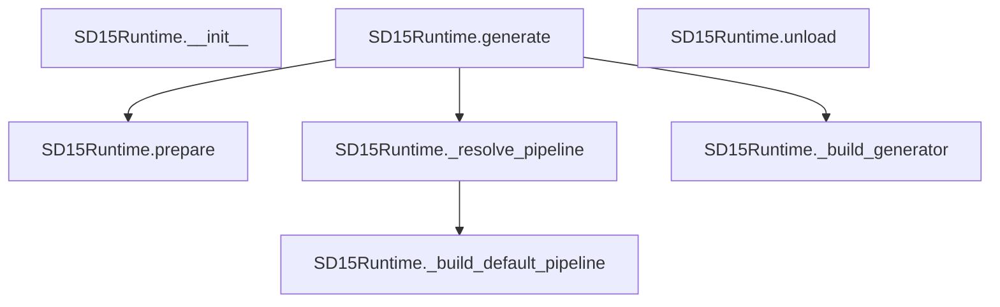

#### `SD15Runtime.__init__`

- 所在位置：`python-ai-service/app/runtimes/sd15_runtime.py:16`
- 语言：`Python`
- 函数签名：`def __init__(self, model_dir: Path, output_dir: Path, pipeline = None) -> None`
- 函数用途：记录模型目录、输出目录以及可选的外部注入 pipeline。
- 参数说明：
  - `self`: 实例/类自身引用。
  - `model_dir: Path`: 输入参数，具体含义请结合函数上下文理解。
  - `output_dir: Path`: 输入参数，具体含义请结合函数上下文理解。
  - `pipeline`: 可选参数，默认值为 `None`。
- 调用的项目内函数：
  - `__init__ -> python-ai-service/app/clients/asset_client.py:7; python-ai-service/app/clients/audit_client.py:7; python-ai-service/app/clients/task_client.py:9`
- 其他可见调用：`Path`

#### `SD15Runtime.prepare`

- 所在位置：`python-ai-service/app/runtimes/sd15_runtime.py:22`
- 语言：`Python`
- 函数签名：`def prepare(self, job = None) -> None`
- 函数用途：确保模型目录和输出目录存在，供后续推理与图片保存使用。
- 参数说明：
  - `self`: 实例/类自身引用。
  - `job`: 可选参数，默认值为 `None`。
- 调用的项目内函数：
  - `prepare -> python-ai-service/app/runtimes/sd15_runtime.py:22; python-ai-service/app/runtimes/ssd1b_runtime.py:21; python-ai-service/app/runtimes/unipic2_runtime.py:26`
- 其他可见调用：`mkdir`

#### `SD15Runtime._build_default_pipeline`

- 所在位置：`python-ai-service/app/runtimes/sd15_runtime.py:27`
- 语言：`Python`
- 函数签名：`def _build_default_pipeline(self)`
- 函数用途：按当前机器环境构建默认 SD1.5 pipeline，并启用基础显存优化。
- 参数说明：
  - `self`: 实例/类自身引用。
- 调用的项目内函数：
  - `_build_default_pipeline -> python-ai-service/app/runtimes/sd15_runtime.py:27; python-ai-service/app/runtimes/ssd1b_runtime.py:25; python-ai-service/app/runtimes/unipic2_runtime.py:48`
  - `preferred_torch_device_type -> python-ai-service/app/core/torch_cuda.py:31`
- 其他可见调用：`from_pretrained, enable_attention_slicing, enable_vae_slicing, hasattr, enable_model_cpu_offload, to`

#### `SD15Runtime._resolve_pipeline`

- 所在位置：`python-ai-service/app/runtimes/sd15_runtime.py:53`
- 语言：`Python`
- 函数签名：`def _resolve_pipeline(self)`
- 函数用途：懒加载 pipeline，避免服务启动时就立刻占满显存。
- 参数说明：
  - `self`: 实例/类自身引用。
- 调用的项目内函数：
  - `_resolve_pipeline -> python-ai-service/app/runtimes/sd15_runtime.py:53; python-ai-service/app/runtimes/ssd1b_runtime.py:46; python-ai-service/app/runtimes/unipic2_runtime.py:169`
  - `_build_default_pipeline -> python-ai-service/app/runtimes/sd15_runtime.py:27; python-ai-service/app/runtimes/ssd1b_runtime.py:25; python-ai-service/app/runtimes/unipic2_runtime.py:48`

#### `SD15Runtime.generate`

- 所在位置：`python-ai-service/app/runtimes/sd15_runtime.py:59`
- 语言：`Python`
- 函数签名：`def generate(self, job_id: int, prompt: str, negative_prompt: str, seed: int, width: int, height: int, steps: int, guidance_scale: float, num_images: int, model_name: str) -> list[dict]`
- 函数用途：执行一次真实生成任务，并把结果图片落盘后返回资产记录。
- 参数说明：
  - `self`: 实例/类自身引用。
  - `job_id: int`: 输入参数，具体含义请结合函数上下文理解。
  - `prompt: str`: 输入参数，具体含义请结合函数上下文理解。
  - `negative_prompt: str`: 输入参数，具体含义请结合函数上下文理解。
  - `seed: int`: 输入参数，具体含义请结合函数上下文理解。
  - `width: int`: 输入参数，具体含义请结合函数上下文理解。
  - `height: int`: 输入参数，具体含义请结合函数上下文理解。
  - `steps: int`: 输入参数，具体含义请结合函数上下文理解。
  - `guidance_scale: float`: 输入参数，具体含义请结合函数上下文理解。
  - `num_images: int`: 输入参数，具体含义请结合函数上下文理解。
  - `model_name: str`: 输入参数，具体含义请结合函数上下文理解。
- 调用的项目内函数：
  - `generate -> python-ai-service/app/main.py:50; python-ai-service/app/runtimes/sd15_runtime.py:59; python-ai-service/app/runtimes/ssd1b_runtime.py:51`
  - `prepare -> python-ai-service/app/runtimes/sd15_runtime.py:22; python-ai-service/app/runtimes/ssd1b_runtime.py:21; python-ai-service/app/runtimes/unipic2_runtime.py:26`
  - `_resolve_pipeline -> python-ai-service/app/runtimes/sd15_runtime.py:53; python-ai-service/app/runtimes/ssd1b_runtime.py:46; python-ai-service/app/runtimes/unipic2_runtime.py:169`
  - `_build_generator -> python-ai-service/app/runtimes/sd15_runtime.py:105; python-ai-service/app/runtimes/ssd1b_runtime.py:96; python-ai-service/app/runtimes/unipic2_runtime.py:231`
- 其他可见调用：`pipeline, enumerate, save, asdict, GeneratedImageRecord, str`

#### `SD15Runtime._build_generator`

- 所在位置：`python-ai-service/app/runtimes/sd15_runtime.py:105`
- 语言：`Python`
- 函数签名：`def _build_generator(self, seed: int)`
- 函数用途：根据随机种子构建 torch generator，保证同种子结果可复现。
- 参数说明：
  - `self`: 实例/类自身引用。
  - `seed: int`: 输入参数，具体含义请结合函数上下文理解。
- 调用的项目内函数：
  - `_build_generator -> python-ai-service/app/runtimes/sd15_runtime.py:105; python-ai-service/app/runtimes/ssd1b_runtime.py:96; python-ai-service/app/runtimes/unipic2_runtime.py:231`
  - `preferred_torch_device_type -> python-ai-service/app/core/torch_cuda.py:31`
- 其他可见调用：`Generator, manual_seed`

#### `SD15Runtime.unload`

- 所在位置：`python-ai-service/app/runtimes/sd15_runtime.py:116`
- 语言：`Python`
- 函数签名：`def unload(self) -> None`
- 函数用途：释放 pipeline 与 CUDA 缓存，供后续模型切换重新分配显存。
- 参数说明：
  - `self`: 实例/类自身引用。
- 调用的项目内函数：
  - `unload -> python-ai-service/app/runtimes/scorers/aesthetic_runtime.py:133; python-ai-service/app/runtimes/scorers/clip_iqa_runtime.py:99; python-ai-service/app/runtimes/scorers/image_reward_runtime.py:67`
  - `best_effort_cleanup_torch -> python-ai-service/app/core/torch_cuda.py:45`
- 其他可见调用：`collect`


### `python-ai-service/app/runtimes/ssd1b_runtime.py`

#### 调用关系图

这张图展示当前文件内函数之间可直接识别的调用关系。

```mermaid
flowchart TD
    n_python_ai_service_app_runtimes_ssd1b_runtime_pySSD1BRuntime___init__["SSD1BRuntime.__init__"]
    n_python_ai_service_app_runtimes_ssd1b_runtime_pySSD1BRuntime_prepare["SSD1BRuntime.prepare"]
    n_python_ai_service_app_runtimes_ssd1b_runtime_pySSD1BRuntime__build_default_pipeline["SSD1BRuntime._build_default_pipeline"]
    n_python_ai_service_app_runtimes_ssd1b_runtime_pySSD1BRuntime__resolve_pipeline["SSD1BRuntime._resolve_pipeline"]
    n_python_ai_service_app_runtimes_ssd1b_runtime_pySSD1BRuntime_generate["SSD1BRuntime.generate"]
    n_python_ai_service_app_runtimes_ssd1b_runtime_pySSD1BRuntime__build_generator["SSD1BRuntime._build_generator"]
    n_python_ai_service_app_runtimes_ssd1b_runtime_pySSD1BRuntime_unload["SSD1BRuntime.unload"]
    n_python_ai_service_app_runtimes_ssd1b_runtime_pySSD1BRuntime__resolve_pipeline --> n_python_ai_service_app_runtimes_ssd1b_runtime_pySSD1BRuntime__build_default_pipeline
    n_python_ai_service_app_runtimes_ssd1b_runtime_pySSD1BRuntime_generate --> n_python_ai_service_app_runtimes_ssd1b_runtime_pySSD1BRuntime_prepare
    n_python_ai_service_app_runtimes_ssd1b_runtime_pySSD1BRuntime_generate --> n_python_ai_service_app_runtimes_ssd1b_runtime_pySSD1BRuntime__resolve_pipeline
    n_python_ai_service_app_runtimes_ssd1b_runtime_pySSD1BRuntime_generate --> n_python_ai_service_app_runtimes_ssd1b_runtime_pySSD1BRuntime__build_generator
```

#### `SSD1BRuntime.__init__`

- 所在位置：`python-ai-service/app/runtimes/ssd1b_runtime.py:16`
- 语言：`Python`
- 函数签名：`def __init__(self, model_dir: Path, output_dir: Path, pipeline = None) -> None`
- 函数用途：源码中没有显式注释，这里根据函数命名和上下文推断其职责。
- 参数说明：
  - `self`: 实例/类自身引用。
  - `model_dir: Path`: 输入参数，具体含义请结合函数上下文理解。
  - `output_dir: Path`: 输入参数，具体含义请结合函数上下文理解。
  - `pipeline`: 可选参数，默认值为 `None`。
- 调用的项目内函数：
  - `__init__ -> python-ai-service/app/clients/asset_client.py:7; python-ai-service/app/clients/audit_client.py:7; python-ai-service/app/clients/task_client.py:9`
- 其他可见调用：`Path`

#### `SSD1BRuntime.prepare`

- 所在位置：`python-ai-service/app/runtimes/ssd1b_runtime.py:21`
- 语言：`Python`
- 函数签名：`def prepare(self, job = None) -> None`
- 函数用途：源码中没有显式注释，这里根据函数命名和上下文推断其职责。
- 参数说明：
  - `self`: 实例/类自身引用。
  - `job`: 可选参数，默认值为 `None`。
- 调用的项目内函数：
  - `prepare -> python-ai-service/app/runtimes/sd15_runtime.py:22; python-ai-service/app/runtimes/ssd1b_runtime.py:21; python-ai-service/app/runtimes/unipic2_runtime.py:26`
- 其他可见调用：`mkdir`

#### `SSD1BRuntime._build_default_pipeline`

- 所在位置：`python-ai-service/app/runtimes/ssd1b_runtime.py:25`
- 语言：`Python`
- 函数签名：`def _build_default_pipeline(self)`
- 函数用途：源码中没有显式注释，这里根据函数命名和上下文推断其职责。
- 参数说明：
  - `self`: 实例/类自身引用。
- 调用的项目内函数：
  - `_build_default_pipeline -> python-ai-service/app/runtimes/sd15_runtime.py:27; python-ai-service/app/runtimes/ssd1b_runtime.py:25; python-ai-service/app/runtimes/unipic2_runtime.py:48`
  - `preferred_torch_device_type -> python-ai-service/app/core/torch_cuda.py:31`
- 其他可见调用：`from_pretrained, enable_attention_slicing, enable_vae_slicing, hasattr, enable_model_cpu_offload, to`

#### `SSD1BRuntime._resolve_pipeline`

- 所在位置：`python-ai-service/app/runtimes/ssd1b_runtime.py:46`
- 语言：`Python`
- 函数签名：`def _resolve_pipeline(self)`
- 函数用途：源码中没有显式注释，这里根据函数命名和上下文推断其职责。
- 参数说明：
  - `self`: 实例/类自身引用。
- 调用的项目内函数：
  - `_resolve_pipeline -> python-ai-service/app/runtimes/sd15_runtime.py:53; python-ai-service/app/runtimes/ssd1b_runtime.py:46; python-ai-service/app/runtimes/unipic2_runtime.py:169`
  - `_build_default_pipeline -> python-ai-service/app/runtimes/sd15_runtime.py:27; python-ai-service/app/runtimes/ssd1b_runtime.py:25; python-ai-service/app/runtimes/unipic2_runtime.py:48`

#### `SSD1BRuntime.generate`

- 所在位置：`python-ai-service/app/runtimes/ssd1b_runtime.py:51`
- 语言：`Python`
- 函数签名：`def generate(self, job_id: int, prompt: str, negative_prompt: str, seed: int, width: int, height: int, steps: int, guidance_scale: float, num_images: int, model_name: str) -> list[dict]`
- 函数用途：源码中没有显式注释，这里根据函数命名和上下文推断其职责。
- 参数说明：
  - `self`: 实例/类自身引用。
  - `job_id: int`: 输入参数，具体含义请结合函数上下文理解。
  - `prompt: str`: 输入参数，具体含义请结合函数上下文理解。
  - `negative_prompt: str`: 输入参数，具体含义请结合函数上下文理解。
  - `seed: int`: 输入参数，具体含义请结合函数上下文理解。
  - `width: int`: 输入参数，具体含义请结合函数上下文理解。
  - `height: int`: 输入参数，具体含义请结合函数上下文理解。
  - `steps: int`: 输入参数，具体含义请结合函数上下文理解。
  - `guidance_scale: float`: 输入参数，具体含义请结合函数上下文理解。
  - `num_images: int`: 输入参数，具体含义请结合函数上下文理解。
  - `model_name: str`: 输入参数，具体含义请结合函数上下文理解。
- 调用的项目内函数：
  - `generate -> python-ai-service/app/main.py:50; python-ai-service/app/runtimes/sd15_runtime.py:59; python-ai-service/app/runtimes/ssd1b_runtime.py:51`
  - `prepare -> python-ai-service/app/runtimes/sd15_runtime.py:22; python-ai-service/app/runtimes/ssd1b_runtime.py:21; python-ai-service/app/runtimes/unipic2_runtime.py:26`
  - `_resolve_pipeline -> python-ai-service/app/runtimes/sd15_runtime.py:53; python-ai-service/app/runtimes/ssd1b_runtime.py:46; python-ai-service/app/runtimes/unipic2_runtime.py:169`
  - `_build_generator -> python-ai-service/app/runtimes/sd15_runtime.py:105; python-ai-service/app/runtimes/ssd1b_runtime.py:96; python-ai-service/app/runtimes/unipic2_runtime.py:231`
- 其他可见调用：`pipeline, enumerate, save, asdict, GeneratedImageRecord, str`

#### `SSD1BRuntime._build_generator`

- 所在位置：`python-ai-service/app/runtimes/ssd1b_runtime.py:96`
- 语言：`Python`
- 函数签名：`def _build_generator(self, seed: int)`
- 函数用途：源码中没有显式注释，这里根据函数命名和上下文推断其职责。
- 参数说明：
  - `self`: 实例/类自身引用。
  - `seed: int`: 输入参数，具体含义请结合函数上下文理解。
- 调用的项目内函数：
  - `_build_generator -> python-ai-service/app/runtimes/sd15_runtime.py:105; python-ai-service/app/runtimes/ssd1b_runtime.py:96; python-ai-service/app/runtimes/unipic2_runtime.py:231`
  - `preferred_torch_device_type -> python-ai-service/app/core/torch_cuda.py:31`
- 其他可见调用：`Generator, manual_seed`

#### `SSD1BRuntime.unload`

- 所在位置：`python-ai-service/app/runtimes/ssd1b_runtime.py:106`
- 语言：`Python`
- 函数签名：`def unload(self) -> None`
- 函数用途：源码中没有显式注释，这里根据函数命名和上下文推断其职责。
- 参数说明：
  - `self`: 实例/类自身引用。
- 调用的项目内函数：
  - `unload -> python-ai-service/app/runtimes/scorers/aesthetic_runtime.py:133; python-ai-service/app/runtimes/scorers/clip_iqa_runtime.py:99; python-ai-service/app/runtimes/scorers/image_reward_runtime.py:67`
  - `best_effort_cleanup_torch -> python-ai-service/app/core/torch_cuda.py:45`
- 其他可见调用：`collect`


### `python-ai-service/app/runtimes/unipic2_runtime.py`

#### 调用关系图

这张图展示当前文件内函数之间可直接识别的调用关系。

```mermaid
flowchart TD
    n_python_ai_service_app_runtimes_unipic2_runtime_pyUniPic2Runtime___init__["UniPic2Runtime.__init__"]
    n_python_ai_service_app_runtimes_unipic2_runtime_pyUniPic2Runtime_prepare["UniPic2Runtime.prepare"]
    n_python_ai_service_app_runtimes_unipic2_runtime_pyUniPic2Runtime__model_load_kwargs["UniPic2Runtime._model_load_kwargs"]
    n_python_ai_service_app_runtimes_unipic2_runtime_pyUniPic2Runtime__build_default_pipeline["UniPic2Runtime._build_default_pipeline"]
    n_python_ai_service_app_runtimes_unipic2_runtime_pyUniPic2Runtime__apply_execution_strategy["UniPic2Runtime._apply_execution_strategy"]
    n_python_ai_service_app_runtimes_unipic2_runtime_pyUniPic2Runtime__resolve_pipeline["UniPic2Runtime._resolve_pipeline"]
    n_python_ai_service_app_runtimes_unipic2_runtime_pyUniPic2Runtime_generate["UniPic2Runtime.generate"]
    n_python_ai_service_app_runtimes_unipic2_runtime_pyUniPic2Runtime__build_generator["UniPic2Runtime._build_generator"]
    n_python_ai_service_app_runtimes_unipic2_runtime_pyUniPic2Runtime_unload["UniPic2Runtime.unload"]
    n_python_ai_service_app_runtimes_unipic2_runtime_pyUniPic2Runtime__build_default_pipeline --> n_python_ai_service_app_runtimes_unipic2_runtime_pyUniPic2Runtime__model_load_kwargs
    n_python_ai_service_app_runtimes_unipic2_runtime_pyUniPic2Runtime__build_default_pipeline --> n_python_ai_service_app_runtimes_unipic2_runtime_pyUniPic2Runtime__apply_execution_strategy
    n_python_ai_service_app_runtimes_unipic2_runtime_pyUniPic2Runtime__resolve_pipeline --> n_python_ai_service_app_runtimes_unipic2_runtime_pyUniPic2Runtime__build_default_pipeline
    n_python_ai_service_app_runtimes_unipic2_runtime_pyUniPic2Runtime_generate --> n_python_ai_service_app_runtimes_unipic2_runtime_pyUniPic2Runtime_prepare
    n_python_ai_service_app_runtimes_unipic2_runtime_pyUniPic2Runtime_generate --> n_python_ai_service_app_runtimes_unipic2_runtime_pyUniPic2Runtime__resolve_pipeline
    n_python_ai_service_app_runtimes_unipic2_runtime_pyUniPic2Runtime_generate --> n_python_ai_service_app_runtimes_unipic2_runtime_pyUniPic2Runtime__build_generator
```

#### `UniPic2Runtime.__init__`

- 所在位置：`python-ai-service/app/runtimes/unipic2_runtime.py:19`
- 语言：`Python`
- 函数签名：`def __init__(self, model_dir: Path, output_dir: Path, pipeline = None, offload_mode: str = 'model') -> None`
- 函数用途：初始化模型目录、输出目录和 CPU offload 策略。
- 参数说明：
  - `self`: 实例/类自身引用。
  - `model_dir: Path`: 输入参数，具体含义请结合函数上下文理解。
  - `output_dir: Path`: 输入参数，具体含义请结合函数上下文理解。
  - `pipeline`: 可选参数，默认值为 `None`。
  - `offload_mode: str`: 可选参数，默认值为 `'model'`。
- 调用的项目内函数：
  - `__init__ -> python-ai-service/app/clients/asset_client.py:7; python-ai-service/app/clients/audit_client.py:7; python-ai-service/app/clients/task_client.py:9`
- 其他可见调用：`Path, strip, lower`

#### `UniPic2Runtime.prepare`

- 所在位置：`python-ai-service/app/runtimes/unipic2_runtime.py:26`
- 语言：`Python`
- 函数签名：`def prepare(self, job = None) -> None`
- 函数用途：准备模型与输出目录，并记录当前运行策略到日志。
- 参数说明：
  - `self`: 实例/类自身引用。
  - `job`: 可选参数，默认值为 `None`。
- 调用的项目内函数：
  - `prepare -> python-ai-service/app/runtimes/sd15_runtime.py:22; python-ai-service/app/runtimes/ssd1b_runtime.py:21; python-ai-service/app/runtimes/unipic2_runtime.py:26`
- 其他可见调用：`mkdir, info`

#### `UniPic2Runtime._model_load_kwargs`

- 所在位置：`python-ai-service/app/runtimes/unipic2_runtime.py:37`
- 语言：`Python`
- 函数签名：`def _model_load_kwargs(self, dtype, device_type: str | None = None, cuda_available: bool | None = None) -> dict`
- 函数用途：源码中没有显式注释，这里根据函数命名和上下文推断其职责。
- 参数说明：
  - `self`: 实例/类自身引用。
  - `dtype`: 输入参数，具体含义请结合函数上下文理解。
  - `device_type: str | None`: 可选参数，默认值为 `None`。
  - `cuda_available: bool | None`: 可选参数，默认值为 `None`。
- 调用的项目内函数：
  - `_model_load_kwargs -> python-ai-service/app/runtimes/unipic2_runtime.py:37`

#### `UniPic2Runtime._build_default_pipeline`

- 所在位置：`python-ai-service/app/runtimes/unipic2_runtime.py:48`
- 语言：`Python`
- 函数签名：`def _build_default_pipeline(self)`
- 函数用途：按 UniPic2 所需组件逐个加载 transformer、VAE 和多路文本编码器。
- 参数说明：
  - `self`: 实例/类自身引用。
- 调用的项目内函数：
  - `_build_default_pipeline -> python-ai-service/app/runtimes/sd15_runtime.py:27; python-ai-service/app/runtimes/ssd1b_runtime.py:25; python-ai-service/app/runtimes/unipic2_runtime.py:48`
  - `preferred_torch_device_type -> python-ai-service/app/core/torch_cuda.py:31`
  - `_model_load_kwargs -> python-ai-service/app/runtimes/unipic2_runtime.py:37`
  - `_apply_execution_strategy -> python-ai-service/app/runtimes/unipic2_runtime.py:134`
- 其他可见调用：`from_pretrained, StableDiffusion3KontextPipeline, hasattr, set_progress_bar_config, enable_attention_slicing, enable_slicing, enable_forward_chunking`

#### `UniPic2Runtime._apply_execution_strategy`

- 所在位置：`python-ai-service/app/runtimes/unipic2_runtime.py:134`
- 语言：`Python`
- 函数签名：`def _apply_execution_strategy(self, pipe, device_type: str | None = None, cuda_available: bool | None = None)`
- 函数用途：根据 offload_mode 选择 CPU/GPU 执行策略，平衡显存与速度。
- 参数说明：
  - `self`: 实例/类自身引用。
  - `pipe`: 输入参数，具体含义请结合函数上下文理解。
  - `device_type: str | None`: 可选参数，默认值为 `None`。
  - `cuda_available: bool | None`: 可选参数，默认值为 `None`。
- 调用的项目内函数：
  - `_apply_execution_strategy -> python-ai-service/app/runtimes/unipic2_runtime.py:134`
- 其他可见调用：`info, to, get, hasattr, getattr, warning`

#### `UniPic2Runtime._resolve_pipeline`

- 所在位置：`python-ai-service/app/runtimes/unipic2_runtime.py:169`
- 语言：`Python`
- 函数签名：`def _resolve_pipeline(self)`
- 函数用途：懒加载 UniPic2 pipeline，避免空闲时占用过多资源。
- 参数说明：
  - `self`: 实例/类自身引用。
- 调用的项目内函数：
  - `_resolve_pipeline -> python-ai-service/app/runtimes/sd15_runtime.py:53; python-ai-service/app/runtimes/ssd1b_runtime.py:46; python-ai-service/app/runtimes/unipic2_runtime.py:169`
  - `_build_default_pipeline -> python-ai-service/app/runtimes/sd15_runtime.py:27; python-ai-service/app/runtimes/ssd1b_runtime.py:25; python-ai-service/app/runtimes/unipic2_runtime.py:48`

#### `UniPic2Runtime.generate`

- 所在位置：`python-ai-service/app/runtimes/unipic2_runtime.py:175`
- 语言：`Python`
- 函数签名：`def generate(self, job_id: int, prompt: str, negative_prompt: str, seed: int, width: int, height: int, steps: int, guidance_scale: float, num_images: int, model_name: str) -> list[dict]`
- 函数用途：执行 UniPic2 生成，并把每张图片保存到统一输出目录。
- 参数说明：
  - `self`: 实例/类自身引用。
  - `job_id: int`: 输入参数，具体含义请结合函数上下文理解。
  - `prompt: str`: 输入参数，具体含义请结合函数上下文理解。
  - `negative_prompt: str`: 输入参数，具体含义请结合函数上下文理解。
  - `seed: int`: 输入参数，具体含义请结合函数上下文理解。
  - `width: int`: 输入参数，具体含义请结合函数上下文理解。
  - `height: int`: 输入参数，具体含义请结合函数上下文理解。
  - `steps: int`: 输入参数，具体含义请结合函数上下文理解。
  - `guidance_scale: float`: 输入参数，具体含义请结合函数上下文理解。
  - `num_images: int`: 输入参数，具体含义请结合函数上下文理解。
  - `model_name: str`: 输入参数，具体含义请结合函数上下文理解。
- 调用的项目内函数：
  - `generate -> python-ai-service/app/main.py:50; python-ai-service/app/runtimes/sd15_runtime.py:59; python-ai-service/app/runtimes/ssd1b_runtime.py:51`
  - `prepare -> python-ai-service/app/runtimes/sd15_runtime.py:22; python-ai-service/app/runtimes/ssd1b_runtime.py:21; python-ai-service/app/runtimes/unipic2_runtime.py:26`
  - `_resolve_pipeline -> python-ai-service/app/runtimes/sd15_runtime.py:53; python-ai-service/app/runtimes/ssd1b_runtime.py:46; python-ai-service/app/runtimes/unipic2_runtime.py:169`
  - `_build_generator -> python-ai-service/app/runtimes/sd15_runtime.py:105; python-ai-service/app/runtimes/ssd1b_runtime.py:96; python-ai-service/app/runtimes/unipic2_runtime.py:231`
- 其他可见调用：`info, pipeline, enumerate, save, asdict, GeneratedImageRecord, str`

#### `UniPic2Runtime._build_generator`

- 所在位置：`python-ai-service/app/runtimes/unipic2_runtime.py:231`
- 语言：`Python`
- 函数签名：`def _build_generator(self, seed: int)`
- 函数用途：用种子创建 torch generator，保证本模型的结果可复现。
- 参数说明：
  - `self`: 实例/类自身引用。
  - `seed: int`: 输入参数，具体含义请结合函数上下文理解。
- 调用的项目内函数：
  - `_build_generator -> python-ai-service/app/runtimes/sd15_runtime.py:105; python-ai-service/app/runtimes/ssd1b_runtime.py:96; python-ai-service/app/runtimes/unipic2_runtime.py:231`
  - `preferred_torch_device_type -> python-ai-service/app/core/torch_cuda.py:31`
  - `seed_global_torch -> python-ai-service/app/core/torch_cuda.py:9`
  - `best_effort_cleanup_torch -> python-ai-service/app/core/torch_cuda.py:45`
- 其他可见调用：`info, Generator, warning, manual_seed`

#### `UniPic2Runtime.unload`

- 所在位置：`python-ai-service/app/runtimes/unipic2_runtime.py:260`
- 语言：`Python`
- 函数签名：`def unload(self) -> None`
- 函数用途：释放 UniPic2 pipeline 与 CUDA 缓存，避免下一个任务被显存占满。
- 参数说明：
  - `self`: 实例/类自身引用。
- 调用的项目内函数：
  - `unload -> python-ai-service/app/runtimes/scorers/aesthetic_runtime.py:133; python-ai-service/app/runtimes/scorers/clip_iqa_runtime.py:99; python-ai-service/app/runtimes/scorers/image_reward_runtime.py:67`
  - `best_effort_cleanup_torch -> python-ai-service/app/core/torch_cuda.py:45`
- 其他可见调用：`info, collect`


### `python-ai-service/app/services/generation_service.py`

#### 调用关系图

这张图展示当前文件内函数之间可直接识别的调用关系。

```mermaid
flowchart TD
    n_python_ai_service_app_services_generation_service_pyGenerationService_generate["GenerationService.generate"]
    n_python_ai_service_app_services_generation_service_pyGenerationService__resolve_seed["GenerationService._resolve_seed"]
    n_python_ai_service_app_services_generation_service_pyGenerationService_generate --> n_python_ai_service_app_services_generation_service_pyGenerationService__resolve_seed
```

#### `GenerationService.generate`

- 所在位置：`python-ai-service/app/services/generation_service.py:17`
- 语言：`Python`
- 函数签名：`def generate(self, job, runtime) -> list[dict]`
- 函数用途：执行一次生成任务，并把最终使用的种子写回每张结果记录。
- 参数说明：
  - `self`: 实例/类自身引用。
  - `job`: 输入参数，具体含义请结合函数上下文理解。
  - `runtime`: 输入参数，具体含义请结合函数上下文理解。
- 调用的项目内函数：
  - `generate -> python-ai-service/app/main.py:50; python-ai-service/app/runtimes/sd15_runtime.py:59; python-ai-service/app/runtimes/ssd1b_runtime.py:51`
  - `_resolve_seed -> python-ai-service/app/services/generation_service.py:41`
- 其他可见调用：`getattr, info, setdefault`

#### `GenerationService._resolve_seed`

- 所在位置：`python-ai-service/app/services/generation_service.py:41`
- 语言：`Python`
- 函数签名：`def _resolve_seed(seed: int, job_id: int | None = None) -> int`
- 函数用途：把随机种子约定统一成运行时可直接消费的正整数。
- 修饰信息：`staticmethod`
- 参数说明：
  - `seed: int`: 输入参数，具体含义请结合函数上下文理解。
  - `job_id: int | None`: 可选参数，默认值为 `None`。
- 调用的项目内函数：
  - `_resolve_seed -> python-ai-service/app/services/generation_service.py:41`
- 其他可见调用：`int, randbelow`


### `python-ai-service/app/services/job_pipeline.py`

#### `JobPipeline.__init__`

- 所在位置：`python-ai-service/app/services/job_pipeline.py:15`
- 语言：`Python`
- 函数签名：`def __init__(self, task_client, asset_client, audit_client, runtime_registry, generation_service, scoring_service) -> None`
- 函数用途：源码中没有显式注释，这里根据函数命名和上下文推断其职责。
- 参数说明：
  - `self`: 实例/类自身引用。
  - `task_client`: 输入参数，具体含义请结合函数上下文理解。
  - `asset_client`: 输入参数，具体含义请结合函数上下文理解。
  - `audit_client`: 输入参数，具体含义请结合函数上下文理解。
  - `runtime_registry`: 输入参数，具体含义请结合函数上下文理解。
  - `generation_service`: 输入参数，具体含义请结合函数上下文理解。
  - `scoring_service`: 输入参数，具体含义请结合函数上下文理解。
- 调用的项目内函数：
  - `__init__ -> python-ai-service/app/clients/asset_client.py:7; python-ai-service/app/clients/audit_client.py:7; python-ai-service/app/clients/task_client.py:9`

#### `JobPipeline.run`

- 所在位置：`python-ai-service/app/services/job_pipeline.py:31`
- 语言：`Python`
- 函数签名：`def run(self, job: GenerateJob) -> list[dict]`
- 函数用途：负责启动一段流程或执行一次任务。
- 参数说明：
  - `self`: 实例/类自身引用。
  - `job: GenerateJob`: 输入参数，具体含义请结合函数上下文理解。
- 调用的项目内函数：
  - `run -> python-ai-service/app/services/job_pipeline.py:31`
  - `update_status -> python-ai-service/app/clients/task_client.py:13`
  - `record_event -> python-ai-service/app/clients/audit_client.py:11`
  - `get_generation_runtime -> python-ai-service/app/runtimes/runtime_registry.py:43`
  - `generate -> python-ai-service/app/main.py:50; python-ai-service/app/runtimes/sd15_runtime.py:59; python-ai-service/app/runtimes/ssd1b_runtime.py:51`
  - `score_batch -> python-ai-service/app/services/scoring_service.py:64`
  - `save_results -> python-ai-service/app/clients/asset_client.py:11`
  - `release_generation_runtime -> python-ai-service/app/runtimes/runtime_registry.py:65`
  - `release_resources -> python-ai-service/app/services/scoring_service.py:127`
- 其他可见调用：`info, type, str, exception, hasattr`


### `python-ai-service/app/services/mock_generator.py`

#### `generate_placeholder`

- 所在位置：`python-ai-service/app/services/mock_generator.py:8`
- 语言：`Python`
- 函数签名：`def generate_placeholder(job_id: int, prompt: str) -> dict`
- 函数用途：源码中没有显式注释，这里根据函数命名和上下文推断其职责。
- 参数说明：
  - `job_id: int`: 输入参数，具体含义请结合函数上下文理解。
  - `prompt: str`: 输入参数，具体含义请结合函数上下文理解。
- 调用的项目内函数：
  - `generate_placeholder -> python-ai-service/app/services/mock_generator.py:8`
  - `score_from_prompt -> python-ai-service/app/services/mock_scorer.py:4`
- 其他可见调用：`Path, resolve, mkdir, Draw, text, save, str`


### `python-ai-service/app/services/mock_scorer.py`

#### `score_from_prompt`

- 所在位置：`python-ai-service/app/services/mock_scorer.py:4`
- 语言：`Python`
- 函数签名：`def score_from_prompt(prompt: str) -> dict`
- 函数用途：源码中没有显式注释，这里根据函数命名和上下文推断其职责。
- 参数说明：
  - `prompt: str`: 输入参数，具体含义请结合函数上下文理解。
- 调用的项目内函数：
  - `score_from_prompt -> python-ai-service/app/services/mock_scorer.py:4`
- 其他可见调用：`int, md5, encode, hexdigest, round, float`


### `python-ai-service/app/services/scoring_service.py`

#### 调用关系图

这张图展示当前文件内函数之间可直接识别的调用关系。

```mermaid
flowchart TD
    n_python_ai_service_app_services_scoring_service_pyScoringService___init__["ScoringService.__init__"]
    n_python_ai_service_app_services_scoring_service_pyScoringService_combine_scores["ScoringService.combine_scores"]
    n_python_ai_service_app_services_scoring_service_pyScoringService_score_batch["ScoringService.score_batch"]
    n_python_ai_service_app_services_scoring_service_pyScoringService__score_image["ScoringService._score_image"]
    n_python_ai_service_app_services_scoring_service_pyScoringService__score_legacy_image["ScoringService._score_legacy_image"]
    n_python_ai_service_app_services_scoring_service_pyScoringService_release_resources["ScoringService.release_resources"]
    n_python_ai_service_app_services_scoring_service_pyScoringService__compress_high_tail["ScoringService._compress_high_tail"]
    n_python_ai_service_app_services_scoring_service_pyScoringService__lift_low_band["ScoringService._lift_low_band"]
    n_python_ai_service_app_services_scoring_service_pyScoringService_combine_scores --> n_python_ai_service_app_services_scoring_service_pyScoringService__compress_high_tail
    n_python_ai_service_app_services_scoring_service_pyScoringService_combine_scores --> n_python_ai_service_app_services_scoring_service_pyScoringService__lift_low_band
    n_python_ai_service_app_services_scoring_service_pyScoringService_score_batch --> n_python_ai_service_app_services_scoring_service_pyScoringService__score_image
    n_python_ai_service_app_services_scoring_service_pyScoringService_score_batch --> n_python_ai_service_app_services_scoring_service_pyScoringService_release_resources
    n_python_ai_service_app_services_scoring_service_pyScoringService__score_image --> n_python_ai_service_app_services_scoring_service_pyScoringService__score_legacy_image
    n_python_ai_service_app_services_scoring_service_pyScoringService__score_legacy_image --> n_python_ai_service_app_services_scoring_service_pyScoringService_combine_scores
```

#### `ScoringService.__init__`

- 所在位置：`python-ai-service/app/services/scoring_service.py:22`
- 语言：`Python`
- 函数签名：`def __init__(self, visual_runtime = None, text_runtime = None, physical_runtime = None, aesthetics_runtime = None, shared_clip_runtime = None, bundle_runtime = None, release_after_batch: bool = False) -> None`
- 函数用途：源码中没有显式注释，这里根据函数命名和上下文推断其职责。
- 参数说明：
  - `self`: 实例/类自身引用。
  - `visual_runtime`: 可选参数，默认值为 `None`。
  - `text_runtime`: 可选参数，默认值为 `None`。
  - `physical_runtime`: 可选参数，默认值为 `None`。
  - `aesthetics_runtime`: 可选参数，默认值为 `None`。
  - `shared_clip_runtime`: 可选参数，默认值为 `None`。
  - `bundle_runtime`: 可选参数，默认值为 `None`。
  - `release_after_batch: bool`: 可选参数，默认值为 `False`。
- 调用的项目内函数：
  - `__init__ -> python-ai-service/app/clients/asset_client.py:7; python-ai-service/app/clients/audit_client.py:7; python-ai-service/app/clients/task_client.py:9`

#### `ScoringService.combine_scores`

- 所在位置：`python-ai-service/app/services/scoring_service.py:41`
- 语言：`Python`
- 函数签名：`def combine_scores(self, visual_fidelity: float, text_consistency: float, physical_plausibility: float, composition_aesthetics: float) -> dict[str, float]`
- 函数用途：源码中没有显式注释，这里根据函数命名和上下文推断其职责。
- 参数说明：
  - `self`: 实例/类自身引用。
  - `visual_fidelity: float`: 输入参数，具体含义请结合函数上下文理解。
  - `text_consistency: float`: 输入参数，具体含义请结合函数上下文理解。
  - `physical_plausibility: float`: 输入参数，具体含义请结合函数上下文理解。
  - `composition_aesthetics: float`: 输入参数，具体含义请结合函数上下文理解。
- 调用的项目内函数：
  - `combine_scores -> python-ai-service/app/services/scoring_service.py:41`
  - `_compress_high_tail -> python-ai-service/app/services/scoring_service.py:140`
  - `_lift_low_band -> python-ai-service/app/runtimes/scorers/power_score_runtime.py:80; python-ai-service/app/services/scoring_service.py:147`
- 其他可见调用：`round, sum, items`

#### `ScoringService.score_batch`

- 所在位置：`python-ai-service/app/services/scoring_service.py:64`
- 语言：`Python`
- 函数签名：`def score_batch(self, job, images: list[dict]) -> list[dict[str, Any]]`
- 函数用途：源码中没有显式注释，这里根据函数命名和上下文推断其职责。
- 参数说明：
  - `self`: 实例/类自身引用。
  - `job`: 输入参数，具体含义请结合函数上下文理解。
  - `images: list[dict]`: 输入参数，具体含义请结合函数上下文理解。
- 调用的项目内函数：
  - `score_batch -> python-ai-service/app/services/scoring_service.py:64`
  - `_score_image -> python-ai-service/app/services/scoring_service.py:92`
  - `release_resources -> python-ai-service/app/services/scoring_service.py:127`
- 其他可见调用：`getattr, Path, get`

#### `ScoringService._score_image`

- 所在位置：`python-ai-service/app/services/scoring_service.py:92`
- 语言：`Python`
- 函数签名：`def _score_image(self, image_path: str, prompt: str, scoring_model_name: str) -> dict[str, Any]`
- 函数用途：源码中没有显式注释，这里根据函数命名和上下文推断其职责。
- 参数说明：
  - `self`: 实例/类自身引用。
  - `image_path: str`: 输入参数，具体含义请结合函数上下文理解。
  - `prompt: str`: 输入参数，具体含义请结合函数上下文理解。
  - `scoring_model_name: str`: 输入参数，具体含义请结合函数上下文理解。
- 调用的项目内函数：
  - `_score_image -> python-ai-service/app/services/scoring_service.py:92`
  - `score_image_for_model -> python-ai-service/app/runtimes/scorers/power_score_runtime.py:761`
  - `score_image -> python-ai-service/app/runtimes/scorers/aesthetic_runtime.py:118; python-ai-service/app/runtimes/scorers/clip_iqa_runtime.py:78; python-ai-service/app/runtimes/scorers/image_reward_runtime.py:61`
  - `_score_legacy_image -> python-ai-service/app/services/scoring_service.py:105`
- 其他可见调用：`RuntimeError, hasattr, ValueError`

#### `ScoringService._score_legacy_image`

- 所在位置：`python-ai-service/app/services/scoring_service.py:105`
- 语言：`Python`
- 函数签名：`def _score_legacy_image(self, image_path: str, prompt: str) -> dict[str, float]`
- 函数用途：源码中没有显式注释，这里根据函数命名和上下文推断其职责。
- 参数说明：
  - `self`: 实例/类自身引用。
  - `image_path: str`: 输入参数，具体含义请结合函数上下文理解。
  - `prompt: str`: 输入参数，具体含义请结合函数上下文理解。
- 调用的项目内函数：
  - `_score_legacy_image -> python-ai-service/app/services/scoring_service.py:105`
  - `score_from_prompt -> python-ai-service/app/services/mock_scorer.py:4`
  - `score_image -> python-ai-service/app/runtimes/scorers/aesthetic_runtime.py:118; python-ai-service/app/runtimes/scorers/clip_iqa_runtime.py:78; python-ai-service/app/runtimes/scorers/image_reward_runtime.py:61`
  - `combine_scores -> python-ai-service/app/services/scoring_service.py:41`
- 其他可见调用：`float`

#### `ScoringService.release_resources`

- 所在位置：`python-ai-service/app/services/scoring_service.py:127`
- 语言：`Python`
- 函数签名：`def release_resources(self) -> None`
- 函数用途：源码中没有显式注释，这里根据函数命名和上下文推断其职责。
- 参数说明：
  - `self`: 实例/类自身引用。
- 调用的项目内函数：
  - `release_resources -> python-ai-service/app/services/scoring_service.py:127`
  - `unload -> python-ai-service/app/runtimes/scorers/aesthetic_runtime.py:133; python-ai-service/app/runtimes/scorers/clip_iqa_runtime.py:99; python-ai-service/app/runtimes/scorers/image_reward_runtime.py:67`
- 其他可见调用：`hasattr`

#### `ScoringService._compress_high_tail`

- 所在位置：`python-ai-service/app/services/scoring_service.py:140`
- 语言：`Python`
- 函数签名：`def _compress_high_tail(score: float, knee: float, scale: float) -> float`
- 函数用途：源码中没有显式注释，这里根据函数命名和上下文推断其职责。
- 修饰信息：`staticmethod`
- 参数说明：
  - `score: float`: 输入参数，具体含义请结合函数上下文理解。
  - `knee: float`: 输入参数，具体含义请结合函数上下文理解。
  - `scale: float`: 输入参数，具体含义请结合函数上下文理解。
- 调用的项目内函数：
  - `_compress_high_tail -> python-ai-service/app/services/scoring_service.py:140`
- 其他可见调用：`max, min, float, round`

#### `ScoringService._lift_low_band`

- 所在位置：`python-ai-service/app/services/scoring_service.py:147`
- 语言：`Python`
- 函数签名：`def _lift_low_band(score: float, target: float, gain: float) -> float`
- 函数用途：源码中没有显式注释，这里根据函数命名和上下文推断其职责。
- 修饰信息：`staticmethod`
- 参数说明：
  - `score: float`: 输入参数，具体含义请结合函数上下文理解。
  - `target: float`: 输入参数，具体含义请结合函数上下文理解。
  - `gain: float`: 输入参数，具体含义请结合函数上下文理解。
- 调用的项目内函数：
  - `_lift_low_band -> python-ai-service/app/runtimes/scorers/power_score_runtime.py:80; python-ai-service/app/services/scoring_service.py:147`
- 其他可见调用：`max, min, float, round`


### `python-ai-service/app/worker.py`

#### `build_worker`

- 所在位置：`python-ai-service/app/worker.py:15`
- 语言：`Python`
- 函数签名：`def build_worker(pipeline = None, settings: Settings | None = None) -> JobWorker`
- 函数用途：保留独立构造函数，便于测试时替换 pipeline 或自定义设置。
- 参数说明：
  - `pipeline`: 可选参数，默认值为 `None`。
  - `settings: Settings | None`: 可选参数，默认值为 `None`。
- 调用的项目内函数：
  - `build_worker -> python-ai-service/app/worker.py:15`
  - `build_job_pipeline -> python-ai-service/app/dependencies.py:54`
- 其他可见调用：`JobWorker`

#### `main`

- 所在位置：`python-ai-service/app/worker.py:20`
- 语言：`Python`
- 函数签名：`def main() -> int`
- 函数用途：创建 Redis 客户端与 Worker，并持续消费生成任务。
- 参数说明：无显式参数。
- 调用的项目内函数：
  - `main -> python-ai-service/app/worker.py:20; python-ai-service/scripts/download_models.py:245; python-ai-service/scripts/generate_thesis_figures.py:23`
  - `get_settings -> python-ai-service/app/core/settings.py:136`
  - `build_worker -> python-ai-service/app/worker.py:15`
  - `getenv -> services/gateway-service/cmd/server/main.go:36; services/platform-common/pkg/config/config.go:40`
  - `consume_forever -> python-ai-service/app/workers/job_worker.py:123`
- 其他可见调用：`from_url`


### `python-ai-service/app/workers/job_worker.py`

#### 调用关系图

这张图展示当前文件内函数之间可直接识别的调用关系。

```mermaid
flowchart TD
    n_python_ai_service_app_workers_job_worker_pyJobWorker___init__["JobWorker.__init__"]
    n_python_ai_service_app_workers_job_worker_pyJobWorker_ensure_consumer_group["JobWorker.ensure_consumer_group"]
    n_python_ai_service_app_workers_job_worker_pyJobWorker_process_payload["JobWorker.process_payload"]
    n_python_ai_service_app_workers_job_worker_pyJobWorker_process_stream_message["JobWorker.process_stream_message"]
    n_python_ai_service_app_workers_job_worker_pyJobWorker_consume_once["JobWorker.consume_once"]
    n_python_ai_service_app_workers_job_worker_pyJobWorker__process_stream_batches["JobWorker._process_stream_batches"]
    n_python_ai_service_app_workers_job_worker_pyJobWorker__reclaim_stale_messages["JobWorker._reclaim_stale_messages"]
    n_python_ai_service_app_workers_job_worker_pyJobWorker_consume_forever["JobWorker.consume_forever"]
    n_python_ai_service_app_workers_job_worker_pyJobWorker__normalize_fields["JobWorker._normalize_fields"]
    n_python_ai_service_app_workers_job_worker_pyJobWorker__decode_value["JobWorker._decode_value"]
    n_python_ai_service_app_workers_job_worker_pyJobWorker_process_stream_message --> n_python_ai_service_app_workers_job_worker_pyJobWorker__normalize_fields
    n_python_ai_service_app_workers_job_worker_pyJobWorker_process_stream_message --> n_python_ai_service_app_workers_job_worker_pyJobWorker_process_payload
    n_python_ai_service_app_workers_job_worker_pyJobWorker_consume_once --> n_python_ai_service_app_workers_job_worker_pyJobWorker__process_stream_batches
    n_python_ai_service_app_workers_job_worker_pyJobWorker_consume_once --> n_python_ai_service_app_workers_job_worker_pyJobWorker__reclaim_stale_messages
    n_python_ai_service_app_workers_job_worker_pyJobWorker__process_stream_batches --> n_python_ai_service_app_workers_job_worker_pyJobWorker__decode_value
    n_python_ai_service_app_workers_job_worker_pyJobWorker__process_stream_batches --> n_python_ai_service_app_workers_job_worker_pyJobWorker_process_stream_message
    n_python_ai_service_app_workers_job_worker_pyJobWorker_consume_forever --> n_python_ai_service_app_workers_job_worker_pyJobWorker_ensure_consumer_group
    n_python_ai_service_app_workers_job_worker_pyJobWorker_consume_forever --> n_python_ai_service_app_workers_job_worker_pyJobWorker_consume_once
    n_python_ai_service_app_workers_job_worker_pyJobWorker__normalize_fields --> n_python_ai_service_app_workers_job_worker_pyJobWorker__decode_value
```

#### `JobWorker.__init__`

- 所在位置：`python-ai-service/app/workers/job_worker.py:20`
- 语言：`Python`
- 函数签名：`def __init__(self, pipeline, stream_name: str = 'stream:generate:jobs', group_name: str = 'python-ai-runtime', block_ms: int = 5000, read_count: int = 1, pending_idle_ms: int = 60000, pending_claim_count: int = 10, sleep_fn = time.sleep) -> None`
- 函数用途：初始化消费组参数、批量大小、挂起消息回收策略和睡眠函数。
- 参数说明：
  - `self`: 实例/类自身引用。
  - `pipeline`: 输入参数，具体含义请结合函数上下文理解。
  - `stream_name: str`: 可选参数，默认值为 `'stream:generate:jobs'`。
  - `group_name: str`: 可选参数，默认值为 `'python-ai-runtime'`。
  - `block_ms: int`: 可选参数，默认值为 `5000`。
  - `read_count: int`: 可选参数，默认值为 `1`。
  - `pending_idle_ms: int`: 可选参数，默认值为 `60000`。
  - `pending_claim_count: int`: 可选参数，默认值为 `10`。
  - `sleep_fn`: 可选参数，默认值为 `time.sleep`。
- 调用的项目内函数：
  - `__init__ -> python-ai-service/app/clients/asset_client.py:7; python-ai-service/app/clients/audit_client.py:7; python-ai-service/app/clients/task_client.py:9`

#### `JobWorker.ensure_consumer_group`

- 所在位置：`python-ai-service/app/workers/job_worker.py:43`
- 语言：`Python`
- 函数签名：`def ensure_consumer_group(self, redis_client) -> None`
- 函数用途：首次启动时确保消费组存在；重复创建消费组会被安全忽略。
- 参数说明：
  - `self`: 实例/类自身引用。
  - `redis_client`: 输入参数，具体含义请结合函数上下文理解。
- 调用的项目内函数：
  - `ensure_consumer_group -> python-ai-service/app/workers/job_worker.py:43`
- 其他可见调用：`xgroup_create, str`

#### `JobWorker.process_payload`

- 所在位置：`python-ai-service/app/workers/job_worker.py:56`
- 语言：`Python`
- 函数签名：`def process_payload(self, payload: str, job_id: int | None = None) -> list[dict]`
- 函数用途：源码中没有显式注释，这里根据函数命名和上下文推断其职责。
- 参数说明：
  - `self`: 实例/类自身引用。
  - `payload: str`: 输入参数，具体含义请结合函数上下文理解。
  - `job_id: int | None`: 可选参数，默认值为 `None`。
- 调用的项目内函数：
  - `process_payload -> python-ai-service/app/workers/job_worker.py:56`
  - `run -> python-ai-service/app/services/job_pipeline.py:31`
- 其他可见调用：`loads, model_validate`

#### `JobWorker.process_stream_message`

- 所在位置：`python-ai-service/app/workers/job_worker.py:64`
- 语言：`Python`
- 函数签名：`def process_stream_message(self, fields: dict[str, Any]) -> list[dict]`
- 函数用途：把 Redis Stream 原始字段解析成 payload，再交给任务流水线执行。
- 参数说明：
  - `self`: 实例/类自身引用。
  - `fields: dict[str, Any]`: 输入参数，具体含义请结合函数上下文理解。
- 调用的项目内函数：
  - `process_stream_message -> python-ai-service/app/workers/job_worker.py:64`
  - `_normalize_fields -> python-ai-service/app/workers/job_worker.py:141`
  - `process_payload -> python-ai-service/app/workers/job_worker.py:56`
- 其他可见调用：`get, ValueError, int, str`

#### `JobWorker.consume_once`

- 所在位置：`python-ai-service/app/workers/job_worker.py:75`
- 语言：`Python`
- 函数签名：`def consume_once(self, redis_client, consumer_name: str) -> int`
- 函数用途：源码中没有显式注释，这里根据函数命名和上下文推断其职责。
- 参数说明：
  - `self`: 实例/类自身引用。
  - `redis_client`: 输入参数，具体含义请结合函数上下文理解。
  - `consumer_name: str`: 输入参数，具体含义请结合函数上下文理解。
- 调用的项目内函数：
  - `consume_once -> python-ai-service/app/workers/job_worker.py:75`
  - `_process_stream_batches -> python-ai-service/app/workers/job_worker.py:94`
  - `_reclaim_stale_messages -> python-ai-service/app/workers/job_worker.py:106`
- 其他可见调用：`xreadgroup, info`

#### `JobWorker._process_stream_batches`

- 所在位置：`python-ai-service/app/workers/job_worker.py:94`
- 语言：`Python`
- 函数签名：`def _process_stream_batches(self, redis_client, messages) -> int`
- 函数用途：源码中没有显式注释，这里根据函数命名和上下文推断其职责。
- 参数说明：
  - `self`: 实例/类自身引用。
  - `redis_client`: 输入参数，具体含义请结合函数上下文理解。
  - `messages`: 输入参数，具体含义请结合函数上下文理解。
- 调用的项目内函数：
  - `_process_stream_batches -> python-ai-service/app/workers/job_worker.py:94`
  - `_decode_value -> python-ai-service/app/workers/job_worker.py:146`
  - `process_stream_message -> python-ai-service/app/workers/job_worker.py:64`
- 其他可见调用：`info, xack`

#### `JobWorker._reclaim_stale_messages`

- 所在位置：`python-ai-service/app/workers/job_worker.py:106`
- 语言：`Python`
- 函数签名：`def _reclaim_stale_messages(self, redis_client, consumer_name: str)`
- 函数用途：领回长时间未 ACK 的挂起消息，避免任务卡死在旧消费者上。
- 参数说明：
  - `self`: 实例/类自身引用。
  - `redis_client`: 输入参数，具体含义请结合函数上下文理解。
  - `consumer_name: str`: 输入参数，具体含义请结合函数上下文理解。
- 调用的项目内函数：
  - `_reclaim_stale_messages -> python-ai-service/app/workers/job_worker.py:106`
- 其他可见调用：`hasattr, xautoclaim, str`

#### `JobWorker.consume_forever`

- 所在位置：`python-ai-service/app/workers/job_worker.py:123`
- 语言：`Python`
- 函数签名：`def consume_forever(self, redis_client, consumer_name: str) -> None`
- 函数用途：进入常驻消费循环，持续从 Redis Stream 拉取或回收任务。
- 参数说明：
  - `self`: 实例/类自身引用。
  - `redis_client`: 输入参数，具体含义请结合函数上下文理解。
  - `consumer_name: str`: 输入参数，具体含义请结合函数上下文理解。
- 调用的项目内函数：
  - `consume_forever -> python-ai-service/app/workers/job_worker.py:123`
  - `ensure_consumer_group -> python-ai-service/app/workers/job_worker.py:43`
  - `consume_once -> python-ai-service/app/workers/job_worker.py:75`
- 其他可见调用：`info, warning, _sleep_fn`

#### `JobWorker._normalize_fields`

- 所在位置：`python-ai-service/app/workers/job_worker.py:141`
- 语言：`Python`
- 函数签名：`def _normalize_fields(self, fields: dict[Any, Any]) -> dict[str, Any]`
- 函数用途：把 Redis 返回的 bytes / mixed dict 统一标准化为字符串键值。
- 参数说明：
  - `self`: 实例/类自身引用。
  - `fields: dict[Any, Any]`: 输入参数，具体含义请结合函数上下文理解。
- 调用的项目内函数：
  - `_normalize_fields -> python-ai-service/app/workers/job_worker.py:141`
  - `_decode_value -> python-ai-service/app/workers/job_worker.py:146`
- 其他可见调用：`str, items`

#### `JobWorker._decode_value`

- 所在位置：`python-ai-service/app/workers/job_worker.py:146`
- 语言：`Python`
- 函数签名：`def _decode_value(value: Any) -> Any`
- 函数用途：把 Redis bytes 值解码成 UTF-8 字符串，其余类型保持原样。
- 修饰信息：`staticmethod`
- 参数说明：
  - `value: Any`: 输入参数，具体含义请结合函数上下文理解。
- 调用的项目内函数：
  - `_decode_value -> python-ai-service/app/workers/job_worker.py:146`
- 其他可见调用：`isinstance, decode`


## 3.3 Python 训练与数据处理

### `python-ai-service/training/common/jsonl.py`

#### `write_jsonl`

- 所在位置：`python-ai-service/training/common/jsonl.py:9`
- 语言：`Python`
- 函数签名：`def write_jsonl(path: Path, rows: Iterable[object]) -> None`
- 函数用途：源码中没有显式注释，这里根据函数命名和上下文推断其职责。
- 参数说明：
  - `path: Path`: 输入参数，具体含义请结合函数上下文理解。
  - `rows: Iterable[object]`: 输入参数，具体含义请结合函数上下文理解。
- 调用的项目内函数：
  - `write_jsonl -> python-ai-service/training/common/jsonl.py:9`
- 其他可见调用：`mkdir, open, asdict, is_dataclass, write, dumps`

#### `read_jsonl`

- 所在位置：`python-ai-service/training/common/jsonl.py:17`
- 语言：`Python`
- 函数签名：`def read_jsonl(path: Path) -> Iterator[dict]`
- 函数用途：负责解析输入或加载外部资源。
- 参数说明：
  - `path: Path`: 输入参数，具体含义请结合函数上下文理解。
- 调用的项目内函数：
  - `read_jsonl -> python-ai-service/training/common/jsonl.py:17`
- 其他可见调用：`open, strip, loads`


### `python-ai-service/training/common/paths.py`

#### `TrainingPaths.from_settings`

- 所在位置：`python-ai-service/training/common/paths.py:18`
- 语言：`Python`
- 函数签名：`def from_settings(cls, settings: Settings) -> 'TrainingPaths'`
- 函数用途：源码中没有显式注释，这里根据函数命名和上下文推断其职责。
- 修饰信息：`classmethod`
- 参数说明：
  - `cls`: 实例/类自身引用。
  - `settings: Settings`: 输入参数，具体含义请结合函数上下文理解。
- 调用的项目内函数：
  - `from_settings -> python-ai-service/training/common/paths.py:18`
- 其他可见调用：`Path, cls`

#### `TrainingPaths.ensure_directories`

- 所在位置：`python-ai-service/training/common/paths.py:28`
- 语言：`Python`
- 函数签名：`def ensure_directories(self) -> None`
- 函数用途：源码中没有显式注释，这里根据函数命名和上下文推断其职责。
- 参数说明：
  - `self`: 实例/类自身引用。
- 调用的项目内函数：
  - `ensure_directories -> python-ai-service/app/core/runtime_paths.py:53; python-ai-service/training/common/paths.py:28`
- 其他可见调用：`mkdir`


### `python-ai-service/training/generation/build_manifest.py`

#### `build_generation_manifest`

- 所在位置：`python-ai-service/training/generation/build_manifest.py:10`
- 语言：`Python`
- 函数签名：`def build_generation_manifest(public_roots: list[Path], local_roots: list[Path], external_roots: list[Path], precomputed_rows: list[dict] | None = None) -> list[dict]`
- 函数用途：负责构建并返回一个新的对象、实例或配置结果。
- 参数说明：
  - `public_roots: list[Path]`: 输入参数，具体含义请结合函数上下文理解。
  - `local_roots: list[Path]`: 输入参数，具体含义请结合函数上下文理解。
  - `external_roots: list[Path]`: 输入参数，具体含义请结合函数上下文理解。
  - `precomputed_rows: list[dict] | None`: 可选参数，默认值为 `None`。
- 调用的项目内函数：
  - `build_generation_manifest -> python-ai-service/training/generation/build_manifest.py:10`
  - `scan_image_roots -> python-ai-service/training/generation/scan_sources.py:8`
  - `dedupe_rows_by_fingerprint -> python-ai-service/training/generation/dedupe.py:13`
  - `apply_stub_caption -> python-ai-service/training/generation/captioning.py:63`
- 其他可见调用：`list, extend, sorted`


### `python-ai-service/training/generation/captioning.py`

#### `_extract_tokens`

- 所在位置：`python-ai-service/training/generation/captioning.py:40`
- 语言：`Python`
- 函数签名：`def _extract_tokens(row: dict) -> set[str]`
- 函数用途：源码中没有显式注释，这里根据函数命名和上下文推断其职责。
- 参数说明：
  - `row: dict`: 输入参数，具体含义请结合函数上下文理解。
- 调用的项目内函数：
  - `_extract_tokens -> python-ai-service/training/generation/captioning.py:40`
- 其他可见调用：`Path, join, as_posix, set, findall, lower`

#### `_append_matching_phrases`

- 所在位置：`python-ai-service/training/generation/captioning.py:46`
- 语言：`Python`
- 函数签名：`def _append_matching_phrases(phrases: list[tuple[set[str], str]], tokens: set[str], parts: list[str]) -> None`
- 函数用途：源码中没有显式注释，这里根据函数命名和上下文推断其职责。
- 参数说明：
  - `phrases: list[tuple[set[str], str]]`: 输入参数，具体含义请结合函数上下文理解。
  - `tokens: set[str]`: 输入参数，具体含义请结合函数上下文理解。
  - `parts: list[str]`: 输入参数，具体含义请结合函数上下文理解。
- 调用的项目内函数：
  - `_append_matching_phrases -> python-ai-service/training/generation/captioning.py:46`
- 其他可见调用：`issubset`

#### `build_caption_from_texts`

- 所在位置：`python-ai-service/training/generation/captioning.py:52`
- 语言：`Python`
- 函数签名：`def build_caption_from_texts(*parts, fallback: str = 'electric industrial scene') -> str`
- 函数用途：负责构建并返回一个新的对象、实例或配置结果。
- 参数说明：
  - `*parts`: 接收额外位置参数。
  - `fallback: str`: 可选参数，默认值为 `'electric industrial scene'`。
- 调用的项目内函数：
  - `build_caption_from_texts -> python-ai-service/training/generation/captioning.py:52`
  - `_append_matching_phrases -> python-ai-service/training/generation/captioning.py:46`
- 其他可见调用：`set, findall, join, lower`

#### `apply_stub_caption`

- 所在位置：`python-ai-service/training/generation/captioning.py:63`
- 语言：`Python`
- 函数签名：`def apply_stub_caption(row: dict) -> dict`
- 函数用途：源码中没有显式注释，这里根据函数命名和上下文推断其职责。
- 参数说明：
  - `row: dict`: 输入参数，具体含义请结合函数上下文理解。
- 调用的项目内函数：
  - `apply_stub_caption -> python-ai-service/training/generation/captioning.py:63`
  - `build_caption_from_texts -> python-ai-service/training/generation/captioning.py:52`
- 其他可见调用：`dict, get, str, strip, lower, startswith, Path, as_posix`


### `python-ai-service/training/generation/config.py`

#### `GenerationTrainingConfig.resolve_generation_model_root`

- 所在位置：`python-ai-service/training/generation/config.py:49`
- 语言：`Python`
- 函数签名：`def resolve_generation_model_root(self, settings: Settings) -> Path`
- 函数用途：源码中没有显式注释，这里根据函数命名和上下文推断其职责。
- 参数说明：
  - `self`: 实例/类自身引用。
  - `settings: Settings`: 输入参数，具体含义请结合函数上下文理解。
- 调用的项目内函数：
  - `resolve_generation_model_root -> python-ai-service/training/generation/config.py:49`
- 其他可见调用：`exists`

#### `GenerationTrainingConfig.resolve_base_model_source`

- 所在位置：`python-ai-service/training/generation/config.py:55`
- 语言：`Python`
- 函数签名：`def resolve_base_model_source(self, settings: Settings) -> str`
- 函数用途：源码中没有显式注释，这里根据函数命名和上下文推断其职责。
- 参数说明：
  - `self`: 实例/类自身引用。
  - `settings: Settings`: 输入参数，具体含义请结合函数上下文理解。
- 调用的项目内函数：
  - `resolve_base_model_source -> python-ai-service/training/generation/config.py:55`
  - `resolve_generation_model_root -> python-ai-service/training/generation/config.py:49`
- 其他可见调用：`exists, any, iterdir, str`

#### `GenerationTrainingConfig.resolve_output_model_dir`

- 所在位置：`python-ai-service/training/generation/config.py:61`
- 语言：`Python`
- 函数签名：`def resolve_output_model_dir(self, settings: Settings) -> Path`
- 函数用途：源码中没有显式注释，这里根据函数命名和上下文推断其职责。
- 参数说明：
  - `self`: 实例/类自身引用。
  - `settings: Settings`: 输入参数，具体含义请结合函数上下文理解。
- 调用的项目内函数：
  - `resolve_output_model_dir -> python-ai-service/training/generation/config.py:61`
  - `resolve_generation_model_root -> python-ai-service/training/generation/config.py:49`


### `python-ai-service/training/generation/dedupe.py`

#### `compute_file_fingerprint`

- 所在位置：`python-ai-service/training/generation/dedupe.py:7`
- 语言：`Python`
- 函数签名：`def compute_file_fingerprint(path: Path) -> str`
- 函数用途：源码中没有显式注释，这里根据函数命名和上下文推断其职责。
- 参数说明：
  - `path: Path`: 输入参数，具体含义请结合函数上下文理解。
- 调用的项目内函数：
  - `compute_file_fingerprint -> python-ai-service/training/generation/dedupe.py:7`
- 其他可见调用：`sha256, update, read_bytes, hexdigest`

#### `dedupe_rows_by_fingerprint`

- 所在位置：`python-ai-service/training/generation/dedupe.py:13`
- 语言：`Python`
- 函数签名：`def dedupe_rows_by_fingerprint(rows: list[dict]) -> list[dict]`
- 函数用途：源码中没有显式注释，这里根据函数命名和上下文推断其职责。
- 参数说明：
  - `rows: list[dict]`: 输入参数，具体含义请结合函数上下文理解。
- 调用的项目内函数：
  - `dedupe_rows_by_fingerprint -> python-ai-service/training/generation/dedupe.py:13`
  - `compute_file_fingerprint -> python-ai-service/training/generation/dedupe.py:7`
- 其他可见调用：`set, Path, add, dict`


### `python-ai-service/training/generation/evaluate.py`

#### `evaluate_generation_model`

- 所在位置：`python-ai-service/training/generation/evaluate.py:12`
- 语言：`Python`
- 函数签名：`def evaluate_generation_model(model_dir: Path, output_dir: Path, config: GenerationTrainingConfig) -> dict[str, object]`
- 函数用途：源码中没有显式注释，这里根据函数命名和上下文推断其职责。
- 参数说明：
  - `model_dir: Path`: 输入参数，具体含义请结合函数上下文理解。
  - `output_dir: Path`: 输入参数，具体含义请结合函数上下文理解。
  - `config: GenerationTrainingConfig`: 输入参数，具体含义请结合函数上下文理解。
- 调用的项目内函数：
  - `evaluate_generation_model -> python-ai-service/training/generation/evaluate.py:12`
- 其他可见调用：`is_available, from_pretrained, to, enable_attention_slicing, mkdir, enumerate, Generator, manual_seed, pipeline, save, str, write_text`


### `python-ai-service/training/generation/merge_lora.py`

#### `merge_lora_weights`

- 所在位置：`python-ai-service/training/generation/merge_lora.py:9`
- 语言：`Python`
- 函数签名：`def merge_lora_weights(base_model_name_or_path: str, lora_output_dir: Path, merged_model_dir: Path) -> Path`
- 函数用途：源码中没有显式注释，这里根据函数命名和上下文推断其职责。
- 参数说明：
  - `base_model_name_or_path: str`: 输入参数，具体含义请结合函数上下文理解。
  - `lora_output_dir: Path`: 输入参数，具体含义请结合函数上下文理解。
  - `merged_model_dir: Path`: 输入参数，具体含义请结合函数上下文理解。
- 调用的项目内函数：
  - `merge_lora_weights -> python-ai-service/training/generation/merge_lora.py:9`
- 其他可见调用：`is_available, from_pretrained, load_lora_weights, str, fuse_lora, unload_lora_weights, mkdir, save_pretrained`


### `python-ai-service/training/generation/pipeline.py`

#### `_load_manifest_rows`

- 所在位置：`python-ai-service/training/generation/pipeline.py:25`
- 语言：`Python`
- 函数签名：`def _load_manifest_rows(manifest_path: Path) -> list[dict]`
- 函数用途：源码中没有显式注释，这里根据函数命名和上下文推断其职责。
- 参数说明：
  - `manifest_path: Path`: 输入参数，具体含义请结合函数上下文理解。
- 调用的项目内函数：
  - `_load_manifest_rows -> python-ai-service/training/generation/pipeline.py:25`
  - `read_jsonl -> python-ai-service/training/common/jsonl.py:17`
- 其他可见调用：`exists, FileNotFoundError, list`

#### `ensure_generation_dataset_ready`

- 所在位置：`python-ai-service/training/generation/pipeline.py:31`
- 语言：`Python`
- 函数签名：`def ensure_generation_dataset_ready(settings: Settings) -> dict[str, object]`
- 函数用途：源码中没有显式注释，这里根据函数命名和上下文推断其职责。
- 参数说明：
  - `settings: Settings`: 输入参数，具体含义请结合函数上下文理解。
- 调用的项目内函数：
  - `ensure_generation_dataset_ready -> python-ai-service/training/generation/pipeline.py:31`
  - `from_settings -> python-ai-service/training/common/paths.py:18`
  - `read_jsonl -> python-ai-service/training/common/jsonl.py:17`
  - `prepare_generation_dataset -> python-ai-service/training/generation/prepare_dataset.py:12`
- 其他可见调用：`exists, any, str, list`

#### `_select_rows`

- 所在位置：`python-ai-service/training/generation/pipeline.py:45`
- 语言：`Python`
- 函数签名：`def _select_rows(rows: list[dict], max_samples: int | None) -> list[dict]`
- 函数用途：源码中没有显式注释，这里根据函数命名和上下文推断其职责。
- 参数说明：
  - `rows: list[dict]`: 输入参数，具体含义请结合函数上下文理解。
  - `max_samples: int | None`: 输入参数，具体含义请结合函数上下文理解。
- 调用的项目内函数：
  - `_select_rows -> python-ai-service/training/generation/pipeline.py:45`

#### `_export_curated_dataset`

- 所在位置：`python-ai-service/training/generation/pipeline.py:51`
- 语言：`Python`
- 函数签名：`def _export_curated_dataset(rows: list[dict], curated_root: Path) -> tuple[list[dict], Path]`
- 函数用途：源码中没有显式注释，这里根据函数命名和上下文推断其职责。
- 参数说明：
  - `rows: list[dict]`: 输入参数，具体含义请结合函数上下文理解。
  - `curated_root: Path`: 输入参数，具体含义请结合函数上下文理解。
- 调用的项目内函数：
  - `_export_curated_dataset -> python-ai-service/training/generation/pipeline.py:51`
  - `write_jsonl -> python-ai-service/training/common/jsonl.py:9`
- 其他可见调用：`mkdir, enumerate, get, Path, exists, copy2`

#### `remove_obsolete_specialized_artifacts`

- 所在位置：`python-ai-service/training/generation/pipeline.py:77`
- 语言：`Python`
- 函数签名：`def remove_obsolete_specialized_artifacts(settings: Settings) -> dict[str, object]`
- 函数用途：负责删除、移除或清理资源。
- 参数说明：
  - `settings: Settings`: 输入参数，具体含义请结合函数上下文理解。
- 调用的项目内函数：
  - `remove_obsolete_specialized_artifacts -> python-ai-service/training/generation/pipeline.py:77`
- 其他可见调用：`exists, rmtree, str`

#### `select_best_generation_checkpoint`

- 所在位置：`python-ai-service/training/generation/pipeline.py:91`
- 语言：`Python`
- 函数签名：`def select_best_generation_checkpoint(lora_output_dir: Path) -> Path`
- 函数用途：源码中没有显式注释，这里根据函数命名和上下文推断其职责。
- 参数说明：
  - `lora_output_dir: Path`: 输入参数，具体含义请结合函数上下文理解。
- 调用的项目内函数：
  - `select_best_generation_checkpoint -> python-ai-service/training/generation/pipeline.py:91`
- 其他可见调用：`glob, fullmatch, is_dir, int, group, sort`

#### `prepare_generation_training_workspace`

- 所在位置：`python-ai-service/training/generation/pipeline.py:103`
- 语言：`Python`
- 函数签名：`def prepare_generation_training_workspace(settings: Settings | None = None, config: GenerationTrainingConfig | None = None, python_executable: str | None = None, download_script_fn: Callable[[Path], Path] | None = None, enable_validation: bool = True) -> dict[str, object]`
- 函数用途：源码中没有显式注释，这里根据函数命名和上下文推断其职责。
- 参数说明：
  - `settings: Settings | None`: 可选参数，默认值为 `None`。
  - `config: GenerationTrainingConfig | None`: 可选参数，默认值为 `None`。
  - `python_executable: str | None`: 可选参数，默认值为 `None`。
  - `download_script_fn: Callable[[Path], Path] | None`: 可选参数，默认值为 `None`。
  - `enable_validation: bool`: 可选参数，默认值为 `True`。
- 调用的项目内函数：
  - `prepare_generation_training_workspace -> python-ai-service/training/generation/pipeline.py:103`
  - `get_settings -> python-ai-service/app/core/settings.py:136`
  - `from_settings -> python-ai-service/training/common/paths.py:18`
  - `ensure_directories -> python-ai-service/app/core/runtime_paths.py:53; python-ai-service/training/common/paths.py:28`
  - `ensure_generation_dataset_ready -> python-ai-service/training/generation/pipeline.py:31`
  - `_load_manifest_rows -> python-ai-service/training/generation/pipeline.py:25`
  - `_select_rows -> python-ai-service/training/generation/pipeline.py:45`
  - `_export_curated_dataset -> python-ai-service/training/generation/pipeline.py:51`
  - `download_diffusers_lora_script -> python-ai-service/training/generation/train_lora.py:12`
  - `resolve_output_model_dir -> python-ai-service/training/generation/config.py:61`
  - `build_lora_train_command -> python-ai-service/training/generation/train_lora.py:23`
- 其他可见调用：`GenerationTrainingConfig, download_script_fn, str, asdict, write_text, dumps`

#### `run_generation_training`

- 所在位置：`python-ai-service/training/generation/pipeline.py:162`
- 语言：`Python`
- 函数签名：`def run_generation_training(settings: Settings | None = None, config: GenerationTrainingConfig | None = None, python_executable: str | None = None, download_script_fn: Callable[[Path], Path] | None = None, prepare_only: bool = False, skip_merge: bool = False, skip_eval: bool = False) -> dict[str, object]`
- 函数用途：负责启动一段流程或执行一次任务。
- 参数说明：
  - `settings: Settings | None`: 可选参数，默认值为 `None`。
  - `config: GenerationTrainingConfig | None`: 可选参数，默认值为 `None`。
  - `python_executable: str | None`: 可选参数，默认值为 `None`。
  - `download_script_fn: Callable[[Path], Path] | None`: 可选参数，默认值为 `None`。
  - `prepare_only: bool`: 可选参数，默认值为 `False`。
  - `skip_merge: bool`: 可选参数，默认值为 `False`。
  - `skip_eval: bool`: 可选参数，默认值为 `False`。
- 调用的项目内函数：
  - `run_generation_training -> python-ai-service/training/generation/pipeline.py:162`
  - `get_settings -> python-ai-service/app/core/settings.py:136`
  - `prepare_generation_training_workspace -> python-ai-service/training/generation/pipeline.py:103`
  - `remove_obsolete_specialized_artifacts -> python-ai-service/training/generation/pipeline.py:77`
  - `run_lora_training -> python-ai-service/training/generation/train_lora.py:101`
  - `select_best_generation_checkpoint -> python-ai-service/training/generation/pipeline.py:91`
  - `merge_lora_weights -> python-ai-service/training/generation/merge_lora.py:9`
  - `resolve_base_model_source -> python-ai-service/training/generation/config.py:55`
  - `evaluate_generation_model -> python-ai-service/training/generation/evaluate.py:12`
- 其他可见调用：`GenerationTrainingConfig, list, Path, str`


### `python-ai-service/training/generation/prepare_dataset.py`

#### `prepare_generation_dataset`

- 所在位置：`python-ai-service/training/generation/prepare_dataset.py:12`
- 语言：`Python`
- 函数签名：`def prepare_generation_dataset(settings: Settings | None = None, public_roots: list[Path] | None = None, local_roots: list[Path] | None = None, external_roots: list[Path] | None = None, include_public_downloads: bool = False, provider_limits: dict[str, int] | None = None) -> dict[str, object]`
- 函数用途：源码中没有显式注释，这里根据函数命名和上下文推断其职责。
- 参数说明：
  - `settings: Settings | None`: 可选参数，默认值为 `None`。
  - `public_roots: list[Path] | None`: 可选参数，默认值为 `None`。
  - `local_roots: list[Path] | None`: 可选参数，默认值为 `None`。
  - `external_roots: list[Path] | None`: 可选参数，默认值为 `None`。
  - `include_public_downloads: bool`: 可选参数，默认值为 `False`。
  - `provider_limits: dict[str, int] | None`: 可选参数，默认值为 `None`。
- 调用的项目内函数：
  - `prepare_generation_dataset -> python-ai-service/training/generation/prepare_dataset.py:12`
  - `get_settings -> python-ai-service/app/core/settings.py:136`
  - `from_settings -> python-ai-service/training/common/paths.py:18`
  - `ensure_directories -> python-ai-service/app/core/runtime_paths.py:53; python-ai-service/training/common/paths.py:28`
  - `collect_public_generation_dataset -> python-ai-service/training/generation/public_dataset.py:73`
  - `build_generation_manifest -> python-ai-service/training/generation/build_manifest.py:10`
  - `write_jsonl -> python-ai-service/training/common/jsonl.py:9`
- 其他可见调用：`list, dict, str`


### `python-ai-service/training/generation/public_dataset.py`

#### `collect_public_generation_dataset`

- 所在位置：`python-ai-service/training/generation/public_dataset.py:73`
- 语言：`Python`
- 函数签名：`def collect_public_generation_dataset(output_root: Path, provider_limits: dict[str, int] | None = None, min_width: int = 384, min_height: int = 384) -> dict[str, object]`
- 函数用途：源码中没有显式注释，这里根据函数命名和上下文推断其职责。
- 参数说明：
  - `output_root: Path`: 输入参数，具体含义请结合函数上下文理解。
  - `provider_limits: dict[str, int] | None`: 可选参数，默认值为 `None`。
  - `min_width: int`: 可选参数，默认值为 `384`。
  - `min_height: int`: 可选参数，默认值为 `384`。
- 调用的项目内函数：
  - `collect_public_generation_dataset -> python-ai-service/training/generation/public_dataset.py:73`
  - `_collect_openverse_rows -> python-ai-service/training/generation/public_dataset.py:106`
  - `_collect_wikimedia_rows -> python-ai-service/training/generation/public_dataset.py:201`
- 其他可见调用：`mkdir, max, get`

#### `_collect_openverse_rows`

- 所在位置：`python-ai-service/training/generation/public_dataset.py:106`
- 语言：`Python`
- 函数签名：`def _collect_openverse_rows(output_root: Path, limit: int, min_width: int, min_height: int) -> tuple[list[dict], list[dict]]`
- 函数用途：源码中没有显式注释，这里根据函数命名和上下文推断其职责。
- 参数说明：
  - `output_root: Path`: 输入参数，具体含义请结合函数上下文理解。
  - `limit: int`: 输入参数，具体含义请结合函数上下文理解。
  - `min_width: int`: 输入参数，具体含义请结合函数上下文理解。
  - `min_height: int`: 输入参数，具体含义请结合函数上下文理解。
- 调用的项目内函数：
  - `_collect_openverse_rows -> python-ai-service/training/generation/public_dataset.py:106`
  - `_fetch_openverse_page -> python-ai-service/training/generation/public_dataset.py:300`
  - `_openverse_result_is_allowed -> python-ai-service/training/generation/public_dataset.py:382`
  - `_download_provider_image -> python-ai-service/training/generation/public_dataset.py:331`
  - `build_caption_from_texts -> python-ai-service/training/generation/captioning.py:52`
  - `_write_sidecar_json -> python-ai-service/training/generation/public_dataset.py:371`
- 其他可见调用：`set, max, items, get, str, strip, add, replace, lower, stat, int`

#### `_collect_wikimedia_rows`

- 所在位置：`python-ai-service/training/generation/public_dataset.py:201`
- 语言：`Python`
- 函数签名：`def _collect_wikimedia_rows(output_root: Path, limit: int, min_width: int, min_height: int) -> tuple[list[dict], list[dict]]`
- 函数用途：源码中没有显式注释，这里根据函数命名和上下文推断其职责。
- 参数说明：
  - `output_root: Path`: 输入参数，具体含义请结合函数上下文理解。
  - `limit: int`: 输入参数，具体含义请结合函数上下文理解。
  - `min_width: int`: 输入参数，具体含义请结合函数上下文理解。
  - `min_height: int`: 输入参数，具体含义请结合函数上下文理解。
- 调用的项目内函数：
  - `_collect_wikimedia_rows -> python-ai-service/training/generation/public_dataset.py:201`
  - `_fetch_wikimedia_page -> python-ai-service/training/generation/public_dataset.py:310`
  - `_first_imageinfo_value -> python-ai-service/training/generation/public_dataset.py:417`
  - `_wikimedia_page_is_allowed -> python-ai-service/training/generation/public_dataset.py:394`
  - `_download_provider_image -> python-ai-service/training/generation/public_dataset.py:331`
  - `_wikimedia_extmetadata -> python-ai-service/training/generation/public_dataset.py:424`
  - `build_caption_from_texts -> python-ai-service/training/generation/captioning.py:52`
  - `_write_sidecar_json -> python-ai-service/training/generation/public_dataset.py:371`
- 其他可见调用：`set, max, items, list, get, values, str, strip, replace, add, lower, stat`

#### `_fetch_openverse_page`

- 所在位置：`python-ai-service/training/generation/public_dataset.py:300`
- 语言：`Python`
- 函数签名：`def _fetch_openverse_page(query: str, page: int, page_size: int) -> dict[str, Any]`
- 函数用途：源码中没有显式注释，这里根据函数命名和上下文推断其职责。
- 参数说明：
  - `query: str`: 输入参数，具体含义请结合函数上下文理解。
  - `page: int`: 输入参数，具体含义请结合函数上下文理解。
  - `page_size: int`: 输入参数，具体含义请结合函数上下文理解。
- 调用的项目内函数：
  - `_fetch_openverse_page -> python-ai-service/training/generation/public_dataset.py:300`
  - `_fetch_json -> python-ai-service/training/generation/public_dataset.py:325`
- 其他可见调用：`str, join, sorted`

#### `_fetch_wikimedia_page`

- 所在位置：`python-ai-service/training/generation/public_dataset.py:310`
- 语言：`Python`
- 函数签名：`def _fetch_wikimedia_page(query: str, offset: int, page_size: int) -> dict[str, Any]`
- 函数用途：源码中没有显式注释，这里根据函数命名和上下文推断其职责。
- 参数说明：
  - `query: str`: 输入参数，具体含义请结合函数上下文理解。
  - `offset: int`: 输入参数，具体含义请结合函数上下文理解。
  - `page_size: int`: 输入参数，具体含义请结合函数上下文理解。
- 调用的项目内函数：
  - `_fetch_wikimedia_page -> python-ai-service/training/generation/public_dataset.py:310`
  - `_fetch_json -> python-ai-service/training/generation/public_dataset.py:325`
- 其他可见调用：`str`

#### `_fetch_json`

- 所在位置：`python-ai-service/training/generation/public_dataset.py:325`
- 语言：`Python`
- 函数签名：`def _fetch_json(url: str) -> dict[str, Any]`
- 函数用途：源码中没有显式注释，这里根据函数命名和上下文推断其职责。
- 参数说明：
  - `url: str`: 输入参数，具体含义请结合函数上下文理解。
- 调用的项目内函数：
  - `_fetch_json -> python-ai-service/training/generation/public_dataset.py:325`
- 其他可见调用：`Request, urlopen, load`

#### `_download_provider_image`

- 所在位置：`python-ai-service/training/generation/public_dataset.py:331`
- 语言：`Python`
- 函数签名：`def _download_provider_image(image_url: str, target_dir: Path, provider: str, bucket: str, slug_source: str) -> Path | None`
- 函数用途：源码中没有显式注释，这里根据函数命名和上下文推断其职责。
- 参数说明：
  - `image_url: str`: 输入参数，具体含义请结合函数上下文理解。
  - `target_dir: Path`: 输入参数，具体含义请结合函数上下文理解。
  - `provider: str`: 输入参数，具体含义请结合函数上下文理解。
  - `bucket: str`: 输入参数，具体含义请结合函数上下文理解。
  - `slug_source: str`: 输入参数，具体含义请结合函数上下文理解。
- 调用的项目内函数：
  - `_download_provider_image -> python-ai-service/training/generation/public_dataset.py:331`
  - `_resolve_suffix -> python-ai-service/training/generation/public_dataset.py:376`
  - `_validate_downloaded_image -> python-ai-service/training/generation/public_dataset.py:357`
- 其他可见调用：`mkdir, sha1, encode, hexdigest, exists, Request, urlopen, read, write_bytes`

#### `_validate_downloaded_image`

- 所在位置：`python-ai-service/training/generation/public_dataset.py:357`
- 语言：`Python`
- 函数签名：`def _validate_downloaded_image(path: Path, min_width: int = 384, min_height: int = 384) -> bool`
- 函数用途：源码中没有显式注释，这里根据函数命名和上下文推断其职责。
- 参数说明：
  - `path: Path`: 输入参数，具体含义请结合函数上下文理解。
  - `min_width: int`: 可选参数，默认值为 `384`。
  - `min_height: int`: 可选参数，默认值为 `384`。
- 调用的项目内函数：
  - `_validate_downloaded_image -> python-ai-service/training/generation/public_dataset.py:357`
- 其他可见调用：`open, verify, unlink, except`

#### `_write_sidecar_json`

- 所在位置：`python-ai-service/training/generation/public_dataset.py:371`
- 语言：`Python`
- 函数签名：`def _write_sidecar_json(path: Path, payload: dict[str, Any]) -> None`
- 函数用途：源码中没有显式注释，这里根据函数命名和上下文推断其职责。
- 参数说明：
  - `path: Path`: 输入参数，具体含义请结合函数上下文理解。
  - `payload: dict[str, Any]`: 输入参数，具体含义请结合函数上下文理解。
- 调用的项目内函数：
  - `_write_sidecar_json -> python-ai-service/training/generation/public_dataset.py:371`
- 其他可见调用：`with_suffix, write_text, dumps`

#### `_resolve_suffix`

- 所在位置：`python-ai-service/training/generation/public_dataset.py:376`
- 语言：`Python`
- 函数签名：`def _resolve_suffix(url: str) -> str`
- 函数用途：源码中没有显式注释，这里根据函数命名和上下文推断其职责。
- 参数说明：
  - `url: str`: 输入参数，具体含义请结合函数上下文理解。
- 调用的项目内函数：
  - `_resolve_suffix -> python-ai-service/training/generation/public_dataset.py:376`
- 其他可见调用：`urlparse, lower, Path`

#### `_openverse_result_is_allowed`

- 所在位置：`python-ai-service/training/generation/public_dataset.py:382`
- 语言：`Python`
- 函数签名：`def _openverse_result_is_allowed(item: dict[str, Any], min_width: int, min_height: int) -> bool`
- 函数用途：源码中没有显式注释，这里根据函数命名和上下文推断其职责。
- 参数说明：
  - `item: dict[str, Any]`: 输入参数，具体含义请结合函数上下文理解。
  - `min_width: int`: 输入参数，具体含义请结合函数上下文理解。
  - `min_height: int`: 输入参数，具体含义请结合函数上下文理解。
- 调用的项目内函数：
  - `_openverse_result_is_allowed -> python-ai-service/training/generation/public_dataset.py:382`
  - `_resolve_suffix -> python-ai-service/training/generation/public_dataset.py:376`
- 其他可见调用：`str, get, strip, lower, int`

#### `_wikimedia_page_is_allowed`

- 所在位置：`python-ai-service/training/generation/public_dataset.py:394`
- 语言：`Python`
- 函数签名：`def _wikimedia_page_is_allowed(page: dict[str, Any], min_width: int, min_height: int) -> bool`
- 函数用途：源码中没有显式注释，这里根据函数命名和上下文推断其职责。
- 参数说明：
  - `page: dict[str, Any]`: 输入参数，具体含义请结合函数上下文理解。
  - `min_width: int`: 输入参数，具体含义请结合函数上下文理解。
  - `min_height: int`: 输入参数，具体含义请结合函数上下文理解。
- 调用的项目内函数：
  - `_wikimedia_page_is_allowed -> python-ai-service/training/generation/public_dataset.py:394`
  - `_first_imageinfo_value -> python-ai-service/training/generation/public_dataset.py:417`
  - `_resolve_suffix -> python-ai-service/training/generation/public_dataset.py:376`
  - `_wikimedia_extmetadata -> python-ai-service/training/generation/public_dataset.py:424`
  - `_wikimedia_license_allowed -> python-ai-service/training/generation/public_dataset.py:410`
- 其他可见调用：`str, lower, int, get`

#### `_wikimedia_license_allowed`

- 所在位置：`python-ai-service/training/generation/public_dataset.py:410`
- 语言：`Python`
- 函数签名：`def _wikimedia_license_allowed(license_name: str) -> bool`
- 函数用途：源码中没有显式注释，这里根据函数命名和上下文推断其职责。
- 参数说明：
  - `license_name: str`: 输入参数，具体含义请结合函数上下文理解。
- 调用的项目内函数：
  - `_wikimedia_license_allowed -> python-ai-service/training/generation/public_dataset.py:410`
- 其他可见调用：`lower, startswith`

#### `_first_imageinfo_value`

- 所在位置：`python-ai-service/training/generation/public_dataset.py:417`
- 语言：`Python`
- 函数签名：`def _first_imageinfo_value(page: dict[str, Any], key: str) -> Any`
- 函数用途：源码中没有显式注释，这里根据函数命名和上下文推断其职责。
- 参数说明：
  - `page: dict[str, Any]`: 输入参数，具体含义请结合函数上下文理解。
  - `key: str`: 输入参数，具体含义请结合函数上下文理解。
- 调用的项目内函数：
  - `_first_imageinfo_value -> python-ai-service/training/generation/public_dataset.py:417`
- 其他可见调用：`get`

#### `_wikimedia_extmetadata`

- 所在位置：`python-ai-service/training/generation/public_dataset.py:424`
- 语言：`Python`
- 函数签名：`def _wikimedia_extmetadata(page: dict[str, Any], key: str) -> str`
- 函数用途：源码中没有显式注释，这里根据函数命名和上下文推断其职责。
- 参数说明：
  - `page: dict[str, Any]`: 输入参数，具体含义请结合函数上下文理解。
  - `key: str`: 输入参数，具体含义请结合函数上下文理解。
- 调用的项目内函数：
  - `_wikimedia_extmetadata -> python-ai-service/training/generation/public_dataset.py:424`
  - `_first_imageinfo_value -> python-ai-service/training/generation/public_dataset.py:417`
  - `_strip_html -> python-ai-service/training/generation/public_dataset.py:430`
- 其他可见调用：`str, get`

#### `_strip_html`

- 所在位置：`python-ai-service/training/generation/public_dataset.py:430`
- 语言：`Python`
- 函数签名：`def _strip_html(value: str) -> str`
- 函数用途：源码中没有显式注释，这里根据函数命名和上下文推断其职责。
- 参数说明：
  - `value: str`: 输入参数，具体含义请结合函数上下文理解。
- 调用的项目内函数：
  - `_strip_html -> python-ai-service/training/generation/public_dataset.py:430`
- 其他可见调用：`unescape, sub, replace, strip`


### `python-ai-service/training/generation/scan_sources.py`

#### `scan_image_roots`

- 所在位置：`python-ai-service/training/generation/scan_sources.py:8`
- 语言：`Python`
- 函数签名：`def scan_image_roots(source_group: str, roots: list[Path]) -> list[dict]`
- 函数用途：源码中没有显式注释，这里根据函数命名和上下文推断其职责。
- 参数说明：
  - `source_group: str`: 输入参数，具体含义请结合函数上下文理解。
  - `roots: list[Path]`: 输入参数，具体含义请结合函数上下文理解。
- 调用的项目内函数：
  - `scan_image_roots -> python-ai-service/training/generation/scan_sources.py:8`
- 其他可见调用：`rglob, is_file, lower, stat, str`


### `python-ai-service/training/generation/train_lora.py`

#### `download_diffusers_lora_script`

- 所在位置：`python-ai-service/training/generation/train_lora.py:12`
- 语言：`Python`
- 函数签名：`def download_diffusers_lora_script(destination_dir: Path, ref: str) -> Path`
- 函数用途：源码中没有显式注释，这里根据函数命名和上下文推断其职责。
- 参数说明：
  - `destination_dir: Path`: 输入参数，具体含义请结合函数上下文理解。
  - `ref: str`: 输入参数，具体含义请结合函数上下文理解。
- 调用的项目内函数：
  - `download_diffusers_lora_script -> python-ai-service/training/generation/train_lora.py:12`
- 其他可见调用：`mkdir, urlretrieve`

#### `build_lora_train_command`

- 所在位置：`python-ai-service/training/generation/train_lora.py:23`
- 语言：`Python`
- 函数签名：`def build_lora_train_command(config: GenerationTrainingConfig, train_script_path: Path, curated_dataset_dir: Path, lora_output_dir: Path, settings: Settings, python_executable: str, enable_validation: bool = True) -> list[str]`
- 函数用途：负责构建并返回一个新的对象、实例或配置结果。
- 参数说明：
  - `config: GenerationTrainingConfig`: 输入参数，具体含义请结合函数上下文理解。
  - `train_script_path: Path`: 输入参数，具体含义请结合函数上下文理解。
  - `curated_dataset_dir: Path`: 输入参数，具体含义请结合函数上下文理解。
  - `lora_output_dir: Path`: 输入参数，具体含义请结合函数上下文理解。
  - `settings: Settings`: 输入参数，具体含义请结合函数上下文理解。
  - `python_executable: str`: 输入参数，具体含义请结合函数上下文理解。
  - `enable_validation: bool`: 可选参数，默认值为 `True`。
- 调用的项目内函数：
  - `build_lora_train_command -> python-ai-service/training/generation/train_lora.py:23`
  - `resolve_base_model_source -> python-ai-service/training/generation/config.py:55`
- 其他可见调用：`str, extend`

#### `run_lora_training`

- 所在位置：`python-ai-service/training/generation/train_lora.py:101`
- 语言：`Python`
- 函数签名：`def run_lora_training(command: list[str], workdir: Path, settings: Settings, extra_env: dict[str, str] | None = None) -> None`
- 函数用途：负责启动一段流程或执行一次任务。
- 参数说明：
  - `command: list[str]`: 输入参数，具体含义请结合函数上下文理解。
  - `workdir: Path`: 输入参数，具体含义请结合函数上下文理解。
  - `settings: Settings`: 输入参数，具体含义请结合函数上下文理解。
  - `extra_env: dict[str, str] | None`: 可选参数，默认值为 `None`。
- 调用的项目内函数：
  - `run_lora_training -> python-ai-service/training/generation/train_lora.py:101`
  - `run -> python-ai-service/app/services/job_pipeline.py:31`
- 其他可见调用：`copy, setdefault, str, update`


### `python-ai-service/training/reporting/thesis_figure_config.py`

#### `FigureSpec.to_manifest_record`

- 所在位置：`python-ai-service/training/reporting/thesis_figure_config.py:53`
- 语言：`Python`
- 函数签名：`def to_manifest_record(self) -> dict[str, str]`
- 函数用途：源码中没有显式注释，这里根据函数命名和上下文推断其职责。
- 参数说明：
  - `self`: 实例/类自身引用。
- 调用的项目内函数：
  - `to_manifest_record -> python-ai-service/training/reporting/thesis_figure_config.py:53`
- 其他可见调用：`asdict`

#### `build_prompt_suite`

- 所在位置：`python-ai-service/training/reporting/thesis_figure_config.py:57`
- 语言：`Python`
- 函数签名：`def build_prompt_suite() -> PromptSuite`
- 函数用途：负责构建并返回一个新的对象、实例或配置结果。
- 参数说明：无显式参数。
- 调用的项目内函数：
  - `build_prompt_suite -> python-ai-service/training/reporting/thesis_figure_config.py:57`
- 其他可见调用：`PromptSuite, list`

#### `expected_figure_inventory`

- 所在位置：`python-ai-service/training/reporting/thesis_figure_config.py:67`
- 语言：`Python`
- 函数签名：`def expected_figure_inventory() -> list[FigureSpec]`
- 函数用途：源码中没有显式注释，这里根据函数命名和上下文推断其职责。
- 参数说明：无显式参数。
- 调用的项目内函数：
  - `expected_figure_inventory -> python-ai-service/training/reporting/thesis_figure_config.py:67`
- 其他可见调用：`FigureSpec`


### `python-ai-service/training/reporting/thesis_figure_data.py`

#### `_parse_duration_seconds`

- 所在位置：`python-ai-service/training/reporting/thesis_figure_data.py:42`
- 语言：`Python`
- 函数签名：`def _parse_duration_seconds(value: str) -> float`
- 函数用途：源码中没有显式注释，这里根据函数命名和上下文推断其职责。
- 参数说明：
  - `value: str`: 输入参数，具体含义请结合函数上下文理解。
- 调用的项目内函数：
  - `_parse_duration_seconds -> python-ai-service/training/reporting/thesis_figure_data.py:42`
- 其他可见调用：`int, split, float, ValueError`

#### `_parse_speed`

- 所在位置：`python-ai-service/training/reporting/thesis_figure_data.py:53`
- 语言：`Python`
- 函数签名：`def _parse_speed(value: str) -> tuple[float | None, float | None]`
- 函数用途：源码中没有显式注释，这里根据函数命名和上下文推断其职责。
- 参数说明：
  - `value: str`: 输入参数，具体含义请结合函数上下文理解。
- 调用的项目内函数：
  - `_parse_speed -> python-ai-service/training/reporting/thesis_figure_data.py:53`
- 其他可见调用：`strip, startswith, endswith, float`

#### `parse_generation_training_log`

- 所在位置：`python-ai-service/training/reporting/thesis_figure_data.py:64`
- 语言：`Python`
- 函数签名：`def parse_generation_training_log(path: Path) -> list[GenerationLogRow]`
- 函数用途：负责解析输入或加载外部资源。
- 参数说明：
  - `path: Path`: 输入参数，具体含义请结合函数上下文理解。
- 调用的项目内函数：
  - `parse_generation_training_log -> python-ai-service/training/reporting/thesis_figure_data.py:64`
  - `_parse_speed -> python-ai-service/training/reporting/thesis_figure_data.py:53`
  - `_parse_duration_seconds -> python-ai-service/training/reporting/thesis_figure_data.py:42`
- 其他可见调用：`read_text, splitlines, search, group, GenerationLogRow, int, float`

#### `load_yolo_results`

- 所在位置：`python-ai-service/training/reporting/thesis_figure_data.py:85`
- 语言：`Python`
- 函数签名：`def load_yolo_results(path: Path) -> list[YoloMetricRow]`
- 函数用途：负责解析输入或加载外部资源。
- 参数说明：
  - `path: Path`: 输入参数，具体含义请结合函数上下文理解。
- 调用的项目内函数：
  - `load_yolo_results -> python-ai-service/training/reporting/thesis_figure_data.py:85`
- 其他可见调用：`open, DictReader, YoloMetricRow, int, float`

#### `load_scoring_v2_history`

- 所在位置：`python-ai-service/training/reporting/thesis_figure_data.py:107`
- 语言：`Python`
- 函数签名：`def load_scoring_v2_history(path: Path) -> list[dict[str, float]]`
- 函数用途：负责解析输入或加载外部资源。
- 参数说明：
  - `path: Path`: 输入参数，具体含义请结合函数上下文理解。
- 调用的项目内函数：
  - `load_scoring_v2_history -> python-ai-service/training/reporting/thesis_figure_data.py:107`
- 其他可见调用：`loads, read_text`

#### `load_scoring_v2_metrics`

- 所在位置：`python-ai-service/training/reporting/thesis_figure_data.py:111`
- 语言：`Python`
- 函数签名：`def load_scoring_v2_metrics(path: Path) -> dict[str, object]`
- 函数用途：负责解析输入或加载外部资源。
- 参数说明：
  - `path: Path`: 输入参数，具体含义请结合函数上下文理解。
- 调用的项目内函数：
  - `load_scoring_v2_metrics -> python-ai-service/training/reporting/thesis_figure_data.py:111`
- 其他可见调用：`loads, read_text`


### `python-ai-service/training/reporting/thesis_figure_rendering.py`

#### `ensure_output_dirs`

- 所在位置：`python-ai-service/training/reporting/thesis_figure_rendering.py:36`
- 语言：`Python`
- 函数签名：`def ensure_output_dirs(root: Path) -> dict[str, Path]`
- 函数用途：源码中没有显式注释，这里根据函数命名和上下文推断其职责。
- 参数说明：
  - `root: Path`: 输入参数，具体含义请结合函数上下文理解。
- 调用的项目内函数：
  - `ensure_output_dirs -> python-ai-service/training/reporting/thesis_figure_rendering.py:36`
- 其他可见调用：`values, mkdir`

#### `write_figure_manifest`

- 所在位置：`python-ai-service/training/reporting/thesis_figure_rendering.py:49`
- 语言：`Python`
- 函数签名：`def write_figure_manifest(path: Path, figure_specs: list[FigureSpec]) -> None`
- 函数用途：源码中没有显式注释，这里根据函数命名和上下文推断其职责。
- 参数说明：
  - `path: Path`: 输入参数，具体含义请结合函数上下文理解。
  - `figure_specs: list[FigureSpec]`: 输入参数，具体含义请结合函数上下文理解。
- 调用的项目内函数：
  - `write_figure_manifest -> python-ai-service/training/reporting/thesis_figure_rendering.py:49`
  - `to_manifest_record -> python-ai-service/training/reporting/thesis_figure_config.py:53`
- 其他可见调用：`write_text, dumps`

#### `_configure_matplotlib`

- 所在位置：`python-ai-service/training/reporting/thesis_figure_rendering.py:54`
- 语言：`Python`
- 函数签名：`def _configure_matplotlib() -> None`
- 函数用途：源码中没有显式注释，这里根据函数命名和上下文推断其职责。
- 参数说明：无显式参数。
- 调用的项目内函数：
  - `_configure_matplotlib -> python-ai-service/training/reporting/thesis_figure_rendering.py:54`

#### `_target_group_for_filename`

- 所在位置：`python-ai-service/training/reporting/thesis_figure_rendering.py:71`
- 语言：`Python`
- 函数签名：`def _target_group_for_filename(filename: str) -> str`
- 函数用途：源码中没有显式注释，这里根据函数命名和上下文推断其职责。
- 参数说明：
  - `filename: str`: 输入参数，具体含义请结合函数上下文理解。
- 调用的项目内函数：
  - `_target_group_for_filename -> python-ai-service/training/reporting/thesis_figure_rendering.py:71`
- 其他可见调用：`int, split`

#### `_save_figure`

- 所在位置：`python-ai-service/training/reporting/thesis_figure_rendering.py:82`
- 语言：`Python`
- 函数签名：`def _save_figure(fig: plt.Figure, output_dirs: dict[str, Path], filename: str) -> Path`
- 函数用途：源码中没有显式注释，这里根据函数命名和上下文推断其职责。
- 参数说明：
  - `fig: plt.Figure`: 输入参数，具体含义请结合函数上下文理解。
  - `output_dirs: dict[str, Path]`: 输入参数，具体含义请结合函数上下文理解。
  - `filename: str`: 输入参数，具体含义请结合函数上下文理解。
- 调用的项目内函数：
  - `_save_figure -> python-ai-service/training/reporting/thesis_figure_rendering.py:82`
  - `_target_group_for_filename -> python-ai-service/training/reporting/thesis_figure_rendering.py:71`
- 其他可见调用：`savefig, copy2, close`

#### `_read_image_array`

- 所在位置：`python-ai-service/training/reporting/thesis_figure_rendering.py:92`
- 语言：`Python`
- 函数签名：`def _read_image_array(image_path: str | Path) -> np.ndarray`
- 函数用途：源码中没有显式注释，这里根据函数命名和上下文推断其职责。
- 参数说明：
  - `image_path: str | Path`: 输入参数，具体含义请结合函数上下文理解。
- 调用的项目内函数：
  - `_read_image_array -> python-ai-service/training/reporting/thesis_figure_rendering.py:92`
- 其他可见调用：`asarray, open, convert`

#### `_plot_image_strip`

- 所在位置：`python-ai-service/training/reporting/thesis_figure_rendering.py:96`
- 语言：`Python`
- 函数签名：`def _plot_image_strip(title: str, prompt: str, records: list[dict[str, object]], output_dirs: dict[str, Path], filename: str) -> None`
- 函数用途：源码中没有显式注释，这里根据函数命名和上下文推断其职责。
- 参数说明：
  - `title: str`: 输入参数，具体含义请结合函数上下文理解。
  - `prompt: str`: 输入参数，具体含义请结合函数上下文理解。
  - `records: list[dict[str, object]]`: 输入参数，具体含义请结合函数上下文理解。
  - `output_dirs: dict[str, Path]`: 输入参数，具体含义请结合函数上下文理解。
  - `filename: str`: 输入参数，具体含义请结合函数上下文理解。
- 调用的项目内函数：
  - `_plot_image_strip -> python-ai-service/training/reporting/thesis_figure_rendering.py:96`
  - `_read_image_array -> python-ai-service/training/reporting/thesis_figure_rendering.py:92`
  - `_save_figure -> python-ai-service/training/reporting/thesis_figure_rendering.py:82`
- 其他可见调用：`subplots, zip, imshow, set_title, str, get, axis, set_xlabel, suptitle, text, tight_layout`

#### `_plot_overview_grid`

- 所在位置：`python-ai-service/training/reporting/thesis_figure_rendering.py:122`
- 语言：`Python`
- 函数签名：`def _plot_overview_grid(records: list[dict[str, object]], output_dirs: dict[str, Path], filename: str) -> None`
- 函数用途：源码中没有显式注释，这里根据函数命名和上下文推断其职责。
- 参数说明：
  - `records: list[dict[str, object]]`: 输入参数，具体含义请结合函数上下文理解。
  - `output_dirs: dict[str, Path]`: 输入参数，具体含义请结合函数上下文理解。
  - `filename: str`: 输入参数，具体含义请结合函数上下文理解。
- 调用的项目内函数：
  - `_plot_overview_grid -> python-ai-service/training/reporting/thesis_figure_rendering.py:122`
  - `build_prompt_suite -> python-ai-service/training/reporting/thesis_figure_config.py:57`
  - `_read_image_array -> python-ai-service/training/reporting/thesis_figure_rendering.py:92`
  - `_save_figure -> python-ai-service/training/reporting/thesis_figure_rendering.py:82`
- 其他可见调用：`subplots, enumerate, next, imshow, axis, set_title, get, set_ylabel, suptitle, text, tight_layout`

#### `_plot_line_chart`

- 所在位置：`python-ai-service/training/reporting/thesis_figure_rendering.py:145`
- 语言：`Python`
- 函数签名：`def _plot_line_chart(x: list[float], series: list[tuple[str, list[float], str]], title: str, xlabel: str, ylabel: str, output_dirs: dict[str, Path], filename: str) -> None`
- 函数用途：源码中没有显式注释，这里根据函数命名和上下文推断其职责。
- 参数说明：
  - `x: list[float]`: 输入参数，具体含义请结合函数上下文理解。
  - `series: list[tuple[str, list[float], str]]`: 输入参数，具体含义请结合函数上下文理解。
  - `title: str`: 输入参数，具体含义请结合函数上下文理解。
  - `xlabel: str`: 输入参数，具体含义请结合函数上下文理解。
  - `ylabel: str`: 输入参数，具体含义请结合函数上下文理解。
  - `output_dirs: dict[str, Path]`: 输入参数，具体含义请结合函数上下文理解。
  - `filename: str`: 输入参数，具体含义请结合函数上下文理解。
- 调用的项目内函数：
  - `_plot_line_chart -> python-ai-service/training/reporting/thesis_figure_rendering.py:145`
  - `_save_figure -> python-ai-service/training/reporting/thesis_figure_rendering.py:82`
- 其他可见调用：`subplots, plot, set_title, set_xlabel, set_ylabel, grid, legend, tight_layout`

#### `_plot_dual_axis_chart`

- 所在位置：`python-ai-service/training/reporting/thesis_figure_rendering.py:167`
- 语言：`Python`
- 函数签名：`def _plot_dual_axis_chart(x: list[float], left_values: list[float], right_values: list[float], left_label: str, right_label: str, title: str, xlabel: str, left_color: str, right_color: str, output_dirs: dict[str, Path], filename: str) -> None`
- 函数用途：源码中没有显式注释，这里根据函数命名和上下文推断其职责。
- 参数说明：
  - `x: list[float]`: 输入参数，具体含义请结合函数上下文理解。
  - `left_values: list[float]`: 输入参数，具体含义请结合函数上下文理解。
  - `right_values: list[float]`: 输入参数，具体含义请结合函数上下文理解。
  - `left_label: str`: 输入参数，具体含义请结合函数上下文理解。
  - `right_label: str`: 输入参数，具体含义请结合函数上下文理解。
  - `title: str`: 输入参数，具体含义请结合函数上下文理解。
  - `xlabel: str`: 输入参数，具体含义请结合函数上下文理解。
  - `left_color: str`: 输入参数，具体含义请结合函数上下文理解。
  - `right_color: str`: 输入参数，具体含义请结合函数上下文理解。
  - `output_dirs: dict[str, Path]`: 输入参数，具体含义请结合函数上下文理解。
  - `filename: str`: 输入参数，具体含义请结合函数上下文理解。
- 调用的项目内函数：
  - `_plot_dual_axis_chart -> python-ai-service/training/reporting/thesis_figure_rendering.py:167`
  - `_save_figure -> python-ai-service/training/reporting/thesis_figure_rendering.py:82`
- 其他可见调用：`subplots, plot, set_xlabel, set_ylabel, tick_params, grid, twinx, suptitle, tight_layout`

#### `_plot_grouped_bar_chart`

- 所在位置：`python-ai-service/training/reporting/thesis_figure_rendering.py:198`
- 语言：`Python`
- 函数签名：`def _plot_grouped_bar_chart(categories: list[str], series: list[tuple[str, list[float], str]], title: str, ylabel: str, output_dirs: dict[str, Path], filename: str) -> None`
- 函数用途：源码中没有显式注释，这里根据函数命名和上下文推断其职责。
- 参数说明：
  - `categories: list[str]`: 输入参数，具体含义请结合函数上下文理解。
  - `series: list[tuple[str, list[float], str]]`: 输入参数，具体含义请结合函数上下文理解。
  - `title: str`: 输入参数，具体含义请结合函数上下文理解。
  - `ylabel: str`: 输入参数，具体含义请结合函数上下文理解。
  - `output_dirs: dict[str, Path]`: 输入参数，具体含义请结合函数上下文理解。
  - `filename: str`: 输入参数，具体含义请结合函数上下文理解。
- 调用的项目内函数：
  - `_plot_grouped_bar_chart -> python-ai-service/training/reporting/thesis_figure_rendering.py:198`
  - `_save_figure -> python-ai-service/training/reporting/thesis_figure_rendering.py:82`
- 其他可见调用：`subplots, arange, max, enumerate, bar, set_xticks, set_xticklabels, set_title, set_ylabel, grid, legend, tight_layout`

#### `_plot_boxplot`

- 所在位置：`python-ai-service/training/reporting/thesis_figure_rendering.py:223`
- 语言：`Python`
- 函数签名：`def _plot_boxplot(labels: list[str], values: list[list[float]], title: str, ylabel: str, output_dirs: dict[str, Path], filename: str) -> None`
- 函数用途：源码中没有显式注释，这里根据函数命名和上下文推断其职责。
- 参数说明：
  - `labels: list[str]`: 输入参数，具体含义请结合函数上下文理解。
  - `values: list[list[float]]`: 输入参数，具体含义请结合函数上下文理解。
  - `title: str`: 输入参数，具体含义请结合函数上下文理解。
  - `ylabel: str`: 输入参数，具体含义请结合函数上下文理解。
  - `output_dirs: dict[str, Path]`: 输入参数，具体含义请结合函数上下文理解。
  - `filename: str`: 输入参数，具体含义请结合函数上下文理解。
- 调用的项目内函数：
  - `_plot_boxplot -> python-ai-service/training/reporting/thesis_figure_rendering.py:223`
  - `_save_figure -> python-ai-service/training/reporting/thesis_figure_rendering.py:82`
- 其他可见调用：`subplots, boxplot, zip, ceil, set_facecolor, set_alpha, set_title, set_ylabel, grid, tight_layout`

#### `_plot_heatmap`

- 所在位置：`python-ai-service/training/reporting/thesis_figure_rendering.py:252`
- 语言：`Python`
- 函数签名：`def _plot_heatmap(matrix: np.ndarray, row_labels: list[str], col_labels: list[str], title: str, output_dirs: dict[str, Path], filename: str) -> None`
- 函数用途：源码中没有显式注释，这里根据函数命名和上下文推断其职责。
- 参数说明：
  - `matrix: np.ndarray`: 输入参数，具体含义请结合函数上下文理解。
  - `row_labels: list[str]`: 输入参数，具体含义请结合函数上下文理解。
  - `col_labels: list[str]`: 输入参数，具体含义请结合函数上下文理解。
  - `title: str`: 输入参数，具体含义请结合函数上下文理解。
  - `output_dirs: dict[str, Path]`: 输入参数，具体含义请结合函数上下文理解。
  - `filename: str`: 输入参数，具体含义请结合函数上下文理解。
- 调用的项目内函数：
  - `_plot_heatmap -> python-ai-service/training/reporting/thesis_figure_rendering.py:252`
  - `_save_figure -> python-ai-service/training/reporting/thesis_figure_rendering.py:82`
- 其他可见调用：`subplots, imshow, set_xticks, arange, set_xticklabels, set_yticks, set_yticklabels, set_title, colorbar, tight_layout`

#### `_plot_heatmap_pair`

- 所在位置：`python-ai-service/training/reporting/thesis_figure_rendering.py:273`
- 语言：`Python`
- 函数签名：`def _plot_heatmap_pair(left_matrix: np.ndarray, right_matrix: np.ndarray, row_labels: list[str], col_labels: list[str], left_title: str, right_title: str, title: str, output_dirs: dict[str, Path], filename: str) -> None`
- 函数用途：源码中没有显式注释，这里根据函数命名和上下文推断其职责。
- 参数说明：
  - `left_matrix: np.ndarray`: 输入参数，具体含义请结合函数上下文理解。
  - `right_matrix: np.ndarray`: 输入参数，具体含义请结合函数上下文理解。
  - `row_labels: list[str]`: 输入参数，具体含义请结合函数上下文理解。
  - `col_labels: list[str]`: 输入参数，具体含义请结合函数上下文理解。
  - `left_title: str`: 输入参数，具体含义请结合函数上下文理解。
  - `right_title: str`: 输入参数，具体含义请结合函数上下文理解。
  - `title: str`: 输入参数，具体含义请结合函数上下文理解。
  - `output_dirs: dict[str, Path]`: 输入参数，具体含义请结合函数上下文理解。
  - `filename: str`: 输入参数，具体含义请结合函数上下文理解。
- 调用的项目内函数：
  - `_plot_heatmap_pair -> python-ai-service/training/reporting/thesis_figure_rendering.py:273`
  - `_save_figure -> python-ai-service/training/reporting/thesis_figure_rendering.py:82`
- 其他可见调用：`min, float, max, subplots, imshow, set_xticks, arange, set_xticklabels, set_yticks, set_yticklabels, set_title, suptitle`

#### `_plot_scoring_pipeline_figure`

- 所在位置：`python-ai-service/training/reporting/thesis_figure_rendering.py:306`
- 语言：`Python`
- 函数签名：`def _plot_scoring_pipeline_figure(output_dirs: dict[str, Path], filename: str) -> None`
- 函数用途：源码中没有显式注释，这里根据函数命名和上下文推断其职责。
- 参数说明：
  - `output_dirs: dict[str, Path]`: 输入参数，具体含义请结合函数上下文理解。
  - `filename: str`: 输入参数，具体含义请结合函数上下文理解。
- 调用的项目内函数：
  - `_plot_scoring_pipeline_figure -> python-ai-service/training/reporting/thesis_figure_rendering.py:306`
  - `_save_figure -> python-ai-service/training/reporting/thesis_figure_rendering.py:82`
- 其他可见调用：`subplots, axis, add_patch, FancyBboxPatch, text, annotate, tight_layout`

#### `_build_generation_records`

- 所在位置：`python-ai-service/training/reporting/thesis_figure_rendering.py:337`
- 语言：`Python`
- 函数签名：`def _build_generation_records(runtime_root: Path, output_root: Path) -> list[dict[str, object]]`
- 函数用途：源码中没有显式注释，这里根据函数命名和上下文推断其职责。
- 参数说明：
  - `runtime_root: Path`: 输入参数，具体含义请结合函数上下文理解。
  - `output_root: Path`: 输入参数，具体含义请结合函数上下文理解。
- 调用的项目内函数：
  - `_build_generation_records -> python-ai-service/training/reporting/thesis_figure_rendering.py:337`
  - `build_prompt_suite -> python-ai-service/training/reporting/thesis_figure_config.py:57`
  - `build_runtime_registry -> python-ai-service/app/dependencies.py:19`
  - `persist_records -> python-ai-service/training/reporting/thesis_figure_rendering.py:351`
  - `get_generation_runtime -> python-ai-service/app/runtimes/runtime_registry.py:43`
  - `generate -> python-ai-service/app/main.py:50; python-ai-service/app/runtimes/sd15_runtime.py:59; python-ai-service/app/runtimes/ssd1b_runtime.py:51`
  - `release_generation_runtime -> python-ai-service/app/runtimes/runtime_registry.py:65`
  - `build_scoring_service -> python-ai-service/app/dependencies.py:29`
  - `_score_image -> python-ai-service/app/services/scoring_service.py:92`
  - `release_resources -> python-ai-service/app/services/scoring_service.py:127`
- 其他可见调用：`Settings, resolve, mkdir, loads, read_text, exists, int, str, Path, enumerate, get, write_text`

#### `persist_records`

- 所在位置：`python-ai-service/training/reporting/thesis_figure_rendering.py:351`
- 语言：`Python`
- 函数签名：`def persist_records() -> None`
- 函数用途：源码中没有显式注释，这里根据函数命名和上下文推断其职责。
- 参数说明：无显式参数。
- 调用的项目内函数：
  - `persist_records -> python-ai-service/training/reporting/thesis_figure_rendering.py:351`
- 其他可见调用：`enumerate, get, write_text, dumps`

#### `_build_heatmap_matrix`

- 所在位置：`python-ai-service/training/reporting/thesis_figure_rendering.py:426`
- 语言：`Python`
- 函数签名：`def _build_heatmap_matrix(records: list[dict[str, object]], scoring_model_name: str) -> tuple[np.ndarray, list[str], list[str]]`
- 函数用途：源码中没有显式注释，这里根据函数命名和上下文推断其职责。
- 参数说明：
  - `records: list[dict[str, object]]`: 输入参数，具体含义请结合函数上下文理解。
  - `scoring_model_name: str`: 输入参数，具体含义请结合函数上下文理解。
- 调用的项目内函数：
  - `_build_heatmap_matrix -> python-ai-service/training/reporting/thesis_figure_rendering.py:426`
  - `_build_model_compare_heatmap_matrix -> python-ai-service/training/reporting/thesis_figure_rendering.py:434`
  - `build_prompt_suite -> python-ai-service/training/reporting/thesis_figure_config.py:57`

#### `_build_model_compare_heatmap_matrix`

- 所在位置：`python-ai-service/training/reporting/thesis_figure_rendering.py:434`
- 语言：`Python`
- 函数签名：`def _build_model_compare_heatmap_matrix(records: list[dict[str, object]], scoring_model_name: str, model_names: list[str]) -> tuple[np.ndarray, list[str], list[str]]`
- 函数用途：源码中没有显式注释，这里根据函数命名和上下文推断其职责。
- 参数说明：
  - `records: list[dict[str, object]]`: 输入参数，具体含义请结合函数上下文理解。
  - `scoring_model_name: str`: 输入参数，具体含义请结合函数上下文理解。
  - `model_names: list[str]`: 输入参数，具体含义请结合函数上下文理解。
- 调用的项目内函数：
  - `_build_model_compare_heatmap_matrix -> python-ai-service/training/reporting/thesis_figure_rendering.py:434`
  - `build_prompt_suite -> python-ai-service/training/reporting/thesis_figure_config.py:57`
- 其他可见调用：`next, extend, float, array`

#### `_render_generation_comparison_figures`

- 所在位置：`python-ai-service/training/reporting/thesis_figure_rendering.py:454`
- 语言：`Python`
- 函数签名：`def _render_generation_comparison_figures(records: list[dict[str, object]], output_dirs: dict[str, Path]) -> None`
- 函数用途：源码中没有显式注释，这里根据函数命名和上下文推断其职责。
- 参数说明：
  - `records: list[dict[str, object]]`: 输入参数，具体含义请结合函数上下文理解。
  - `output_dirs: dict[str, Path]`: 输入参数，具体含义请结合函数上下文理解。
- 调用的项目内函数：
  - `_render_generation_comparison_figures -> python-ai-service/training/reporting/thesis_figure_rendering.py:454`
  - `_plot_overview_grid -> python-ai-service/training/reporting/thesis_figure_rendering.py:122`
  - `build_prompt_suite -> python-ai-service/training/reporting/thesis_figure_config.py:57`
  - `_plot_image_strip -> python-ai-service/training/reporting/thesis_figure_rendering.py:96`
- 其他可见调用：`sort, index, str`

#### `_render_generation_training_figures`

- 所在位置：`python-ai-service/training/reporting/thesis_figure_rendering.py:468`
- 语言：`Python`
- 函数签名：`def _render_generation_training_figures(runtime_root: Path, output_dirs: dict[str, Path]) -> None`
- 函数用途：源码中没有显式注释，这里根据函数命名和上下文推断其职责。
- 参数说明：
  - `runtime_root: Path`: 输入参数，具体含义请结合函数上下文理解。
  - `output_dirs: dict[str, Path]`: 输入参数，具体含义请结合函数上下文理解。
- 调用的项目内函数：
  - `_render_generation_training_figures -> python-ai-service/training/reporting/thesis_figure_rendering.py:468`
  - `parse_generation_training_log -> python-ai-service/training/reporting/thesis_figure_data.py:64`
  - `_plot_line_chart -> python-ai-service/training/reporting/thesis_figure_rendering.py:145`
  - `_plot_dual_axis_chart -> python-ai-service/training/reporting/thesis_figure_rendering.py:167`
- 其他可见调用：`RuntimeError`

#### `_render_scoring_training_figures`

- 所在位置：`python-ai-service/training/reporting/thesis_figure_rendering.py:515`
- 语言：`Python`
- 函数签名：`def _render_scoring_training_figures(runtime_root: Path, output_dirs: dict[str, Path]) -> None`
- 函数用途：源码中没有显式注释，这里根据函数命名和上下文推断其职责。
- 参数说明：
  - `runtime_root: Path`: 输入参数，具体含义请结合函数上下文理解。
  - `output_dirs: dict[str, Path]`: 输入参数，具体含义请结合函数上下文理解。
- 调用的项目内函数：
  - `_render_scoring_training_figures -> python-ai-service/training/reporting/thesis_figure_rendering.py:515`
  - `load_scoring_v2_history -> python-ai-service/training/reporting/thesis_figure_data.py:107`
  - `load_scoring_v2_metrics -> python-ai-service/training/reporting/thesis_figure_data.py:111`
  - `load_yolo_results -> python-ai-service/training/reporting/thesis_figure_data.py:85`
  - `_plot_scoring_pipeline_figure -> python-ai-service/training/reporting/thesis_figure_rendering.py:306`
  - `_plot_line_chart -> python-ai-service/training/reporting/thesis_figure_rendering.py:145`
  - `_plot_grouped_bar_chart -> python-ai-service/training/reporting/thesis_figure_rendering.py:198`
  - `_plot_dual_axis_chart -> python-ai-service/training/reporting/thesis_figure_rendering.py:167`
- 其他可见调用：`int, float, max, list, keys, values`

#### `_render_evaluation_stats`

- 所在位置：`python-ai-service/training/reporting/thesis_figure_rendering.py:623`
- 语言：`Python`
- 函数签名：`def _render_evaluation_stats(records: list[dict[str, object]], output_dirs: dict[str, Path]) -> None`
- 函数用途：源码中没有显式注释，这里根据函数命名和上下文推断其职责。
- 参数说明：
  - `records: list[dict[str, object]]`: 输入参数，具体含义请结合函数上下文理解。
  - `output_dirs: dict[str, Path]`: 输入参数，具体含义请结合函数上下文理解。
- 调用的项目内函数：
  - `_render_evaluation_stats -> python-ai-service/training/reporting/thesis_figure_rendering.py:623`
  - `build_prompt_suite -> python-ai-service/training/reporting/thesis_figure_config.py:57`
  - `_plot_grouped_bar_chart -> python-ai-service/training/reporting/thesis_figure_rendering.py:198`
  - `_plot_boxplot -> python-ai-service/training/reporting/thesis_figure_rendering.py:223`
  - `_build_heatmap_matrix -> python-ai-service/training/reporting/thesis_figure_rendering.py:426`
  - `_plot_heatmap -> python-ai-service/training/reporting/thesis_figure_rendering.py:252`
  - `_build_model_compare_heatmap_matrix -> python-ai-service/training/reporting/thesis_figure_rendering.py:434`
  - `_plot_heatmap_pair -> python-ai-service/training/reporting/thesis_figure_rendering.py:273`
- 其他可见调用：`float, mean, list, max, str`

#### `generate_thesis_figure_package`

- 所在位置：`python-ai-service/training/reporting/thesis_figure_rendering.py:753`
- 语言：`Python`
- 函数签名：`def generate_thesis_figure_package(runtime_root: str | Path, output_dir: str | Path) -> dict[str, object]`
- 函数用途：源码中没有显式注释，这里根据函数命名和上下文推断其职责。
- 参数说明：
  - `runtime_root: str | Path`: 输入参数，具体含义请结合函数上下文理解。
  - `output_dir: str | Path`: 输入参数，具体含义请结合函数上下文理解。
- 调用的项目内函数：
  - `generate_thesis_figure_package -> python-ai-service/training/reporting/thesis_figure_rendering.py:753`
  - `_configure_matplotlib -> python-ai-service/training/reporting/thesis_figure_rendering.py:54`
  - `ensure_output_dirs -> python-ai-service/training/reporting/thesis_figure_rendering.py:36`
  - `expected_figure_inventory -> python-ai-service/training/reporting/thesis_figure_config.py:67`
  - `_build_generation_records -> python-ai-service/training/reporting/thesis_figure_rendering.py:337`
  - `_render_generation_comparison_figures -> python-ai-service/training/reporting/thesis_figure_rendering.py:454`
  - `_render_generation_training_figures -> python-ai-service/training/reporting/thesis_figure_rendering.py:468`
  - `_render_scoring_training_figures -> python-ai-service/training/reporting/thesis_figure_rendering.py:515`
  - `_render_evaluation_stats -> python-ai-service/training/reporting/thesis_figure_rendering.py:623`
  - `write_figure_manifest -> python-ai-service/training/reporting/thesis_figure_rendering.py:49`
- 其他可见调用：`Path, str`


### `python-ai-service/training/reporting/yolo_epoch_metrics.py`

#### `read_latest_epoch`

- 所在位置：`python-ai-service/training/reporting/yolo_epoch_metrics.py:25`
- 语言：`Python`
- 函数签名：`def read_latest_epoch(results_csv: Path) -> int | None`
- 函数用途：负责解析输入或加载外部资源。
- 参数说明：
  - `results_csv: Path`: 输入参数，具体含义请结合函数上下文理解。
- 调用的项目内函数：
  - `read_latest_epoch -> python-ai-service/training/reporting/yolo_epoch_metrics.py:25`
- 其他可见调用：`exists, open, DictReader, str, get, strip, int`

#### `read_epoch_row`

- 所在位置：`python-ai-service/training/reporting/yolo_epoch_metrics.py:43`
- 语言：`Python`
- 函数签名：`def read_epoch_row(results_csv: Path, epoch: int) -> dict[str, str] | None`
- 函数用途：负责解析输入或加载外部资源。
- 参数说明：
  - `results_csv: Path`: 输入参数，具体含义请结合函数上下文理解。
  - `epoch: int`: 输入参数，具体含义请结合函数上下文理解。
- 调用的项目内函数：
  - `read_epoch_row -> python-ai-service/training/reporting/yolo_epoch_metrics.py:43`
- 其他可见调用：`exists, str, open, DictReader, get, strip, dict`

#### `read_logged_epochs`

- 所在位置：`python-ai-service/training/reporting/yolo_epoch_metrics.py:56`
- 语言：`Python`
- 函数签名：`def read_logged_epochs(metrics_log: Path) -> set[int]`
- 函数用途：负责解析输入或加载外部资源。
- 参数说明：
  - `metrics_log: Path`: 输入参数，具体含义请结合函数上下文理解。
- 调用的项目内函数：
  - `read_logged_epochs -> python-ai-service/training/reporting/yolo_epoch_metrics.py:56`
- 其他可见调用：`exists, set, open, strip, loads, get, add, int, except`

#### `next_pending_epoch`

- 所在位置：`python-ai-service/training/reporting/yolo_epoch_metrics.py:78`
- 语言：`Python`
- 函数签名：`def next_pending_epoch(results_csv: Path, metrics_log: Path) -> int | None`
- 函数用途：源码中没有显式注释，这里根据函数命名和上下文推断其职责。
- 参数说明：
  - `results_csv: Path`: 输入参数，具体含义请结合函数上下文理解。
  - `metrics_log: Path`: 输入参数，具体含义请结合函数上下文理解。
- 调用的项目内函数：
  - `next_pending_epoch -> python-ai-service/training/reporting/yolo_epoch_metrics.py:78`
  - `read_latest_epoch -> python-ai-service/training/reporting/yolo_epoch_metrics.py:25`
  - `read_logged_epochs -> python-ai-service/training/reporting/yolo_epoch_metrics.py:56`

#### `append_metrics_record`

- 所在位置：`python-ai-service/training/reporting/yolo_epoch_metrics.py:87`
- 语言：`Python`
- 函数签名：`def append_metrics_record(metrics_log: Path, record: Mapping[str, object] | YoloEpochMetricsRecord) -> None`
- 函数用途：源码中没有显式注释，这里根据函数命名和上下文推断其职责。
- 参数说明：
  - `metrics_log: Path`: 输入参数，具体含义请结合函数上下文理解。
  - `record: Mapping[str, object] | YoloEpochMetricsRecord`: 输入参数，具体含义请结合函数上下文理解。
- 调用的项目内函数：
  - `append_metrics_record -> python-ai-service/training/reporting/yolo_epoch_metrics.py:87`
- 其他可见调用：`asdict, isinstance, dict, mkdir, open, write, dumps`

#### `build_metrics_payload`

- 所在位置：`python-ai-service/training/reporting/yolo_epoch_metrics.py:94`
- 语言：`Python`
- 函数签名：`def build_metrics_payload(record: YoloEpochMetricsRecord, extra: Mapping[str, object] | None = None) -> dict[str, object]`
- 函数用途：负责构建并返回一个新的对象、实例或配置结果。
- 参数说明：
  - `record: YoloEpochMetricsRecord`: 输入参数，具体含义请结合函数上下文理解。
  - `extra: Mapping[str, object] | None`: 可选参数，默认值为 `None`。
- 调用的项目内函数：
  - `build_metrics_payload -> python-ai-service/training/reporting/yolo_epoch_metrics.py:94`
- 其他可见调用：`asdict, update, dict`

#### `build_metrics_record`

- 所在位置：`python-ai-service/training/reporting/yolo_epoch_metrics.py:101`
- 语言：`Python`
- 函数签名：`def build_metrics_record(epoch: int, weights_path: Path, metrics: Mapping[str, object], status: str = 'ok') -> YoloEpochMetricsRecord`
- 函数用途：负责构建并返回一个新的对象、实例或配置结果。
- 参数说明：
  - `epoch: int`: 输入参数，具体含义请结合函数上下文理解。
  - `weights_path: Path`: 输入参数，具体含义请结合函数上下文理解。
  - `metrics: Mapping[str, object]`: 输入参数，具体含义请结合函数上下文理解。
  - `status: str`: 可选参数，默认值为 `'ok'`。
- 调用的项目内函数：
  - `build_metrics_record -> python-ai-service/training/reporting/yolo_epoch_metrics.py:101`
  - `_float -> python-ai-service/training/reporting/yolo_epoch_metrics.py:102`
- 其他可见调用：`round, float, get, except, YoloEpochMetricsRecord, now, isoformat, str`

#### `_float`

- 所在位置：`python-ai-service/training/reporting/yolo_epoch_metrics.py:102`
- 语言：`Python`
- 函数签名：`def _float(key: str) -> float`
- 函数用途：源码中没有显式注释，这里根据函数命名和上下文推断其职责。
- 参数说明：
  - `key: str`: 输入参数，具体含义请结合函数上下文理解。
- 调用的项目内函数：
  - `_float -> python-ai-service/training/reporting/yolo_epoch_metrics.py:102`
- 其他可见调用：`round, float, get, except`

#### `build_metrics_record_from_results_row`

- 所在位置：`python-ai-service/training/reporting/yolo_epoch_metrics.py:120`
- 语言：`Python`
- 函数签名：`def build_metrics_record_from_results_row(row: Mapping[str, object], weights_path: Path, status: str = 'ok') -> YoloEpochMetricsRecord`
- 函数用途：负责构建并返回一个新的对象、实例或配置结果。
- 参数说明：
  - `row: Mapping[str, object]`: 输入参数，具体含义请结合函数上下文理解。
  - `weights_path: Path`: 输入参数，具体含义请结合函数上下文理解。
  - `status: str`: 可选参数，默认值为 `'ok'`。
- 调用的项目内函数：
  - `build_metrics_record_from_results_row -> python-ai-service/training/reporting/yolo_epoch_metrics.py:120`
  - `build_metrics_record -> python-ai-service/training/reporting/yolo_epoch_metrics.py:101`
- 其他可见调用：`get, int, float, except, ValueError`

#### `build_error_record`

- 所在位置：`python-ai-service/training/reporting/yolo_epoch_metrics.py:129`
- 语言：`Python`
- 函数签名：`def build_error_record(epoch: int, weights_path: Path, message: str) -> dict[str, object]`
- 函数用途：负责构建并返回一个新的对象、实例或配置结果。
- 参数说明：
  - `epoch: int`: 输入参数，具体含义请结合函数上下文理解。
  - `weights_path: Path`: 输入参数，具体含义请结合函数上下文理解。
  - `message: str`: 输入参数，具体含义请结合函数上下文理解。
- 调用的项目内函数：
  - `build_error_record -> python-ai-service/training/reporting/yolo_epoch_metrics.py:129`
- 其他可见调用：`now, isoformat, str`

#### `process_is_running`

- 所在位置：`python-ai-service/training/reporting/yolo_epoch_metrics.py:139`
- 语言：`Python`
- 函数签名：`def process_is_running(pid: int | None) -> bool`
- 函数用途：源码中没有显式注释，这里根据函数命名和上下文推断其职责。
- 参数说明：
  - `pid: int | None`: 输入参数，具体含义请结合函数上下文理解。
- 调用的项目内函数：
  - `process_is_running -> python-ai-service/training/reporting/yolo_epoch_metrics.py:139`
- 其他可见调用：`kill`


### `python-ai-service/training/scoring/config.py`

#### `ScoringTrainingConfig.bundle_payload`

- 所在位置：`python-ai-service/training/scoring/config.py:108`
- 语言：`Python`
- 函数签名：`def bundle_payload(self) -> dict[str, object]`
- 函数用途：源码中没有显式注释，这里根据函数命名和上下文推断其职责。
- 参数说明：
  - `self`: 实例/类自身引用。
- 调用的项目内函数：
  - `bundle_payload -> python-ai-service/training/scoring/config.py:108`


### `python-ai-service/training/scoring/datasets.py`

#### `download_dataset_archives`

- 所在位置：`python-ai-service/training/scoring/datasets.py:88`
- 语言：`Python`
- 函数签名：`def download_dataset_archives(dataset_root: Path, sources: list[dict[str, str | bool]]) -> list[dict[str, str]]`
- 函数用途：源码中没有显式注释，这里根据函数命名和上下文推断其职责。
- 参数说明：
  - `dataset_root: Path`: 输入参数，具体含义请结合函数上下文理解。
  - `sources: list[dict[str, str | bool]]`: 输入参数，具体含义请结合函数上下文理解。
- 调用的项目内函数：
  - `download_dataset_archives -> python-ai-service/training/scoring/datasets.py:88`
- 其他可见调用：`mkdir, bool, get, str, exists, urlretrieve`

#### `extract_archives`

- 所在位置：`python-ai-service/training/scoring/datasets.py:110`
- 语言：`Python`
- 函数签名：`def extract_archives(dataset_root: Path, archives: list[dict[str, str]]) -> list[dict[str, str]]`
- 函数用途：源码中没有显式注释，这里根据函数命名和上下文推断其职责。
- 参数说明：
  - `dataset_root: Path`: 输入参数，具体含义请结合函数上下文理解。
  - `archives: list[dict[str, str]]`: 输入参数，具体含义请结合函数上下文理解。
- 调用的项目内函数：
  - `extract_archives -> python-ai-service/training/scoring/datasets.py:110`
  - `_extract_nested_archives -> python-ai-service/training/scoring/datasets.py:612`
- 其他可见调用：`mkdir, exists, rmtree, ZipFile, extractall, write_text, str`

#### `load_local_dataset_sources`

- 所在位置：`python-ai-service/training/scoring/datasets.py:136`
- 语言：`Python`
- 函数签名：`def load_local_dataset_sources(dataset_root: Path, sources: list[dict[str, object]]) -> list[dict[str, str]]`
- 函数用途：负责解析输入或加载外部资源。
- 参数说明：
  - `dataset_root: Path`: 输入参数，具体含义请结合函数上下文理解。
  - `sources: list[dict[str, object]]`: 输入参数，具体含义请结合函数上下文理解。
- 调用的项目内函数：
  - `load_local_dataset_sources -> python-ai-service/training/scoring/datasets.py:136`
- 其他可见调用：`bool, get, str, isinstance, strip, Path, is_absolute, resolve, exists`

#### `materialize_hf_detection_datasets`

- 所在位置：`python-ai-service/training/scoring/datasets.py:166`
- 语言：`Python`
- 函数签名：`def materialize_hf_detection_datasets(dataset_root: Path, sources: list[dict[str, object]], power_classes: list[str]) -> list[dict[str, str]]`
- 函数用途：源码中没有显式注释，这里根据函数命名和上下文推断其职责。
- 参数说明：
  - `dataset_root: Path`: 输入参数，具体含义请结合函数上下文理解。
  - `sources: list[dict[str, object]]`: 输入参数，具体含义请结合函数上下文理解。
  - `power_classes: list[str]`: 输入参数，具体含义请结合函数上下文理解。
- 调用的项目内函数：
  - `materialize_hf_detection_datasets -> python-ai-service/training/scoring/datasets.py:166`
  - `_materialized_dataset_matches_classes -> python-ai-service/training/scoring/datasets.py:572`
  - `_export_hf_bboxes_labels_dataset -> python-ai-service/training/scoring/datasets.py:505`
- 其他可见调用：`mkdir, bool, get, str, startswith, isinstance, exists, rmtree, dict, items, ValueError, write_text`

#### `build_scoring_manifests`

- 所在位置：`python-ai-service/training/scoring/datasets.py:206`
- 语言：`Python`
- 函数签名：`def build_scoring_manifests(dataset_root: Path, extracted: list[dict[str, str]], power_classes: list[str], max_train_samples: int | None = None, max_val_samples: int | None = None, max_test_samples: int | None = None) -> dict[str, object]`
- 函数用途：负责构建并返回一个新的对象、实例或配置结果。
- 参数说明：
  - `dataset_root: Path`: 输入参数，具体含义请结合函数上下文理解。
  - `extracted: list[dict[str, str]]`: 输入参数，具体含义请结合函数上下文理解。
  - `power_classes: list[str]`: 输入参数，具体含义请结合函数上下文理解。
  - `max_train_samples: int | None`: 可选参数，默认值为 `None`。
  - `max_val_samples: int | None`: 可选参数，默认值为 `None`。
  - `max_test_samples: int | None`: 可选参数，默认值为 `None`。
- 调用的项目内函数：
  - `build_scoring_manifests -> python-ai-service/training/scoring/datasets.py:206`
  - `_collect_detection_rows -> python-ai-service/training/scoring/datasets.py:294`
  - `_collect_classification_rows -> python-ai-service/training/scoring/datasets.py:485`
  - `_group_splits -> python-ai-service/training/scoring/datasets.py:909`
  - `_cap_rows -> python-ai-service/training/scoring/datasets.py:917`
  - `write_jsonl -> python-ai-service/training/common/jsonl.py:9`
- 其他可见调用：`Path, extend, str, mkdir, items, write_text, dumps`

#### `select_supported_power_classes`

- 所在位置：`python-ai-service/training/scoring/datasets.py:249`
- 语言：`Python`
- 函数签名：`def select_supported_power_classes(extracted: list[dict[str, str]], power_classes: list[str], min_train_instances: int, min_val_instances: int) -> dict[str, object]`
- 函数用途：源码中没有显式注释，这里根据函数命名和上下文推断其职责。
- 参数说明：
  - `extracted: list[dict[str, str]]`: 输入参数，具体含义请结合函数上下文理解。
  - `power_classes: list[str]`: 输入参数，具体含义请结合函数上下文理解。
  - `min_train_instances: int`: 输入参数，具体含义请结合函数上下文理解。
  - `min_val_instances: int`: 输入参数，具体含义请结合函数上下文理解。
- 调用的项目内函数：
  - `select_supported_power_classes -> python-ai-service/training/scoring/datasets.py:249`
  - `_collect_detection_rows -> python-ai-service/training/scoring/datasets.py:294`
- 其他可见调用：`get, Path, str, list`

#### `_collect_detection_rows`

- 所在位置：`python-ai-service/training/scoring/datasets.py:294`
- 语言：`Python`
- 函数签名：`def _collect_detection_rows(root: Path, source_name: str, power_classes: list[str]) -> tuple[list[dict[str, object]], Path | None]`
- 函数用途：源码中没有显式注释，这里根据函数命名和上下文推断其职责。
- 参数说明：
  - `root: Path`: 输入参数，具体含义请结合函数上下文理解。
  - `source_name: str`: 输入参数，具体含义请结合函数上下文理解。
  - `power_classes: list[str]`: 输入参数，具体含义请结合函数上下文理解。
- 调用的项目内函数：
  - `_collect_detection_rows -> python-ai-service/training/scoring/datasets.py:294`
  - `_collect_via_rows -> python-ai-service/training/scoring/datasets.py:332`
  - `_export_via_to_yolo_dataset -> python-ai-service/training/scoring/datasets.py:429`
  - `_collect_pascal_voc_rows -> python-ai-service/training/scoring/datasets.py:361`
  - `_export_pascal_voc_to_yolo_dataset -> python-ai-service/training/scoring/datasets.py:381`
  - `_load_class_names -> python-ai-service/training/scoring/datasets.py:564`
  - `_find_image_for_label -> python-ai-service/training/scoring/datasets.py:579`
  - `_parse_yolo_label_file -> python-ai-service/training/scoring/datasets.py:625`
  - `_build_prompt_from_detections -> python-ai-service/training/scoring/datasets.py:753`
  - `_infer_split -> python-ai-service/training/scoring/datasets.py:926`
  - `_build_row -> python-ai-service/training/scoring/datasets.py:764`
- 其他可见调用：`next, iter, rglob`

#### `_collect_via_rows`

- 所在位置：`python-ai-service/training/scoring/datasets.py:332`
- 语言：`Python`
- 函数签名：`def _collect_via_rows(root: Path, annotation_json: Path, source_name: str, power_classes: list[str]) -> list[dict[str, object]]`
- 函数用途：源码中没有显式注释，这里根据函数命名和上下文推断其职责。
- 参数说明：
  - `root: Path`: 输入参数，具体含义请结合函数上下文理解。
  - `annotation_json: Path`: 输入参数，具体含义请结合函数上下文理解。
  - `source_name: str`: 输入参数，具体含义请结合函数上下文理解。
  - `power_classes: list[str]`: 输入参数，具体含义请结合函数上下文理解。
- 调用的项目内函数：
  - `_collect_via_rows -> python-ai-service/training/scoring/datasets.py:332`
  - `_normalize_component -> python-ai-service/training/scoring/datasets.py:715`
  - `_polygon_to_bbox -> python-ai-service/training/scoring/datasets.py:688`
  - `_build_prompt_from_detections -> python-ai-service/training/scoring/datasets.py:753`
  - `_build_row -> python-ai-service/training/scoring/datasets.py:764`
  - `_infer_split -> python-ai-service/training/scoring/datasets.py:926`
- 其他可见调用：`loads, read_text, next, iter, rglob, values, exists, get, str`

#### `_collect_pascal_voc_rows`

- 所在位置：`python-ai-service/training/scoring/datasets.py:361`
- 语言：`Python`
- 函数签名：`def _collect_pascal_voc_rows(root: Path, source_name: str, power_classes: list[str]) -> list[dict[str, object]]`
- 函数用途：源码中没有显式注释，这里根据函数命名和上下文推断其职责。
- 参数说明：
  - `root: Path`: 输入参数，具体含义请结合函数上下文理解。
  - `source_name: str`: 输入参数，具体含义请结合函数上下文理解。
  - `power_classes: list[str]`: 输入参数，具体含义请结合函数上下文理解。
- 调用的项目内函数：
  - `_collect_pascal_voc_rows -> python-ai-service/training/scoring/datasets.py:361`
  - `_parse_pascal_voc_annotation -> python-ai-service/training/scoring/datasets.py:646`
  - `_build_prompt_from_detections -> python-ai-service/training/scoring/datasets.py:753`
  - `_build_row -> python-ai-service/training/scoring/datasets.py:764`
  - `_infer_split -> python-ai-service/training/scoring/datasets.py:926`
- 其他可见调用：`rglob`

#### `_export_pascal_voc_to_yolo_dataset`

- 所在位置：`python-ai-service/training/scoring/datasets.py:381`
- 语言：`Python`
- 函数签名：`def _export_pascal_voc_to_yolo_dataset(root: Path, source_name: str, power_classes: list[str]) -> Path | None`
- 函数用途：源码中没有显式注释，这里根据函数命名和上下文推断其职责。
- 参数说明：
  - `root: Path`: 输入参数，具体含义请结合函数上下文理解。
  - `source_name: str`: 输入参数，具体含义请结合函数上下文理解。
  - `power_classes: list[str]`: 输入参数，具体含义请结合函数上下文理解。
- 调用的项目内函数：
  - `_export_pascal_voc_to_yolo_dataset -> python-ai-service/training/scoring/datasets.py:381`
  - `_parse_pascal_voc_annotation -> python-ai-service/training/scoring/datasets.py:646`
  - `_infer_split -> python-ai-service/training/scoring/datasets.py:926`
- 其他可见调用：`exists, rmtree, enumerate, mkdir, rglob, copy2, write_text, join, safe_dump, str`

#### `_export_via_to_yolo_dataset`

- 所在位置：`python-ai-service/training/scoring/datasets.py:429`
- 语言：`Python`
- 函数签名：`def _export_via_to_yolo_dataset(root: Path, annotation_json: Path, source_name: str, power_classes: list[str]) -> Path | None`
- 函数用途：源码中没有显式注释，这里根据函数命名和上下文推断其职责。
- 参数说明：
  - `root: Path`: 输入参数，具体含义请结合函数上下文理解。
  - `annotation_json: Path`: 输入参数，具体含义请结合函数上下文理解。
  - `source_name: str`: 输入参数，具体含义请结合函数上下文理解。
  - `power_classes: list[str]`: 输入参数，具体含义请结合函数上下文理解。
- 调用的项目内函数：
  - `_export_via_to_yolo_dataset -> python-ai-service/training/scoring/datasets.py:429`
  - `_infer_split -> python-ai-service/training/scoring/datasets.py:926`
  - `_normalize_component -> python-ai-service/training/scoring/datasets.py:715`
  - `_polygon_to_bbox -> python-ai-service/training/scoring/datasets.py:688`
- 其他可见调用：`loads, read_text, next, iter, rglob, exists, rmtree, enumerate, mkdir, values, get, str`

#### `_collect_classification_rows`

- 所在位置：`python-ai-service/training/scoring/datasets.py:485`
- 语言：`Python`
- 函数签名：`def _collect_classification_rows(root: Path, source_name: str, power_classes: list[str]) -> list[dict[str, object]]`
- 函数用途：源码中没有显式注释，这里根据函数命名和上下文推断其职责。
- 参数说明：
  - `root: Path`: 输入参数，具体含义请结合函数上下文理解。
  - `source_name: str`: 输入参数，具体含义请结合函数上下文理解。
  - `power_classes: list[str]`: 输入参数，具体含义请结合函数上下文理解。
- 调用的项目内函数：
  - `_collect_classification_rows -> python-ai-service/training/scoring/datasets.py:485`
  - `_infer_split -> python-ai-service/training/scoring/datasets.py:926`
  - `_map_classification_component -> python-ai-service/training/scoring/datasets.py:748`
  - `_build_prompt_for_classification -> python-ai-service/training/scoring/datasets.py:759`
  - `_build_row -> python-ai-service/training/scoring/datasets.py:764`
- 其他可见调用：`rglob, is_file, lower`

#### `_export_hf_bboxes_labels_dataset`

- 所在位置：`python-ai-service/training/scoring/datasets.py:505`
- 语言：`Python`
- 函数签名：`def _export_hf_bboxes_labels_dataset(export_root: Path, dataset_id: str, source_name: str, power_classes: list[str], label_map: dict[str, str]) -> None`
- 函数用途：源码中没有显式注释，这里根据函数命名和上下文推断其职责。
- 参数说明：
  - `export_root: Path`: 输入参数，具体含义请结合函数上下文理解。
  - `dataset_id: str`: 输入参数，具体含义请结合函数上下文理解。
  - `source_name: str`: 输入参数，具体含义请结合函数上下文理解。
  - `power_classes: list[str]`: 输入参数，具体含义请结合函数上下文理解。
  - `label_map: dict[str, str]`: 输入参数，具体含义请结合函数上下文理解。
- 调用的项目内函数：
  - `_export_hf_bboxes_labels_dataset -> python-ai-service/training/scoring/datasets.py:505`
  - `_map_source_label -> python-ai-service/training/scoring/datasets.py:728`
  - `_xyxy_to_yolo_bbox -> python-ai-service/training/scoring/datasets.py:734`
- 其他可见调用：`load_dataset, enumerate, mkdir, replace, items, get, convert, zip, int2str, int, save, write_text`

#### `_load_class_names`

- 所在位置：`python-ai-service/training/scoring/datasets.py:564`
- 语言：`Python`
- 函数签名：`def _load_class_names(yolo_yaml: Path) -> list[str]`
- 函数用途：源码中没有显式注释，这里根据函数命名和上下文推断其职责。
- 参数说明：
  - `yolo_yaml: Path`: 输入参数，具体含义请结合函数上下文理解。
- 调用的项目内函数：
  - `_load_class_names -> python-ai-service/training/scoring/datasets.py:564`
- 其他可见调用：`safe_load, read_text, get, isinstance, str, sorted`

#### `_materialized_dataset_matches_classes`

- 所在位置：`python-ai-service/training/scoring/datasets.py:572`
- 语言：`Python`
- 函数签名：`def _materialized_dataset_matches_classes(export_root: Path, power_classes: list[str]) -> bool`
- 函数用途：源码中没有显式注释，这里根据函数命名和上下文推断其职责。
- 参数说明：
  - `export_root: Path`: 输入参数，具体含义请结合函数上下文理解。
  - `power_classes: list[str]`: 输入参数，具体含义请结合函数上下文理解。
- 调用的项目内函数：
  - `_materialized_dataset_matches_classes -> python-ai-service/training/scoring/datasets.py:572`
  - `_load_class_names -> python-ai-service/training/scoring/datasets.py:564`
- 其他可见调用：`exists, str`

#### `_find_image_for_label`

- 所在位置：`python-ai-service/training/scoring/datasets.py:579`
- 语言：`Python`
- 函数签名：`def _find_image_for_label(label_path: Path) -> Path | None`
- 函数用途：源码中没有显式注释，这里根据函数命名和上下文推断其职责。
- 参数说明：
  - `label_path: Path`: 输入参数，具体含义请结合函数上下文理解。
- 调用的项目内函数：
  - `_find_image_for_label -> python-ai-service/training/scoring/datasets.py:579`
- 其他可见调用：`list, enumerate, Path, exists, rglob, lower`

#### `_extract_nested_archives`

- 所在位置：`python-ai-service/training/scoring/datasets.py:612`
- 语言：`Python`
- 函数签名：`def _extract_nested_archives(root: Path) -> None`
- 函数用途：源码中没有显式注释，这里根据函数命名和上下文推断其职责。
- 参数说明：
  - `root: Path`: 输入参数，具体含义请结合函数上下文理解。
- 调用的项目内函数：
  - `_extract_nested_archives -> python-ai-service/training/scoring/datasets.py:612`
- 其他可见调用：`rglob, pop, with_suffix, exists, ZipFile, extractall, write_text`

#### `_parse_yolo_label_file`

- 所在位置：`python-ai-service/training/scoring/datasets.py:625`
- 语言：`Python`
- 函数签名：`def _parse_yolo_label_file(label_path: Path, class_names: list[str], power_classes: list[str]) -> list[dict[str, object]]`
- 函数用途：源码中没有显式注释，这里根据函数命名和上下文推断其职责。
- 参数说明：
  - `label_path: Path`: 输入参数，具体含义请结合函数上下文理解。
  - `class_names: list[str]`: 输入参数，具体含义请结合函数上下文理解。
  - `power_classes: list[str]`: 输入参数，具体含义请结合函数上下文理解。
- 调用的项目内函数：
  - `_parse_yolo_label_file -> python-ai-service/training/scoring/datasets.py:625`
  - `_normalize_component -> python-ai-service/training/scoring/datasets.py:715`
- 其他可见调用：`read_text, splitlines, strip, split, int, float`

#### `_parse_pascal_voc_annotation`

- 所在位置：`python-ai-service/training/scoring/datasets.py:646`
- 语言：`Python`
- 函数签名：`def _parse_pascal_voc_annotation(annotation_path: Path, power_classes: list[str]) -> tuple[Path | None, list[dict[str, object]]]`
- 函数用途：源码中没有显式注释，这里根据函数命名和上下文推断其职责。
- 参数说明：
  - `annotation_path: Path`: 输入参数，具体含义请结合函数上下文理解。
  - `power_classes: list[str]`: 输入参数，具体含义请结合函数上下文理解。
- 调用的项目内函数：
  - `_parse_pascal_voc_annotation -> python-ai-service/training/scoring/datasets.py:646`
  - `_normalize_component -> python-ai-service/training/scoring/datasets.py:715`
  - `_xyxy_to_yolo_bbox -> python-ai-service/training/scoring/datasets.py:734`
- 其他可见调用：`parse, getroot, findtext, exists, float, findall, find, int`

#### `_polygon_to_bbox`

- 所在位置：`python-ai-service/training/scoring/datasets.py:688`
- 语言：`Python`
- 函数签名：`def _polygon_to_bbox(shape_attributes: dict[str, object]) -> list[float] | None`
- 函数用途：源码中没有显式注释，这里根据函数命名和上下文推断其职责。
- 参数说明：
  - `shape_attributes: dict[str, object]`: 输入参数，具体含义请结合函数上下文理解。
- 调用的项目内函数：
  - `_polygon_to_bbox -> python-ai-service/training/scoring/datasets.py:688`
- 其他可见调用：`get, isinstance, min, float, max`

#### `normalize_component_name`

- 所在位置：`python-ai-service/training/scoring/datasets.py:711`
- 语言：`Python`
- 函数签名：`def normalize_component_name(raw_name: str, power_classes: list[str]) -> str | None`
- 函数用途：源码中没有显式注释，这里根据函数命名和上下文推断其职责。
- 参数说明：
  - `raw_name: str`: 输入参数，具体含义请结合函数上下文理解。
  - `power_classes: list[str]`: 输入参数，具体含义请结合函数上下文理解。
- 调用的项目内函数：
  - `normalize_component_name -> python-ai-service/training/scoring/datasets.py:711`
  - `_normalize_component -> python-ai-service/training/scoring/datasets.py:715`

#### `_normalize_component`

- 所在位置：`python-ai-service/training/scoring/datasets.py:715`
- 语言：`Python`
- 函数签名：`def _normalize_component(raw_name: str, power_classes: list[str]) -> str | None`
- 函数用途：源码中没有显式注释，这里根据函数命名和上下文推断其职责。
- 参数说明：
  - `raw_name: str`: 输入参数，具体含义请结合函数上下文理解。
  - `power_classes: list[str]`: 输入参数，具体含义请结合函数上下文理解。
- 调用的项目内函数：
  - `_normalize_component -> python-ai-service/training/scoring/datasets.py:715`
- 其他可见调用：`lower, replace, split, get`

#### `_map_source_label`

- 所在位置：`python-ai-service/training/scoring/datasets.py:728`
- 语言：`Python`
- 函数签名：`def _map_source_label(raw_label: str, label_map: dict[str, str], power_classes: list[str]) -> str | None`
- 函数用途：源码中没有显式注释，这里根据函数命名和上下文推断其职责。
- 参数说明：
  - `raw_label: str`: 输入参数，具体含义请结合函数上下文理解。
  - `label_map: dict[str, str]`: 输入参数，具体含义请结合函数上下文理解。
  - `power_classes: list[str]`: 输入参数，具体含义请结合函数上下文理解。
- 调用的项目内函数：
  - `_map_source_label -> python-ai-service/training/scoring/datasets.py:728`
  - `_normalize_component -> python-ai-service/training/scoring/datasets.py:715`

#### `_xyxy_to_yolo_bbox`

- 所在位置：`python-ai-service/training/scoring/datasets.py:734`
- 语言：`Python`
- 函数签名：`def _xyxy_to_yolo_bbox(bbox: list[float], image_width: int, image_height: int) -> list[float]`
- 函数用途：源码中没有显式注释，这里根据函数命名和上下文推断其职责。
- 参数说明：
  - `bbox: list[float]`: 输入参数，具体含义请结合函数上下文理解。
  - `image_width: int`: 输入参数，具体含义请结合函数上下文理解。
  - `image_height: int`: 输入参数，具体含义请结合函数上下文理解。
- 调用的项目内函数：
  - `_xyxy_to_yolo_bbox -> python-ai-service/training/scoring/datasets.py:734`
- 其他可见调用：`float, max, min`

#### `_map_classification_component`

- 所在位置：`python-ai-service/training/scoring/datasets.py:748`
- 语言：`Python`
- 函数签名：`def _map_classification_component(class_name: str) -> str`
- 函数用途：源码中没有显式注释，这里根据函数命名和上下文推断其职责。
- 参数说明：
  - `class_name: str`: 输入参数，具体含义请结合函数上下文理解。
- 调用的项目内函数：
  - `_map_classification_component -> python-ai-service/training/scoring/datasets.py:748`
- 其他可见调用：`split, get`

#### `_build_prompt_from_detections`

- 所在位置：`python-ai-service/training/scoring/datasets.py:753`
- 语言：`Python`
- 函数签名：`def _build_prompt_from_detections(detections: list[dict[str, object]]) -> str`
- 函数用途：源码中没有显式注释，这里根据函数命名和上下文推断其职责。
- 参数说明：
  - `detections: list[dict[str, object]]`: 输入参数，具体含义请结合函数上下文理解。
- 调用的项目内函数：
  - `_build_prompt_from_detections -> python-ai-service/training/scoring/datasets.py:753`
- 其他可见调用：`sorted, str, join`

#### `_build_prompt_for_classification`

- 所在位置：`python-ai-service/training/scoring/datasets.py:759`
- 语言：`Python`
- 函数签名：`def _build_prompt_for_classification(class_name: str, component: str) -> str`
- 函数用途：源码中没有显式注释，这里根据函数命名和上下文推断其职责。
- 参数说明：
  - `class_name: str`: 输入参数，具体含义请结合函数上下文理解。
  - `component: str`: 输入参数，具体含义请结合函数上下文理解。
- 调用的项目内函数：
  - `_build_prompt_for_classification -> python-ai-service/training/scoring/datasets.py:759`
- 其他可见调用：`replace`

#### `_build_row`

- 所在位置：`python-ai-service/training/scoring/datasets.py:764`
- 语言：`Python`
- 函数签名：`def _build_row(image_path: Path, prompt: str, detections: list[dict[str, object]], split: str, source_name: str, power_classes: list[str]) -> dict[str, object]`
- 函数用途：源码中没有显式注释，这里根据函数命名和上下文推断其职责。
- 参数说明：
  - `image_path: Path`: 输入参数，具体含义请结合函数上下文理解。
  - `prompt: str`: 输入参数，具体含义请结合函数上下文理解。
  - `detections: list[dict[str, object]]`: 输入参数，具体含义请结合函数上下文理解。
  - `split: str`: 输入参数，具体含义请结合函数上下文理解。
  - `source_name: str`: 输入参数，具体含义请结合函数上下文理解。
  - `power_classes: list[str]`: 输入参数，具体含义请结合函数上下文理解。
- 调用的项目内函数：
  - `_build_row -> python-ai-service/training/scoring/datasets.py:764`
  - `_analyze_image -> python-ai-service/app/runtimes/scorers/power_score_runtime.py:311; python-ai-service/training/scoring/datasets.py:836`
  - `_analyze_prompt -> python-ai-service/app/runtimes/scorers/power_score_runtime.py:355; python-ai-service/training/scoring/datasets.py:876`
  - `clamp_score -> python-ai-service/training/scoring/modeling.py:135`
  - `_build_yolo_feature_vector -> python-ai-service/app/runtimes/scorers/power_score_runtime.py:722; python-ai-service/training/scoring/datasets.py:814`
- 其他可见调用：`open, convert, min, str`

#### `_build_yolo_feature_vector`

- 所在位置：`python-ai-service/training/scoring/datasets.py:814`
- 语言：`Python`
- 函数签名：`def _build_yolo_feature_vector(detections: list[dict[str, object]], power_classes: list[str]) -> list[float]`
- 函数用途：源码中没有显式注释，这里根据函数命名和上下文推断其职责。
- 参数说明：
  - `detections: list[dict[str, object]]`: 输入参数，具体含义请结合函数上下文理解。
  - `power_classes: list[str]`: 输入参数，具体含义请结合函数上下文理解。
- 调用的项目内函数：
  - `_build_yolo_feature_vector -> python-ai-service/app/runtimes/scorers/power_score_runtime.py:722; python-ai-service/training/scoring/datasets.py:814`
- 其他可见调用：`enumerate, str, max, float, sum`

#### `_analyze_image`

- 所在位置：`python-ai-service/training/scoring/datasets.py:836`
- 语言：`Python`
- 函数签名：`def _analyze_image(image: Image.Image, detections: list[dict[str, object]]) -> dict[str, float]`
- 函数用途：源码中没有显式注释，这里根据函数命名和上下文推断其职责。
- 参数说明：
  - `image: Image.Image`: 输入参数，具体含义请结合函数上下文理解。
  - `detections: list[dict[str, object]]`: 输入参数，具体含义请结合函数上下文理解。
- 调用的项目内函数：
  - `_analyze_image -> python-ai-service/app/runtimes/scorers/power_score_runtime.py:311; python-ai-service/training/scoring/datasets.py:836`
  - `clamp_score -> python-ai-service/training/scoring/modeling.py:135`
- 其他可见调用：`asarray, convert, mean, float, abs, diff, min, std, max`

#### `_analyze_prompt`

- 所在位置：`python-ai-service/training/scoring/datasets.py:876`
- 语言：`Python`
- 函数签名：`def _analyze_prompt(prompt: str, detections: list[dict[str, object]]) -> dict[str, object]`
- 函数用途：源码中没有显式注释，这里根据函数命名和上下文推断其职责。
- 参数说明：
  - `prompt: str`: 输入参数，具体含义请结合函数上下文理解。
  - `detections: list[dict[str, object]]`: 输入参数，具体含义请结合函数上下文理解。
- 调用的项目内函数：
  - `_analyze_prompt -> python-ai-service/app/runtimes/scorers/power_score_runtime.py:355; python-ai-service/training/scoring/datasets.py:876`
  - `score_detected_topology -> python-ai-service/training/scoring/modeling.py:82`
  - `clamp_score -> python-ai-service/training/scoring/modeling.py:135`
- 其他可见调用：`lower, set, replace, split, items, update, str, float, get, min, sorted`

#### `_group_splits`

- 所在位置：`python-ai-service/training/scoring/datasets.py:909`
- 语言：`Python`
- 函数签名：`def _group_splits(rows: list[dict[str, object]]) -> dict[str, list[dict[str, object]]]`
- 函数用途：源码中没有显式注释，这里根据函数命名和上下文推断其职责。
- 参数说明：
  - `rows: list[dict[str, object]]`: 输入参数，具体含义请结合函数上下文理解。
- 调用的项目内函数：
  - `_group_splits -> python-ai-service/training/scoring/datasets.py:909`
- 其他可见调用：`str, setdefault`

#### `_cap_rows`

- 所在位置：`python-ai-service/training/scoring/datasets.py:917`
- 语言：`Python`
- 函数签名：`def _cap_rows(rows: list[dict[str, object]], limit: int | None) -> list[dict[str, object]]`
- 函数用途：源码中没有显式注释，这里根据函数命名和上下文推断其职责。
- 参数说明：
  - `rows: list[dict[str, object]]`: 输入参数，具体含义请结合函数上下文理解。
  - `limit: int | None`: 输入参数，具体含义请结合函数上下文理解。
- 调用的项目内函数：
  - `_cap_rows -> python-ai-service/training/scoring/datasets.py:917`
- 其他可见调用：`Random, list, shuffle`

#### `_infer_split`

- 所在位置：`python-ai-service/training/scoring/datasets.py:926`
- 语言：`Python`
- 函数签名：`def _infer_split(path: Path) -> str`
- 函数用途：源码中没有显式注释，这里根据函数命名和上下文推断其职责。
- 参数说明：
  - `path: Path`: 输入参数，具体含义请结合函数上下文理解。
- 调用的项目内函数：
  - `_infer_split -> python-ai-service/training/scoring/datasets.py:926`
- 其他可见调用：`lower, int, sha1, str, encode, hexdigest`


### `python-ai-service/training/scoring/modeling.py`

#### `score_detected_topology`

- 所在位置：`python-ai-service/training/scoring/modeling.py:82`
- 语言：`Python`
- 函数签名：`def score_detected_topology(detected_classes: set[str]) -> float`
- 函数用途：源码中没有显式注释，这里根据函数命名和上下文推断其职责。
- 参数说明：
  - `detected_classes: set[str]`: 输入参数，具体含义请结合函数上下文理解。
- 调用的项目内函数：
  - `score_detected_topology -> python-ai-service/training/scoring/modeling.py:82`
  - `clamp_score -> python-ai-service/training/scoring/modeling.py:135`
- 其他可见调用：`issubset, min`

#### `choose_training_device`

- 所在位置：`python-ai-service/training/scoring/modeling.py:113`
- 语言：`Python`
- 函数签名：`def choose_training_device(preferred: str | None = None) -> torch.device`
- 函数用途：源码中没有显式注释，这里根据函数命名和上下文推断其职责。
- 参数说明：
  - `preferred: str | None`: 可选参数，默认值为 `None`。
- 调用的项目内函数：
  - `choose_training_device -> python-ai-service/training/scoring/modeling.py:113`
- 其他可见调用：`strip, lower, is_available, device, getattr`

#### `encode_prompt`

- 所在位置：`python-ai-service/training/scoring/modeling.py:130`
- 语言：`Python`
- 函数签名：`def encode_prompt(prompt: str, vocab: dict[str, int]) -> list[int]`
- 函数用途：源码中没有显式注释，这里根据函数命名和上下文推断其职责。
- 参数说明：
  - `prompt: str`: 输入参数，具体含义请结合函数上下文理解。
  - `vocab: dict[str, int]`: 输入参数，具体含义请结合函数上下文理解。
- 调用的项目内函数：
  - `encode_prompt -> python-ai-service/training/scoring/modeling.py:130`
- 其他可见调用：`get, findall, lower`

#### `clamp_score`

- 所在位置：`python-ai-service/training/scoring/modeling.py:135`
- 语言：`Python`
- 函数签名：`def clamp_score(value: float) -> float`
- 函数用途：源码中没有显式注释，这里根据函数命名和上下文推断其职责。
- 参数说明：
  - `value: float`: 输入参数，具体含义请结合函数上下文理解。
- 调用的项目内函数：
  - `clamp_score -> python-ai-service/training/scoring/modeling.py:135`
- 其他可见调用：`round, max, min, float`

#### `FourDimScoreModel.__init__`

- 所在位置：`python-ai-service/training/scoring/modeling.py:140`
- 语言：`Python`
- 函数签名：`def __init__(self, vocab_size: int, yolo_feature_dim: int, target_dim: int, pretrained_backbone: bool = False) -> None`
- 函数用途：源码中没有显式注释，这里根据函数命名和上下文推断其职责。
- 参数说明：
  - `self`: 实例/类自身引用。
  - `vocab_size: int`: 输入参数，具体含义请结合函数上下文理解。
  - `yolo_feature_dim: int`: 输入参数，具体含义请结合函数上下文理解。
  - `target_dim: int`: 输入参数，具体含义请结合函数上下文理解。
  - `pretrained_backbone: bool`: 可选参数，默认值为 `False`。
- 调用的项目内函数：
  - `__init__ -> python-ai-service/app/clients/asset_client.py:7; python-ai-service/app/clients/audit_client.py:7; python-ai-service/app/clients/task_client.py:9`
- 其他可见调用：`mobilenet_v3_small, AdaptiveAvgPool2d, EmbeddingBag, Sequential, Linear, SiLU, Dropout, ModuleList`

#### `FourDimScoreModel.forward`

- 所在位置：`python-ai-service/training/scoring/modeling.py:170`
- 语言：`Python`
- 函数签名：`def forward(self, images: torch.Tensor, prompt_ids: torch.Tensor, prompt_offsets: torch.Tensor, yolo_features: torch.Tensor) -> torch.Tensor`
- 函数用途：源码中没有显式注释，这里根据函数命名和上下文推断其职责。
- 参数说明：
  - `self`: 实例/类自身引用。
  - `images: torch.Tensor`: 输入参数，具体含义请结合函数上下文理解。
  - `prompt_ids: torch.Tensor`: 输入参数，具体含义请结合函数上下文理解。
  - `prompt_offsets: torch.Tensor`: 输入参数，具体含义请结合函数上下文理解。
  - `yolo_features: torch.Tensor`: 输入参数，具体含义请结合函数上下文理解。
- 调用的项目内函数：
  - `forward -> python-ai-service/app/runtimes/scorers/aesthetic_runtime.py:38; python-ai-service/training/scoring/modeling.py:170`
- 其他可见调用：`image_backbone, avgpool, flatten, prompt_embedding, yolo_encoder, fusion, cat, head`

#### `configure_image_backbone_trainability`

- 所在位置：`python-ai-service/training/scoring/modeling.py:185`
- 语言：`Python`
- 函数签名：`def configure_image_backbone_trainability(backbone: nn.Sequential, trainable_stages: int) -> None`
- 函数用途：源码中没有显式注释，这里根据函数命名和上下文推断其职责。
- 参数说明：
  - `backbone: nn.Sequential`: 输入参数，具体含义请结合函数上下文理解。
  - `trainable_stages: int`: 输入参数，具体含义请结合函数上下文理解。
- 调用的项目内函数：
  - `configure_image_backbone_trainability -> python-ai-service/training/scoring/modeling.py:185`
- 其他可见调用：`list, children, max, min, int, parameters`


### `python-ai-service/training/scoring/pipeline.py`

#### `ScoreManifestDataset.__init__`

- 所在位置：`python-ai-service/training/scoring/pipeline.py:39`
- 语言：`Python`
- 函数签名：`def __init__(self, rows: list[dict[str, object]], vocab: dict[str, int], image_size: int, targets: list[str]) -> None`
- 函数用途：源码中没有显式注释，这里根据函数命名和上下文推断其职责。
- 参数说明：
  - `self`: 实例/类自身引用。
  - `rows: list[dict[str, object]]`: 输入参数，具体含义请结合函数上下文理解。
  - `vocab: dict[str, int]`: 输入参数，具体含义请结合函数上下文理解。
  - `image_size: int`: 输入参数，具体含义请结合函数上下文理解。
  - `targets: list[str]`: 输入参数，具体含义请结合函数上下文理解。
- 调用的项目内函数：
  - `__init__ -> python-ai-service/app/clients/asset_client.py:7; python-ai-service/app/clients/audit_client.py:7; python-ai-service/app/clients/task_client.py:9`
- 其他可见调用：`Compose, Resize, ToTensor, Normalize`

#### `ScoreManifestDataset.__len__`

- 所在位置：`python-ai-service/training/scoring/pipeline.py:59`
- 语言：`Python`
- 函数签名：`def __len__(self) -> int`
- 函数用途：源码中没有显式注释，这里根据函数命名和上下文推断其职责。
- 参数说明：
  - `self`: 实例/类自身引用。
- 调用的项目内函数：
  - `__len__ -> python-ai-service/training/scoring/pipeline.py:59`

#### `ScoreManifestDataset.__getitem__`

- 所在位置：`python-ai-service/training/scoring/pipeline.py:62`
- 语言：`Python`
- 函数签名：`def __getitem__(self, index: int) -> dict[str, object]`
- 函数用途：源码中没有显式注释，这里根据函数命名和上下文推断其职责。
- 参数说明：
  - `self`: 实例/类自身引用。
  - `index: int`: 输入参数，具体含义请结合函数上下文理解。
- 调用的项目内函数：
  - `__getitem__ -> python-ai-service/training/scoring/pipeline.py:62`
  - `encode_prompt -> python-ai-service/training/scoring/modeling.py:130`
- 其他可见调用：`open, convert, _transform, str, tensor, float`

#### `_collate_batch`

- 所在位置：`python-ai-service/training/scoring/pipeline.py:73`
- 语言：`Python`
- 函数签名：`def _collate_batch(batch: list[dict[str, object]]) -> dict[str, torch.Tensor]`
- 函数用途：源码中没有显式注释，这里根据函数命名和上下文推断其职责。
- 参数说明：
  - `batch: list[dict[str, object]]`: 输入参数，具体含义请结合函数上下文理解。
- 调用的项目内函数：
  - `_collate_batch -> python-ai-service/training/scoring/pipeline.py:73`
- 其他可见调用：`stack, extend, tensor`

#### `run_scoring_training`

- 所在位置：`python-ai-service/training/scoring/pipeline.py:94`
- 语言：`Python`
- 函数签名：`def run_scoring_training(settings: Settings | None = None, config: ScoringTrainingConfig | None = None) -> dict[str, object]`
- 函数用途：负责启动一段流程或执行一次任务。
- 参数说明：
  - `settings: Settings | None`: 可选参数，默认值为 `None`。
  - `config: ScoringTrainingConfig | None`: 可选参数，默认值为 `None`。
- 调用的项目内函数：
  - `run_scoring_training -> python-ai-service/training/scoring/pipeline.py:94`
  - `get_settings -> python-ai-service/app/core/settings.py:136`
  - `from_settings -> python-ai-service/training/common/paths.py:18`
  - `ensure_directories -> python-ai-service/app/core/runtime_paths.py:53; python-ai-service/training/common/paths.py:28`
  - `download_dataset_archives -> python-ai-service/training/scoring/datasets.py:88`
  - `extract_archives -> python-ai-service/training/scoring/datasets.py:110`
  - `load_local_dataset_sources -> python-ai-service/training/scoring/datasets.py:136`
  - `materialize_hf_detection_datasets -> python-ai-service/training/scoring/datasets.py:166`
  - `select_supported_power_classes -> python-ai-service/training/scoring/datasets.py:249`
  - `build_scoring_manifests -> python-ai-service/training/scoring/datasets.py:206`
  - `read_jsonl -> python-ai-service/training/common/jsonl.py:17`
  - `_build_vocab -> python-ai-service/training/scoring/pipeline.py:325`
- 其他可见调用：`ScoringTrainingConfig, seed, manual_seed, is_available, manual_seed_all, str, bool, get, list, Path, RuntimeError, mkdir`

#### `_run_epoch`

- 所在位置：`python-ai-service/training/scoring/pipeline.py:277`
- 语言：`Python`
- 函数签名：`def _run_epoch(model, loader, device, optimizer, loss_fn) -> float`
- 函数用途：源码中没有显式注释，这里根据函数命名和上下文推断其职责。
- 参数说明：
  - `model`: 输入参数，具体含义请结合函数上下文理解。
  - `loader`: 输入参数，具体含义请结合函数上下文理解。
  - `device`: 输入参数，具体含义请结合函数上下文理解。
  - `optimizer`: 输入参数，具体含义请结合函数上下文理解。
  - `loss_fn`: 输入参数，具体含义请结合函数上下文理解。
- 调用的项目内函数：
  - `_run_epoch -> python-ai-service/training/scoring/pipeline.py:277`
- 其他可见调用：`train, zero_grad, model, to, loss_fn, backward, step, float, detach, cpu, max`

#### `_evaluate`

- 所在位置：`python-ai-service/training/scoring/pipeline.py:297`
- 语言：`Python`
- 函数签名：`def _evaluate(model, loader, device, targets: list[str]) -> dict[str, object]`
- 函数用途：源码中没有显式注释，这里根据函数命名和上下文推断其职责。
- 参数说明：
  - `model`: 输入参数，具体含义请结合函数上下文理解。
  - `loader`: 输入参数，具体含义请结合函数上下文理解。
  - `device`: 输入参数，具体含义请结合函数上下文理解。
  - `targets: list[str]`: 输入参数，具体含义请结合函数上下文理解。
- 调用的项目内函数：
  - `_evaluate -> python-ai-service/training/scoring/pipeline.py:297`
- 其他可见调用：`eval, no_grad, model, to, abs, detach, cpu, float, mean, enumerate, round, max`

#### `_build_vocab`

- 所在位置：`python-ai-service/training/scoring/pipeline.py:325`
- 语言：`Python`
- 函数签名：`def _build_vocab(rows: list[dict[str, object]]) -> dict[str, int]`
- 函数用途：源码中没有显式注释，这里根据函数命名和上下文推断其职责。
- 参数说明：
  - `rows: list[dict[str, object]]`: 输入参数，具体含义请结合函数上下文理解。
- 调用的项目内函数：
  - `_build_vocab -> python-ai-service/training/scoring/pipeline.py:325`
- 其他可见调用：`str, lower, replace, split, strip`

#### `_train_yolo_auxiliary`

- 所在位置：`python-ai-service/training/scoring/pipeline.py:335`
- 语言：`Python`
- 函数签名：`def _train_yolo_auxiliary(training_root: Path, bundle_dir: Path, manifest_summary: dict[str, object], config: ScoringTrainingConfig, device: torch.device, active_classes: list[str] | None = None) -> dict[str, object]`
- 函数用途：源码中没有显式注释，这里根据函数命名和上下文推断其职责。
- 参数说明：
  - `training_root: Path`: 输入参数，具体含义请结合函数上下文理解。
  - `bundle_dir: Path`: 输入参数，具体含义请结合函数上下文理解。
  - `manifest_summary: dict[str, object]`: 输入参数，具体含义请结合函数上下文理解。
  - `config: ScoringTrainingConfig`: 输入参数，具体含义请结合函数上下文理解。
  - `device: torch.device`: 输入参数，具体含义请结合函数上下文理解。
  - `active_classes: list[str] | None`: 可选参数，默认值为 `None`。
- 调用的项目内函数：
  - `_train_yolo_auxiliary -> python-ai-service/training/scoring/pipeline.py:335`
  - `_prepare_yolo_training_dataset -> python-ai-service/training/scoring/pipeline.py:451`
  - `_maybe_build_high_map_training_dataset -> python-ai-service/training/scoring/pipeline.py:418`
  - `_extract_yolo_metrics -> python-ai-service/training/scoring/pipeline.py:553`
- 其他可见调用：`get, str, mkdir, train, Path, exists, copy2, val`

#### `_maybe_build_high_map_training_dataset`

- 所在位置：`python-ai-service/training/scoring/pipeline.py:418`
- 语言：`Python`
- 函数签名：`def _maybe_build_high_map_training_dataset(primary_yaml: Path, training_root: Path, config: ScoringTrainingConfig) -> Path`
- 函数用途：源码中没有显式注释，这里根据函数命名和上下文推断其职责。
- 参数说明：
  - `primary_yaml: Path`: 输入参数，具体含义请结合函数上下文理解。
  - `training_root: Path`: 输入参数，具体含义请结合函数上下文理解。
  - `config: ScoringTrainingConfig`: 输入参数，具体含义请结合函数上下文理解。
- 调用的项目内函数：
  - `_maybe_build_high_map_training_dataset -> python-ai-service/training/scoring/pipeline.py:418`
  - `build_high_map_variant -> python-ai-service/training/scoring/yolo_dataset_tools.py:221`
- 其他可见调用：`safe_load, read_text, get, Path, is_absolute, resolve, not, exists, str`

#### `_prepare_yolo_training_dataset`

- 所在位置：`python-ai-service/training/scoring/pipeline.py:451`
- 语言：`Python`
- 函数签名：`def _prepare_yolo_training_dataset(training_root: Path, yolo_datasets: list[str], active_classes: list[str] | None = None) -> Path`
- 函数用途：源码中没有显式注释，这里根据函数命名和上下文推断其职责。
- 参数说明：
  - `training_root: Path`: 输入参数，具体含义请结合函数上下文理解。
  - `yolo_datasets: list[str]`: 输入参数，具体含义请结合函数上下文理解。
  - `active_classes: list[str] | None`: 可选参数，默认值为 `None`。
- 调用的项目内函数：
  - `_prepare_yolo_training_dataset -> python-ai-service/training/scoring/pipeline.py:451`
  - `normalize_component_name -> python-ai-service/training/scoring/datasets.py:711`
- 其他可见调用：`Path, str, exists, rmtree, mkdir, enumerate, safe_load, read_text, get, values, isinstance, list`

#### `_extract_yolo_metrics`

- 所在位置：`python-ai-service/training/scoring/pipeline.py:553`
- 语言：`Python`
- 函数签名：`def _extract_yolo_metrics(metrics) -> dict[str, float]`
- 函数用途：源码中没有显式注释，这里根据函数命名和上下文推断其职责。
- 参数说明：
  - `metrics`: 输入参数，具体含义请结合函数上下文理解。
- 调用的项目内函数：
  - `_extract_yolo_metrics -> python-ai-service/training/scoring/pipeline.py:553`
- 其他可见调用：`getattr, isinstance, items, str, round, float, except`


### `python-ai-service/training/scoring/yolo_dataset_tools.py`

#### `canonicalize_yolo_label_line`

- 所在位置：`python-ai-service/training/scoring/yolo_dataset_tools.py:31`
- 语言：`Python`
- 函数签名：`def canonicalize_yolo_label_line(raw_line: str) -> tuple[str | None, dict[str, int]]`
- 函数用途：源码中没有显式注释，这里根据函数命名和上下文推断其职责。
- 参数说明：
  - `raw_line: str`: 输入参数，具体含义请结合函数上下文理解。
- 调用的项目内函数：
  - `canonicalize_yolo_label_line -> python-ai-service/training/scoring/yolo_dataset_tools.py:31`
- 其他可见调用：`strip, split, int, float, min, max`

#### `clean_yolo_dataset`

- 所在位置：`python-ai-service/training/scoring/yolo_dataset_tools.py:102`
- 语言：`Python`
- 函数签名：`def clean_yolo_dataset(merged_root: Path) -> dict[str, int]`
- 函数用途：源码中没有显式注释，这里根据函数命名和上下文推断其职责。
- 参数说明：
  - `merged_root: Path`: 输入参数，具体含义请结合函数上下文理解。
- 调用的项目内函数：
  - `clean_yolo_dataset -> python-ai-service/training/scoring/yolo_dataset_tools.py:102`
  - `canonicalize_yolo_label_line -> python-ai-service/training/scoring/yolo_dataset_tools.py:31`
  - `_merge_stats -> python-ai-service/training/scoring/yolo_dataset_tools.py:314`
  - `_find_related_image -> python-ai-service/training/scoring/yolo_dataset_tools.py:305`
- 其他可见调用：`exists, sorted, glob, strip, read_text, splitlines, set, add, unlink, write_text, join`

#### `rebuild_yolo_merged_artifacts`

- 所在位置：`python-ai-service/training/scoring/yolo_dataset_tools.py:156`
- 语言：`Python`
- 函数签名：`def rebuild_yolo_merged_artifacts(training_root: Path) -> dict[str, object]`
- 函数用途：源码中没有显式注释，这里根据函数命名和上下文推断其职责。
- 参数说明：
  - `training_root: Path`: 输入参数，具体含义请结合函数上下文理解。
- 调用的项目内函数：
  - `rebuild_yolo_merged_artifacts -> python-ai-service/training/scoring/yolo_dataset_tools.py:156`
  - `_normalize_path_key -> python-ai-service/training/scoring/yolo_dataset_tools.py:471`
  - `_filter_rows_to_existing_examples -> python-ai-service/training/scoring/yolo_dataset_tools.py:369`
  - `_read_csv_rows -> python-ai-service/training/scoring/yolo_dataset_tools.py:353`
  - `_scan_existing_examples -> python-ai-service/training/scoring/yolo_dataset_tools.py:384`
  - `_build_manifest_row -> python-ai-service/training/scoring/yolo_dataset_tools.py:411`
  - `_build_exact_row -> python-ai-service/training/scoring/yolo_dataset_tools.py:423`
  - `_write_csv_rows -> python-ai-service/training/scoring/yolo_dataset_tools.py:360`
  - `_sorted_rows -> python-ai-service/training/scoring/yolo_dataset_tools.py:466`
  - `_read_active_classes -> python-ai-service/training/scoring/yolo_dataset_tools.py:481`
  - `_build_counts_by_source -> python-ai-service/training/scoring/yolo_dataset_tools.py:491`
  - `_build_counts_total -> python-ai-service/training/scoring/yolo_dataset_tools.py:501`
- 其他可见调用：`str, get, write_text, dumps`

#### `build_high_map_variant`

- 所在位置：`python-ai-service/training/scoring/yolo_dataset_tools.py:221`
- 语言：`Python`
- 函数签名：`def build_high_map_variant(merged_root: Path, variant_root: Path, max_repeat_by_class: dict[str, int], min_box_area: float, variant_name: str = 'high_map_v1') -> dict[str, object]`
- 函数用途：负责构建并返回一个新的对象、实例或配置结果。
- 参数说明：
  - `merged_root: Path`: 输入参数，具体含义请结合函数上下文理解。
  - `variant_root: Path`: 输入参数，具体含义请结合函数上下文理解。
  - `max_repeat_by_class: dict[str, int]`: 输入参数，具体含义请结合函数上下文理解。
  - `min_box_area: float`: 输入参数，具体含义请结合函数上下文理解。
  - `variant_name: str`: 可选参数，默认值为 `'high_map_v1'`。
- 调用的项目内函数：
  - `build_high_map_variant -> python-ai-service/training/scoring/yolo_dataset_tools.py:221`
  - `clean_yolo_dataset -> python-ai-service/training/scoring/yolo_dataset_tools.py:102`
  - `_read_active_classes -> python-ai-service/training/scoring/yolo_dataset_tools.py:481`
  - `_label_path_for_image -> python-ai-service/training/scoring/yolo_dataset_tools.py:477`
  - `_read_variant_label_lines -> python-ai-service/training/scoring/yolo_dataset_tools.py:319`
  - `_read_class_ids -> python-ai-service/training/scoring/yolo_dataset_tools.py:340`
- 其他可见调用：`exists, rmtree, mkdir, max, int, get, sorted, iterdir, is_file, copy2, write_text, join`

#### `_find_related_image`

- 所在位置：`python-ai-service/training/scoring/yolo_dataset_tools.py:305`
- 语言：`Python`
- 函数签名：`def _find_related_image(label_path: Path) -> Path | None`
- 函数用途：源码中没有显式注释，这里根据函数命名和上下文推断其职责。
- 参数说明：
  - `label_path: Path`: 输入参数，具体含义请结合函数上下文理解。
- 调用的项目内函数：
  - `_find_related_image -> python-ai-service/training/scoring/yolo_dataset_tools.py:305`
- 其他可见调用：`exists`

#### `_merge_stats`

- 所在位置：`python-ai-service/training/scoring/yolo_dataset_tools.py:314`
- 语言：`Python`
- 函数签名：`def _merge_stats(target: dict[str, int], delta: dict[str, int]) -> None`
- 函数用途：源码中没有显式注释，这里根据函数命名和上下文推断其职责。
- 参数说明：
  - `target: dict[str, int]`: 输入参数，具体含义请结合函数上下文理解。
  - `delta: dict[str, int]`: 输入参数，具体含义请结合函数上下文理解。
- 调用的项目内函数：
  - `_merge_stats -> python-ai-service/training/scoring/yolo_dataset_tools.py:314`
- 其他可见调用：`items, int, get`

#### `_read_variant_label_lines`

- 所在位置：`python-ai-service/training/scoring/yolo_dataset_tools.py:319`
- 语言：`Python`
- 函数签名：`def _read_variant_label_lines(label_path: Path, min_box_area: float, filter_small_boxes: bool) -> list[str]`
- 函数用途：源码中没有显式注释，这里根据函数命名和上下文推断其职责。
- 参数说明：
  - `label_path: Path`: 输入参数，具体含义请结合函数上下文理解。
  - `min_box_area: float`: 输入参数，具体含义请结合函数上下文理解。
  - `filter_small_boxes: bool`: 输入参数，具体含义请结合函数上下文理解。
- 调用的项目内函数：
  - `_read_variant_label_lines -> python-ai-service/training/scoring/yolo_dataset_tools.py:319`
- 其他可见调用：`read_text, splitlines, strip, split, float`

#### `_read_class_ids`

- 所在位置：`python-ai-service/training/scoring/yolo_dataset_tools.py:340`
- 语言：`Python`
- 函数签名：`def _read_class_ids(label_lines: list[str]) -> set[int]`
- 函数用途：源码中没有显式注释，这里根据函数命名和上下文推断其职责。
- 参数说明：
  - `label_lines: list[str]`: 输入参数，具体含义请结合函数上下文理解。
- 调用的项目内函数：
  - `_read_class_ids -> python-ai-service/training/scoring/yolo_dataset_tools.py:340`
- 其他可见调用：`set, split, add, int, float`

#### `_read_csv_rows`

- 所在位置：`python-ai-service/training/scoring/yolo_dataset_tools.py:353`
- 语言：`Python`
- 函数签名：`def _read_csv_rows(path: Path) -> list[dict[str, str]]`
- 函数用途：源码中没有显式注释，这里根据函数命名和上下文推断其职责。
- 参数说明：
  - `path: Path`: 输入参数，具体含义请结合函数上下文理解。
- 调用的项目内函数：
  - `_read_csv_rows -> python-ai-service/training/scoring/yolo_dataset_tools.py:353`
- 其他可见调用：`exists, open, dict, DictReader`

#### `_write_csv_rows`

- 所在位置：`python-ai-service/training/scoring/yolo_dataset_tools.py:360`
- 语言：`Python`
- 函数签名：`def _write_csv_rows(path: Path, fieldnames: list[str], rows: Iterable[dict[str, str]]) -> None`
- 函数用途：源码中没有显式注释，这里根据函数命名和上下文推断其职责。
- 参数说明：
  - `path: Path`: 输入参数，具体含义请结合函数上下文理解。
  - `fieldnames: list[str]`: 输入参数，具体含义请结合函数上下文理解。
  - `rows: Iterable[dict[str, str]]`: 输入参数，具体含义请结合函数上下文理解。
- 调用的项目内函数：
  - `_write_csv_rows -> python-ai-service/training/scoring/yolo_dataset_tools.py:360`
- 其他可见调用：`mkdir, open, DictWriter, writeheader, writerow, get`

#### `_filter_rows_to_existing_examples`

- 所在位置：`python-ai-service/training/scoring/yolo_dataset_tools.py:369`
- 语言：`Python`
- 函数签名：`def _filter_rows_to_existing_examples(rows: list[dict[str, str]]) -> list[dict[str, str]]`
- 函数用途：源码中没有显式注释，这里根据函数命名和上下文推断其职责。
- 参数说明：
  - `rows: list[dict[str, str]]`: 输入参数，具体含义请结合函数上下文理解。
- 调用的项目内函数：
  - `_filter_rows_to_existing_examples -> python-ai-service/training/scoring/yolo_dataset_tools.py:369`
  - `_label_path_for_image -> python-ai-service/training/scoring/yolo_dataset_tools.py:477`
- 其他可见调用：`Path, str, get, exists, read_text, strip`

#### `_scan_existing_examples`

- 所在位置：`python-ai-service/training/scoring/yolo_dataset_tools.py:384`
- 语言：`Python`
- 函数签名：`def _scan_existing_examples(merged_root: Path) -> list[dict[str, str]]`
- 函数用途：源码中没有显式注释，这里根据函数命名和上下文推断其职责。
- 参数说明：
  - `merged_root: Path`: 输入参数，具体含义请结合函数上下文理解。
- 调用的项目内函数：
  - `_scan_existing_examples -> python-ai-service/training/scoring/yolo_dataset_tools.py:384`
  - `_label_path_for_image -> python-ai-service/training/scoring/yolo_dataset_tools.py:477`
  - `_normalize_path_key -> python-ai-service/training/scoring/yolo_dataset_tools.py:471`
- 其他可见调用：`exists, sorted, iterdir, is_file, read_text, strip, partition, str, resolve`

#### `_build_manifest_row`

- 所在位置：`python-ai-service/training/scoring/yolo_dataset_tools.py:411`
- 语言：`Python`
- 函数签名：`def _build_manifest_row(example: dict[str, str], metadata: dict[str, str] | None) -> dict[str, str]`
- 函数用途：源码中没有显式注释，这里根据函数命名和上下文推断其职责。
- 参数说明：
  - `example: dict[str, str]`: 输入参数，具体含义请结合函数上下文理解。
  - `metadata: dict[str, str] | None`: 输入参数，具体含义请结合函数上下文理解。
- 调用的项目内函数：
  - `_build_manifest_row -> python-ai-service/training/scoring/yolo_dataset_tools.py:411`
  - `_pick_source_name -> python-ai-service/training/scoring/yolo_dataset_tools.py:435`
- 其他可见调用：`str, get`

#### `_build_exact_row`

- 所在位置：`python-ai-service/training/scoring/yolo_dataset_tools.py:423`
- 语言：`Python`
- 函数签名：`def _build_exact_row(example: dict[str, str], metadata: dict[str, str] | None) -> dict[str, str]`
- 函数用途：源码中没有显式注释，这里根据函数命名和上下文推断其职责。
- 参数说明：
  - `example: dict[str, str]`: 输入参数，具体含义请结合函数上下文理解。
  - `metadata: dict[str, str] | None`: 输入参数，具体含义请结合函数上下文理解。
- 调用的项目内函数：
  - `_build_exact_row -> python-ai-service/training/scoring/yolo_dataset_tools.py:423`
  - `_pick_source_name -> python-ai-service/training/scoring/yolo_dataset_tools.py:435`
- 其他可见调用：`str, get`

#### `_pick_source_name`

- 所在位置：`python-ai-service/training/scoring/yolo_dataset_tools.py:435`
- 语言：`Python`
- 函数签名：`def _pick_source_name(example: dict[str, str], metadata: dict[str, str] | None, source_name_by_prefix: dict[str, str]) -> str`
- 函数用途：源码中没有显式注释，这里根据函数命名和上下文推断其职责。
- 参数说明：
  - `example: dict[str, str]`: 输入参数，具体含义请结合函数上下文理解。
  - `metadata: dict[str, str] | None`: 输入参数，具体含义请结合函数上下文理解。
  - `source_name_by_prefix: dict[str, str]`: 输入参数，具体含义请结合函数上下文理解。
- 调用的项目内函数：
  - `_pick_source_name -> python-ai-service/training/scoring/yolo_dataset_tools.py:435`
  - `_metadata_has_source_provenance -> python-ai-service/training/scoring/yolo_dataset_tools.py:460`
- 其他可见调用：`str, get, strip, rsplit, isdigit`

#### `_metadata_has_source_provenance`

- 所在位置：`python-ai-service/training/scoring/yolo_dataset_tools.py:460`
- 语言：`Python`
- 函数签名：`def _metadata_has_source_provenance(metadata: dict[str, str] | None) -> bool`
- 函数用途：源码中没有显式注释，这里根据函数命名和上下文推断其职责。
- 参数说明：
  - `metadata: dict[str, str] | None`: 输入参数，具体含义请结合函数上下文理解。
- 调用的项目内函数：
  - `_metadata_has_source_provenance -> python-ai-service/training/scoring/yolo_dataset_tools.py:460`
- 其他可见调用：`bool, str, get, strip`

#### `_sorted_rows`

- 所在位置：`python-ai-service/training/scoring/yolo_dataset_tools.py:466`
- 语言：`Python`
- 函数签名：`def _sorted_rows(rows: list[dict[str, str]]) -> list[dict[str, str]]`
- 函数用途：源码中没有显式注释，这里根据函数命名和上下文推断其职责。
- 参数说明：
  - `rows: list[dict[str, str]]`: 输入参数，具体含义请结合函数上下文理解。
- 调用的项目内函数：
  - `_sorted_rows -> python-ai-service/training/scoring/yolo_dataset_tools.py:466`
- 其他可见调用：`sorted, get, str`

#### `_normalize_path_key`

- 所在位置：`python-ai-service/training/scoring/yolo_dataset_tools.py:471`
- 语言：`Python`
- 函数签名：`def _normalize_path_key(raw_path: str) -> str`
- 函数用途：源码中没有显式注释，这里根据函数命名和上下文推断其职责。
- 参数说明：
  - `raw_path: str`: 输入参数，具体含义请结合函数上下文理解。
- 调用的项目内函数：
  - `_normalize_path_key -> python-ai-service/training/scoring/yolo_dataset_tools.py:471`
- 其他可见调用：`str, Path, expanduser, resolve`

#### `_label_path_for_image`

- 所在位置：`python-ai-service/training/scoring/yolo_dataset_tools.py:477`
- 语言：`Python`
- 函数签名：`def _label_path_for_image(image_path: Path) -> Path`
- 函数用途：源码中没有显式注释，这里根据函数命名和上下文推断其职责。
- 参数说明：
  - `image_path: Path`: 输入参数，具体含义请结合函数上下文理解。
- 调用的项目内函数：
  - `_label_path_for_image -> python-ai-service/training/scoring/yolo_dataset_tools.py:477`

#### `_read_active_classes`

- 所在位置：`python-ai-service/training/scoring/yolo_dataset_tools.py:481`
- 语言：`Python`
- 函数签名：`def _read_active_classes(dataset_yaml: Path) -> list[str]`
- 函数用途：源码中没有显式注释，这里根据函数命名和上下文推断其职责。
- 参数说明：
  - `dataset_yaml: Path`: 输入参数，具体含义请结合函数上下文理解。
- 调用的项目内函数：
  - `_read_active_classes -> python-ai-service/training/scoring/yolo_dataset_tools.py:481`
- 其他可见调用：`exists, safe_load, read_text, get, isinstance, str, sorted`

#### `_build_counts_by_source`

- 所在位置：`python-ai-service/training/scoring/yolo_dataset_tools.py:491`
- 语言：`Python`
- 函数签名：`def _build_counts_by_source(rows: list[dict[str, str]]) -> dict[str, dict[str, int]]`
- 函数用途：源码中没有显式注释，这里根据函数命名和上下文推断其职责。
- 参数说明：
  - `rows: list[dict[str, str]]`: 输入参数，具体含义请结合函数上下文理解。
- 调用的项目内函数：
  - `_build_counts_by_source -> python-ai-service/training/scoring/yolo_dataset_tools.py:491`
- 其他可见调用：`str, get, setdefault`

#### `_build_counts_total`

- 所在位置：`python-ai-service/training/scoring/yolo_dataset_tools.py:501`
- 语言：`Python`
- 函数签名：`def _build_counts_total(rows: list[dict[str, str]]) -> dict[str, int]`
- 函数用途：源码中没有显式注释，这里根据函数命名和上下文推断其职责。
- 参数说明：
  - `rows: list[dict[str, str]]`: 输入参数，具体含义请结合函数上下文理解。
- 调用的项目内函数：
  - `_build_counts_total -> python-ai-service/training/scoring/yolo_dataset_tools.py:501`
- 其他可见调用：`str, get`

#### `_build_source_dataset_entries`

- 所在位置：`python-ai-service/training/scoring/yolo_dataset_tools.py:509`
- 语言：`Python`
- 函数签名：`def _build_source_dataset_entries(rows: list[dict[str, str]]) -> list[dict[str, str | int | None]]`
- 函数用途：源码中没有显式注释，这里根据函数命名和上下文推断其职责。
- 参数说明：
  - `rows: list[dict[str, str]]`: 输入参数，具体含义请结合函数上下文理解。
- 调用的项目内函数：
  - `_build_source_dataset_entries -> python-ai-service/training/scoring/yolo_dataset_tools.py:509`
  - `_find_dataset_yaml -> python-ai-service/training/scoring/yolo_dataset_tools.py:532`
  - `_infer_split_relative -> python-ai-service/training/scoring/yolo_dataset_tools.py:546`
- 其他可见调用：`defaultdict, str, get, sorted, items, int, isdigit`

#### `_find_dataset_yaml`

- 所在位置：`python-ai-service/training/scoring/yolo_dataset_tools.py:532`
- 语言：`Python`
- 函数签名：`def _find_dataset_yaml(row: dict[str, str]) -> Path | None`
- 函数用途：源码中没有显式注释，这里根据函数命名和上下文推断其职责。
- 参数说明：
  - `row: dict[str, str]`: 输入参数，具体含义请结合函数上下文理解。
- 调用的项目内函数：
  - `_find_dataset_yaml -> python-ai-service/training/scoring/yolo_dataset_tools.py:532`
- 其他可见调用：`get, Path, exists`

#### `_infer_split_relative`

- 所在位置：`python-ai-service/training/scoring/yolo_dataset_tools.py:546`
- 语言：`Python`
- 函数签名：`def _infer_split_relative(sample_row: list[dict[str, str]], dataset_root: str | None, split: str) -> str | None`
- 函数用途：源码中没有显式注释，这里根据函数命名和上下文推断其职责。
- 参数说明：
  - `sample_row: list[dict[str, str]]`: 输入参数，具体含义请结合函数上下文理解。
  - `dataset_root: str | None`: 输入参数，具体含义请结合函数上下文理解。
  - `split: str`: 输入参数，具体含义请结合函数上下文理解。
- 调用的项目内函数：
  - `_infer_split_relative -> python-ai-service/training/scoring/yolo_dataset_tools.py:546`
- 其他可见调用：`Path, str, get, relative_to`


## 3.4 Python 脚本工具

### `python-ai-service/scripts/bootstrap.py`

#### `ensure_project_root_on_path`

- 所在位置：`python-ai-service/scripts/bootstrap.py:7`
- 语言：`Python`
- 函数签名：`def ensure_project_root_on_path() -> Path`
- 函数用途：源码中没有显式注释，这里根据函数命名和上下文推断其职责。
- 参数说明：无显式参数。
- 调用的项目内函数：
  - `ensure_project_root_on_path -> python-ai-service/scripts/bootstrap.py:7`
- 其他可见调用：`Path, resolve, str, insert`


### `python-ai-service/scripts/download_models.py`

#### `get_legacy_project_root`

- 所在位置：`python-ai-service/scripts/download_models.py:32`
- 语言：`Python`
- 函数签名：`def get_legacy_project_root() -> Path`
- 函数用途：负责读取、查询或列举数据。
- 参数说明：无显式参数。
- 调用的项目内函数：
  - `get_legacy_project_root -> python-ai-service/scripts/download_models.py:32`
  - `getenv -> services/gateway-service/cmd/server/main.go:36; services/platform-common/pkg/config/config.go:40`
- 其他可见调用：`Path`

#### `resolve_aesthetic_weight_source`

- 所在位置：`python-ai-service/scripts/download_models.py:37`
- 语言：`Python`
- 函数签名：`def resolve_aesthetic_weight_source(settings: Settings) -> str`
- 函数用途：源码中没有显式注释，这里根据函数命名和上下文推断其职责。
- 参数说明：
  - `settings: Settings`: 输入参数，具体含义请结合函数上下文理解。
- 调用的项目内函数：
  - `resolve_aesthetic_weight_source -> python-ai-service/scripts/download_models.py:37`
  - `get_legacy_project_root -> python-ai-service/scripts/download_models.py:32`
- 其他可见调用：`exists, str`

#### `_is_remote_source`

- 所在位置：`python-ai-service/scripts/download_models.py:48`
- 语言：`Python`
- 函数签名：`def _is_remote_source(source: str) -> bool`
- 函数用途：源码中没有显式注释，这里根据函数命名和上下文推断其职责。
- 参数说明：
  - `source: str`: 输入参数，具体含义请结合函数上下文理解。
- 调用的项目内函数：
  - `_is_remote_source -> python-ai-service/scripts/download_models.py:48`
- 其他可见调用：`urlparse`

#### `get_model_manifest`

- 所在位置：`python-ai-service/scripts/download_models.py:53`
- 语言：`Python`
- 函数签名：`def get_model_manifest(settings: Settings | None = None) -> dict[str, dict[str, str | None]]`
- 函数用途：负责读取、查询或列举数据。
- 参数说明：
  - `settings: Settings | None`: 可选参数，默认值为 `None`。
- 调用的项目内函数：
  - `get_model_manifest -> python-ai-service/scripts/download_models.py:53`
  - `get_settings -> python-ai-service/app/core/settings.py:136`
  - `resolve_aesthetic_weight_source -> python-ai-service/scripts/download_models.py:37`
- 其他可见调用：`RuntimePaths, RuntimeModelManifestEntry, str, model_dump, items`

#### `_copy_local_weight`

- 所在位置：`python-ai-service/scripts/download_models.py:123`
- 语言：`Python`
- 函数签名：`def _copy_local_weight(entry: dict[str, str | None]) -> dict[str, object]`
- 函数用途：源码中没有显式注释，这里根据函数命名和上下文推断其职责。
- 参数说明：
  - `entry: dict[str, str | None]`: 输入参数，具体含义请结合函数上下文理解。
- 调用的项目内函数：
  - `_copy_local_weight -> python-ai-service/scripts/download_models.py:123`
  - `_is_remote_source -> python-ai-service/scripts/download_models.py:48`
- 其他可见调用：`Path, mkdir, unquote, urlparse, urlretrieve, str, exists, copy2`

#### `_download_huggingface`

- 所在位置：`python-ai-service/scripts/download_models.py:155`
- 语言：`Python`
- 函数签名：`def _download_huggingface(entry: dict[str, str | None], snapshot_download_fn = None, max_workers: int = 1, retry_attempts: int = 3) -> dict[str, object]`
- 函数用途：源码中没有显式注释，这里根据函数命名和上下文推断其职责。
- 参数说明：
  - `entry: dict[str, str | None]`: 输入参数，具体含义请结合函数上下文理解。
  - `snapshot_download_fn`: 可选参数，默认值为 `None`。
  - `max_workers: int`: 可选参数，默认值为 `1`。
  - `retry_attempts: int`: 可选参数，默认值为 `3`。
- 调用的项目内函数：
  - `_download_huggingface -> python-ai-service/scripts/download_models.py:155`
- 其他可见调用：`Path, mkdir, snapshot_download_fn, get, str, except, sleep, min`

#### `execute_download_plan`

- 所在位置：`python-ai-service/scripts/download_models.py:207`
- 语言：`Python`
- 函数签名：`def execute_download_plan(selected_models: list[str], check_only: bool = False) -> dict[str, object]`
- 函数用途：源码中没有显式注释，这里根据函数命名和上下文推断其职责。
- 参数说明：
  - `selected_models: list[str]`: 输入参数，具体含义请结合函数上下文理解。
  - `check_only: bool`: 可选参数，默认值为 `False`。
- 调用的项目内函数：
  - `execute_download_plan -> python-ai-service/scripts/download_models.py:207`
  - `get_settings -> python-ai-service/app/core/settings.py:136`
  - `ensure_directories -> python-ai-service/app/core/runtime_paths.py:53; python-ai-service/training/common/paths.py:28`
  - `get_model_manifest -> python-ai-service/scripts/download_models.py:53`
  - `_copy_local_weight -> python-ai-service/scripts/download_models.py:123`
  - `_download_huggingface -> python-ai-service/scripts/download_models.py:155`
- 其他可见调用：`RuntimePaths, Path, exists, any, iterdir, str`

#### `main`

- 所在位置：`python-ai-service/scripts/download_models.py:245`
- 语言：`Python`
- 函数签名：`def main() -> int`
- 函数用途：程序入口函数，负责启动当前模块或服务。
- 参数说明：无显式参数。
- 调用的项目内函数：
  - `main -> python-ai-service/app/worker.py:20; python-ai-service/scripts/download_models.py:245; python-ai-service/scripts/generate_thesis_figures.py:23`
  - `get_model_manifest -> python-ai-service/scripts/download_models.py:53`
  - `execute_download_plan -> python-ai-service/scripts/download_models.py:207`
- 其他可见调用：`ArgumentParser, add_argument, parse_args, list, print, dumps`


### `python-ai-service/scripts/generate_thesis_figures.py`

#### `_parse_args`

- 所在位置：`python-ai-service/scripts/generate_thesis_figures.py:16`
- 语言：`Python`
- 函数签名：`def _parse_args() -> argparse.Namespace`
- 函数用途：源码中没有显式注释，这里根据函数命名和上下文推断其职责。
- 参数说明：无显式参数。
- 调用的项目内函数：
  - `_parse_args -> python-ai-service/scripts/generate_thesis_figures.py:16; python-ai-service/scripts/monitor_yolo_epoch_metrics.py:31; python-ai-service/scripts/repair_yolo_merged_dataset.py:17`
- 其他可见调用：`ArgumentParser, add_argument, parse_args`

#### `main`

- 所在位置：`python-ai-service/scripts/generate_thesis_figures.py:23`
- 语言：`Python`
- 函数签名：`def main() -> int`
- 函数用途：程序入口函数，负责启动当前模块或服务。
- 参数说明：无显式参数。
- 调用的项目内函数：
  - `main -> python-ai-service/app/worker.py:20; python-ai-service/scripts/download_models.py:245; python-ai-service/scripts/generate_thesis_figures.py:23`
  - `_parse_args -> python-ai-service/scripts/generate_thesis_figures.py:16; python-ai-service/scripts/monitor_yolo_epoch_metrics.py:31; python-ai-service/scripts/repair_yolo_merged_dataset.py:17`
  - `generate_thesis_figure_package -> python-ai-service/training/reporting/thesis_figure_rendering.py:753`
- 其他可见调用：`print, dumps`


### `python-ai-service/scripts/monitor_yolo_epoch_metrics.py`

#### `_parse_args`

- 所在位置：`python-ai-service/scripts/monitor_yolo_epoch_metrics.py:31`
- 语言：`Python`
- 函数签名：`def _parse_args() -> argparse.Namespace`
- 函数用途：源码中没有显式注释，这里根据函数命名和上下文推断其职责。
- 参数说明：无显式参数。
- 调用的项目内函数：
  - `_parse_args -> python-ai-service/scripts/generate_thesis_figures.py:16; python-ai-service/scripts/monitor_yolo_epoch_metrics.py:31; python-ai-service/scripts/repair_yolo_merged_dataset.py:17`
- 其他可见调用：`ArgumentParser, add_argument, parse_args`

#### `_validate_epoch`

- 所在位置：`python-ai-service/scripts/monitor_yolo_epoch_metrics.py:54`
- 语言：`Python`
- 函数签名：`def _validate_epoch(epoch: int, weights_path: Path, data_path: Path, imgsz: int, batch: int, device: str) -> dict[str, object]`
- 函数用途：源码中没有显式注释，这里根据函数命名和上下文推断其职责。
- 参数说明：
  - `epoch: int`: 输入参数，具体含义请结合函数上下文理解。
  - `weights_path: Path`: 输入参数，具体含义请结合函数上下文理解。
  - `data_path: Path`: 输入参数，具体含义请结合函数上下文理解。
  - `imgsz: int`: 输入参数，具体含义请结合函数上下文理解。
  - `batch: int`: 输入参数，具体含义请结合函数上下文理解。
  - `device: str`: 输入参数，具体含义请结合函数上下文理解。
- 调用的项目内函数：
  - `_validate_epoch -> python-ai-service/scripts/monitor_yolo_epoch_metrics.py:54`
  - `build_metrics_record -> python-ai-service/training/reporting/yolo_epoch_metrics.py:101`
- 其他可见调用：`str, val, getattr, isinstance`

#### `main`

- 所在位置：`python-ai-service/scripts/monitor_yolo_epoch_metrics.py:82`
- 语言：`Python`
- 函数签名：`def main() -> int`
- 函数用途：程序入口函数，负责启动当前模块或服务。
- 参数说明：无显式参数。
- 调用的项目内函数：
  - `main -> python-ai-service/app/worker.py:20; python-ai-service/scripts/download_models.py:245; python-ai-service/scripts/generate_thesis_figures.py:23`
  - `_parse_args -> python-ai-service/scripts/generate_thesis_figures.py:16; python-ai-service/scripts/monitor_yolo_epoch_metrics.py:31; python-ai-service/scripts/repair_yolo_merged_dataset.py:17`
  - `next_pending_epoch -> python-ai-service/training/reporting/yolo_epoch_metrics.py:78`
  - `read_epoch_row -> python-ai-service/training/reporting/yolo_epoch_metrics.py:43`
  - `build_metrics_record_from_results_row -> python-ai-service/training/reporting/yolo_epoch_metrics.py:120`
  - `_validate_epoch -> python-ai-service/scripts/monitor_yolo_epoch_metrics.py:54`
  - `build_error_record -> python-ai-service/training/reporting/yolo_epoch_metrics.py:129`
  - `append_metrics_record -> python-ai-service/training/reporting/yolo_epoch_metrics.py:87`
  - `build_metrics_payload -> python-ai-service/training/reporting/yolo_epoch_metrics.py:94`
  - `read_latest_epoch -> python-ai-service/training/reporting/yolo_epoch_metrics.py:25`
  - `process_is_running -> python-ai-service/training/reporting/yolo_epoch_metrics.py:139`
  - `read_logged_epochs -> python-ai-service/training/reporting/yolo_epoch_metrics.py:56`
- 其他可见调用：`and, exists, RuntimeError, str, print, isinstance, get, dict, update, sleep, max, dumps`


### `python-ai-service/scripts/prepare_generation_v3_dataset.py`

#### `_existing`

- 所在位置：`python-ai-service/scripts/prepare_generation_v3_dataset.py:19`
- 语言：`Python`
- 函数签名：`def _existing(paths: list[Path]) -> list[Path]`
- 函数用途：源码中没有显式注释，这里根据函数命名和上下文推断其职责。
- 参数说明：
  - `paths: list[Path]`: 输入参数，具体含义请结合函数上下文理解。
- 调用的项目内函数：
  - `_existing -> python-ai-service/scripts/prepare_generation_v3_dataset.py:19`
- 其他可见调用：`exists`

#### `main`

- 所在位置：`python-ai-service/scripts/prepare_generation_v3_dataset.py:23`
- 语言：`Python`
- 函数签名：`def main() -> int`
- 函数用途：程序入口函数，负责启动当前模块或服务。
- 参数说明：无显式参数。
- 调用的项目内函数：
  - `main -> python-ai-service/app/worker.py:20; python-ai-service/scripts/download_models.py:245; python-ai-service/scripts/generate_thesis_figures.py:23`
  - `get_settings -> python-ai-service/app/core/settings.py:136`
  - `get_legacy_project_root -> python-ai-service/scripts/download_models.py:32`
  - `prepare_generation_dataset -> python-ai-service/training/generation/prepare_dataset.py:12`
  - `_existing -> python-ai-service/scripts/prepare_generation_v3_dataset.py:19`
- 其他可见调用：`ArgumentParser, add_argument, parse_args, Path, items, print, dumps`


### `python-ai-service/scripts/repair_yolo_merged_dataset.py`

#### `_parse_args`

- 所在位置：`python-ai-service/scripts/repair_yolo_merged_dataset.py:17`
- 语言：`Python`
- 函数签名：`def _parse_args() -> argparse.Namespace`
- 函数用途：源码中没有显式注释，这里根据函数命名和上下文推断其职责。
- 参数说明：无显式参数。
- 调用的项目内函数：
  - `_parse_args -> python-ai-service/scripts/generate_thesis_figures.py:16; python-ai-service/scripts/monitor_yolo_epoch_metrics.py:31; python-ai-service/scripts/repair_yolo_merged_dataset.py:17`
- 其他可见调用：`ArgumentParser, add_argument, parse_args`

#### `main`

- 所在位置：`python-ai-service/scripts/repair_yolo_merged_dataset.py:30`
- 语言：`Python`
- 函数签名：`def main() -> int`
- 函数用途：程序入口函数，负责启动当前模块或服务。
- 参数说明：无显式参数。
- 调用的项目内函数：
  - `main -> python-ai-service/app/worker.py:20; python-ai-service/scripts/download_models.py:245; python-ai-service/scripts/generate_thesis_figures.py:23`
  - `_parse_args -> python-ai-service/scripts/generate_thesis_figures.py:16; python-ai-service/scripts/monitor_yolo_epoch_metrics.py:31; python-ai-service/scripts/repair_yolo_merged_dataset.py:17`
  - `clean_yolo_dataset -> python-ai-service/training/scoring/yolo_dataset_tools.py:102`
  - `rebuild_yolo_merged_artifacts -> python-ai-service/training/scoring/yolo_dataset_tools.py:156`
  - `build_high_map_variant -> python-ai-service/training/scoring/yolo_dataset_tools.py:221`
- 其他可见调用：`print, dumps`


### `python-ai-service/scripts/runtime_probe.py`

#### `_package_available`

- 所在位置：`python-ai-service/scripts/runtime_probe.py:20`
- 语言：`Python`
- 函数签名：`def _package_available(name: str) -> bool`
- 函数用途：源码中没有显式注释，这里根据函数命名和上下文推断其职责。
- 参数说明：
  - `name: str`: 输入参数，具体含义请结合函数上下文理解。
- 调用的项目内函数：
  - `_package_available -> python-ai-service/app/runtimes/runtime_registry.py:147; python-ai-service/scripts/runtime_probe.py:20`
- 其他可见调用：`find_spec`

#### `_detect_cuda`

- 所在位置：`python-ai-service/scripts/runtime_probe.py:24`
- 语言：`Python`
- 函数签名：`def _detect_cuda() -> bool | None`
- 函数用途：源码中没有显式注释，这里根据函数命名和上下文推断其职责。
- 参数说明：无显式参数。
- 调用的项目内函数：
  - `_detect_cuda -> python-ai-service/app/runtimes/runtime_registry.py:151; python-ai-service/scripts/runtime_probe.py:24`
  - `_package_available -> python-ai-service/app/runtimes/runtime_registry.py:147; python-ai-service/scripts/runtime_probe.py:20`
- 其他可见调用：`bool, is_available`

#### `build_runtime_probe`

- 所在位置：`python-ai-service/scripts/runtime_probe.py:33`
- 语言：`Python`
- 函数签名：`def build_runtime_probe() -> dict[str, object]`
- 函数用途：负责构建并返回一个新的对象、实例或配置结果。
- 参数说明：无显式参数。
- 调用的项目内函数：
  - `build_runtime_probe -> python-ai-service/scripts/runtime_probe.py:33`
  - `get_settings -> python-ai-service/app/core/settings.py:136`
  - `build_probe_report -> python-ai-service/app/core/runtime_paths.py:57`
  - `_package_available -> python-ai-service/app/runtimes/runtime_registry.py:147; python-ai-service/scripts/runtime_probe.py:20`
  - `_detect_cuda -> python-ai-service/app/runtimes/runtime_registry.py:151; python-ai-service/scripts/runtime_probe.py:24`
  - `list_models -> python-ai-service/app/runtimes/runtime_registry.py:72`
- 其他可见调用：`RuntimePaths, RuntimeRegistry, RuntimeProbeReport, split, model_dump`

#### `main`

- 所在位置：`python-ai-service/scripts/runtime_probe.py:56`
- 语言：`Python`
- 函数签名：`def main() -> int`
- 函数用途：程序入口函数，负责启动当前模块或服务。
- 参数说明：无显式参数。
- 调用的项目内函数：
  - `main -> python-ai-service/app/worker.py:20; python-ai-service/scripts/download_models.py:245; python-ai-service/scripts/generate_thesis_figures.py:23`
  - `build_runtime_probe -> python-ai-service/scripts/runtime_probe.py:33`
- 其他可见调用：`print, dumps`


### `python-ai-service/scripts/train_generation_v3.py`

#### `main`

- 所在位置：`python-ai-service/scripts/train_generation_v3.py:19`
- 语言：`Python`
- 函数签名：`def main() -> int`
- 函数用途：程序入口函数，负责启动当前模块或服务。
- 参数说明：无显式参数。
- 调用的项目内函数：
  - `main -> python-ai-service/app/worker.py:20; python-ai-service/scripts/download_models.py:245; python-ai-service/scripts/generate_thesis_figures.py:23`
  - `run_generation_training -> python-ai-service/training/generation/pipeline.py:162`
- 其他可见调用：`ArgumentParser, add_argument, parse_args, GenerationTrainingConfig, replace, Path, print, dumps`


### `python-ai-service/scripts/train_scoring_v2.py`

#### `_parse_args`

- 所在位置：`python-ai-service/scripts/train_scoring_v2.py:17`
- 语言：`Python`
- 函数签名：`def _parse_args() -> argparse.Namespace`
- 函数用途：源码中没有显式注释，这里根据函数命名和上下文推断其职责。
- 参数说明：无显式参数。
- 调用的项目内函数：
  - `_parse_args -> python-ai-service/scripts/generate_thesis_figures.py:16; python-ai-service/scripts/monitor_yolo_epoch_metrics.py:31; python-ai-service/scripts/repair_yolo_merged_dataset.py:17`
- 其他可见调用：`ArgumentParser, add_argument, parse_args`

#### `main`

- 所在位置：`python-ai-service/scripts/train_scoring_v2.py:27`
- 语言：`Python`
- 函数签名：`def main() -> int`
- 函数用途：程序入口函数，负责启动当前模块或服务。
- 参数说明：无显式参数。
- 调用的项目内函数：
  - `main -> python-ai-service/app/worker.py:20; python-ai-service/scripts/download_models.py:245; python-ai-service/scripts/generate_thesis_figures.py:23`
  - `_parse_args -> python-ai-service/scripts/generate_thesis_figures.py:16; python-ai-service/scripts/monitor_yolo_epoch_metrics.py:31; python-ai-service/scripts/repair_yolo_merged_dataset.py:17`
  - `run_scoring_training -> python-ai-service/training/scoring/pipeline.py:94`
- 其他可见调用：`ScoringTrainingConfig, print, dumps`


### `python-ai-service/scripts/train_scoring_v3.py`

#### `_parse_args`

- 所在位置：`python-ai-service/scripts/train_scoring_v3.py:17`
- 语言：`Python`
- 函数签名：`def _parse_args() -> argparse.Namespace`
- 函数用途：源码中没有显式注释，这里根据函数命名和上下文推断其职责。
- 参数说明：无显式参数。
- 调用的项目内函数：
  - `_parse_args -> python-ai-service/scripts/generate_thesis_figures.py:16; python-ai-service/scripts/monitor_yolo_epoch_metrics.py:31; python-ai-service/scripts/repair_yolo_merged_dataset.py:17`
- 其他可见调用：`ArgumentParser, add_argument, parse_args`

#### `main`

- 所在位置：`python-ai-service/scripts/train_scoring_v3.py:27`
- 语言：`Python`
- 函数签名：`def main() -> int`
- 函数用途：程序入口函数，负责启动当前模块或服务。
- 参数说明：无显式参数。
- 调用的项目内函数：
  - `main -> python-ai-service/app/worker.py:20; python-ai-service/scripts/download_models.py:245; python-ai-service/scripts/generate_thesis_figures.py:23`
  - `_parse_args -> python-ai-service/scripts/generate_thesis_figures.py:16; python-ai-service/scripts/monitor_yolo_epoch_metrics.py:31; python-ai-service/scripts/repair_yolo_merged_dataset.py:17`
  - `run_scoring_training -> python-ai-service/training/scoring/pipeline.py:94`
- 其他可见调用：`ScoringTrainingConfig, print, dumps`


## 3.5 Go 微服务

### 本模块文件级调用图索引

- `services/asset-service/repository/asset_repository.go`
- `services/asset-service/service/asset_service.go`
- `services/audit-service/repository/audit_repository.go`
- `services/audit-service/service/audit_service.go`
- `services/gateway-service/cmd/server/main.go`
- `services/model-service/repository/model_repository.go`
- `services/model-service/service/model_service.go`
- `services/task-service/repository/task_repository.go`

### `services/asset-service/cmd/server/main.go`

#### `main`

- 所在位置：`services/asset-service/cmd/server/main.go:16`
- 语言：`Go`
- 函数签名：`func main()`
- 函数用途：程序入口函数，负责启动当前模块或服务。
- 参数说明：无显式参数。
- 调用的项目内函数：
  - `Load -> services/platform-common/pkg/config/config.go:22`
  - `NewAssetRepository -> services/asset-service/repository/asset_repository.go:20`
  - `NewAssetService -> services/asset-service/service/asset_service.go:34`
  - `NewAssetController -> services/asset-service/controller/asset_controller.go:20`
  - `New -> services/asset-service/router/router.go:12; services/audit-service/router/router.go:12; services/auth-service/router/router.go:12`
- 其他可见调用：`Fatalf, Open, Close, Ping, Run`


### `services/asset-service/controller/asset_controller.go`

#### `NewAssetController`

- 所在位置：`services/asset-service/controller/asset_controller.go:20`
- 语言：`Go`
- 函数签名：`func NewAssetController(svc *service.AssetService)`
- 函数用途：NewAssetController 创建资产控制器实例。
- 参数说明：
  - `svc`: Go 参数，类型为 `*service.AssetService`。
- 调用的项目内函数：未通过静态分析识别到明显的项目内直接函数调用，或主要依赖对象方法/框架回调。

#### `c *AssetController.SaveGenerateResults`

- 所在位置：`services/asset-service/controller/asset_controller.go:25`
- 语言：`Go`
- 函数签名：`func (c *AssetController) SaveGenerateResults(ctx *gin.Context)`
- 函数用途：SaveGenerateResults 接收 Python 运行时回传的评分结果并写入资产表。
- 参数说明：
  - `ctx`: Go 参数，类型为 `*gin.Context`。
- 调用的项目内函数：
  - `Error -> services/platform-common/pkg/logger/logger.go:9`
  - `SaveGenerateResults -> services/asset-service/controller/asset_controller.go:25; services/asset-service/service/asset_service.go:38`
- 其他可见调用：`ShouldBindJSON, Context`

#### `c *AssetController.ListHistory`

- 所在位置：`services/asset-service/controller/asset_controller.go:48`
- 语言：`Go`
- 函数签名：`func (c *AssetController) ListHistory(ctx *gin.Context)`
- 函数用途：ListHistory 返回历史中心展示所需的资产列表。
- 参数说明：
  - `ctx`: Go 参数，类型为 `*gin.Context`。
- 调用的项目内函数：
  - `ListHistory -> services/asset-service/controller/asset_controller.go:48; services/asset-service/repository/asset_repository.go:182; services/asset-service/service/asset_service.go:99`
  - `Error -> services/platform-common/pkg/logger/logger.go:9`
- 其他可见调用：`Context`

#### `c *AssetController.ListHistoryPage`

- 所在位置：`services/asset-service/controller/asset_controller.go:62`
- 语言：`Go`
- 函数签名：`func (c *AssetController) ListHistoryPage(ctx *gin.Context)`
- 函数用途：ListHistoryPage 返回带分页信息的历史列表，供历史中心使用。
- 参数说明：
  - `ctx`: Go 参数，类型为 `*gin.Context`。
- 调用的项目内函数：
  - `Error -> services/platform-common/pkg/logger/logger.go:9`
  - `ListHistoryPage -> services/asset-service/controller/asset_controller.go:62; services/asset-service/repository/asset_repository.go:233; services/asset-service/service/asset_service.go:115`
- 其他可见调用：`ShouldBindQuery, Context`

#### `c *AssetController.GetAssetDetail`

- 所在位置：`services/asset-service/controller/asset_controller.go:85`
- 语言：`Go`
- 函数签名：`func (c *AssetController) GetAssetDetail(ctx *gin.Context)`
- 函数用途：GetAssetDetail 返回单个资产的详细信息，供历史详情抽屉展示。
- 参数说明：
  - `ctx`: Go 参数，类型为 `*gin.Context`。
- 调用的项目内函数：
  - `GetAssetDetail -> services/asset-service/controller/asset_controller.go:85; services/asset-service/service/asset_service.go:111`
  - `Error -> services/platform-common/pkg/logger/logger.go:9`
- 其他可见调用：`ParseInt, Param, Context`


### `services/asset-service/model/asset.go`

#### `BuildHistoryPageResult`

- 所在位置：`services/asset-service/model/asset.go:114`
- 语言：`Go`
- 函数签名：`func BuildHistoryPageResult(items []HistoryItem, page int, pageSize int, total int)`
- 函数用途：负责构建并返回一个新的对象、实例或配置结果。
- 参数说明：
  - `items`: Go 参数，类型为 `[]HistoryItem`。
  - `page`: Go 参数，类型为 `int`。
  - `pageSize`: Go 参数，类型为 `int`。
  - `total`: Go 参数，类型为 `int`。
- 调用的项目内函数：未通过静态分析识别到明显的项目内直接函数调用，或主要依赖对象方法/框架回调。
- 其他可见调用：`int, Ceil, float64`


### `services/asset-service/repository/asset_repository.go`

#### 调用关系图

这张图展示当前文件内函数之间可直接识别的调用关系。

```mermaid
flowchart TD
    n_services_asset_service_repository_asset_repository_goNewAssetRepository["NewAssetRepository"]
    n_services_asset_service_repository_asset_repository_gor__AssetRepository_ensureSchema["r *AssetRepository.ensureSchema"]
    n_services_asset_service_repository_asset_repository_gor__AssetRepository_SaveResults["r *AssetRepository.SaveResults"]
    n_services_asset_service_repository_asset_repository_gor__AssetRepository_ListHistory["r *AssetRepository.ListHistory"]
    n_services_asset_service_repository_asset_repository_gor__AssetRepository_ListHistoryPage["r *AssetRepository.ListHistoryPage"]
    n_services_asset_service_repository_asset_repository_gor__AssetRepository_GetDetail["r *AssetRepository.GetDetail"]
    n_services_asset_service_repository_asset_repository_gobuildHistoryWhereClause["buildHistoryWhereClause"]
    n_services_asset_service_repository_asset_repository_goscanHistoryItems["scanHistoryItems"]
    n_services_asset_service_repository_asset_repository_gor__AssetRepository_SaveResults --> n_services_asset_service_repository_asset_repository_gor__AssetRepository_ensureSchema
    n_services_asset_service_repository_asset_repository_gor__AssetRepository_SaveResults --> n_services_asset_service_repository_asset_repository_gor__AssetRepository_GetDetail
    n_services_asset_service_repository_asset_repository_gor__AssetRepository_ListHistory --> n_services_asset_service_repository_asset_repository_gor__AssetRepository_ensureSchema
    n_services_asset_service_repository_asset_repository_gor__AssetRepository_ListHistoryPage --> n_services_asset_service_repository_asset_repository_gor__AssetRepository_ensureSchema
    n_services_asset_service_repository_asset_repository_gor__AssetRepository_ListHistoryPage --> n_services_asset_service_repository_asset_repository_gobuildHistoryWhereClause
    n_services_asset_service_repository_asset_repository_gor__AssetRepository_ListHistoryPage --> n_services_asset_service_repository_asset_repository_goscanHistoryItems
    n_services_asset_service_repository_asset_repository_gor__AssetRepository_GetDetail --> n_services_asset_service_repository_asset_repository_gor__AssetRepository_ensureSchema
```

#### `NewAssetRepository`

- 所在位置：`services/asset-service/repository/asset_repository.go:20`
- 语言：`Go`
- 函数签名：`func NewAssetRepository(db *sql.DB)`
- 函数用途：NewAssetRepository 创建资产仓储实例。
- 参数说明：
  - `db`: Go 参数，类型为 `*sql.DB`。
- 调用的项目内函数：未通过静态分析识别到明显的项目内直接函数调用，或主要依赖对象方法/框架回调。

#### `r *AssetRepository.ensureSchema`

- 所在位置：`services/asset-service/repository/asset_repository.go:25`
- 语言：`Go`
- 函数签名：`func (r *AssetRepository) ensureSchema(ctx context.Context)`
- 函数用途：ensureSchema 在首次使用时补齐资产相关表结构。
- 参数说明：
  - `ctx`: Go 参数，类型为 `context.Context`。
- 调用的项目内函数：未通过静态分析识别到明显的项目内直接函数调用，或主要依赖对象方法/框架回调。
- 其他可见调用：`Do, ExecContext`

#### `r *AssetRepository.SaveResults`

- 所在位置：`services/asset-service/repository/asset_repository.go:84`
- 语言：`Go`
- 函数签名：`func (r *AssetRepository) SaveResults(ctx context.Context, jobID int64, items []model.PersistAssetResult)`
- 函数用途：SaveResults 把一批生成结果写入资产、提示词和评分表，并返回写入后的历史记录。
- 参数说明：
  - `ctx`: Go 参数，类型为 `context.Context`。
  - `jobID`: Go 参数，类型为 `int64`。
  - `items`: Go 参数，类型为 `[]model.PersistAssetResult`。
- 调用的项目内函数：
  - `ensureSchema -> services/asset-service/repository/asset_repository.go:25; services/audit-service/repository/audit_repository.go:46; services/model-service/repository/model_repository.go:75`
  - `GetDetail -> services/asset-service/repository/asset_repository.go:280`
- 其他可见调用：`BeginTx, Rollback, ExecContext, LastInsertId, string, Commit`

#### `r *AssetRepository.ListHistory`

- 所在位置：`services/asset-service/repository/asset_repository.go:182`
- 语言：`Go`
- 函数签名：`func (r *AssetRepository) ListHistory(ctx context.Context)`
- 函数用途：ListHistory 联表查询历史中心所需的聚合结果。
- 参数说明：
  - `ctx`: Go 参数，类型为 `context.Context`。
- 调用的项目内函数：
  - `ensureSchema -> services/asset-service/repository/asset_repository.go:25; services/audit-service/repository/audit_repository.go:46; services/model-service/repository/model_repository.go:75`
- 其他可见调用：`QueryContext, Close, Next, Scan, Err`

#### `r *AssetRepository.ListHistoryPage`

- 所在位置：`services/asset-service/repository/asset_repository.go:233`
- 语言：`Go`
- 函数签名：`func (r *AssetRepository) ListHistoryPage(ctx context.Context, query model.HistoryPageQuery)`
- 函数用途：ListHistoryPage 联表查询带分页和筛选条件的历史记录。
- 参数说明：
  - `ctx`: Go 参数，类型为 `context.Context`。
  - `query`: Go 参数，类型为 `model.HistoryPageQuery`。
- 调用的项目内函数：
  - `ensureSchema -> services/asset-service/repository/asset_repository.go:25; services/audit-service/repository/audit_repository.go:46; services/model-service/repository/model_repository.go:75`
  - `buildHistoryWhereClause -> services/asset-service/repository/asset_repository.go:332`
  - `scanHistoryItems -> services/asset-service/repository/asset_repository.go:360`
  - `BuildHistoryPageResult -> services/asset-service/model/asset.go:114`
- 其他可见调用：`QueryRowContext, Scan, QueryContext, Close`

#### `r *AssetRepository.GetDetail`

- 所在位置：`services/asset-service/repository/asset_repository.go:280`
- 语言：`Go`
- 函数签名：`func (r *AssetRepository) GetDetail(ctx context.Context, id int64)`
- 函数用途：GetDetail 查询单条资产记录的完整详情。
- 参数说明：
  - `ctx`: Go 参数，类型为 `context.Context`。
  - `id`: Go 参数，类型为 `int64`。
- 调用的项目内函数：
  - `ensureSchema -> services/asset-service/repository/asset_repository.go:25; services/audit-service/repository/audit_repository.go:46; services/model-service/repository/model_repository.go:75`
- 其他可见调用：`QueryRowContext, Scan, byte`

#### `buildHistoryWhereClause`

- 所在位置：`services/asset-service/repository/asset_repository.go:332`
- 语言：`Go`
- 函数签名：`func buildHistoryWhereClause(query model.HistoryPageQuery)`
- 函数用途：负责构建并返回一个新的对象、实例或配置结果。
- 参数说明：
  - `query`: Go 参数，类型为 `model.HistoryPageQuery`。
- 调用的项目内函数：未通过静态分析识别到明显的项目内直接函数调用，或主要依赖对象方法/框架回调。
- 其他可见调用：`TrimSpace, ToLower, Join`

#### `scanHistoryItems`

- 所在位置：`services/asset-service/repository/asset_repository.go:360`
- 语言：`Go`
- 函数签名：`func scanHistoryItems(rows *sql.Rows)`
- 函数用途：源码中没有显式注释，这里根据函数命名和上下文推断其职责。
- 参数说明：
  - `rows`: Go 参数，类型为 `*sql.Rows`。
- 调用的项目内函数：未通过静态分析识别到明显的项目内直接函数调用，或主要依赖对象方法/框架回调。
- 其他可见调用：`Next, Scan, Err`


### `services/asset-service/router/router.go`

#### `New`

- 所在位置：`services/asset-service/router/router.go:12`
- 语言：`Go`
- 函数签名：`func New(assetController *controller.AssetController)`
- 函数用途：负责构建并返回一个新的对象、实例或配置结果。
- 参数说明：
  - `assetController`: Go 参数，类型为 `*controller.AssetController`。
- 调用的项目内函数：
  - `New -> services/asset-service/router/router.go:12; services/audit-service/router/router.go:12; services/auth-service/router/router.go:12`
- 其他可见调用：`Use, Logger, Recovery, Group`


### `services/asset-service/service/asset_service.go`

#### 调用关系图

这张图展示当前文件内函数之间可直接识别的调用关系。

```mermaid
flowchart TD
    n_services_asset_service_service_asset_service_goNewAssetService["NewAssetService"]
    n_services_asset_service_service_asset_service_gos__AssetService_SaveGenerateResults["s *AssetService.SaveGenerateResults"]
    n_services_asset_service_service_asset_service_gos__AssetService_ListHistory["s *AssetService.ListHistory"]
    n_services_asset_service_service_asset_service_gos__AssetService_GetAssetDetail["s *AssetService.GetAssetDetail"]
    n_services_asset_service_service_asset_service_gos__AssetService_ListHistoryPage["s *AssetService.ListHistoryPage"]
    n_services_asset_service_service_asset_service_gonormalizeHistoryPageQuery["normalizeHistoryPageQuery"]
    n_services_asset_service_service_asset_service_gos__AssetService_SaveGenerateResults --> n_services_asset_service_service_asset_service_gos__AssetService_ListHistory
    n_services_asset_service_service_asset_service_gos__AssetService_ListHistoryPage --> n_services_asset_service_service_asset_service_gonormalizeHistoryPageQuery
```

#### `NewAssetService`

- 所在位置：`services/asset-service/service/asset_service.go:34`
- 语言：`Go`
- 函数签名：`func NewAssetService(repo Repository)`
- 函数用途：负责构建并返回一个新的对象、实例或配置结果。
- 参数说明：
  - `repo`: Go 参数，类型为 `Repository`。
- 调用的项目内函数：未通过静态分析识别到明显的项目内直接函数调用，或主要依赖对象方法/框架回调。

#### `s *AssetService.SaveGenerateResults`

- 所在位置：`services/asset-service/service/asset_service.go:38`
- 语言：`Go`
- 函数签名：`func (s *AssetService) SaveGenerateResults(ctx context.Context, input SaveGenerateResultsInput)`
- 函数用途：源码中没有显式注释，这里根据函数命名和上下文推断其职责。
- 参数说明：
  - `ctx`: Go 参数，类型为 `context.Context`。
  - `input`: Go 参数，类型为 `SaveGenerateResultsInput`。
- 调用的项目内函数：
  - `ListHistory -> services/asset-service/controller/asset_controller.go:48; services/asset-service/repository/asset_repository.go:182; services/asset-service/service/asset_service.go:99`
  - `SaveResults -> services/asset-service/repository/asset_repository.go:84`
- 其他可见调用：`Base`

#### `s *AssetService.ListHistory`

- 所在位置：`services/asset-service/service/asset_service.go:99`
- 语言：`Go`
- 函数签名：`func (s *AssetService) ListHistory(ctx context.Context)`
- 函数用途：负责读取、查询或列举数据。
- 参数说明：
  - `ctx`: Go 参数，类型为 `context.Context`。
- 调用的项目内函数：
  - `ListHistory -> services/asset-service/controller/asset_controller.go:48; services/asset-service/repository/asset_repository.go:182; services/asset-service/service/asset_service.go:99`

#### `s *AssetService.GetAssetDetail`

- 所在位置：`services/asset-service/service/asset_service.go:111`
- 语言：`Go`
- 函数签名：`func (s *AssetService) GetAssetDetail(ctx context.Context, id int64)`
- 函数用途：负责读取、查询或列举数据。
- 参数说明：
  - `ctx`: Go 参数，类型为 `context.Context`。
  - `id`: Go 参数，类型为 `int64`。
- 调用的项目内函数：
  - `GetDetail -> services/asset-service/repository/asset_repository.go:280`

#### `s *AssetService.ListHistoryPage`

- 所在位置：`services/asset-service/service/asset_service.go:115`
- 语言：`Go`
- 函数签名：`func (s *AssetService) ListHistoryPage(ctx context.Context, query HistoryPageQuery)`
- 函数用途：负责读取、查询或列举数据。
- 参数说明：
  - `ctx`: Go 参数，类型为 `context.Context`。
  - `query`: Go 参数，类型为 `HistoryPageQuery`。
- 调用的项目内函数：
  - `normalizeHistoryPageQuery -> services/asset-service/service/asset_service.go:129`
  - `ListHistoryPage -> services/asset-service/controller/asset_controller.go:62; services/asset-service/repository/asset_repository.go:233; services/asset-service/service/asset_service.go:115`

#### `normalizeHistoryPageQuery`

- 所在位置：`services/asset-service/service/asset_service.go:129`
- 语言：`Go`
- 函数签名：`func normalizeHistoryPageQuery(query HistoryPageQuery)`
- 函数用途：源码中没有显式注释，这里根据函数命名和上下文推断其职责。
- 参数说明：
  - `query`: Go 参数，类型为 `HistoryPageQuery`。
- 调用的项目内函数：未通过静态分析识别到明显的项目内直接函数调用，或主要依赖对象方法/框架回调。


### `services/audit-service/cmd/server/main.go`

#### `main`

- 所在位置：`services/audit-service/cmd/server/main.go:16`
- 语言：`Go`
- 函数签名：`func main()`
- 函数用途：程序入口函数，负责启动当前模块或服务。
- 参数说明：无显式参数。
- 调用的项目内函数：
  - `Load -> services/platform-common/pkg/config/config.go:22`
  - `NewAuditRepository -> services/audit-service/repository/audit_repository.go:22`
  - `NewAuditService -> services/audit-service/service/audit_service.go:25`
  - `NewAuditController -> services/audit-service/controller/audit_controller.go:20`
  - `New -> services/asset-service/router/router.go:12; services/audit-service/router/router.go:12; services/auth-service/router/router.go:12`
- 其他可见调用：`Fatalf, Open, Close, Ping, Run`


### `services/audit-service/controller/audit_controller.go`

#### `NewAuditController`

- 所在位置：`services/audit-service/controller/audit_controller.go:20`
- 语言：`Go`
- 函数签名：`func NewAuditController(svc *service.AuditService)`
- 函数用途：NewAuditController 创建审计控制器实例。
- 参数说明：
  - `svc`: Go 参数，类型为 `*service.AuditService`。
- 调用的项目内函数：未通过静态分析识别到明显的项目内直接函数调用，或主要依赖对象方法/框架回调。

#### `c *AuditController.RecordTaskEvent`

- 所在位置：`services/audit-service/controller/audit_controller.go:25`
- 语言：`Go`
- 函数签名：`func (c *AuditController) RecordTaskEvent(ctx *gin.Context)`
- 函数用途：RecordTaskEvent 接收任务事件并写入审计表。
- 参数说明：
  - `ctx`: Go 参数，类型为 `*gin.Context`。
- 调用的项目内函数：
  - `Error -> services/platform-common/pkg/logger/logger.go:9`
  - `RecordTaskEvent -> services/audit-service/controller/audit_controller.go:25; services/audit-service/service/audit_service.go:29`
- 其他可见调用：`ShouldBindJSON, Context`

#### `c *AuditController.ListTaskEvents`

- 所在位置：`services/audit-service/controller/audit_controller.go:47`
- 语言：`Go`
- 函数签名：`func (c *AuditController) ListTaskEvents(ctx *gin.Context)`
- 函数用途：ListTaskEvents 按任务 ID 返回时间线事件列表。
- 参数说明：
  - `ctx`: Go 参数，类型为 `*gin.Context`。
- 调用的项目内函数：
  - `ListTaskEvents -> services/audit-service/controller/audit_controller.go:47; services/audit-service/service/audit_service.go:49`
  - `Error -> services/platform-common/pkg/logger/logger.go:9`
- 其他可见调用：`ParseInt, Param, Context`


### `services/audit-service/repository/audit_repository.go`

#### 调用关系图

这张图展示当前文件内函数之间可直接识别的调用关系。

```mermaid
flowchart TD
    n_services_audit_service_repository_audit_repository_goNewAuditRepository["NewAuditRepository"]
    n_services_audit_service_repository_audit_repository_goauditSchemaStatements["auditSchemaStatements"]
    n_services_audit_service_repository_audit_repository_gor__AuditRepository_ensureSchema["r *AuditRepository.ensureSchema"]
    n_services_audit_service_repository_audit_repository_goisIgnorableMigrationError["isIgnorableMigrationError"]
    n_services_audit_service_repository_audit_repository_gor__AuditRepository_Append["r *AuditRepository.Append"]
    n_services_audit_service_repository_audit_repository_gor__AuditRepository_ListByJobID["r *AuditRepository.ListByJobID"]
    n_services_audit_service_repository_audit_repository_gor__AuditRepository_ensureSchema --> n_services_audit_service_repository_audit_repository_goauditSchemaStatements
    n_services_audit_service_repository_audit_repository_gor__AuditRepository_ensureSchema --> n_services_audit_service_repository_audit_repository_goisIgnorableMigrationError
    n_services_audit_service_repository_audit_repository_gor__AuditRepository_Append --> n_services_audit_service_repository_audit_repository_gor__AuditRepository_ensureSchema
    n_services_audit_service_repository_audit_repository_gor__AuditRepository_ListByJobID --> n_services_audit_service_repository_audit_repository_gor__AuditRepository_ensureSchema
```

#### `NewAuditRepository`

- 所在位置：`services/audit-service/repository/audit_repository.go:22`
- 语言：`Go`
- 函数签名：`func NewAuditRepository(db *sql.DB)`
- 函数用途：NewAuditRepository 创建审计仓储实例。
- 参数说明：
  - `db`: Go 参数，类型为 `*sql.DB`。
- 调用的项目内函数：未通过静态分析识别到明显的项目内直接函数调用，或主要依赖对象方法/框架回调。

#### `auditSchemaStatements`

- 所在位置：`services/audit-service/repository/audit_repository.go:27`
- 语言：`Go`
- 函数签名：`func auditSchemaStatements()`
- 函数用途：auditSchemaStatements 返回审计表自举 SQL 与兼容升级 SQL。
- 参数说明：无显式参数。
- 调用的项目内函数：未通过静态分析识别到明显的项目内直接函数调用，或主要依赖对象方法/框架回调。

#### `r *AuditRepository.ensureSchema`

- 所在位置：`services/audit-service/repository/audit_repository.go:46`
- 语言：`Go`
- 函数签名：`func (r *AuditRepository) ensureSchema(ctx context.Context)`
- 函数用途：ensureSchema 确保审计表结构只在首次访问时初始化一次。
- 参数说明：
  - `ctx`: Go 参数，类型为 `context.Context`。
- 调用的项目内函数：
  - `auditSchemaStatements -> services/audit-service/repository/audit_repository.go:27`
  - `isIgnorableMigrationError -> services/audit-service/repository/audit_repository.go:62; services/model-service/repository/model_repository.go:200; services/task-service/repository/task_repository.go:73`
- 其他可见调用：`Do, ExecContext`

#### `isIgnorableMigrationError`

- 所在位置：`services/audit-service/repository/audit_repository.go:62`
- 语言：`Go`
- 函数签名：`func isIgnorableMigrationError(err error)`
- 函数用途：isIgnorableMigrationError 用于忽略幂等迁移中的“列已存在”错误。
- 参数说明：
  - `err`: Go 参数，类型为 `error`。
- 调用的项目内函数：未通过静态分析识别到明显的项目内直接函数调用，或主要依赖对象方法/框架回调。
- 其他可见调用：`As`

#### `r *AuditRepository.Append`

- 所在位置：`services/audit-service/repository/audit_repository.go:71`
- 语言：`Go`
- 函数签名：`func (r *AuditRepository) Append(ctx context.Context, item model.TaskEvent)`
- 函数用途：Append 写入一条审计事件。
- 参数说明：
  - `ctx`: Go 参数，类型为 `context.Context`。
  - `item`: Go 参数，类型为 `model.TaskEvent`。
- 调用的项目内函数：
  - `ensureSchema -> services/asset-service/repository/asset_repository.go:25; services/audit-service/repository/audit_repository.go:46; services/model-service/repository/model_repository.go:75`
- 其他可见调用：`ExecContext`

#### `r *AuditRepository.ListByJobID`

- 所在位置：`services/audit-service/repository/audit_repository.go:83`
- 语言：`Go`
- 函数签名：`func (r *AuditRepository) ListByJobID(ctx context.Context, jobID int64)`
- 函数用途：ListByJobID 查询某个任务的全部审计事件，按时间正序返回。
- 参数说明：
  - `ctx`: Go 参数，类型为 `context.Context`。
  - `jobID`: Go 参数，类型为 `int64`。
- 调用的项目内函数：
  - `ensureSchema -> services/asset-service/repository/asset_repository.go:25; services/audit-service/repository/audit_repository.go:46; services/model-service/repository/model_repository.go:75`
- 其他可见调用：`QueryContext, Close, Next, Scan, Err`


### `services/audit-service/router/router.go`

#### `New`

- 所在位置：`services/audit-service/router/router.go:12`
- 语言：`Go`
- 函数签名：`func New(auditController *controller.AuditController)`
- 函数用途：负责构建并返回一个新的对象、实例或配置结果。
- 参数说明：
  - `auditController`: Go 参数，类型为 `*controller.AuditController`。
- 调用的项目内函数：
  - `New -> services/asset-service/router/router.go:12; services/audit-service/router/router.go:12; services/auth-service/router/router.go:12`
- 其他可见调用：`Use, Logger, Recovery, Group`


### `services/audit-service/service/audit_service.go`

#### 调用关系图

这张图展示当前文件内函数之间可直接识别的调用关系。

```mermaid
flowchart TD
    n_services_audit_service_service_audit_service_goNewAuditService["NewAuditService"]
    n_services_audit_service_service_audit_service_gos__AuditService_RecordTaskEvent["s *AuditService.RecordTaskEvent"]
    n_services_audit_service_service_audit_service_gos__AuditService_ListTaskEvents["s *AuditService.ListTaskEvents"]
    n_services_audit_service_service_audit_service_goextractJobID["extractJobID"]
    n_services_audit_service_service_audit_service_gos__AuditService_RecordTaskEvent --> n_services_audit_service_service_audit_service_goextractJobID
```

#### `NewAuditService`

- 所在位置：`services/audit-service/service/audit_service.go:25`
- 语言：`Go`
- 函数签名：`func NewAuditService(repo Repository)`
- 函数用途：负责构建并返回一个新的对象、实例或配置结果。
- 参数说明：
  - `repo`: Go 参数，类型为 `Repository`。
- 调用的项目内函数：未通过静态分析识别到明显的项目内直接函数调用，或主要依赖对象方法/框架回调。

#### `s *AuditService.RecordTaskEvent`

- 所在位置：`services/audit-service/service/audit_service.go:29`
- 语言：`Go`
- 函数签名：`func (s *AuditService) RecordTaskEvent(ctx context.Context, input RecordTaskEventInput)`
- 函数用途：源码中没有显式注释，这里根据函数命名和上下文推断其职责。
- 参数说明：
  - `ctx`: Go 参数，类型为 `context.Context`。
  - `input`: Go 参数，类型为 `RecordTaskEventInput`。
- 调用的项目内函数：
  - `extractJobID -> services/audit-service/service/audit_service.go:54`
  - `Append -> services/audit-service/repository/audit_repository.go:71`
- 其他可见调用：`Marshal, string`

#### `s *AuditService.ListTaskEvents`

- 所在位置：`services/audit-service/service/audit_service.go:49`
- 语言：`Go`
- 函数签名：`func (s *AuditService) ListTaskEvents(ctx context.Context, jobID int64)`
- 函数用途：负责读取、查询或列举数据。
- 参数说明：
  - `ctx`: Go 参数，类型为 `context.Context`。
  - `jobID`: Go 参数，类型为 `int64`。
- 调用的项目内函数：
  - `ListByJobID -> services/audit-service/repository/audit_repository.go:83`

#### `extractJobID`

- 所在位置：`services/audit-service/service/audit_service.go:54`
- 语言：`Go`
- 函数签名：`func extractJobID(value any)`
- 函数用途：extractJobID 兼容 JSON 反序列化后常见的几种数字类型。
- 参数说明：
  - `value`: Go 参数，类型为 `any`。
- 调用的项目内函数：未通过静态分析识别到明显的项目内直接函数调用，或主要依赖对象方法/框架回调。
- 其他可见调用：`int64, Int64, Errorf`


### `services/auth-service/cmd/server/main.go`

#### `main`

- 所在位置：`services/auth-service/cmd/server/main.go:16`
- 语言：`Go`
- 函数签名：`func main()`
- 函数用途：程序入口函数，负责启动当前模块或服务。
- 参数说明：无显式参数。
- 调用的项目内函数：
  - `Load -> services/platform-common/pkg/config/config.go:22`
  - `NewUserRepository -> services/auth-service/repository/user_repository.go:14`
  - `NewAuthService -> services/auth-service/service/auth_service.go:30`
  - `NewAuthController -> services/auth-service/controller/auth_controller.go:18`
  - `New -> services/asset-service/router/router.go:12; services/audit-service/router/router.go:12; services/auth-service/router/router.go:12`
- 其他可见调用：`Fatalf, Open, Close, Ping, Run`


### `services/auth-service/controller/auth_controller.go`

#### `NewAuthController`

- 所在位置：`services/auth-service/controller/auth_controller.go:18`
- 语言：`Go`
- 函数签名：`func NewAuthController(svc *service.AuthService)`
- 函数用途：负责构建并返回一个新的对象、实例或配置结果。
- 参数说明：
  - `svc`: Go 参数，类型为 `*service.AuthService`。
- 调用的项目内函数：未通过静态分析识别到明显的项目内直接函数调用，或主要依赖对象方法/框架回调。

#### `c *AuthController.Login`

- 所在位置：`services/auth-service/controller/auth_controller.go:22`
- 语言：`Go`
- 函数签名：`func (c *AuthController) Login(ctx *gin.Context)`
- 函数用途：源码中没有显式注释，这里根据函数命名和上下文推断其职责。
- 参数说明：
  - `ctx`: Go 参数，类型为 `*gin.Context`。
- 调用的项目内函数：
  - `Error -> services/platform-common/pkg/logger/logger.go:9`
  - `Login -> services/auth-service/controller/auth_controller.go:22; services/auth-service/service/auth_service.go:37`
- 其他可见调用：`ShouldBindJSON, Context, Is`


### `services/auth-service/repository/user_repository.go`

#### `NewUserRepository`

- 所在位置：`services/auth-service/repository/user_repository.go:14`
- 语言：`Go`
- 函数签名：`func NewUserRepository(db *sql.DB)`
- 函数用途：负责构建并返回一个新的对象、实例或配置结果。
- 参数说明：
  - `db`: Go 参数，类型为 `*sql.DB`。
- 调用的项目内函数：未通过静态分析识别到明显的项目内直接函数调用，或主要依赖对象方法/框架回调。

#### `r *UserRepository.FindByUsername`

- 所在位置：`services/auth-service/repository/user_repository.go:18`
- 语言：`Go`
- 函数签名：`func (r *UserRepository) FindByUsername(ctx context.Context, username string)`
- 函数用途：负责读取、查询或列举数据。
- 参数说明：
  - `ctx`: Go 参数，类型为 `context.Context`。
  - `username`: Go 参数，类型为 `string`。
- 调用的项目内函数：未通过静态分析识别到明显的项目内直接函数调用，或主要依赖对象方法/框架回调。
- 其他可见调用：`QueryRowContext, Scan`


### `services/auth-service/router/router.go`

#### `New`

- 所在位置：`services/auth-service/router/router.go:12`
- 语言：`Go`
- 函数签名：`func New(authController *controller.AuthController)`
- 函数用途：负责构建并返回一个新的对象、实例或配置结果。
- 参数说明：
  - `authController`: Go 参数，类型为 `*controller.AuthController`。
- 调用的项目内函数：
  - `New -> services/asset-service/router/router.go:12; services/audit-service/router/router.go:12; services/auth-service/router/router.go:12`
- 其他可见调用：`Use, Logger, Recovery, Group`


### `services/auth-service/service/auth_service.go`

#### `NewAuthService`

- 所在位置：`services/auth-service/service/auth_service.go:30`
- 语言：`Go`
- 函数签名：`func NewAuthService(repo UserRepository, jwtSecret string)`
- 函数用途：负责构建并返回一个新的对象、实例或配置结果。
- 参数说明：
  - `repo`: Go 参数，类型为 `UserRepository`。
  - `jwtSecret`: Go 参数，类型为 `string`。
- 调用的项目内函数：未通过静态分析识别到明显的项目内直接函数调用，或主要依赖对象方法/框架回调。

#### `s *AuthService.Login`

- 所在位置：`services/auth-service/service/auth_service.go:37`
- 语言：`Go`
- 函数签名：`func (s *AuthService) Login(ctx context.Context, req LoginRequest)`
- 函数用途：源码中没有显式注释，这里根据函数命名和上下文推断其职责。
- 参数说明：
  - `ctx`: Go 参数，类型为 `context.Context`。
  - `req`: Go 参数，类型为 `LoginRequest`。
- 调用的项目内函数：
  - `FindByUsername -> services/auth-service/repository/user_repository.go:18`
  - `Issue -> services/platform-common/pkg/jwtx/jwt.go:9`
- 其他可见调用：`TrimSpace, CompareHashAndPassword, byte, FormatInt`


### `services/gateway-service/cmd/server/main.go`

#### 调用关系图

这张图展示当前文件内函数之间可直接识别的调用关系。

```mermaid
flowchart TD
    n_services_gateway_service_cmd_server_main_gomain["main"]
    n_services_gateway_service_cmd_server_main_gogetenv["getenv"]
    n_services_gateway_service_cmd_server_main_goresolveImageCheckDir["resolveImageCheckDir"]
    n_services_gateway_service_cmd_server_main_gomain --> n_services_gateway_service_cmd_server_main_gogetenv
    n_services_gateway_service_cmd_server_main_gomain --> n_services_gateway_service_cmd_server_main_goresolveImageCheckDir
    n_services_gateway_service_cmd_server_main_goresolveImageCheckDir --> n_services_gateway_service_cmd_server_main_gogetenv
```

#### `main`

- 所在位置：`services/gateway-service/cmd/server/main.go:14`
- 语言：`Go`
- 函数签名：`func main()`
- 函数用途：程序入口函数，负责启动当前模块或服务。
- 参数说明：无显式参数。
- 调用的项目内函数：
  - `Load -> services/platform-common/pkg/config/config.go:22`
  - `NewReverseProxy -> services/gateway-service/service/proxy_service.go:10`
  - `getenv -> services/gateway-service/cmd/server/main.go:36; services/platform-common/pkg/config/config.go:40`
  - `NewStaticFileHandler -> services/gateway-service/service/proxy_service.go:16`
  - `resolveImageCheckDir -> services/gateway-service/cmd/server/main.go:43`
  - `New -> services/asset-service/router/router.go:12; services/audit-service/router/router.go:12; services/auth-service/router/router.go:12`
- 其他可见调用：`Fatalf, Run`

#### `getenv`

- 所在位置：`services/gateway-service/cmd/server/main.go:36`
- 语言：`Go`
- 函数签名：`func getenv(key, fallback string)`
- 函数用途：负责读取、查询或列举数据。
- 参数说明：
  - `key`: 输入参数。
  - `fallback`: Go 参数，类型为 `string`。
- 调用的项目内函数：未通过静态分析识别到明显的项目内直接函数调用，或主要依赖对象方法/框架回调。
- 其他可见调用：`Getenv`

#### `resolveImageCheckDir`

- 所在位置：`services/gateway-service/cmd/server/main.go:43`
- 语言：`Go`
- 函数签名：`func resolveImageCheckDir()`
- 函数用途：源码中没有显式注释，这里根据函数命名和上下文推断其职责。
- 参数说明：无显式参数。
- 调用的项目内函数：
  - `getenv -> services/gateway-service/cmd/server/main.go:36; services/platform-common/pkg/config/config.go:40`
- 其他可见调用：`Getenv, Clean, string, HasSuffix, TrimSuffix, Join, Dir`


### `services/gateway-service/middleware/auth.go`

#### `RequireBearer`

- 所在位置：`services/gateway-service/middleware/auth.go:10`
- 语言：`Go`
- 函数签名：`func RequireBearer()`
- 函数用途：源码中没有显式注释，这里根据函数命名和上下文推断其职责。
- 参数说明：无显式参数。
- 调用的项目内函数：未通过静态分析识别到明显的项目内直接函数调用，或主要依赖对象方法/框架回调。
- 其他可见调用：`TrimSpace, GetHeader, AbortWithStatusJSON, Next`


### `services/gateway-service/middleware/cors.go`

#### `CORS`

- 所在位置：`services/gateway-service/middleware/cors.go:15`
- 语言：`Go`
- 函数签名：`func CORS()`
- 函数用途：源码中没有显式注释，这里根据函数命名和上下文推断其职责。
- 参数说明：无显式参数。
- 调用的项目内函数：未通过静态分析识别到明显的项目内直接函数调用，或主要依赖对象方法/框架回调。
- 其他可见调用：`TrimSpace, GetHeader, Next, Header, Set, Add, AbortWithStatus`


### `services/gateway-service/router/router.go`

#### `New`

- 所在位置：`services/gateway-service/router/router.go:22`
- 语言：`Go`
- 函数签名：`func New(upstreams Upstreams)`
- 函数用途：负责构建并返回一个新的对象、实例或配置结果。
- 参数说明：
  - `upstreams`: Go 参数，类型为 `Upstreams`。
- 调用的项目内函数：
  - `RequireBearer -> services/gateway-service/middleware/auth.go:10`
- 其他可见调用：`Default, Use, Any, WrapH, Group`


### `services/gateway-service/service/proxy_service.go`

#### `NewReverseProxy`

- 所在位置：`services/gateway-service/service/proxy_service.go:10`
- 语言：`Go`
- 函数签名：`func NewReverseProxy(target string)`
- 函数用途：NewReverseProxy 为网关内部各微服务构建统一反向代理。
- 参数说明：
  - `target`: Go 参数，类型为 `string`。
- 调用的项目内函数：未通过静态分析识别到明显的项目内直接函数调用，或主要依赖对象方法/框架回调。
- 其他可见调用：`Parse, NewSingleHostReverseProxy`

#### `NewStaticFileHandler`

- 所在位置：`services/gateway-service/service/proxy_service.go:16`
- 语言：`Go`
- 函数签名：`func NewStaticFileHandler(root, prefix string)`
- 函数用途：NewStaticFileHandler 暴露生成图片目录，供前端通过网关统一访问。
- 参数说明：
  - `root`: 输入参数。
  - `prefix`: Go 参数，类型为 `string`。
- 调用的项目内函数：未通过静态分析识别到明显的项目内直接函数调用，或主要依赖对象方法/框架回调。
- 其他可见调用：`StripPrefix, FileServer, Dir`


### `services/model-service/cmd/server/main.go`

#### `main`

- 所在位置：`services/model-service/cmd/server/main.go:16`
- 语言：`Go`
- 函数签名：`func main()`
- 函数用途：程序入口函数，负责启动当前模块或服务。
- 参数说明：无显式参数。
- 调用的项目内函数：
  - `Load -> services/platform-common/pkg/config/config.go:22`
  - `NewModelRepository -> services/model-service/repository/model_repository.go:24`
  - `NewModelService -> services/model-service/service/model_service.go:24`
  - `NewModelController -> services/model-service/controller/model_controller.go:18`
  - `New -> services/asset-service/router/router.go:12; services/audit-service/router/router.go:12; services/auth-service/router/router.go:12`
- 其他可见调用：`Fatalf, Open, Close, Ping, Run`


### `services/model-service/controller/model_controller.go`

#### `NewModelController`

- 所在位置：`services/model-service/controller/model_controller.go:18`
- 语言：`Go`
- 函数签名：`func NewModelController(svc *service.ModelService)`
- 函数用途：NewModelController 创建模型控制器实例。
- 参数说明：
  - `svc`: Go 参数，类型为 `*service.ModelService`。
- 调用的项目内函数：未通过静态分析识别到明显的项目内直接函数调用，或主要依赖对象方法/框架回调。

#### `c *ModelController.ListModels`

- 所在位置：`services/model-service/controller/model_controller.go:23`
- 语言：`Go`
- 函数签名：`func (c *ModelController) ListModels(ctx *gin.Context)`
- 函数用途：ListModels 返回模型中心展示所需的全部模型条目。
- 参数说明：
  - `ctx`: Go 参数，类型为 `*gin.Context`。
- 调用的项目内函数：
  - `ListModels -> services/model-service/controller/model_controller.go:23; services/model-service/service/model_service.go:29`
  - `Error -> services/platform-common/pkg/logger/logger.go:9`
- 其他可见调用：`Context`

#### `c *ModelController.GetModel`

- 所在位置：`services/model-service/controller/model_controller.go:37`
- 语言：`Go`
- 函数签名：`func (c *ModelController) GetModel(ctx *gin.Context)`
- 函数用途：GetModel 返回指定模型的详细信息。
- 参数说明：
  - `ctx`: Go 参数，类型为 `*gin.Context`。
- 调用的项目内函数：
  - `GetModel -> services/model-service/controller/model_controller.go:37; services/model-service/service/model_service.go:40`
  - `Error -> services/platform-common/pkg/logger/logger.go:9`
- 其他可见调用：`Context, Param`


### `services/model-service/repository/model_repository.go`

#### 调用关系图

这张图展示当前文件内函数之间可直接识别的调用关系。

```mermaid
flowchart TD
    n_services_model_service_repository_model_repository_goNewModelRepository["NewModelRepository"]
    n_services_model_service_repository_model_repository_gomodelSchemaStatements["modelSchemaStatements"]
    n_services_model_service_repository_model_repository_goruntimePath["runtimePath"]
    n_services_model_service_repository_model_repository_gor__ModelRepository_ensureSchema["r *ModelRepository.ensureSchema"]
    n_services_model_service_repository_model_repository_goisIgnorableMigrationError["isIgnorableMigrationError"]
    n_services_model_service_repository_model_repository_gor__ModelRepository_ListCatalog["r *ModelRepository.ListCatalog"]
    n_services_model_service_repository_model_repository_gor__ModelRepository_GetByName["r *ModelRepository.GetByName"]
    n_services_model_service_repository_model_repository_gor__ModelRepository_ensureSchema --> n_services_model_service_repository_model_repository_gomodelSchemaStatements
    n_services_model_service_repository_model_repository_gor__ModelRepository_ensureSchema --> n_services_model_service_repository_model_repository_goisIgnorableMigrationError
    n_services_model_service_repository_model_repository_gor__ModelRepository_ensureSchema --> n_services_model_service_repository_model_repository_goruntimePath
    n_services_model_service_repository_model_repository_gor__ModelRepository_ListCatalog --> n_services_model_service_repository_model_repository_gor__ModelRepository_ensureSchema
    n_services_model_service_repository_model_repository_gor__ModelRepository_GetByName --> n_services_model_service_repository_model_repository_gor__ModelRepository_ensureSchema
```

#### `NewModelRepository`

- 所在位置：`services/model-service/repository/model_repository.go:24`
- 语言：`Go`
- 函数签名：`func NewModelRepository(db *sql.DB)`
- 函数用途：NewModelRepository 创建模型仓储实例。
- 参数说明：
  - `db`: Go 参数，类型为 `*sql.DB`。
- 调用的项目内函数：未通过静态分析识别到明显的项目内直接函数调用，或主要依赖对象方法/框架回调。

#### `modelSchemaStatements`

- 所在位置：`services/model-service/repository/model_repository.go:29`
- 语言：`Go`
- 函数签名：`func modelSchemaStatements()`
- 函数用途：modelSchemaStatements 返回模型注册表所需的建表与升级 SQL。
- 参数说明：无显式参数。
- 调用的项目内函数：未通过静态分析识别到明显的项目内直接函数调用，或主要依赖对象方法/框架回调。

#### `runtimePath`

- 所在位置：`services/model-service/repository/model_repository.go:65`
- 语言：`Go`
- 函数签名：`func runtimePath(parts ...string)`
- 函数用途：负责启动一段流程或执行一次任务。
- 参数说明：
  - `parts`: Go 参数，类型为 `...string`。
- 调用的项目内函数：未通过静态分析识别到明显的项目内直接函数调用，或主要依赖对象方法/框架回调。
- 其他可见调用：`Getenv, Join`

#### `r *ModelRepository.ensureSchema`

- 所在位置：`services/model-service/repository/model_repository.go:75`
- 语言：`Go`
- 函数签名：`func (r *ModelRepository) ensureSchema(ctx context.Context)`
- 函数用途：ensureSchema 确保模型表结构和基础种子数据存在。
- 参数说明：
  - `ctx`: Go 参数，类型为 `context.Context`。
- 调用的项目内函数：
  - `modelSchemaStatements -> services/model-service/repository/model_repository.go:29`
  - `isIgnorableMigrationError -> services/audit-service/repository/audit_repository.go:62; services/model-service/repository/model_repository.go:200; services/task-service/repository/task_repository.go:73`
  - `runtimePath -> services/model-service/repository/model_repository.go:65`
- 其他可见调用：`Do, ExecContext`

#### `isIgnorableMigrationError`

- 所在位置：`services/model-service/repository/model_repository.go:200`
- 语言：`Go`
- 函数签名：`func isIgnorableMigrationError(err error)`
- 函数用途：isIgnorableMigrationError 忽略重复列与重复索引带来的幂等迁移错误。
- 参数说明：
  - `err`: Go 参数，类型为 `error`。
- 调用的项目内函数：未通过静态分析识别到明显的项目内直接函数调用，或主要依赖对象方法/框架回调。
- 其他可见调用：`As`

#### `r *ModelRepository.ListCatalog`

- 所在位置：`services/model-service/repository/model_repository.go:209`
- 语言：`Go`
- 函数签名：`func (r *ModelRepository) ListCatalog(ctx context.Context)`
- 函数用途：ListCatalog 返回模型中心的完整目录列表。
- 参数说明：
  - `ctx`: Go 参数，类型为 `context.Context`。
- 调用的项目内函数：
  - `ensureSchema -> services/asset-service/repository/asset_repository.go:25; services/audit-service/repository/audit_repository.go:46; services/model-service/repository/model_repository.go:75`
- 其他可见调用：`QueryContext, Close, Next, Scan, Err`

#### `r *ModelRepository.GetByName`

- 所在位置：`services/model-service/repository/model_repository.go:254`
- 语言：`Go`
- 函数签名：`func (r *ModelRepository) GetByName(ctx context.Context, modelName string)`
- 函数用途：GetByName 根据模型名查询单条注册表记录。
- 参数说明：
  - `ctx`: Go 参数，类型为 `context.Context`。
  - `modelName`: Go 参数，类型为 `string`。
- 调用的项目内函数：
  - `ensureSchema -> services/asset-service/repository/asset_repository.go:25; services/audit-service/repository/audit_repository.go:46; services/model-service/repository/model_repository.go:75`
- 其他可见调用：`QueryRowContext, Scan`


### `services/model-service/router/router.go`

#### `New`

- 所在位置：`services/model-service/router/router.go:12`
- 语言：`Go`
- 函数签名：`func New(modelController *controller.ModelController)`
- 函数用途：负责构建并返回一个新的对象、实例或配置结果。
- 参数说明：
  - `modelController`: Go 参数，类型为 `*controller.ModelController`。
- 调用的项目内函数：
  - `New -> services/asset-service/router/router.go:12; services/audit-service/router/router.go:12; services/auth-service/router/router.go:12`
- 其他可见调用：`Use, Logger, Recovery, Group`


### `services/model-service/service/model_service.go`

#### 调用关系图

这张图展示当前文件内函数之间可直接识别的调用关系。

```mermaid
flowchart TD
    n_services_model_service_service_model_service_goNewModelService["NewModelService"]
    n_services_model_service_service_model_service_gos__ModelService_ListModels["s *ModelService.ListModels"]
    n_services_model_service_service_model_service_gos__ModelService_GetModel["s *ModelService.GetModel"]
    n_services_model_service_service_model_service_gohydrateStatus["hydrateStatus"]
    n_services_model_service_service_model_service_gohasLocalModelFiles["hasLocalModelFiles"]
    n_services_model_service_service_model_service_gos__ModelService_ListModels --> n_services_model_service_service_model_service_gohydrateStatus
    n_services_model_service_service_model_service_gos__ModelService_GetModel --> n_services_model_service_service_model_service_gohydrateStatus
    n_services_model_service_service_model_service_gohydrateStatus --> n_services_model_service_service_model_service_gohasLocalModelFiles
```

#### `NewModelService`

- 所在位置：`services/model-service/service/model_service.go:24`
- 语言：`Go`
- 函数签名：`func NewModelService(repo Repository)`
- 函数用途：负责构建并返回一个新的对象、实例或配置结果。
- 参数说明：
  - `repo`: Go 参数，类型为 `Repository`。
- 调用的项目内函数：未通过静态分析识别到明显的项目内直接函数调用，或主要依赖对象方法/框架回调。

#### `s *ModelService.ListModels`

- 所在位置：`services/model-service/service/model_service.go:29`
- 语言：`Go`
- 函数签名：`func (s *ModelService) ListModels(ctx context.Context)`
- 函数用途：ListModels 会在仓储返回基础目录后，进一步探测本地模型文件是否真的可用。
- 参数说明：
  - `ctx`: Go 参数，类型为 `context.Context`。
- 调用的项目内函数：
  - `ListCatalog -> services/model-service/repository/model_repository.go:209`
  - `hydrateStatus -> services/model-service/service/model_service.go:49`

#### `s *ModelService.GetModel`

- 所在位置：`services/model-service/service/model_service.go:40`
- 语言：`Go`
- 函数签名：`func (s *ModelService) GetModel(ctx context.Context, modelName string)`
- 函数用途：负责读取、查询或列举数据。
- 参数说明：
  - `ctx`: Go 参数，类型为 `context.Context`。
  - `modelName`: Go 参数，类型为 `string`。
- 调用的项目内函数：
  - `GetByName -> services/model-service/repository/model_repository.go:254`
  - `hydrateStatus -> services/model-service/service/model_service.go:49`

#### `hydrateStatus`

- 所在位置：`services/model-service/service/model_service.go:49`
- 语言：`Go`
- 函数签名：`func hydrateStatus(item RegistryModel)`
- 函数用途：hydrateStatus 用实际磁盘内容覆盖注册表中的状态，避免“表里存在但目录为空”误报为可用。
- 参数说明：
  - `item`: Go 参数，类型为 `RegistryModel`。
- 调用的项目内函数：
  - `hasLocalModelFiles -> services/model-service/service/model_service.go:78`
- 其他可见调用：`Join, Dir`

#### `hasLocalModelFiles`

- 所在位置：`services/model-service/service/model_service.go:78`
- 语言：`Go`
- 函数签名：`func hasLocalModelFiles(path string)`
- 函数用途：源码中没有显式注释，这里根据函数命名和上下文推断其职责。
- 参数说明：
  - `path`: Go 参数，类型为 `string`。
- 调用的项目内函数：未通过静态分析识别到明显的项目内直接函数调用，或主要依赖对象方法/框架回调。
- 其他可见调用：`ReadDir`


### `services/platform-common/pkg/config/config.go`

#### `Load`

- 所在位置：`services/platform-common/pkg/config/config.go:22`
- 语言：`Go`
- 函数签名：`func Load()`
- 函数用途：Load 会优先装载当前服务目录向上的 .env / .env.local，再读取进程环境变量。 这样既兼容 Docker 注入，也兼容 GoLand 本地直接运行。
- 参数说明：无显式参数。
- 调用的项目内函数：
  - `loadLocalEnvFiles -> services/platform-common/pkg/config/config.go:56`
  - `getenvRequired -> services/platform-common/pkg/config/config.go:47`
  - `getenv -> services/gateway-service/cmd/server/main.go:36; services/platform-common/pkg/config/config.go:40`

#### `getenv`

- 所在位置：`services/platform-common/pkg/config/config.go:40`
- 语言：`Go`
- 函数签名：`func getenv(key, fallback string)`
- 函数用途：负责读取、查询或列举数据。
- 参数说明：
  - `key`: 输入参数。
  - `fallback`: Go 参数，类型为 `string`。
- 调用的项目内函数：未通过静态分析识别到明显的项目内直接函数调用，或主要依赖对象方法/框架回调。
- 其他可见调用：`Getenv`

#### `getenvRequired`

- 所在位置：`services/platform-common/pkg/config/config.go:47`
- 语言：`Go`
- 函数签名：`func getenvRequired(key string)`
- 函数用途：负责读取、查询或列举数据。
- 参数说明：
  - `key`: Go 参数，类型为 `string`。
- 调用的项目内函数：未通过静态分析识别到明显的项目内直接函数调用，或主要依赖对象方法/框架回调。
- 其他可见调用：`Getenv, Errorf`

#### `loadLocalEnvFiles`

- 所在位置：`services/platform-common/pkg/config/config.go:56`
- 语言：`Go`
- 函数签名：`func loadLocalEnvFiles()`
- 函数用途：loadLocalEnvFiles 只在变量尚未显式注入时回填本地文件，避免覆盖 Docker / IDE 配置。
- 参数说明：无显式参数。
- 调用的项目内函数：
  - `currentEnvKeys -> services/platform-common/pkg/config/config.go:74`
  - `dotenvCandidates -> services/platform-common/pkg/config/config.go:90`
- 其他可见调用：`Read, Setenv`

#### `currentEnvKeys`

- 所在位置：`services/platform-common/pkg/config/config.go:74`
- 语言：`Go`
- 函数签名：`func currentEnvKeys()`
- 函数用途：源码中没有显式注释，这里根据函数命名和上下文推断其职责。
- 参数说明：无显式参数。
- 调用的项目内函数：未通过静态分析识别到明显的项目内直接函数调用，或主要依赖对象方法/框架回调。

#### `dotenvCandidates`

- 所在位置：`services/platform-common/pkg/config/config.go:90`
- 语言：`Go`
- 函数签名：`func dotenvCandidates()`
- 函数用途：dotenvCandidates 会把工作目录向上的 .env 与 .env.local 都纳入候选， 让 monorepo 下的服务既能继承根配置，也能拥有自己的局部覆盖。
- 参数说明：无显式参数。
- 调用的项目内函数：未通过静态分析识别到明显的项目内直接函数调用，或主要依赖对象方法/框架回调。
- 其他可见调用：`Getwd, Dir, Join, Stat`


### `services/platform-common/pkg/jwtx/jwt.go`

#### `Issue`

- 所在位置：`services/platform-common/pkg/jwtx/jwt.go:9`
- 语言：`Go`
- 函数签名：`func Issue(secret, userID, username string, expireMinutes int)`
- 函数用途：源码中没有显式注释，这里根据函数命名和上下文推断其职责。
- 参数说明：
  - `secret`: 输入参数。
  - `userID`: 输入参数。
  - `username`: Go 参数，类型为 `string`。
  - `expireMinutes`: Go 参数，类型为 `int`。
- 调用的项目内函数：未通过静态分析识别到明显的项目内直接函数调用，或主要依赖对象方法/框架回调。
- 其他可见调用：`Now, Add, Duration, Unix, NewWithClaims, SignedString, byte`


### `services/platform-common/pkg/logger/logger.go`

#### `Info`

- 所在位置：`services/platform-common/pkg/logger/logger.go:5`
- 语言：`Go`
- 函数签名：`func Info(format string, args ...any)`
- 函数用途：源码中没有显式注释，这里根据函数命名和上下文推断其职责。
- 参数说明：
  - `format`: Go 参数，类型为 `string`。
  - `args`: Go 参数，类型为 `...any`。
- 调用的项目内函数：未通过静态分析识别到明显的项目内直接函数调用，或主要依赖对象方法/框架回调。
- 其他可见调用：`Printf`

#### `Error`

- 所在位置：`services/platform-common/pkg/logger/logger.go:9`
- 语言：`Go`
- 函数签名：`func Error(format string, args ...any)`
- 函数用途：源码中没有显式注释，这里根据函数命名和上下文推断其职责。
- 参数说明：
  - `format`: Go 参数，类型为 `string`。
  - `args`: Go 参数，类型为 `...any`。
- 调用的项目内函数：未通过静态分析识别到明显的项目内直接函数调用，或主要依赖对象方法/框架回调。
- 其他可见调用：`Printf`


### `services/task-service/cmd/server/main.go`

#### `main`

- 所在位置：`services/task-service/cmd/server/main.go:18`
- 语言：`Go`
- 函数签名：`func main()`
- 函数用途：程序入口函数，负责启动当前模块或服务。
- 参数说明：无显式参数。
- 调用的项目内函数：
  - `Load -> services/platform-common/pkg/config/config.go:22`
  - `NewTaskRepository -> services/task-service/repository/task_repository.go:21`
  - `NewTaskService -> services/task-service/service/task_service.go:28`
  - `NewTaskController -> services/task-service/controller/task_controller.go:18`
  - `New -> services/asset-service/router/router.go:12; services/audit-service/router/router.go:12; services/auth-service/router/router.go:12`
- 其他可见调用：`Fatalf, Open, Close, Ping, NewClient, Background, Err, Run`


### `services/task-service/controller/task_controller.go`

#### `NewTaskController`

- 所在位置：`services/task-service/controller/task_controller.go:18`
- 语言：`Go`
- 函数签名：`func NewTaskController(svc *service.TaskService)`
- 函数用途：负责构建并返回一个新的对象、实例或配置结果。
- 参数说明：
  - `svc`: Go 参数，类型为 `*service.TaskService`。
- 调用的项目内函数：未通过静态分析识别到明显的项目内直接函数调用，或主要依赖对象方法/框架回调。

#### `c *TaskController.CreateGenerateJob`

- 所在位置：`services/task-service/controller/task_controller.go:22`
- 语言：`Go`
- 函数签名：`func (c *TaskController) CreateGenerateJob(ctx *gin.Context)`
- 函数用途：负责构建并返回一个新的对象、实例或配置结果。
- 参数说明：
  - `ctx`: Go 参数，类型为 `*gin.Context`。
- 调用的项目内函数：
  - `Error -> services/platform-common/pkg/logger/logger.go:9`
  - `CreateGenerateJob -> services/task-service/controller/task_controller.go:22; services/task-service/service/task_service.go:32`
- 其他可见调用：`ShouldBindJSON, Context`

#### `c *TaskController.GetJob`

- 所在位置：`services/task-service/controller/task_controller.go:44`
- 语言：`Go`
- 函数签名：`func (c *TaskController) GetJob(ctx *gin.Context)`
- 函数用途：负责读取、查询或列举数据。
- 参数说明：
  - `ctx`: Go 参数，类型为 `*gin.Context`。
- 调用的项目内函数：
  - `GetJob -> services/task-service/controller/task_controller.go:44; services/task-service/service/task_service.go:69`
  - `Error -> services/platform-common/pkg/logger/logger.go:9`
- 其他可见调用：`ParseInt, Param, Context`

#### `c *TaskController.ListJobs`

- 所在位置：`services/task-service/controller/task_controller.go:66`
- 语言：`Go`
- 函数签名：`func (c *TaskController) ListJobs(ctx *gin.Context)`
- 函数用途：负责读取、查询或列举数据。
- 参数说明：
  - `ctx`: Go 参数，类型为 `*gin.Context`。
- 调用的项目内函数：
  - `ListJobs -> services/task-service/controller/task_controller.go:66; services/task-service/service/task_service.go:73`
  - `Error -> services/platform-common/pkg/logger/logger.go:9`
- 其他可见调用：`Context`

#### `c *TaskController.UpdateTaskStatus`

- 所在位置：`services/task-service/controller/task_controller.go:79`
- 语言：`Go`
- 函数签名：`func (c *TaskController) UpdateTaskStatus(ctx *gin.Context)`
- 函数用途：负责更新状态、字段或配置。
- 参数说明：
  - `ctx`: Go 参数，类型为 `*gin.Context`。
- 调用的项目内函数：
  - `Error -> services/platform-common/pkg/logger/logger.go:9`
  - `UpdateStatus -> services/task-service/repository/task_repository.go:194; services/task-service/service/task_service.go:77`
- 其他可见调用：`ParseInt, Param, ShouldBindJSON, Context`


### `services/task-service/repository/task_repository.go`

#### 调用关系图

这张图展示当前文件内函数之间可直接识别的调用关系。

```mermaid
flowchart TD
    n_services_task_service_repository_task_repository_goNewTaskRepository["NewTaskRepository"]
    n_services_task_service_repository_task_repository_gotaskSchemaStatements["taskSchemaStatements"]
    n_services_task_service_repository_task_repository_gor__TaskRepository_ensureSchema["r *TaskRepository.ensureSchema"]
    n_services_task_service_repository_task_repository_goisIgnorableMigrationError["isIgnorableMigrationError"]
    n_services_task_service_repository_task_repository_gor__TaskRepository_Create["r *TaskRepository.Create"]
    n_services_task_service_repository_task_repository_gor__TaskRepository_GetByID["r *TaskRepository.GetByID"]
    n_services_task_service_repository_task_repository_gor__TaskRepository_List["r *TaskRepository.List"]
    n_services_task_service_repository_task_repository_gor__TaskRepository_UpdateStatus["r *TaskRepository.UpdateStatus"]
    n_services_task_service_repository_task_repository_gor__TaskRepository_ensureSchema --> n_services_task_service_repository_task_repository_gotaskSchemaStatements
    n_services_task_service_repository_task_repository_gor__TaskRepository_ensureSchema --> n_services_task_service_repository_task_repository_goisIgnorableMigrationError
    n_services_task_service_repository_task_repository_gor__TaskRepository_Create --> n_services_task_service_repository_task_repository_gor__TaskRepository_ensureSchema
    n_services_task_service_repository_task_repository_gor__TaskRepository_Create --> n_services_task_service_repository_task_repository_gor__TaskRepository_GetByID
    n_services_task_service_repository_task_repository_gor__TaskRepository_GetByID --> n_services_task_service_repository_task_repository_gor__TaskRepository_ensureSchema
    n_services_task_service_repository_task_repository_gor__TaskRepository_List --> n_services_task_service_repository_task_repository_gor__TaskRepository_ensureSchema
    n_services_task_service_repository_task_repository_gor__TaskRepository_UpdateStatus --> n_services_task_service_repository_task_repository_gor__TaskRepository_ensureSchema
    n_services_task_service_repository_task_repository_gor__TaskRepository_UpdateStatus --> n_services_task_service_repository_task_repository_gor__TaskRepository_GetByID
```

#### `NewTaskRepository`

- 所在位置：`services/task-service/repository/task_repository.go:21`
- 语言：`Go`
- 函数签名：`func NewTaskRepository(db *sql.DB)`
- 函数用途：NewTaskRepository 创建任务仓储，并在首次访问时按需补齐本地调试所需表结构。
- 参数说明：
  - `db`: Go 参数，类型为 `*sql.DB`。
- 调用的项目内函数：未通过静态分析识别到明显的项目内直接函数调用，或主要依赖对象方法/框架回调。

#### `taskSchemaStatements`

- 所在位置：`services/task-service/repository/task_repository.go:27`
- 语言：`Go`
- 函数签名：`func taskSchemaStatements()`
- 函数用途：taskSchemaStatements 保存任务表的自举 SQL。 这里同时兼容全新数据库和从早期版本平滑升级的场景。
- 参数说明：无显式参数。
- 调用的项目内函数：未通过静态分析识别到明显的项目内直接函数调用，或主要依赖对象方法/框架回调。

#### `r *TaskRepository.ensureSchema`

- 所在位置：`services/task-service/repository/task_repository.go:57`
- 语言：`Go`
- 函数签名：`func (r *TaskRepository) ensureSchema(ctx context.Context)`
- 函数用途：ensureSchema 只在第一次调用时执行一次表结构补齐，避免每次请求重复迁移。
- 参数说明：
  - `ctx`: Go 参数，类型为 `context.Context`。
- 调用的项目内函数：
  - `taskSchemaStatements -> services/task-service/repository/task_repository.go:27`
  - `isIgnorableMigrationError -> services/audit-service/repository/audit_repository.go:62; services/model-service/repository/model_repository.go:200; services/task-service/repository/task_repository.go:73`
- 其他可见调用：`Do, ExecContext`

#### `isIgnorableMigrationError`

- 所在位置：`services/task-service/repository/task_repository.go:73`
- 语言：`Go`
- 函数签名：`func isIgnorableMigrationError(err error)`
- 函数用途：isIgnorableMigrationError 用于忽略“列已存在”一类幂等迁移错误。
- 参数说明：
  - `err`: Go 参数，类型为 `error`。
- 调用的项目内函数：未通过静态分析识别到明显的项目内直接函数调用，或主要依赖对象方法/框架回调。
- 其他可见调用：`As`

#### `r *TaskRepository.Create`

- 所在位置：`services/task-service/repository/task_repository.go:83`
- 语言：`Go`
- 函数签名：`func (r *TaskRepository) Create(ctx context.Context, job model.Job)`
- 函数用途：负责构建并返回一个新的对象、实例或配置结果。
- 参数说明：
  - `ctx`: Go 参数，类型为 `context.Context`。
  - `job`: Go 参数，类型为 `model.Job`。
- 调用的项目内函数：
  - `ensureSchema -> services/asset-service/repository/asset_repository.go:25; services/audit-service/repository/audit_repository.go:46; services/model-service/repository/model_repository.go:75`
  - `GetByID -> services/task-service/repository/task_repository.go:119`
- 其他可见调用：`ExecContext, LastInsertId`

#### `r *TaskRepository.GetByID`

- 所在位置：`services/task-service/repository/task_repository.go:119`
- 语言：`Go`
- 函数签名：`func (r *TaskRepository) GetByID(ctx context.Context, id int64)`
- 函数用途：负责读取、查询或列举数据。
- 参数说明：
  - `ctx`: Go 参数，类型为 `context.Context`。
  - `id`: Go 参数，类型为 `int64`。
- 调用的项目内函数：
  - `ensureSchema -> services/asset-service/repository/asset_repository.go:25; services/audit-service/repository/audit_repository.go:46; services/model-service/repository/model_repository.go:75`
- 其他可见调用：`QueryRowContext, Scan`

#### `r *TaskRepository.List`

- 所在位置：`services/task-service/repository/task_repository.go:150`
- 语言：`Go`
- 函数签名：`func (r *TaskRepository) List(ctx context.Context)`
- 函数用途：负责读取、查询或列举数据。
- 参数说明：
  - `ctx`: Go 参数，类型为 `context.Context`。
- 调用的项目内函数：
  - `ensureSchema -> services/asset-service/repository/asset_repository.go:25; services/audit-service/repository/audit_repository.go:46; services/model-service/repository/model_repository.go:75`
- 其他可见调用：`QueryContext, Close, Next, Scan, Err`

#### `r *TaskRepository.UpdateStatus`

- 所在位置：`services/task-service/repository/task_repository.go:194`
- 语言：`Go`
- 函数签名：`func (r *TaskRepository) UpdateStatus(ctx context.Context, id int64, input model.UpdateJobStatusInput)`
- 函数用途：负责更新状态、字段或配置。
- 参数说明：
  - `ctx`: Go 参数，类型为 `context.Context`。
  - `id`: Go 参数，类型为 `int64`。
  - `input`: Go 参数，类型为 `model.UpdateJobStatusInput`。
- 调用的项目内函数：
  - `ensureSchema -> services/asset-service/repository/asset_repository.go:25; services/audit-service/repository/audit_repository.go:46; services/model-service/repository/model_repository.go:75`
  - `GetByID -> services/task-service/repository/task_repository.go:119`
- 其他可见调用：`ExecContext`


### `services/task-service/router/router.go`

#### `New`

- 所在位置：`services/task-service/router/router.go:12`
- 语言：`Go`
- 函数签名：`func New(taskController *controller.TaskController)`
- 函数用途：负责构建并返回一个新的对象、实例或配置结果。
- 参数说明：
  - `taskController`: Go 参数，类型为 `*controller.TaskController`。
- 调用的项目内函数：
  - `New -> services/asset-service/router/router.go:12; services/audit-service/router/router.go:12; services/auth-service/router/router.go:12`
- 其他可见调用：`Use, Logger, Recovery, Group`


### `services/task-service/service/task_service.go`

#### `NewTaskService`

- 所在位置：`services/task-service/service/task_service.go:28`
- 语言：`Go`
- 函数签名：`func NewTaskService(repo Repository, rdb *redis.Client)`
- 函数用途：负责构建并返回一个新的对象、实例或配置结果。
- 参数说明：
  - `repo`: Go 参数，类型为 `Repository`。
  - `rdb`: Go 参数，类型为 `*redis.Client`。
- 调用的项目内函数：未通过静态分析识别到明显的项目内直接函数调用，或主要依赖对象方法/框架回调。

#### `s *TaskService.CreateGenerateJob`

- 所在位置：`services/task-service/service/task_service.go:32`
- 语言：`Go`
- 函数签名：`func (s *TaskService) CreateGenerateJob(ctx context.Context, input CreateGenerateJobInput)`
- 函数用途：负责构建并返回一个新的对象、实例或配置结果。
- 参数说明：
  - `ctx`: Go 参数，类型为 `context.Context`。
  - `input`: Go 参数，类型为 `CreateGenerateJobInput`。
- 调用的项目内函数：
  - `Create -> services/task-service/repository/task_repository.go:83`
- 其他可见调用：`Marshal, string, XAdd, Err`

#### `s *TaskService.GetJob`

- 所在位置：`services/task-service/service/task_service.go:69`
- 语言：`Go`
- 函数签名：`func (s *TaskService) GetJob(ctx context.Context, id int64)`
- 函数用途：负责读取、查询或列举数据。
- 参数说明：
  - `ctx`: Go 参数，类型为 `context.Context`。
  - `id`: Go 参数，类型为 `int64`。
- 调用的项目内函数：
  - `GetByID -> services/task-service/repository/task_repository.go:119`

#### `s *TaskService.ListJobs`

- 所在位置：`services/task-service/service/task_service.go:73`
- 语言：`Go`
- 函数签名：`func (s *TaskService) ListJobs(ctx context.Context)`
- 函数用途：负责读取、查询或列举数据。
- 参数说明：
  - `ctx`: Go 参数，类型为 `context.Context`。
- 调用的项目内函数：
  - `List -> services/task-service/repository/task_repository.go:150`

#### `s *TaskService.UpdateStatus`

- 所在位置：`services/task-service/service/task_service.go:77`
- 语言：`Go`
- 函数签名：`func (s *TaskService) UpdateStatus(ctx context.Context, id int64, input UpdateJobStatusInput)`
- 函数用途：负责更新状态、字段或配置。
- 参数说明：
  - `ctx`: Go 参数，类型为 `context.Context`。
  - `id`: Go 参数，类型为 `int64`。
  - `input`: Go 参数，类型为 `UpdateJobStatusInput`。
- 调用的项目内函数：
  - `UpdateStatus -> services/task-service/repository/task_repository.go:194; services/task-service/service/task_service.go:77`

