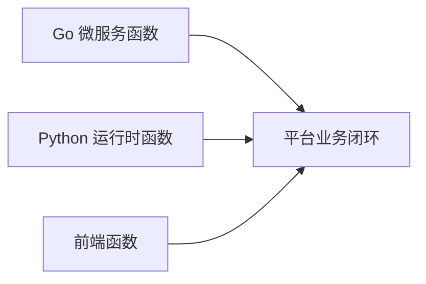
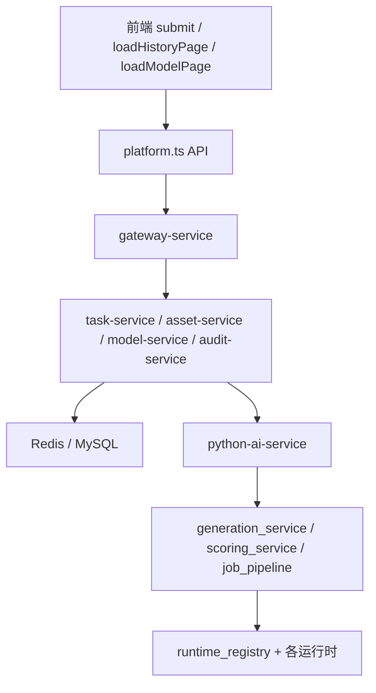

# 项目函数说明

本文档用于汇总当前项目业务代码中的主要函数及其职责，便于论文撰写、项目介绍和后续维护。为保证可读性，本文档按模块分组说明，覆盖项目主业务函数，不包含测试函数，也不展开第三方改造模型源码中的内部细节。

## 1. 总体说明

项目代码主要由三部分组成：

- Go 微服务
- Python AI 运行时与训练脚本
- Vue 3 前端工作台

## 2. Go 微服务函数说明

### 2.1 platform-common 公共函数

| 文件 | 函数 | 作用 |
| --- | --- | --- |
| `services/platform-common/pkg/config/config.go` | `Load` | 加载服务配置 |
| `services/platform-common/pkg/config/config.go` | `getenv` | 读取带默认值的环境变量 |
| `services/platform-common/pkg/config/config.go` | `getenvRequired` | 读取必填环境变量 |
| `services/platform-common/pkg/config/config.go` | `loadLocalEnvFiles` | 加载本地 `.env` 文件 |
| `services/platform-common/pkg/config/config.go` | `dotenvCandidates` | 枚举候选环境文件 |
| `services/platform-common/pkg/jwtx/jwt.go` | `Issue` | 签发 JWT |
| `services/platform-common/pkg/logger/logger.go` | `Info` | 输出信息日志 |
| `services/platform-common/pkg/logger/logger.go` | `Error` | 输出错误日志 |

### 2.2 auth-service

| 文件 | 函数 | 作用 |
| --- | --- | --- |
| `services/auth-service/cmd/server/main.go` | `main` | 启动认证服务 |
| `services/auth-service/controller/auth_controller.go` | `NewAuthController` | 创建认证控制器 |
| `services/auth-service/controller/auth_controller.go` | `Login` | 处理登录请求 |
| `services/auth-service/repository/user_repository.go` | `NewUserRepository` | 创建用户仓储 |
| `services/auth-service/repository/user_repository.go` | `FindByUsername` | 按用户名查询用户 |
| `services/auth-service/router/router.go` | `New` | 创建认证服务路由 |
| `services/auth-service/service/auth_service.go` | `NewAuthService` | 创建认证服务实例 |
| `services/auth-service/service/auth_service.go` | `Login` | 完成登录校验和令牌签发 |

### 2.3 gateway-service

| 文件 | 函数 | 作用 |
| --- | --- | --- |
| `services/gateway-service/cmd/server/main.go` | `main` | 启动网关服务 |
| `services/gateway-service/cmd/server/main.go` | `getenv` | 读取环境变量 |
| `services/gateway-service/middleware/auth.go` | `RequireBearer` | Bearer Token 校验中间件 |
| `services/gateway-service/router/router.go` | `New` | 创建网关路由 |
| `services/gateway-service/service/proxy_service.go` | `NewReverseProxy` | 构造反向代理 |
| `services/gateway-service/service/proxy_service.go` | `NewStaticFileHandler` | 构造静态文件访问处理器 |

### 2.4 model-service

| 文件 | 函数 | 作用 |
| --- | --- | --- |
| `services/model-service/cmd/server/main.go` | `main` | 启动模型服务 |
| `services/model-service/controller/model_controller.go` | `NewModelController` | 创建模型控制器 |
| `services/model-service/controller/model_controller.go` | `ListModels` | 返回模型列表 |
| `services/model-service/controller/model_controller.go` | `GetModel` | 返回单个模型详情 |
| `services/model-service/repository/model_repository.go` | `NewModelRepository` | 创建模型仓储 |
| `services/model-service/repository/model_repository.go` | `modelSchemaStatements` | 生成模型表结构 SQL |
| `services/model-service/repository/model_repository.go` | `ensureSchema` | 确保模型表存在 |
| `services/model-service/repository/model_repository.go` | `isIgnorableMigrationError` | 判断迁移错误是否可忽略 |
| `services/model-service/repository/model_repository.go` | `ListCatalog` | 查询模型目录 |
| `services/model-service/repository/model_repository.go` | `GetByName` | 按模型名查询模型 |
| `services/model-service/router/router.go` | `New` | 创建模型服务路由 |
| `services/model-service/service/model_service.go` | `NewModelService` | 创建模型服务实例 |
| `services/model-service/service/model_service.go` | `ListModels` | 获取模型列表 |
| `services/model-service/service/model_service.go` | `GetModel` | 获取模型详情 |
| `services/model-service/service/model_service.go` | `hydrateStatus` | 结合运行时状态补充模型状态信息 |

### 2.5 task-service

| 文件 | 函数 | 作用 |
| --- | --- | --- |
| `services/task-service/cmd/server/main.go` | `main` | 启动任务服务 |
| `services/task-service/controller/task_controller.go` | `NewTaskController` | 创建任务控制器 |
| `services/task-service/controller/task_controller.go` | `CreateGenerateJob` | 创建生成任务 |
| `services/task-service/controller/task_controller.go` | `GetJob` | 获取任务详情 |
| `services/task-service/controller/task_controller.go` | `ListJobs` | 获取任务列表 |
| `services/task-service/controller/task_controller.go` | `UpdateTaskStatus` | 更新任务状态 |
| `services/task-service/repository/task_repository.go` | `NewTaskRepository` | 创建任务仓储 |
| `services/task-service/repository/task_repository.go` | `taskSchemaStatements` | 生成任务表结构 SQL |
| `services/task-service/repository/task_repository.go` | `ensureSchema` | 确保任务表存在 |
| `services/task-service/repository/task_repository.go` | `isIgnorableMigrationError` | 判断迁移错误是否可忽略 |
| `services/task-service/repository/task_repository.go` | `Create` | 写入任务记录 |
| `services/task-service/repository/task_repository.go` | `GetByID` | 按 ID 查询任务 |
| `services/task-service/repository/task_repository.go` | `List` | 查询任务列表 |
| `services/task-service/repository/task_repository.go` | `UpdateStatus` | 更新任务状态 |
| `services/task-service/router/router.go` | `New` | 创建任务服务路由 |
| `services/task-service/service/task_service.go` | `NewTaskService` | 创建任务服务实例 |
| `services/task-service/service/task_service.go` | `CreateGenerateJob` | 创建生成任务并写入 Redis Stream |
| `services/task-service/service/task_service.go` | `GetJob` | 获取任务详情 |
| `services/task-service/service/task_service.go` | `ListJobs` | 获取任务列表 |
| `services/task-service/service/task_service.go` | `UpdateStatus` | 更新任务状态 |

### 2.6 asset-service

| 文件 | 函数 | 作用 |
| --- | --- | --- |
| `services/asset-service/cmd/server/main.go` | `main` | 启动资产服务 |
| `services/asset-service/controller/asset_controller.go` | `NewAssetController` | 创建资产控制器 |
| `services/asset-service/controller/asset_controller.go` | `SaveGenerateResults` | 写入生成结果 |
| `services/asset-service/controller/asset_controller.go` | `ListHistory` | 返回历史分页列表 |
| `services/asset-service/controller/asset_controller.go` | `GetAssetDetail` | 返回资产详情 |
| `services/asset-service/model/asset.go` | `Normalized` | 规范化分页参数或查询值 |
| `services/asset-service/repository/asset_repository.go` | `NewAssetRepository` | 创建资产仓储 |
| `services/asset-service/repository/asset_repository.go` | `ensureSchema` | 确保资产表存在 |
| `services/asset-service/repository/asset_repository.go` | `SaveResults` | 保存生成结果与评分结果 |
| `services/asset-service/repository/asset_repository.go` | `buildHistoryFilters` | 构造历史筛选条件 |
| `services/asset-service/repository/asset_repository.go` | `ListHistory` | 查询历史分页结果 |
| `services/asset-service/repository/asset_repository.go` | `GetDetail` | 查询资产详情 |
| `services/asset-service/router/router.go` | `New` | 创建资产服务路由 |
| `services/asset-service/service/asset_service.go` | `NewAssetService` | 创建资产服务实例 |
| `services/asset-service/service/asset_service.go` | `SaveGenerateResults` | 保存生成结果 |
| `services/asset-service/service/asset_service.go` | `ListHistory` | 获取历史分页 |
| `services/asset-service/service/asset_service.go` | `GetAssetDetail` | 获取资产详情 |

### 2.7 audit-service

| 文件 | 函数 | 作用 |
| --- | --- | --- |
| `services/audit-service/cmd/server/main.go` | `main` | 启动审计服务 |
| `services/audit-service/controller/audit_controller.go` | `NewAuditController` | 创建审计控制器 |
| `services/audit-service/controller/audit_controller.go` | `RecordTaskEvent` | 写入审计事件 |
| `services/audit-service/controller/audit_controller.go` | `ListTaskEvents` | 查询任务事件 |
| `services/audit-service/repository/audit_repository.go` | `NewAuditRepository` | 创建审计仓储 |
| `services/audit-service/repository/audit_repository.go` | `auditSchemaStatements` | 生成审计表结构 SQL |
| `services/audit-service/repository/audit_repository.go` | `ensureSchema` | 确保审计表存在 |
| `services/audit-service/repository/audit_repository.go` | `isIgnorableMigrationError` | 判断迁移错误是否可忽略 |
| `services/audit-service/repository/audit_repository.go` | `Append` | 追加审计事件 |
| `services/audit-service/repository/audit_repository.go` | `ListByJobID` | 按任务 ID 查询审计事件 |
| `services/audit-service/router/router.go` | `New` | 创建审计服务路由 |
| `services/audit-service/service/audit_service.go` | `NewAuditService` | 创建审计服务实例 |
| `services/audit-service/service/audit_service.go` | `RecordTaskEvent` | 记录任务事件 |
| `services/audit-service/service/audit_service.go` | `ListTaskEvents` | 返回任务事件列表 |
| `services/audit-service/service/audit_service.go` | `extractJobID` | 从事件内容中提取任务 ID |

## 3. Python AI 运行时函数说明

### 3.1 客户端与依赖构造

| 文件 | 函数 | 作用 |
| --- | --- | --- |
| `python-ai-service/app/clients/asset_client.py` | `__init__`、`save_results` | 向资产服务回写生成和评分结果 |
| `python-ai-service/app/clients/audit_client.py` | `__init__`、`record_event` | 向审计服务写入事件 |
| `python-ai-service/app/clients/task_client.py` | `__init__`、`update_status` | 向任务服务更新状态 |
| `python-ai-service/app/dependencies.py` | `build_runtime_registry` | 构建运行时注册中心 |
| `python-ai-service/app/dependencies.py` | `build_generation_service` | 构建生成服务 |
| `python-ai-service/app/dependencies.py` | `build_scoring_service` | 构建评分服务 |
| `python-ai-service/app/dependencies.py` | `build_job_pipeline` | 构建任务流水线 |

### 3.2 核心配置与运行环境

| 文件 | 函数 | 作用 |
| --- | --- | --- |
| `python-ai-service/app/core/runtime_logging.py` | `configure_runtime_logging` | 配置运行时日志 |
| `python-ai-service/app/core/runtime_paths.py` | `__post_init__` | 初始化运行时路径对象 |
| `python-ai-service/app/core/runtime_paths.py` | `hf_home`、`models_generation`、`models_scoring`、`outputs_images`、`logs`、`tmp` | 返回各目录路径 |
| `python-ai-service/app/core/runtime_paths.py` | `directory_map` | 汇总目录映射 |
| `python-ai-service/app/core/runtime_paths.py` | `ensure_directories` | 确保目录存在 |
| `python-ai-service/app/core/runtime_paths.py` | `build_probe_report` | 生成运行时探针报告 |
| `python-ai-service/app/core/settings.py` | `_load_local_env_files` 等一组 `_read_*` 函数 | 加载和解析环境变量 |
| `python-ai-service/app/core/settings.py` | `from_env` | 从环境构造配置对象 |
| `python-ai-service/app/core/settings.py` | `hf_home`、`generation_model_dir`、`scoring_model_dir`、`output_image_dir`、`logs_dir`、`tmp_dir` | 返回各业务目录 |
| `python-ai-service/app/core/settings.py` | `get_settings` | 获取全局配置 |
| `python-ai-service/app/core/torch_cuda.py` | `seed_global_torch` | 设置随机种子 |
| `python-ai-service/app/core/torch_cuda.py` | `best_effort_cleanup_cuda` | 尽力清理 CUDA 显存 |

### 3.3 API 入口

| 文件 | 函数 | 作用 |
| --- | --- | --- |
| `python-ai-service/app/main.py` | `create_app` | 创建 FastAPI 应用 |
| `python-ai-service/app/main.py` | `get_registry`、`get_generator`、`get_scorer` | 注入依赖 |
| `python-ai-service/app/main.py` | `health` | 健康检查 |
| `python-ai-service/app/main.py` | `runtime_status` | 返回运行时状态 |
| `python-ai-service/app/main.py` | `runtime_models` | 返回模型列表 |
| `python-ai-service/app/main.py` | `generate` | 处理内部生成接口 |

### 3.4 生成运行时

| 文件 | 函数 | 作用 |
| --- | --- | --- |
| `python-ai-service/app/runtimes/runtime_registry.py` | `__init__` | 初始化生成运行时工厂 |
| `python-ai-service/app/runtimes/runtime_registry.py` | `get_generation_runtime` | 获取指定生成模型运行时 |
| `python-ai-service/app/runtimes/runtime_registry.py` | `release_generation_runtime` | 释放生成模型 |
| `python-ai-service/app/runtimes/runtime_registry.py` | `list_models` | 列出模型中心展示项 |
| `python-ai-service/app/runtimes/runtime_registry.py` | `build_status` | 构造运行时状态报告 |
| `python-ai-service/app/runtimes/runtime_registry.py` | `_build_sd15_runtime` | 构造 `sd15-electric` 运行时 |
| `python-ai-service/app/runtimes/runtime_registry.py` | `_build_sd15_specialized_runtime` | 构造 `sd15-electric-specialized` 运行时 |
| `python-ai-service/app/runtimes/runtime_registry.py` | `_build_unipic2_runtime` | 构造 `unipic2-kontext` 运行时 |
| `python-ai-service/app/runtimes/runtime_registry.py` | `_release_generation_runtime` | 回收生成模型缓存 |
| `python-ai-service/app/runtimes/runtime_registry.py` | `_package_available`、`_detect_cuda`、`_resolve_status` | 探测包、CUDA 和模型状态 |
| `python-ai-service/app/runtimes/sd15_runtime.py` | `__init__`、`prepare`、`_build_default_pipeline`、`_resolve_pipeline`、`generate`、`_build_generator`、`unload` | `sd15` 路线模型加载、生成、释放 |
| `python-ai-service/app/runtimes/unipic2_runtime.py` | `__init__`、`prepare`、`_model_load_kwargs`、`_build_default_pipeline`、`_apply_execution_strategy`、`_resolve_pipeline`、`generate`、`_build_generator`、`unload` | `UniPic2` 模型加载、策略控制、生成、释放 |

### 3.5 评分运行时

| 文件 | 函数 | 作用 |
| --- | --- | --- |
| `python-ai-service/app/runtimes/scorers/aesthetic_runtime.py` | `_extract_weight_filename` | 解析美学权重文件名 |
| `python-ai-service/app/runtimes/scorers/aesthetic_runtime.py` | `normalize_score` | 美学分归一化 |
| `python-ai-service/app/runtimes/scorers/aesthetic_runtime.py` | `_resolve_device`、`_resolve_weight_path`、`_load_models` | 加载评分模型依赖 |
| `python-ai-service/app/runtimes/scorers/aesthetic_runtime.py` | `score_image`、`unload` | 执行评分与释放资源 |
| `python-ai-service/app/runtimes/scorers/clip_iqa_runtime.py` | `normalize_probability_score` | 概率分归一化 |
| `python-ai-service/app/runtimes/scorers/clip_iqa_runtime.py` | `_resolve_device`、`_load_models` | 加载 CLIP-IQA 评分模型 |
| `python-ai-service/app/runtimes/scorers/clip_iqa_runtime.py` | `score_image`、`unload` | 执行评分与卸载 |
| `python-ai-service/app/runtimes/scorers/image_reward_runtime.py` | `normalize_score` | ImageReward 分数归一化 |
| `python-ai-service/app/runtimes/scorers/image_reward_runtime.py` | `_resolve_device`、`_resolve_download_root`、`_load_model` | 加载 ImageReward |
| `python-ai-service/app/runtimes/scorers/image_reward_runtime.py` | `score_image`、`unload` | 执行文本一致性评分 |
| `python-ai-service/app/runtimes/scorers/power_score_runtime.py` | `encode_prompt`、`clamp_score` | Prompt 编码和分值约束 |
| `python-ai-service/app/runtimes/scorers/power_score_runtime.py` | `score_image`、`score_image_for_model` | 对指定评分模型执行评分 |
| `python-ai-service/app/runtimes/scorers/power_score_runtime.py` | `_ensure_loaded`、`_ensure_hybrid_loaded`、`_ensure_student_loaded` | 确保评分 bundle 加载完成 |
| `python-ai-service/app/runtimes/scorers/power_score_runtime.py` | `_score_student_image`、`_score_hybrid_image` | 两条评分路线的主执行逻辑 |
| `python-ai-service/app/runtimes/scorers/power_score_runtime.py` | `_call_runtime`、`_predict_detections`、`_normalize_detection`、`_analyze_image`、`_analyze_prompt`、`_predict_yolo_features` | 行业检测、Prompt 分析和特征构造 |
| `python-ai-service/app/runtimes/scorers/power_score_runtime.py` | `unload` | 释放评分模型资源 |

### 3.6 生成、评分和任务流水线

| 文件 | 函数 | 作用 |
| --- | --- | --- |
| `python-ai-service/app/services/generation_service.py` | `generate` | 调用生成运行时出图 |
| `python-ai-service/app/services/generation_service.py` | `_resolve_seed` | 解析和生成随机种子 |
| `python-ai-service/app/services/scoring_service.py` | `combine_scores` | 汇总四维分数与总分 |
| `python-ai-service/app/services/scoring_service.py` | `score_batch` | 批量评分 |
| `python-ai-service/app/services/scoring_service.py` | `_score_image` | 选择评分模型路线 |
| `python-ai-service/app/services/scoring_service.py` | `_score_legacy_image` | 走默认评分链路 |
| `python-ai-service/app/services/scoring_service.py` | `release_resources` | 释放评分资源 |
| `python-ai-service/app/services/scoring_service.py` | `_compress_high_tail`、`_lift_low_band` | 总分校准函数 |
| `python-ai-service/app/services/job_pipeline.py` | `__init__`、`run` | 执行任务流水线 |
| `python-ai-service/app/services/mock_generator.py` | `generate_placeholder` | 生成占位图 |
| `python-ai-service/app/services/mock_scorer.py` | `score_from_prompt` | 生成 mock 分数 |
| `python-ai-service/app/worker.py` | `build_worker`、`main` | 启动 Worker |
| `python-ai-service/app/workers/job_worker.py` | `ensure_consumer_group`、`process_payload`、`process_stream_message`、`consume_once`、`_process_stream_batches`、`_reclaim_stale_messages`、`consume_forever`、`_normalize_fields`、`_decode_value` | Redis Stream 消费与任务处理 |

### 3.7 脚本与训练入口

| 文件 | 函数 | 作用 |
| --- | --- | --- |
| `python-ai-service/scripts/bootstrap.py` | `ensure_project_root_on_path` | 确保脚本运行时加载项目根路径 |
| `python-ai-service/scripts/download_models.py` | `get_legacy_project_root`、`resolve_aesthetic_weight_source`、`get_model_manifest`、`_copy_local_weight`、`_download_huggingface`、`execute_download_plan`、`main` | 管理模型下载和运行时目录准备 |
| `python-ai-service/scripts/prepare_generation_v3_dataset.py` | `_existing`、`main` | 准备生成训练数据集 |
| `python-ai-service/scripts/runtime_probe.py` | `_package_available`、`_detect_cuda`、`build_runtime_probe`、`main` | 生成运行时探针报告 |
| `python-ai-service/scripts/train_generation_v3.py` | `main` | 生成模型训练入口 |
| `python-ai-service/scripts/train_scoring_v3.py` | `main` | 评分模型训练入口 |

## 4. Python 训练流水线函数说明

| 文件 | 函数 | 作用 |
| --- | --- | --- |
| `python-ai-service/training/generation/build_manifest.py` | `build_generation_manifest` | 构建生成训练清单 |
| `python-ai-service/training/generation/scan_sources.py` | `scan_image_roots` | 扫描图片目录 |
| `python-ai-service/training/generation/captioning.py` | `_extract_tokens`、`_append_matching_phrases`、`apply_stub_caption` | 从路径和文件名生成初始 caption |
| `python-ai-service/training/generation/dedupe.py` | `compute_file_fingerprint`、`dedupe_rows_by_fingerprint` | 按指纹去重 |
| `python-ai-service/training/generation/prepare_dataset.py` | `prepare_generation_dataset` | 生成 raw manifest |
| `python-ai-service/training/generation/pipeline.py` | `_load_manifest_rows`、`_select_rows`、`_export_curated_dataset`、`prepare_generation_training_workspace`、`run_generation_training` | 生成模型训练主流程 |
| `python-ai-service/training/scoring/pipeline.py` | `run_scoring_training`、`_resolve_yolo_source`、`_write_json` | 评分训练 bundle 构造主流程 |

## 5. 前端函数说明

### 5.1 API 层

| 文件 | 函数 | 作用 |
| --- | --- | --- |
| `web-console/src/api/platform.ts` | `createGenerateTask` | 创建生成任务 |
| `web-console/src/api/platform.ts` | `getTask` | 获取任务详情 |
| `web-console/src/api/platform.ts` | `listTasks` | 获取任务列表 |
| `web-console/src/api/platform.ts` | `listAssetHistory` | 获取历史分页 |
| `web-console/src/api/platform.ts` | `getAssetDetail` | 获取资产详情 |
| `web-console/src/api/platform.ts` | `listTaskAuditEvents` | 获取任务审计事件 |
| `web-console/src/api/platform.ts` | `listModels` | 获取模型列表 |
| `web-console/src/api/platform.ts` | `buildImageUrl` | 生成图片访问 URL |

### 5.2 状态管理

| 文件 | 函数 | 作用 |
| --- | --- | --- |
| `web-console/src/stores/auth.ts` | `getStorage` | 获取本地存储对象 |
| `web-console/src/stores/platform.ts` | `isCacheFresh` | 判断缓存是否新鲜 |
| `web-console/src/stores/platform.ts` | `extractErrorMessage` | 提取错误提示 |
| `web-console/src/stores/platform.ts` | `createDefaultHistoryQuery` | 创建默认历史查询条件 |
| `web-console/src/stores/platform.ts` | `sanitizeHistoryQuery` | 清洗历史查询参数 |
| `web-console/src/stores/platform.ts` | `toHistoryApiParams` | 转换为后端接口参数 |
| `web-console/src/stores/platform.ts` | `ensureHistoryPage` | 规范化分页响应 |
| `web-console/src/stores/platform.ts` | `serializeHistoryQuery` | 序列化查询条件 |

### 5.3 通用工具与组件逻辑

| 文件 | 函数 | 作用 |
| --- | --- | --- |
| `web-console/src/utils/mobile-layout.ts` | `getWorkbenchSections`、`shouldUseHistoryCards` | 响应式布局判断 |
| `web-console/src/utils/score-grade.ts` | `getScoreGrade` | 根据分数返回等级 |
| `web-console/src/components/audit/audit-event-presenter.ts` | `normalizeEventType`、`includesAny`、`parsePayload`、`formatValue`、`joinSentence`、`summarizePayload`、`resolveTitle`、`resolveDescription`、`presentAuditEvent` | 审计事件可读化 |
| `web-console/src/components/workbench/generation-progress.ts` | `normalize`、`includesAny`、`sortAuditEvents`、`resolvePhaseIndex`、`buildPhaseState`、`buildHeadline`、`buildDetail`、`formatAuditEventLabel`、`getRecentAuditEvents`、`buildGenerationProgress` | 生成进度构造逻辑 |

### 5.4 页面与视图函数

| 文件 | 函数 | 作用 |
| --- | --- | --- |
| `web-console/src/components/AppShell.vue` | `syncViewport`、`go`、`logout` | 外壳导航与退出登录 |
| `web-console/src/components/history/HistoryDetailDrawer.vue` | `syncViewport` | 历史详情抽屉响应式处理 |
| `web-console/src/components/history/HistoryTable.vue` | `syncViewport` | 历史列表响应式处理 |
| `web-console/src/components/workbench/ScoreRadar.vue` | `polarPoint`、`angle`、`gridPoint` | 雷达图坐标计算 |
| `web-console/src/views/DashboardView.vue` | `loadDashboard` | 加载概览页数据 |
| `web-console/src/views/generate-defaults.ts` | `getRandomRecommendedPositivePrompt` | 生成推荐 Prompt |
| `web-console/src/views/GenerateView.vue` | `stopPolling`、`syncViewport`、`tickTask`、`startPolling`、`submit`、`applyModelDefaults`、`fillDefaults`、`syncModelFromRoute`、`bootstrapWorkbench` | 工作台主流程 |
| `web-console/src/views/history-pagination.ts` | `shouldFallbackToFirstHistoryPage` | 历史分页回退判断 |
| `web-console/src/views/HistoryView.vue` | `buildHistoryQuery`、`openDetail`、`resetFilters`、`loadHistoryPage`、`scheduleHistoryReload`、`handlePageChange`、`handlePageSizeChange`、`syncViewport` | 历史页主逻辑 |
| `web-console/src/views/LoginView.vue` | `submit` | 登录提交流程 |
| `web-console/src/views/ModelCenterView.vue` | `jumpToGenerate`、`loadModelPage` | 模型中心跳转与加载 |
| `web-console/src/views/task-audit-utils.ts` | `toTimestamp`、`pickLatestTask`、`pickLatestHistory`、`resolveAuditTaskId` | 任务审计辅助函数 |
| `web-console/src/views/TaskAuditView.vue` | `bootstrapAuditContext`、`loadTaskAuditPage` | 任务审计页初始化与加载 |

## 6. 函数调用关系简图

## 7. 总结

项目函数体系可以概括为：

- Go 侧函数负责服务启动、路由、控制器、仓储和业务编排
- Python 侧函数负责模型加载、生成、评分、任务消费和训练脚本
- 前端函数负责任务提交、历史分页、审计展示、模型展示和响应式交互

如果后续需要把这份文档继续扩展成“逐函数逐参数说明”，可以在本文基础上继续补充每个函数的参数、返回值和调用关系。
