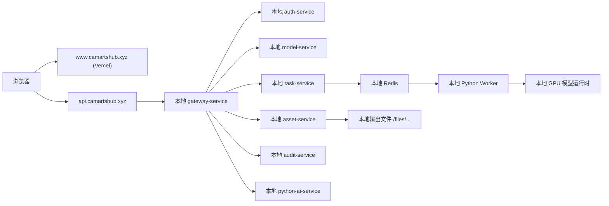

# Vercel 前端 + 本地 GPU 后端部署设计

**日期**：2026-04-25

## 目标

将 `web-console` 部署到 `Vercel`，并绑定到 `www.camartshub.xyz`；同时保留当前本地 GPU 电脑作为完整后端与模型运行节点，使平台在公网域名下可以完整访问登录、任务、历史、模型和图片资源。

## 已确认约束

- GitHub 仓库为 `https://github.com/hrzt66/electric-ai-platform`
- 前后端代码位于同一个仓库中
- 前端需要走 `Vercel` 自动部署
- `www.camartshub.xyz` 作为主入口
- `camartshub.xyz` 跳转到 `https://www.camartshub.xyz`
- 本地 GPU 电脑可以长期在线
- 当前云服务器暂不承载模型部署，本轮不作为主业务承载节点

## 设计决策

采用“`Vercel` 托管前端 + 本地电脑暴露统一网关”的方案。

- `Vercel` 只负责托管前端静态资源。
- 公网后端只暴露一个入口，即 `api.camartshub.xyz`。
- `api.camartshub.xyz` 指向本地电脑上的 `gateway-service`。
- `gateway-service` 继续转发到本机的 `auth-service`、`model-service`、`task-service`、`asset-service`、`audit-service` 与 Python AI 运行时。
- 模型推理、评分、Worker 消费、文件输出仍保留在本地 GPU 电脑，不迁移到云服务器。

该方案优先保证“尽快完整上线”，同时尽量减少对现有微服务结构的改动。

## 目标域名结构

- `www.camartshub.xyz`
  前端正式站点，由 `Vercel` 托管。
- `camartshub.xyz`
  301 跳转到 `https://www.camartshub.xyz`。
- `api.camartshub.xyz`
  后端统一入口，转到本地电脑上的网关服务。

## 系统架构

## 前端设计

### 部署方式

- `Vercel` 直接连接 GitHub 仓库 `hrzt66/electric-ai-platform`
- `Root Directory` 指向 `web-console`
- `Build Command` 使用 `npm run build`
- `Output Directory` 使用 `dist`

### API 地址策略

前端不能继续只依赖 `vite.config.ts` 中的开发代理，因为 `Vercel` 生产环境不存在本地 Vite 代理层。需要改为“开发环境走相对路径，生产环境走显式环境变量”的设计。

- 开发环境保留当前 `Vite` 代理体验
- 生产环境通过 `Vercel` 环境变量指定 API 根地址
- `axios` 的 `baseURL` 不能写死为仅适用于开发环境的相对路径
- 图片资源 URL 也需要基于同一后端源站生成，避免生产环境仍指向前端站点自身

### 涉及文件

- 修改：`web-console/src/api/http.ts`
- 修改：`web-console/src/api/platform.ts`
- 可能新增：`web-console/.env.production`
- 可能新增：仓库根目录或 `web-console` 下的 `vercel.json`
- 可能更新：`web-console/vite.config.ts`

## 后端公网暴露设计

### 暴露原则

公网只暴露一个入口，即本地电脑的 `gateway-service`。

- 浏览器不直接访问各微服务单独端口
- 浏览器不直接访问 Python 服务端口
- 图片仍通过网关的 `/files/...` 路径访问
- 其余服务维持本机回环或内网调用关系

### 暴露方式

本轮实现以“域名映射到本地网关入口”为目标，具体技术实现可以是反向隧道、内网穿透或反向代理，但必须满足以下约束：

- `api.camartshub.xyz` 对外只暴露统一网关
- 网关需要支持 HTTPS 终止或由上层代理负责 HTTPS
- 本地微服务之间的现有调用方式尽量不改
- 生产访问域名固定为 `https://api.camartshub.xyz`

## 运行与可用性边界

- 当前版本的业务可用性依赖本地 GPU 电脑持续在线
- 若本地电脑离线，`www` 仍可打开，但登录、任务、历史、图片访问会失败
- 故障应收敛为 API 不可用，而不是前端页面静态资源加载失败
- 本轮不处理“云服务器接管业务层”的迁移，只保证当前结构能完整上线

## 错误处理要求

- 前端需要统一使用生产 API 源站，避免页面可访问但接口仍打到本地地址
- 登录失效处理继续沿用现有 401 逻辑
- 图片 URL 必须与 API 域名保持同源或可控跨域关系
- 若后端网关不可达，应返回清晰的前端接口失败表现，而不是静默超时

## 安全边界

- 不在公网暴露数据库、Redis、Python 内部端口
- 只开放网关对外访问所需的 HTTP/HTTPS 入口
- 后端访问链路尽量收敛到单域名，便于证书和跨域管理
- 如使用隧道或代理，优先采用支持域名绑定和 TLS 的方案

## 验证方式

### 部署验证

- `Vercel` 成功从 GitHub 仓库自动构建 `web-console`
- `www.camartshub.xyz` 能正确打开前端首页
- `camartshub.xyz` 会跳转到 `https://www.camartshub.xyz`

### 联通验证

- `https://api.camartshub.xyz` 能访问网关健康接口
- 前端登录请求能成功到达本地网关
- 模型列表、历史中心、任务审计接口可正常返回
- 图片资源可通过 `/files/...` 正常显示

### 业务验证

- 能在生产域名下完成一次真实登录
- 能提交一次真实生成任务
- 能轮询到任务状态变化
- 能在历史中心看到生成结果与详情

## 后续演进预留

- 后续若云服务器具备更强算力，可把业务层或 AI 层逐步迁移到云端
- 只要前端继续使用 `www` 和 `api` 两层域名抽象，未来迁移不需要重做前端发布结构
- 当前设计优先服务“毕业设计展示可用”和“快速公网演示”
