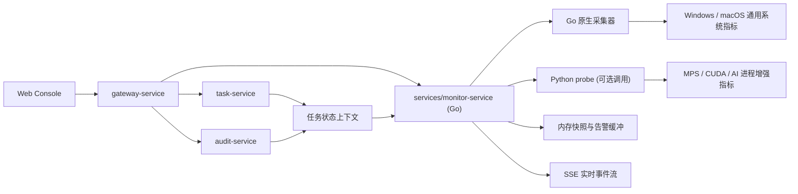

# 跨平台 AI 运行健康监控微服务设计

**日期**：2026-05-02

## 目标

为当前 `electric-ai-platform` 新增一个独立的监控微服务，面向 `Windows` 与 `macOS` 双系统，自动识别宿主机环境并提供统一的 AI 运行健康监控能力。该服务归属于现有 `Go` 微服务体系，负责对外提供 HTTP API、实时推送、健康判定和告警聚合；必要时允许调用 `Python probe` 辅助脚本，以补足跨平台 AI 运行时指标采集能力。

## 已确认约束

- 当前仓库已有 `Go 微服务 + Python AI 运行时 + Vue 3 前端控制台` 基础架构。
- 本轮需求明确要求“新增一个微服务”，且该微服务需要归入 `Go` 微服务体系。
- `Python` 可以参与实现，但只能作为被 `Go monitor-service` 调用的探针助手，不能继续承载主 API 服务。
- 监控服务需要兼顾 `Windows` 与 `macOS`，不能写死为 `NVIDIA + nvidia-smi` 路线。
- 用户当前本机是 `macOS`，但首版设计必须同时考虑 Windows 的展示和采集兼容。
- 前端需要兼顾双系统，不允许在 macOS 页面中出现只适用于 NVIDIA 的误导性文案。
- 监控内容既要覆盖整机资源，也要重点突出 AI 运行健康。
- 实时体验优先于简单实现，前端需要采用服务端主动推送方案。
- 首版做“监控 + 告警 + 任务上下文关联”，不做自动干预或任务控制。

## 设计决策

采用“`Go monitor-service` + 可选 `Python probe` + SSE 实时推送 + 任务上下文关联”的方案。

- 新增 `services/monitor-service`，作为新的 `Go` 微服务。
- `Go monitor-service` 负责：
  - 宿主机平台识别
  - 采样调度
  - 指标归一化
  - 健康等级判定
  - 告警生成与恢复
  - 任务上下文关联
  - HTTP API 与 `SSE` 输出
- `Python probe` 仅负责输出结构化采集结果，不对外暴露独立 API。
- `monitor-service` 优先直接采集通用系统指标；遇到 `MPS`、`CUDA`、AI 进程辅助诊断等更适合 Python 获取的信息时，再调用 `probe`。
- `gateway-service` 继续作为统一入口，对外暴露 `/api/v1/monitor/*`。
- `web-console` 首页接入新的实时监控面板，统一以“AI 运行健康”为主标题，再按平台差异展示具体指标。

该方案优先保证微服务归属清晰、与现有 Go 服务结构一致、前端实时体验良好，并保留 Python 在 AI 运行时信息采集上的灵活性。

## 不采用的方案

### 方案一：把监控逻辑直接塞进 `python-ai-service`

不采用该方案，原因如下：

- 不满足“新增微服务”的明确目标。
- 不满足“微服务归到 Go 里面”的新增约束。
- AI 推理职责与基础设施监控职责会耦合。

### 方案二：新建纯 Python `monitor-service`

不采用该方案，原因如下：

- 与“主微服务归到 Go 里面”的要求冲突。
- 会让监控服务在技术栈边界上偏离现有 Go 微服务主线。
- 后续需要在 Go 网关和 Go 服务体系中解释一个例外服务，架构叙事更弱。

### 方案三：仅做整机资源轮询，不做 AI 进程和任务关联

不采用该方案，原因如下：

- 只能看到机器资源高低，无法解释“为什么高”。
- 无法突出毕业设计平台中的 AI 主链路价值。
- 前端体验会退化成普通系统监控，而不是“AI 运行健康监控”。

## 系统架构

### 服务职责

- `services/monitor-service`
  - 识别宿主机平台
  - 周期采集监控指标
  - 调用 Python probe 获取增强指标
  - 归一化平台差异
  - 判定健康等级
  - 生成与恢复告警
  - 读取任务上下文
  - 对外提供快照、告警和 `SSE`
- `Python probe`
  - 输出 JSON 结构化采样结果
  - 不直接对外开放 HTTP 接口
  - 被 `Go monitor-service` 通过子进程调用
- `gateway-service`
  - 新增 `MONITOR_SERVICE_URL`
  - 代理 `/api/v1/monitor/*`
- `web-console`
  - 新增首页监控面板
  - 订阅 `SSE` 实时流
  - 根据平台差异渲染文案和指标

## 跨平台采集策略

### Go 原生采集层

`Go monitor-service` 直接负责以下跨平台通用信息：

- CPU 使用率
- 系统内存总量、已用、可用
- 磁盘总量、已用、可用
- 服务进程在线状态
- 基础进程内存和 CPU 占用

这些指标应尽量由 Go 层直接完成，避免所有采样都依赖 Python。

### Python probe 增强层

以下信息允许交给 Python probe 采集并输出 JSON：

- `macOS` 下 `MPS` 是否可用
- `Apple Silicon` 下与 AI 运行相关的统一内存辅助判断
- `Windows + CUDA/NVIDIA` 下更适合从 Python 运行时或 AI 侧获取的补充指标
- `python-ai-service` / worker 进程的更细粒度辅助诊断

Python probe 的职责边界：

- 接收 `Go` 层传入的平台参数或采样模式参数
- 输出单次采样 JSON
- 采样失败时输出明确错误
- 不保存长期状态
- 不承担读写 API 请求

### Windows 路线

适用于本机存在 `Windows` 运行环境时的采集。

采集重点：

- CPU 使用率
- 系统内存总量、已用、可用
- 磁盘总量、已用、可用
- AI 关键进程占用
- 若存在可用 `CUDA/NVIDIA` 指标，则补采：
  - GPU 名称
  - 显存总量
  - 显存已用
  - GPU 利用率
  - 温度

Windows 下“显存健康”以 GPU 显存为主语义。

### macOS 路线

适用于 `macOS` 主机，包括 Apple Silicon 与 Intel Mac。

采集重点：

- CPU 使用率
- 系统统一内存总量、已用、可用
- 内存压力等级
- `swap` 使用情况
- 磁盘总量、已用、可用
- AI 关键进程占用
- `MPS` 是否可用

在 `Apple Silicon` 下，“显存健康”改为“AI 加速资源健康”的等价概念，重点根据以下信息综合判断：

- 统一内存占用率
- `swap` 是否持续增长
- `MPS` 是否可用
- `python-ai-service` / worker 是否在任务执行期间维持高内存占用

在 `Intel Mac` 且无法稳定获取 GPU 指标时，服务仍需正常工作，但明确返回“GPU 指标不可用”，不影响整机与 AI 进程健康监控。

### 平台识别原则

- `Go monitor-service` 启动时先识别当前宿主机的 `OS`。
- 运行时快照中返回 `platform_family` 与 `accelerator_type`。
- 所有下游接口与前端逻辑必须基于归一化字段，而不是直接依赖原始平台命令输出。

## 监控数据模型

监控结果统一分为四层。

### 1. `host_snapshot`

整机级资源状态：

- `platform_family`
- `captured_at`
- `cpu_usage_percent`
- `memory_total_bytes`
- `memory_used_bytes`
- `memory_available_bytes`
- `memory_pressure_level`
- `swap_used_bytes`
- `swap_total_bytes`
- `disk_total_bytes`
- `disk_used_bytes`
- `disk_available_bytes`

### 2. `accelerator_snapshot`

AI 加速资源状态：

- `accelerator_type`
  - 可取 `nvidia-cuda`
  - 可取 `apple-mps`
  - 可取 `unavailable`
- `available`
- `summary_label`
- `gpu_name`
- `vram_total_mb`
- `vram_used_mb`
- `gpu_utilization_percent`
- `temperature_c`
- `mps_available`
- `unified_memory_pressure`
- `ai_process_memory_bytes`
- `unavailable_reason`

说明：

- 在 `Windows + NVIDIA` 路线下，重点填写显存、GPU 利用率和温度。
- 在 `macOS` 路线下，重点填写 `MPS`、统一内存压力与 AI 进程占用。

### 3. `service_snapshot`

AI 相关服务与进程状态：

- `service_name`
- `display_name`
- `pid`
- `status`
- `uptime_seconds`
- `cpu_percent`
- `resident_memory_bytes`
- `sample_ok`
- `sample_error`

首版重点监控：

- `python-ai-service`
- `python-ai-worker`
- `gateway-service`

### 4. `task_runtime_context`

任务上下文摘要：

- `active_task_count`
- `latest_task_id`
- `latest_task_status`
- `latest_task_stage`
- `last_stage_changed_at`
- `context_source`

该层用于解释资源波动与任务阶段之间的关系，例如模型加载、生成、评分或故障恢复阶段。

## 健康等级与告警规则

统一健康等级：

- `healthy`
- `warning`
- `critical`

### Windows / NVIDIA 规则

- 显存使用率 `>= 80%`：`warning`
- 显存使用率 `>= 90%`：`critical`
- GPU 温度 `>= 80C`：`warning`
- GPU 温度 `>= 85C`：`critical`

### macOS / Apple Silicon 规则

- 统一内存使用率连续 3 次采样 `>= 80%`：`warning`
- `swap` 使用量连续 3 次采样增长，且 AI 进程常驻内存总量 `>= 4 GB`：`critical`
- `MPS` 不可用且仍存在活跃生成或评分任务：
  - 首次触发：`warning`
  - 连续 3 次采样仍未恢复：`critical`

### 通用规则

- AI 关键进程掉线：`critical`
- 连续 3 次采样失败：`critical`
- CPU 使用率连续 5 次采样 `>= 85%`：`warning`
- 磁盘使用率 `>= 85%`：`warning`
- 磁盘使用率 `>= 95%`：`critical`
- 无活跃任务时，AI 进程常驻内存总量连续 5 次采样 `>= 3 GB`：`warning`

### 告警分类

- `active_alerts`
  当前仍在发生的告警
- `recent_alerts`
  最近已恢复的告警

每条告警至少包含：

- `alert_id`
- `level`
- `category`
- `title`
- `message`
- `raised_at`
- `recovered_at`
- `platform_family`
- `task_context`

## 任务上下文关联策略

`monitor-service` 只读接入任务上下文，不直接控制任务。

关联方式：

- 从 `task-service` 获取最近活跃任务
- 必要时从 `audit-service` 获取最近任务事件
- 将任务信息折叠为轻量 `task_runtime_context`

目标效果：

- 解释当前高压是否由活跃任务引起
- 指出高资源占用出现在哪个任务阶段
- 在前端中让告警具备“原因可读性”

## API 设计

### `GET /health`

服务健康检查，只返回服务是否存活。

### `GET /api/v1/monitor/overview`

返回当前最新监控快照，作为前端初次加载数据源。

响应应包含：

- `host_snapshot`
- `accelerator_snapshot`
- `service_snapshots`
- `task_runtime_context`
- `overall_health`
- `active_alerts`

### `GET /api/v1/monitor/alerts`

返回当前活跃告警与最近告警。

### `GET /api/v1/monitor/stream`

使用 `SSE` 持续推送实时事件。

首版事件类型：

- `snapshot`
- `alert_raised`
- `alert_recovered`
- `task_context_changed`

### 网关接入

`gateway-service` 新增：

- `MONITOR_SERVICE_URL`
- `/api/v1/monitor`
- `/api/v1/monitor/*path`

前端仍只访问网关，不直接访问 `monitor-service`。

## 前端设计

首版在 `DashboardView` 增加实时监控面板，主标题统一为“AI 运行健康”。

### 页面结构

- 当前整体健康状态卡片
- AI 关键服务在线状态
- 平台相关资源摘要
- 最近活跃任务上下文
- 活跃告警与最近告警列表

### 平台差异展示

`Windows + NVIDIA` 显示：

- 显存占用
- GPU 利用率
- 温度

`macOS` 显示：

- 统一内存压力
- `swap`
- `MPS` 状态
- AI 进程内存占用

### 双系统兼容原则

- 主标题统一，不写死“显存监控”作为唯一页面概念。
- 子指标按平台切换。
- 不可用指标显示“当前系统暂不提供该指标”，而不是报错样式。
- 告警文案按平台转换，避免在 macOS 中出现 NVIDIA 专用术语。

### 前端实时连接策略

- 首次加载调用 `GET /api/v1/monitor/overview`
- 随后建立一个带 `Authorization` 头的 `fetch` 流式连接，消费 `text/event-stream`
- 连接中断时自动重连
- 断线期间展示轻量提示，不阻断页面其他功能

## 异常处理与降级要求

- 某类指标采集失败时，不允许整个监控接口报错退出。
- 缺失指标应返回 `available=false` 与具体原因。
- `overview` 接口始终尽量返回部分可用数据。
- `SSE` 在局部采集失败时继续推送状态事件。
- 采样失败本身也应纳入告警体系。

## 技术实现方向

主服务使用 `Go + Gin`，并对齐现有 `services/*-service` 结构。

建议新增目录：

- `services/monitor-service/cmd/server/main.go`
- `services/monitor-service/router/router.go`
- `services/monitor-service/controller/monitor_controller.go`
- `services/monitor-service/service/monitor_service.go`

建议新增 Python probe 辅助目录：

- `monitor-probe/` 或
- `python-ai-service/scripts/monitor_probe.py`

原则：

- Go 是主服务
- Python 是被调用探针
- 不新增第二个对外 API 服务

## 测试策略

### Go 单元测试

- 平台识别逻辑
- 指标归一化
- 告警阈值判定
- 探针输出解析
- `SSE` 事件构造

### Go 集成测试

- `overview` 接口
- `alerts` 接口
- `stream` 接口
- `gateway-service` 代理 `/api/v1/monitor/*`

### 前端测试

- 不同平台下的面板渲染
- `SSE` 数据驱动页面实时刷新
- 指标缺失时的降级展示
- 告警列表状态更新

### 手工验证

- `macOS` 本机验证实时刷新与资源变化
- `Windows` 路线验证字段兼容与展示文案
- 活跃任务前后观察健康状态变化

## 验收标准

- 新增独立 `Go monitor-service` 并可单独启动。
- 服务能够自动识别 `Windows` 与 `macOS` 平台。
- 前端首页能实时显示 AI 运行健康状态。
- macOS 下页面不会出现仅适用于 NVIDIA 的硬编码文案。
- Windows 下若存在 GPU 指标，可显示显存、温度与 GPU 利用率。
- 监控服务能输出活跃告警与最近恢复告警。
- 告警能结合任务上下文解释资源波动来源。
- 网关统一代理监控接口，前端不直连新服务。
- Python 仅作为探针被调用，不承载独立 API。

## 风险与后续演进

### 首版风险

- 不同 `macOS` 版本下可直接获取的 GPU 细粒度指标有限。
- Windows 路线下 GPU 指标是否可用依赖宿主机环境与驱动。
- Python probe 的路径、环境和依赖需要被 `Go monitor-service` 稳定定位。
- AI 进程名或启动方式变化时，进程识别规则可能需要同步更新。

### 缓解方式

- 所有平台差异都收敛到统一归一化字段，不把原始命令输出暴露给前端。
- 对不可用指标明确返回原因并降级展示。
- Go 侧允许 probe 失败降级，不让单个 probe 失败拖垮整个监控接口。
- 首版先保证“稳定可解释”，再逐步增加更细粒度的性能指标。

### 后续演进

- 增加独立监控页，而不仅限于首页摘要卡片。
- 增加任务阶段与资源峰值的时间线分析。
- 增加监控历史缓存和短时趋势图。
- 增加可配置阈值与告警静默策略。
- 若后续需要，再引入自动干预机制，但不纳入本轮范围。
