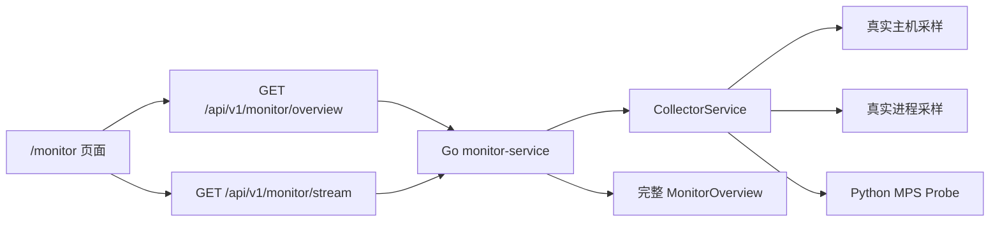

# 正式监控平台设计

**日期**：2026-05-03

## 目标

把当前 `web-console` 中偏展示型的“AI 运行监控驾驶舱”升级为一个更正式、可持续值守、可用于论文与答辩展示的监控平台首页，同时把实时性从“首帧快照 + 单次 SSE”提升为稳定的 `1 秒级持续刷新`。

本轮设计目标分为两部分：

- 让监控数据链路具备真正的 `1 秒级实时感`，而不是只在页面进入时看到一次快照。
- 让监控页面具备正式 `NOC` 风格的信息架构，能够在普通后台窗口内清楚展示平台健康、主机资源、关键服务和 AI 运行状态。

## 已确认结论

- 用户明确要求“后续都由我来做决定”，不再需要中间确认。
- 用户选择 `1 秒级` 刷新，而不是 500ms 或 100ms 级近实时。
- 用户希望首页同时包含：
  - 运维值班台视角
  - 资源监控台视角
  - AI 运行监控台视角
- 用户选择 `企业 NOC 大屏` 风格，但使用场景以普通后台窗口查看为主，不是纯全屏展示。
- 用户要求采用多进程/多子任务并行执行。

## 当前问题

当前监控页已经能显示真实主机与 MPS 数据，但仍有两个核心短板：

### 1. 实时性不足

目前 `/api/v1/monitor/stream` 只是返回一帧 SSE 快照，而不是持续流。

这会导致：

- 页面进入时能看到数据，但后续不会稳定每秒刷新。
- “实时连接中”更多只是连接存在，不代表持续收到新数据。
- 页面不能形成正式监控平台应有的趋势和跳动感。

### 2. 页面更像状态展示页，不像正式监控平台

当前页面结构以圆环卡片和说明块为主，更接近“好看的监控看板”，但还不够像正式平台：

- 顶部没有明确的全局健康状态带。
- 缺少最近 1 分钟趋势区，无法体现持续监控。
- 服务区、告警区、AI 运行区之间层级还不够强。
- 数字、状态、解释混在一起，信息密度不够稳定。
- 页面视觉是“驾驶舱”，但不是正式 `NOC` 运维监控台。

## 设计决策

采用“`1 秒级持续 SSE + NOC 风格单页监控首页`”方案。

### 实时链路决策

- 后端 `monitor-service` 继续保留 `GET /api/v1/monitor/overview` 作为首屏补帧接口。
- 后端 `GET /api/v1/monitor/stream` 升级为持续输出的 SSE 流，每 `1 秒` 推送一帧完整 `MonitorOverview`。
- 前端进入监控页时：
  - 先请求一次 `overview`
  - 再连接持续 SSE
  - SSE 中断后自动显示连接状态异常，并触发有限重连

### 页面形态决策

首页采用 `单页 NOC 驾驶舱`，但专门针对普通后台窗口优化，而不是做超宽全屏大屏。

首屏结构固定为三层：

1. `全局状态带`
2. `实时趋势与资源主区`
3. `服务 / 告警 / AI 运行明细区`

这样做的原因：

- 第一眼先回答“系统现在是否健康”
- 第二眼回答“是哪一层出问题”
- 第三眼再进入资源、服务和 AI 任务细节

## 不采用的方案

### 方案一：继续保留当前单次 SSE，只优化 UI

不采用。

原因：

- 页面再正式，也不能掩盖数据不持续更新的问题。
- 用户已经明确指出“数据还是不够实时”。
- 这会得到一个更漂亮但并不真正实时的监控页。

### 方案二：用短轮询替代持续 SSE

本轮不采用。

原因：

- 每秒轮询 `overview` 当然能工作，但语义上更像轮询面板，而不是实时监控流。
- 现有链路已经有 `/stream`，直接补齐持续流更顺滑。
- SSE 更适合表达连接状态和持续推送关系。

### 方案三：拆成首页 + 多个详情页

本轮不采用。

原因：

- 用户当前需要的是“非常正式的监控平台”主页面，而不是先做复杂 IA。
- 先把首页做到强、稳、实时，最符合当前目标。
- 详情页可以作为后续迭代，而不是阻塞本轮交付。

## 系统架构

## 页面信息架构

### 1. 全局状态带

放在页面顶部，强调“平台当前是否健康”。

展示内容：

- 页面标题：`平台运行监控中心`
- 页面副标题：`1 秒级实时采样 · Host / Service / AI Runtime`
- 全局健康等级
- 实时连接状态
- 最新采样时间
- 平台类型

展示原则：

- 健康等级和连接状态优先级最高。
- 时间戳使用“最近更新时间 + 绝对时间”的组合表达。
- 顶部背景采用强对比深色，不用普通白卡片。

### 2. 顶部摘要指标带

这一行负责快速概览。

固定展示 4 个摘要卡：

- 总体健康
- 活跃告警数
- 关键服务在线数
- 活跃任务数

每张卡都必须包含：

- 主数字或状态词
- 一句简短解释
- 与健康等级联动的视觉强调

### 3. 实时趋势主区

这是本轮比当前页面新增的关键区域。

展示最近 `60 秒` 的小趋势带：

- CPU 使用率趋势
- 内存使用率趋势
- AI 进程内存趋势

实现原则：

- 前端维护最近 60 帧的轻量历史数组，不要求后端提供历史查询。
- 趋势图采用轻量 SVG 或纯 CSS 折线/柱线表达，不引入重图表库。
- 这一块是“正式监控平台感”的关键来源。

### 4. 资源主区

资源区采用 `NOC 指标卡 + 环形负载` 的组合，而不是只靠三枚大圆环。

固定展示：

- CPU
- Memory
- Disk
- AI Accelerator

规则：

- CPU、内存、磁盘优先显示真实百分比。
- `MPS` 不伪造 GPU 百分比。
- 对 Apple Silicon：
  - 用 `MPS Available / Preferred Device / AI Process Memory / Unified Pressure`
  - 不再硬塞“假 GPU 使用率”

### 5. 服务运行矩阵

服务区采用表格式矩阵，而不是简单列表。

字段：

- 服务名称
- 当前状态
- PID
- CPU%
- RSS
- Uptime
- Sample 状态

作用：

- 把“服务是否活着”与“服务负载是否异常”明确分开。
- 让这块更像正式运维平台，而不是标签云。

### 6. 告警与解释区

告警区拆成两个栏目：

- `Active Alerts`
- `Signal Explanations`

`Active Alerts` 放真实告警。

`Signal Explanations` 放非故障性的解释，例如：

- 当前没有运行任务，因此阶段为空
- 当前平台没有独立 GPU 利用率指标
- 当前字段因平台限制缺失

这样可以把“异常”和“暂无此类数据”分开。

### 7. AI 运行区

这一块强调 AI 系统运行状态，而不只是主机资源。

展示内容：

- Active Task Count
- Latest Task Stage
- Preferred Device Type
- AI Process Memory
- MPS Availability

当没有任务时：

- 不显示“空白”
- 显示可解释文案，例如“当前未检测到活跃生成任务”

## 数据流设计

### 首屏加载

页面挂载时：

1. 请求一次 `/monitor/overview`
2. 用返回结果初始化页面
3. 立即启动 `/monitor/stream`

这样做可以保证：

- 首屏快
- SSE 首帧未到时不会空白

### 持续更新

SSE 连接建立后：

- 每秒接收一帧完整 `MonitorOverview`
- 前端更新当前快照
- 同时把关键数值追加进本地历史缓冲区

本地历史只保留最近 60 帧。

### 断线策略

如果 SSE 失败：

- `monitorConnected` 切到 `false`
- 页面顶部状态带显示 `连接异常`
- 前端做有限自动重连
- 不清空最后一帧数据

这样用户会看到“数据停在最后一帧”，而不是整页闪空。

## 组件边界

为了保证页面正式且可维护，监控页需要从“大单文件”向局部拆分靠拢。

本轮允许拆出以下前端组件：

- `MonitorStatusHero`
- `MonitorSummaryStrip`
- `MonitorTrendPanel`
- `MonitorServiceTable`
- `MonitorAlertPanel`

如果当前仓库节奏不适合拆太多文件，也至少要把同类计算逻辑抽成纯函数或局部 helpers，避免所有逻辑都堆在一个视图里。

## 后端改造边界

本轮后端只补充监控平台必需能力，不额外扩项目边界。

### 必做

- `/stream` 从单帧 SSE 改成持续 1 秒级输出
- 每帧返回完整 `MonitorOverview`
- 响应头保持标准 SSE 语义

### 可选增强

- 在流中增加 `event: snapshot`
- 在流中增加采样序号或事件时间

### 本轮不做

- WebSocket 改造
- 服务端长期保存历史监控时间序列
- Prometheus/OpenTelemetry 接入

## 错误处理

### 前端

- 首次 `overview` 失败：显示页面级加载错误
- SSE 中断：顶部状态带转为连接异常，但保留最近一帧
- 部分字段缺失：显示解释，不伪造数值

### 后端

- 单次采样失败不能直接炸掉整个流
- 某一子采样失败时，要尽量保留其他字段
- 探针失败应写入 `unavailable_reason`，而不是吞掉

## 测试策略

### 后端测试

- 持续 SSE 流格式测试
- 每秒级事件输出测试
- 断开 context 时流终止测试

### 前端测试

- `platformStore` 的流连接与重连状态测试
- 历史趋势缓冲区只保留最近 60 帧测试
- 监控首页在完整数据下渲染测试
- 字段缺失时解释性文案测试
- `MPS` 场景不伪造 GPU 百分比测试

## 成功标准

完成后必须满足以下结果：

1. `/monitor` 页面首屏打开后，1 秒内可见第一帧真实数据。
2. 页面在不刷新浏览器的情况下，每秒持续更新。
3. 页面具备正式 `NOC` 风格，而不是普通卡片页。
4. 页面能同时看清：
   - 全局健康
   - 主机资源
   - 服务状态
   - 告警
   - AI 运行态
5. Apple Silicon 下不再伪造 GPU 利用率。
6. 断开流时，页面能明确显示连接异常，但保留最后一帧数据。
