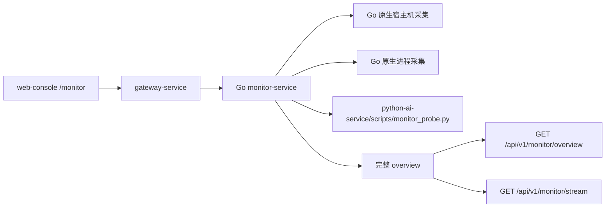

# macOS 真实监控数据补齐设计

**日期**：2026-05-03

## 目标

把当前 `services/monitor-service` 从“占位监控”升级为“这台 macOS 机器上的真实监控”，保证前端运行监控页能够看到真实的宿主机资源、AI 加速器状态和关键 AI 相关进程状态，而不是固定零值或空列表。

本轮目标只覆盖当前本机 `macOS` 环境跑通，不要求同时把 `Windows` 路线做完整，但必须保留后续扩展接口，不把实现写死成一次性脚本。

## 已确认范围

- 用户明确要求“先把这台机器跑通”。
- 用户选择“主机真实数据 + AI 相关真实数据”的方案。
- 用户要求后续实现采用并行推进方式完成。
- 本轮以 `Go monitor-service` 为主，不回退到 Python HTTP 服务。
- 前端页面已经具备监控视图，但当前数据源仍然是占位实现。

## 当前问题

当前监控链路存在三类问题：

### 1. Go 监控服务没有真实采样

`services/monitor-service/service/collector_service.go` 当前只返回：

- 当前平台名
- 一组默认零值宿主机指标
- 一组默认“未采集”的加速器占位值

这意味着即使前端和 SSE 链路工作正常，用户看到的也不是真实机器状态。

### 2. Python probe 也是占位实现

`python-ai-service/scripts/monitor_probe.py` 目前只返回硬编码结构：

- `macOS` 下固定 `mps_available: false`
- 固定 `ai_process_memory_bytes: 0`

它并没有真正探测当前 PyTorch/MPS 状态，也没有辅助读取 AI 相关进程信息。

### 3. 总览结构与真实监控目标不一致

虽然前端现在已经避免了 SSE 覆盖问题，但后端产出的 `overview` 仍然缺少真实：

- `host_snapshot`
- `accelerator_snapshot`
- `service_snapshots`
- `task_runtime_context`

因此页面最多只能说明“字段缺失原因”，无法承担真实监控职责。

## 设计决策

采用“`Go` 原生采集真实宿主机与进程指标 + `Python probe` 补充 `MPS` 与 AI 运行时信息 + 完整 `overview` 统一输出”的方案。

- `Go monitor-service` 负责当前机器上绝大多数真实指标采集。
- `Python probe` 只补 `Go` 不适合直接采集或已经在 Python 运行时中有现成能力的信息。
- `HTTP /overview` 与 `SSE /stream` 始终输出同一份完整 `overview`。
- 本轮只对 `macOS` 做真实实现。
- `Windows` 路线保留接口与默认行为，但不在本轮追求真实采样。

这样处理的原因：

- 当前问题的主要矛盾不是页面，而是监控源头不是真数据。
- `Go` 直接采主机和进程指标，依赖更少、链路更稳定。
- `MPS` 可用性由 Python/PyTorch 探测更自然，也更贴近 AI 运行时真实状态。
- 统一 `overview` 可避免“接口返回一套、SSE 推送另一套”的语义漂移再次发生。

## 不采用的方案

### 方案一：继续只修前端展示

不采用，原因如下：

- 页面已经能展示结构化数据。
- 现在的问题不是“不会显示”，而是“后端没有真实数据”。
- 继续修页面只能让空状态更漂亮，不能让监控变真。

### 方案二：所有监控都交给 Python probe

不采用，原因如下：

- 会把 `monitor-service` 退化成一个 Python 子进程包装器。
- 宿主机指标、磁盘、进程存活这类能力 Go 更适合长期承载。
- 后续扩展 Windows 时，Go 主体仍然更利于统一 API 和健康判断。

### 方案三：一步做到 macOS + Windows 双平台真实采集

本轮不采用，原因如下：

- 用户明确要求先把当前机器跑通。
- 现在最需要的是在本机看到真数据，而不是先做跨平台框架铺垫。
- 双平台同时推进会显著放大测试和验证面，反而拖慢可见结果。

## 系统架构

## 采集边界

### Go 层负责的真实数据

本轮由 `Go monitor-service` 直接采集：

- CPU 使用率
- 物理内存总量、已用、可用
- `swap` 总量、已用
- 磁盘总量、已用、可用
- 平台时间戳
- 关键进程是否存在
- 关键进程驻留内存
- 关键进程 CPU 占用
- 关键进程 PID

这部分是本轮“真实监控”最核心的基线能力。

### Python probe 负责的真实数据

本轮由 `python-ai-service/scripts/monitor_probe.py` 负责：

- 当前 PyTorch 是否暴露可用 `MPS`
- 当前首选 torch 设备类型
- AI 进程相关辅助信息
  - 本轮最低要求：返回目标 Python 进程集合的 RSS 汇总或最大值
- `MPS` 不可用时的明确原因

Python probe 不对外暴露 HTTP，只输出单次 JSON。

## macOS 数据源选择

### 宿主机与进程指标

采用 `gopsutil` 作为 Go 层主采集依赖。

原因：

- 它已经覆盖 CPU、内存、磁盘、进程等绝大多数本轮需要的 macOS 指标。
- 比直接解析 `ps`、`top`、`vm_stat`、`df` 等命令输出更稳定、更易测试。
- 后续扩展 Windows 时，依赖和调用方式可以复用。

本轮预计使用：

- `cpu.Percent`
- `mem.VirtualMemory`
- `mem.SwapMemory`
- `disk.Usage`
- `process.Processes`

### 内存压力等级

`gopsutil` 本身不提供 macOS 风格的 `memory pressure` 等级语义。

本轮采用“由 Go 侧根据真实资源状态推导 `memory_pressure_level`”的方式，而不是解析图形界面专属指标：

- 内存使用率较低且 `swap` 很小：`normal`
- 内存使用率较高或 `swap` 明显增长：`warning`
- 内存占用接近上限且 `swap` 明显偏高：`critical`

这样做的原因：

- 能在当前仓库内稳定落地。
- 不依赖额外系统命令解析。
- 语义与前端现有展示字段兼容。

## 关键进程识别策略

本轮至少监控以下进程：

- `python-ai-service`
- `python-ai-worker`
- `gateway-service`

识别策略采用“双轨制”：

### 1. 进程名/命令行匹配

通过 `gopsutil/process` 读取：

- 可执行文件名
- 完整命令行

匹配规则优先看命令行特征，例如：

- 包含 `python-ai-service/app/main.py`
- 包含 `python-ai-service/app/worker.py`
- 可执行名包含 `gateway-service`

### 2. 结果归一化

每个服务最终只输出一条 `service_snapshot`：

- 存在多个匹配进程时，优先保留最合理的一条
- 以 RSS 最大或启动时间最早的匹配项作为代表
- 如果没有匹配项，返回 `status: "missing"`

## AI 加速器语义

本轮 `macOS` 路线下，`accelerator_snapshot` 统一输出：

- `accelerator_type: "apple-mps"`
- `available`
- `mps_available`
- `summary_label`
- `unified_memory_pressure`
- `ai_process_memory_bytes`
- `unavailable_reason`

本轮不强行制造：

- `gpu_utilization_percent`
- `temperature_c`
- 独立 `VRAM`

原因：

- 在当前 `macOS + Apple Silicon + MPS` 场景下，这些值并没有稳定通用的数据源。
- 强行填零会再次制造假监控。

前端可以继续接受这些字段缺失，但本轮必须让缺失原因是真实且可解释的。

## task_runtime_context 范围

本轮不尝试打通复杂任务聚合，只做最低可用真实上下文：

- `active_task_count`
- `latest_task_stage`

若当前 `monitor-service` 无法可靠读取任务服务内部状态，则允许：

- 返回 `active_task_count: 0`
- 不伪造阶段名
- 在页面中由现有逻辑解释“当前没有运行任务，因此没有最新阶段上报”

也就是说，本轮“真实数据”重点在宿主机、加速器和关键进程，不把任务上下文扩成第二个大项目。

## overview 生成规则

每次采样都生成一份完整 `model.MonitorOverview`：

- `overall_health`
- `host_snapshot`
- `accelerator_snapshot`
- `service_snapshots`
- `task_runtime_context`
- `active_alerts`
- `recent_alerts`

`GetOverview` 和 `Stream` 都必须复用同一份完整结果。

SSE 只允许推送完整 `overview`，不再允许推送只有 `overall_health` 的精简对象。

## 健康等级规则

本轮沿用现有告警服务的整体方向，但让输入变成真实指标。

### overall_health 判定优先级

1. 关键服务缺失：`critical`
2. `MPS` 不可用且 AI 相关关键进程正在运行：`warning`
3. 内存或 `swap` 压力明显偏高：`warning`
4. 资源正常且关键服务在线：`healthy`

### 关键告警

至少保留以下告警类型：

- `service:*`
- `accelerator:mps-unavailable`
- `host:memory-pressure`
- `host:swap-pressure`

`recent_alerts` 本轮允许先保持空列表，但结构必须稳定存在。

## 失败与降级策略

### Go 采样失败

- 单个子指标失败不能让整个 `overview` 崩掉。
- 失败字段置空或保留缺失原因。
- 采样时间、平台、已成功字段仍然返回。

### Python probe 失败

- 不让整个 `/overview` 失败。
- `accelerator_snapshot` 返回：
  - `accelerator_type: "apple-mps"`
  - `available: false`
  - `unavailable_reason` 写成 probe 失败原因

### 关键进程读取失败

- 对应 `service_snapshot.status` 标记为 `unknown` 或 `missing`
- `sample_error` 写明失败原因

## 测试策略

本轮测试分三层：

### 1. Go 单测

覆盖：

- 真实采样结果的归一化
- `service_snapshot` 生成规则
- `memory_pressure_level` 推导规则
- `overview` 与 SSE 的完整结构一致性

### 2. Python 单测

覆盖：

- `monitor_probe.py` 在 `macOS` 分支下的真实 payload 结构
- `MPS` 可用性探测逻辑
- probe 错误时的降级结构

### 3. 本机手动验证

至少验证：

- 监控服务启动后 `/api/v1/monitor/overview` 返回真实 `cpu_usage_percent`
- 返回真实内存、`swap`、磁盘值
- `accelerator_snapshot` 中 `mps_available` 与当前本机 PyTorch 状态一致
- `service_snapshots` 中能看到当前 `gateway-service` 或 Python AI 相关进程的真实状态
- 打开前端 `/monitor` 页面能看到真实变化而不是固定零值

## 文件范围

本轮主要影响：

- `services/monitor-service/go.mod`
- `services/monitor-service/service/collector_service.go`
- `services/monitor-service/service/probe_service.go`
- `services/monitor-service/service/monitor_service.go`
- `services/monitor-service/service/alert_service.go`
- `services/monitor-service/model/monitor.go`
- `services/monitor-service/service/*_test.go`
- `python-ai-service/scripts/monitor_probe.py`
- `python-ai-service/tests/test_monitor_probe.py`

前端原则上只做小幅兼容，不再做新的视觉改版。

## 并行实施拆分

由于用户明确要求“多进程完成”，本轮实现适合拆成三个并行子任务：

### 子任务 A：Go 宿主机与进程真实采集

负责：

- 接入 `gopsutil`
- 真实读取 CPU、内存、`swap`、磁盘
- 真实读取关键进程状态
- 归一化 `service_snapshots`

### 子任务 B：Python probe 与加速器真实采集

负责：

- 重写 `monitor_probe.py`
- 接入真实 `MPS` 可用性探测
- 输出 AI 进程内存辅助字段
- 补齐 probe 测试

### 子任务 C：overview 聚合、告警、SSE 与本机验证

负责：

- 统一完整 `overview`
- 把 Go 采样与 Python probe 拼成真实 `accelerator_snapshot`
- 保证 `HTTP` / `SSE` 结构一致
- 跑服务测试与本机接口验证

三个子任务写集尽量分离，便于并行推进后再汇合。

## 成功标准

满足以下条件才算这轮完成：

- 当前这台 `macOS` 机器的监控接口返回真实主机资源值，而不是默认零值
- `MPS` 可用性来自真实探测，而不是硬编码
- `service_snapshots` 至少能真实反映关键 AI 相关进程是否存在
- 前端运行监控页打开后能看到真实数据
- HTTP 和 SSE 对同一时刻输出相同结构的完整 `overview`
- 相关 Go / Python / 前端测试通过
