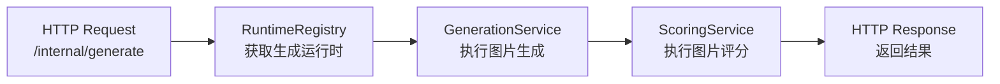
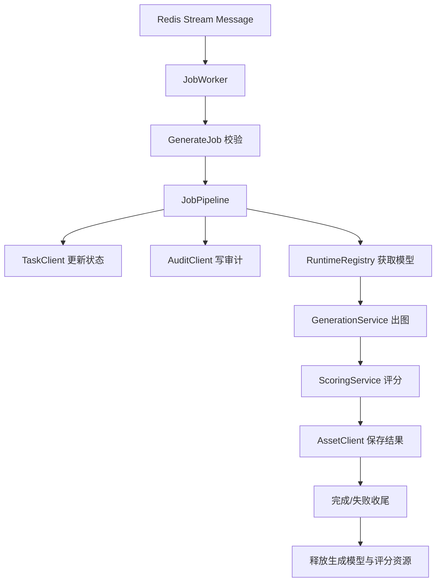

# Python AI Service

`python-ai-service` 是 Electric AI Platform 中负责图像生成、图像评分、异步任务消费和模型训练编排的 Python 服务。

它不是一个只暴露 HTTP 接口的轻量 API，而是一个同时覆盖以下职责的工程：

- 在线推理服务：提供健康检查、运行时探针、模型清单查询、内部生成接口
- 异步任务执行节点：从 Redis Stream 消费生成任务，并串联状态更新、审计、生成、评分、结果持久化
- 本地模型运行时：管理 SD1.5、SSD-1B、UniPic2 等生成模型，以及多种评分运行时
- 离线训练工具箱：准备数据集、训练电力领域专用生成模型、训练多维评分模型、导出评估产物

如果你是第一次接手这个仓库，建议先读完本文的这几个部分：

1. [项目定位](#项目定位)
2. [目录结构](#目录结构)
3. [核心调用链](#核心调用链)
4. [快速启动](#快速启动)
5. [训练与数据流程](#训练与数据流程)

---

## 项目定位

这个服务面向“电力行业图像生成”场景，核心目标是：

- 根据业务侧传入的 prompt、负面 prompt、模型名、采样参数生成图片
- 对生成结果进行多维评分，包括视觉保真、文本一致、物理合理、构图美学和总分
- 把任务状态、审计事件、图片结果同步回其他服务
- 为电力领域专用模型和评分模型提供训练、评估和打包能力

从系统边界看，它是 Electric AI Platform 的“AI 执行节点”，上游和旁路依赖包括：

- 任务服务：接收任务状态更新
- 资产服务：接收生成结果和评分结果
- 审计服务：记录任务阶段事件
- Redis：作为异步任务队列
- Hugging Face / 本地模型目录：作为模型来源

---

## 技术栈

- Python 3
- FastAPI + Uvicorn
- Redis Streams
- Pydantic v2
- PyTorch / Diffusers / Transformers
- Pillow / NumPy / SciPy
- Ultralytics YOLO

依赖列表见 `requirements.txt`。

---

## 目录结构

```text
python-ai-service/
├── app/                    在线服务、运行时、任务流水线
│   ├── clients/            对任务服务、资产服务、审计服务的 HTTP 客户端
│   ├── core/               配置、路径、日志、CUDA 清理等基础设施
│   ├── runtimes/           生成模型运行时与评分运行时
│   ├── schemas/            Pydantic 请求/响应模型
│   ├── services/           生成服务、评分服务、任务流水线
│   ├── workers/            Redis Stream Worker 实现
│   ├── dependencies.py     统一装配依赖
│   ├── main.py             FastAPI 入口
│   └── worker.py           Worker 进程入口
├── scripts/                模型检查/下载、训练脚本、运行时探针等 CLI
├── tests/                  单元测试与集成测试
├── training/               数据准备、训练、评估、报告生成
└── unipicv2/               自定义 UniPic2 / SD3.5 Kontext 推理实现
```

### 关键模块速览

| 路径 | 作用 |
| --- | --- |
| `app/main.py` | FastAPI 应用入口，暴露健康检查、运行时探针、模型列表和内部生成接口 |
| `app/worker.py` | Worker 启动入口，连接 Redis 并消费生成任务 |
| `app/services/job_pipeline.py` | 整个异步任务链路的总编排 |
| `app/runtimes/runtime_registry.py` | 生成模型注册、懒加载、切换与释放 |
| `app/services/scoring_service.py` | 统一封装评分逻辑 |
| `app/runtimes/scorers/power_score_runtime.py` | 自训练评分模型 `electric-score-v2` 的核心运行时 |
| `scripts/download_models.py` | 模型清单、检查与下载 |
| `training/generation/pipeline.py` | 专用生成模型训练流程 |
| `training/scoring/pipeline.py` | 多维评分模型训练流程 |

---

## 核心调用链

项目有两条主要执行路径：

- 同步内部接口：`POST /internal/generate`
- 异步任务消费：Redis Stream Worker

### 1. 同步内部接口链路



这条链路适合：

- 内部联调
- 快速验证模型行为
- 无需任务服务、资产服务、审计服务参与的同步调用

特点：

- 运行时依赖是懒加载的
- 生成模型会被复用，不会在每次请求后主动卸载
- 评分服务在这个入口默认关闭“每批自动释放”，更偏向保留热状态

### 2. 异步 Worker 链路



这条链路适合：

- 生产或准生产的后台执行
- 需要状态机推进、审计留痕、结果回写的完整任务
- 单机单卡资源敏感场景

特点：

- 消费 Redis Stream `stream:generate:jobs`
- 使用消费组 `python-ai-runtime`
- 队列为空时会回收长时间未 ACK 的挂起消息
- 任务结束后无论成功失败，都会主动释放生成与评分资源

### 任务状态推进

`JobPipeline` 中的典型状态流转如下：

```text
preparing
-> downloading
-> generating
-> scoring
-> persisting
-> completed
```

如果发生异常：

```text
failed
```

同时还会写审计事件，例如：

- `task.preparing`
- `model.prepare`
- `generation.completed`
- `scoring.completed`
- `task.completed`
- `task.failed`

---

## 运行时与模型管理

### 生成模型注册表

当前支持的生成模型由 `RuntimeRegistry` 统一管理：

| 模型名 | 类型 | 来源 |
| --- | --- | --- |
| `sd15-electric` | Stable Diffusion 1.5 基线模型 | Hugging Face |
| `sd15-electric-specialized` | 电力领域专用 SD1.5 模型 | 本地部署模型 |
| `ssd1b-electric` | SSD-1B / SDXL distilled 模型 | Hugging Face |
| `unipic2-kontext` | UniPic2 SD3.5 Kontext 模型 | Hugging Face |

运行时管理策略有两个重要点：

- 生成模型按需懒加载，避免服务启动时直接占满显存
- 任一时刻默认只保留一个活跃生成模型，切换模型时会先释放上一个模型

这对于单卡环境尤其重要，因为这个仓库明确在设计上偏向“节省显存”而不是“多模型并发常驻”。

### 评分模型

评分侧分为两类：

#### 1. 旧版组合式评分：`electric-score-v1`

这条链路组合了多个运行时：

- `ImageRewardRuntime`：文本-图像一致性
- `AestheticRuntime`：美学评分
- `ClipIQARuntime`：视觉保真和物理合理性

最后会通过规则将四个维度压缩/抬升后加权得到总分。

#### 2. 自训练评分模型：`electric-score-v2`

这是仓库当前更有“产品化”特征的一条链路，核心在 `PowerScoreRuntime`：

- 加载自训练 `FourDimScoreModel`
- 使用 prompt 编码特征
- 可选加载 YOLO11 辅助检测模型
- 根据检测结果生成图像检查图
- 输出四个维度得分、总分和解释信息

四个基础维度包括：

- `visual_fidelity`：视觉保真
- `text_consistency`：文本一致
- `physical_plausibility`：物理合理
- `composition_aesthetics`：构图美学

### UniPic2 的执行策略

`unipic2-kontext` 额外支持 `offload_mode`：

- `model`：优先使用 model CPU offload
- `sequential`：优先使用 sequential CPU offload
- `none`：不做 offload，直接在 CUDA 上运行

这个配置用于在速度和显存之间做权衡。

---

## 配置说明

### 环境变量

核心配置由 `app/core/settings.py` 统一读取，支持从当前目录及父目录的 `.env` / `.env.local` 自动加载。

常用环境变量如下：

| 变量名 | 默认值 | 说明 |
| --- | --- | --- |
| `ELECTRIC_AI_RUNTIME_ROOT` | `<mono-repo-root>/model` | 模型、输出图、日志、训练产物的根目录 |
| `TASK_SERVICE_BASE_URL` | `http://localhost:8083` | 任务服务地址 |
| `ASSET_SERVICE_BASE_URL` | `http://localhost:8084` | 资产服务地址 |
| `AUDIT_SERVICE_BASE_URL` | `http://localhost:8085` | 审计服务地址 |
| `MODEL_SERVICE_BASE_URL` | `http://localhost:8082` | 预留模型服务地址 |
| `REDIS_URL` | `redis://localhost:6379/0` | Redis 地址 |
| `ELECTRIC_AI_UNIPIC2_OFFLOAD_MODE` | `model` | UniPic2 的 offload 策略 |
| `ELECTRIC_AI_SCORING_RELEASE_AFTER_BATCH` | `true` | 评分服务是否在每批后自动释放 |
| `ELECTRIC_AI_WORKER_NAME` | `<hostname>-<pid>` | Worker 消费者名称 |
| `ELECTRIC_AI_LEGACY_ROOT` | 无 | 旧项目目录，用于迁移美学评分权重 |

### 推荐的 `.env.local` 示例

```env
ELECTRIC_AI_RUNTIME_ROOT=/absolute/path/to/model
TASK_SERVICE_BASE_URL=http://127.0.0.1:8083
ASSET_SERVICE_BASE_URL=http://127.0.0.1:8084
AUDIT_SERVICE_BASE_URL=http://127.0.0.1:8085
REDIS_URL=redis://127.0.0.1:6379/0
ELECTRIC_AI_UNIPIC2_OFFLOAD_MODE=model
ELECTRIC_AI_SCORING_RELEASE_AFTER_BATCH=true
```

### 运行时目录约定

默认 `runtime_root` 下会使用以下目录：

```text
model/
├── hf-home/
├── generation/
├── scoring/
├── image/
├── image_check/
├── logs/
└── tmp/
```

目录用途：

- `generation/`：生成模型目录
- `scoring/`：评分模型目录
- `image/`：生成图片输出
- `image_check/`：带检测框或评分辅助信息的检查图
- `logs/`：运行日志
- `tmp/`：临时文件

---

## 快速启动

### 1. 安装依赖

建议先创建虚拟环境，然后安装依赖：

```bash
python -m venv .venv
source .venv/bin/activate
python -m pip install -r requirements.txt
```

如果你的环境使用 Conda，也可以用 Conda 解释器执行相同的 `pip install`。

### 2. 检查本地运行时环境

查看当前 Python 环境、目录探针和模型清单：

```bash
python scripts/runtime_probe.py
```

只检查模型目录是否已就位：

```bash
python scripts/download_models.py --all --check
```

下载全部模型：

```bash
python scripts/download_models.py --all
```

只下载某一个模型：

```bash
python scripts/download_models.py --model sd15-electric
python scripts/download_models.py --model image-reward
```

### 3. 启动 API 服务

```bash
uvicorn app.main:app --host 0.0.0.0 --port 8000 --reload
```

可用接口：

- `GET /health`
- `GET /runtime/status`
- `GET /runtime/models`
- `POST /internal/generate`

### 4. 启动 Worker

```bash
python -m app.worker
```

Worker 会：

- 连接 `REDIS_URL`
- 确保消费组存在
- 持续拉取新任务
- 在没有新任务时尝试领回 stale pending messages

---

## 内部接口说明

### `POST /internal/generate`

这是一个内部生成接口，直接完成“生成 + 评分”，不经过任务服务和资产服务。

#### 请求体

```json
{
  "job_id": 1,
  "prompt": "A wind turbine farm at sunset",
  "negative_prompt": "blurry",
  "model_name": "sd15-electric",
  "scoring_model_name": "electric-score-v2",
  "seed": 42,
  "steps": 20,
  "guidance_scale": 7.5,
  "width": 512,
  "height": 512,
  "num_images": 1
}
```

#### 字段说明

| 字段 | 说明 |
| --- | --- |
| `job_id` | 任务 ID |
| `prompt` | 正向提示词 |
| `negative_prompt` | 负向提示词 |
| `model_name` | 生成模型名 |
| `scoring_model_name` | 评分模型名，默认 `electric-score-v1` |
| `seed` | 随机种子，传 `-1` 时会在服务端解析为实际种子 |
| `steps` | 推理步数 |
| `guidance_scale` | CFG 指数 |
| `width` / `height` | 输出图尺寸 |
| `num_images` | 生成张数 |

#### 返回体示例

```json
{
  "code": 0,
  "message": "success",
  "data": {
    "job_id": 1,
    "results": [
      {
        "image_name": "1_0_42.png",
        "file_path": "/path/to/model/image/1_0_42.png",
        "model_name": "sd15-electric",
        "scoring_model_name": "electric-score-v2",
        "positive_prompt": "A wind turbine farm at sunset",
        "negative_prompt": "blurry",
        "sampling_steps": 20,
        "seed": 42,
        "guidance_scale": 7.5,
        "visual_fidelity": 80.0,
        "text_consistency": 90.0,
        "physical_plausibility": 70.0,
        "composition_aesthetics": 60.0,
        "total_score": 77.0
      }
    ]
  },
  "trace_id": "job-1"
}
```

---

## 异步任务格式

Worker 期望 Redis Stream 消息至少包含：

- `payload`：JSON 字符串
- `job_id`：可选；如果 `payload` 中没有 `job_id`，Worker 会把这个字段合并进去

`payload` 的核心字段与 `GenerateJob` 基本一致，例如：

```json
{
  "prompt": "substation",
  "negative_prompt": "blurry",
  "model_name": "sd15-electric",
  "seed": 11,
  "steps": 20,
  "guidance_scale": 7.5,
  "width": 512,
  "height": 512,
  "num_images": 1
}
```

消费时，Worker 会先读取新消息，再回收超时挂起消息。

---

## 与外部服务的集成

异步流水线会通过三个客户端与外部系统交互：

### 1. TaskClient

用于更新任务状态：

- `POST /internal/tasks/{job_id}/status`

### 2. AssetClient

用于保存图片与评分结果：

- `POST /api/v1/assets/results`

### 3. AuditClient

用于记录任务事件：

- `POST /api/v1/audit/task-events`

因此，如果你只想单机验证生成与评分能力，使用 `/internal/generate` 更简单；如果你要验证全链路，就需要把这三个外部服务也准备好。

---

## 训练与数据流程

这个仓库不仅能推理，也能训练。

### 一、生成模型训练

目标是产出电力领域专用的 `sd15-electric-specialized` 模型。

流程大致如下：

1. 准备生成数据集 manifest
2. 导出 curated 数据集
3. 下载或定位 diffusers LoRA 训练脚本
4. 执行 LoRA 训练
5. 选择最佳 checkpoint
6. 合并 LoRA 权重为独立模型
7. 生成评估图片

常用脚本：

```bash
python scripts/train_generation_v3.py --prepare-only
python scripts/train_generation_v3.py
```

支持的常用参数：

- `--prepare-only`
- `--skip-merge`
- `--skip-eval`
- `--num-train-epochs`
- `--max-train-steps`
- `--max-train-samples`
- `--python-executable`
- `--train-script-path`

产物通常位于：

- `runtime_root/datasets/generation-v3/`
- `runtime_root/training/generation/sd15-electric-specialized-v2/`
- `runtime_root/generation/sd15-electric-specialized/`

### 二、评分模型训练

目标是训练 `electric-score-v2` 评分包。

流程大致如下：

1. 下载并解压检测/分类数据集
2. 构建 train / val / test manifest
3. 训练 YOLO 辅助模型
4. 训练四维评分模型
5. 导出 `bundle_config.json`、`vocab.json`、`student_best.pt`、`yolo_aux.pt`、`metrics.json`

常用脚本：

```bash
python scripts/train_scoring_v3.py
```

支持的常用参数：

- `--epochs`
- `--yolo-epochs`
- `--device`
- `--yolo-imgsz`
- `--yolo-batch-size`

当前默认辅助检测训练配置已经切到 YOLO11：

- `model=yolo11s.pt`
- `imgsz=640`
- `batch=6`
- `optimizer=AdamW`
- `lr0=3e-4`
- `warmup_epochs=3.0`

注意：

- `yolo_aux.pt` 不能只按“文件替换”理解，它需要和 `electric-score-v2` 的 `bundle_config.json`、`yolo_feature_dim` 以及评分模型训练时使用的类别集合保持一致。
- 如果更换成不同类别体系的 YOLO11 权重，正确做法是重训并重新导出整套 `electric-score-v2` bundle，而不是单独覆盖 `yolo_aux.pt`。

产物通常位于：

- `runtime_root/datasets/scoring-v2/`
- `runtime_root/training/scoring/electric-score-v2/`
- `runtime_root/scoring/electric-score-v2/`

---

## 模型下载与清单

模型清单定义在 `scripts/download_models.py` 中，主要来源包括：

- Hugging Face 模型仓库
- 本地复制权重
- 本地已部署模型目录

当前清单包含：

| 名称 | 目标 | 来源 |
| --- | --- | --- |
| `sd15-electric` | generation | `runwayml/stable-diffusion-v1-5` |
| `sd15-electric-specialized` | generation | 本地 runtime 目录 |
| `ssd1b-electric` | generation | `segmind/SSD-1B` |
| `unipic2-kontext` | generation | `Skywork/UniPic2-SD3.5M-Kontext-2B` |
| `image-reward` | scoring | `THUDM/ImageReward` |
| `aesthetic-predictor` | scoring | 本地或远程拷贝美学权重 |

说明：

- `sd15-electric-specialized` 不会从远端自动下载，它假定训练或部署阶段已经把模型放到本地
- `aesthetic-predictor` 会优先查找旧项目目录中的权重文件，如果找不到再回退到公开 URL

---

## 测试

测试目录在 `tests/`，覆盖范围包括：

- FastAPI 入口
- Worker 消费逻辑
- 运行时设置读取
- 模型清单与下载脚本
- 训练配置与训练流程
- 运行时注册与模型切换
- 多种生成/评分运行时

通常可以这样执行：

```bash
python -m pytest
```

如果只跑某些关键测试：

```bash
python -m pytest tests/test_main.py tests/test_job_worker.py tests/test_runtime_settings.py
```

---

## 常用排查思路

### 1. 服务起不来

优先检查：

- 是否已经安装 `requirements.txt`
- Python 版本是否兼容
- `torch` / `diffusers` / `transformers` 是否装好
- `.env.local` 中的路径和 URL 是否正确

### 2. 模型不可用

先执行：

```bash
python scripts/download_models.py --all --check
```

如果状态是 `missing`，说明本地目录还没有准备好。

### 3. UniPic2 显存占用太高

尝试调整：

- `ELECTRIC_AI_UNIPIC2_OFFLOAD_MODE=model`
- `ELECTRIC_AI_UNIPIC2_OFFLOAD_MODE=sequential`

如果追求最快速度且显存足够，再使用：

- `ELECTRIC_AI_UNIPIC2_OFFLOAD_MODE=none`

### 4. Worker 不处理消息

检查：

- Redis 是否可连接
- Stream 名称是否为 `stream:generate:jobs`
- 消费组是否存在
- 消息是否包含 `payload`
- `payload` 是否满足 `GenerateJob` 的字段要求

### 5. 结果生成了但没有持久化

优先检查：

- 资产服务是否可用
- `ASSET_SERVICE_BASE_URL` 是否配置正确
- `JobPipeline` 是否在 `persisting` 阶段抛异常

---

## 开发建议

如果你准备继续维护这个仓库，建议按下面的顺序理解代码：

1. 先看 `app/main.py` 和 `app/worker.py`，理解两个入口
2. 再看 `app/services/job_pipeline.py`，理解全链路编排
3. 接着看 `app/runtimes/runtime_registry.py`，理解模型获取和释放策略
4. 然后看 `app/services/scoring_service.py` 和 `app/runtimes/scorers/power_score_runtime.py`
5. 最后再进入 `training/` 目录理解训练流程

如果你是要改线上行为，优先关注：

- `app/schemas/jobs.py`
- `app/services/generation_service.py`
- `app/services/scoring_service.py`
- `app/services/job_pipeline.py`
- `app/workers/job_worker.py`

如果你是要改训练链路，优先关注：

- `training/generation/*`
- `training/scoring/*`
- `scripts/train_generation_v3.py`
- `scripts/train_scoring_v3.py`

---

## 总结

一句话概括，这个仓库是一个围绕“电力行业图像生成与评分”构建的 Python AI 执行服务，既负责在线推理，也负责异步任务消费，还内置了生成模型和评分模型的训练能力。

如果你想继续补文档，下一步最值得补的通常是：

- 一份 `.env.local.example`
- 一份 Docker / 部署说明
- 一份 Redis 任务投递示例
- 一份模型目录准备说明
